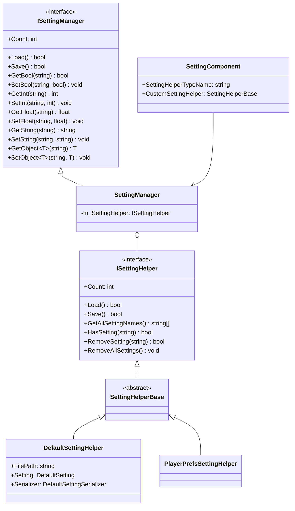
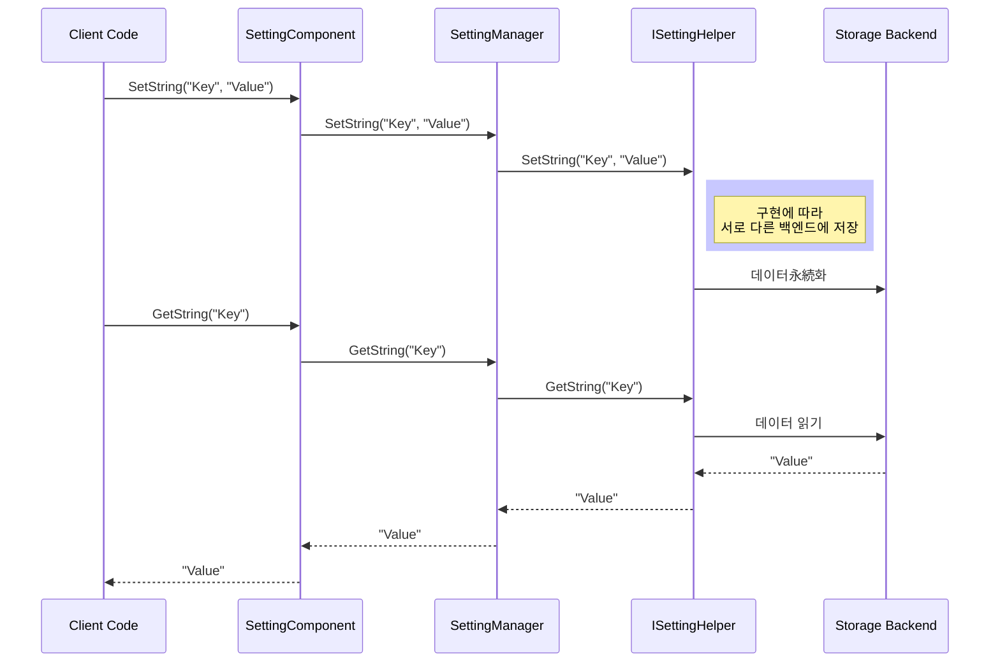

# API 참고

이 문서는 GameFrameX Setting 모듈의 모든 공개 API를 상세히 소개하며, 인터페이스 정의, 클래스 설명 및 사용 방법을 포함합니다.

## 개요

GameFrameX Setting 모듈은 완전한 게임 구성 관리 솔루션을 제공하여 다양한 저장 백엔드(파일 저장, PlayerPrefs,小游戏 플랫폼 저장)를 지원합니다. 이 모듈은 계층화된 아키텍처 설계를 채택하여 인터페이스 추상을 통해 저장 무관의 설정 관리 기능을 구현합니다.

## 아키텍처 개요



## ISettingManager 인터페이스

`ISettingManager`는 설정 관리의 핵심 인터페이스로, 게임 설정의 기본 작업을 정의합니다.

> Source: [ISettingManager.cs](https://github.com/GameFrameX/com.gameframex.unity.setting/blob/main/Runtime/Setting/Setting/ISettingManager.cs#L30-L342)

### 속성

#### `Count: int`

현재 게임 구성 항목의 수량을 가져옵니다.

```csharp
int count = settingManager.Count;
```

> Source: [ISettingManager.cs](https://github.com/GameFrameX/com.gameframex.unity.setting/blob/main/Runtime/Setting/Setting/ISettingManager.cs#L50-L51)

### 메서드

#### `Load(): bool`

게임 구성을 로드합니다.

**반환:** 로드 성공 여부.

```csharp
bool success = settingManager.Load();
```

> Source: [ISettingManager.cs](https://github.com/GameFrameX/com.gameframex.unity.setting/blob/main/Runtime/Setting/Setting/ISettingManager.cs#L70-L71)

---

#### `Save(): bool`

게임 구성을 저장합니다.

**반환:** 저장 성공 여부.

```csharp
bool success = settingManager.Save();
```

> Source: [ISettingManager.cs](https://github.com/GameFrameX/com.gameframex.unity.setting/blob/main/Runtime/Setting/Setting/ISettingManager.cs#L80-L81)

---

#### `GetAllSettingNames(): string[]`

모든 게임 구성 항목의 이름 배열을 가져옵니다.

**반환:** 모든 구성 항목 이름의 배열.

```csharp
string[] names = settingManager.GetAllSettingNames();
```

> Source: [ISettingManager.cs](https://github.com/GameFrameX/com.gameframex.unity.setting/blob/main/Runtime/Setting/Setting/ISettingManager.cs#L90-L91)

---

#### `GetAllSettingNames(results: List<string>): void`

모든 게임 구성 항목의 이름 목록을 가져옵니다.

**매개변수:**
- `results` (List<string>): 구성 항목 이름을 저장하는 데 사용되는 목록.

```csharp
var names = new List<string>();
settingManager.GetAllSettingNames(names);
```

> Source: [ISettingManager.cs](https://github.com/GameFrameX/com.gameframex.unity.setting/blob/main/Runtime/Setting/Setting/ISettingManager.cs#L100-L101)

---

#### `HasSetting(settingName: string): bool`

지정 구성 항목이 존재하는지 확인합니다.

**매개변수:**
- `settingName` (string): 확인할 구성 항목 이름.

**반환:** 구성 항목이 존재하는지 여부.

```csharp
bool exists = settingManager.HasSetting("PlayerName");
```

> Source: [ISettingManager.cs](https://github.com/GameFrameX/com.gameframex.unity.setting/blob/main/Runtime/Setting/Setting/ISettingManager.cs#L112-L113)

---

#### `RemoveSetting(settingName: string): bool`

지정 구성 항목을 제거합니다.

**매개변수:**
- `settingName` (string): 제거할 구성 항목 이름.

**반환:** 제거 성공 여부.

```csharp
bool success = settingManager.RemoveSetting("OldSetting");
```

> Source: [ISettingManager.cs](https://github.com/GameFrameX/com.gameframex.unity.setting/blob/main/Runtime/Setting/Setting/ISettingManager.cs#L122-L123)

---

#### `RemoveAllSettings(): void`

모든 게임 구성 항목을 비웁니다.

```csharp
settingManager.RemoveAllSettings();
```

> Source: [ISettingManager.cs](https://github.com/GameFrameX/com.gameframex.unity.setting/blob/main/Runtime/Setting/Setting/ISettingManager.cs#L131-L132)

---

### 부울 값 작업

#### `GetBool(settingName: string): bool`

지정 구성 항목에서 부울 값을 읽습니다.

**매개변수:**
- `settingName` (string): 구성 항목 이름.

**반환:** 읽은 부울 값. 구성 항목이 존재하지 않으면 예외 발생.

```csharp
bool value = settingManager.GetBool("SoundEnabled");
```

> Source: [ISettingManager.cs](https://github.com/GameFrameX/com.gameframex.unity.setting/blob/main/Runtime/Setting/Setting/ISettingManager.cs#L142-L143)

---

#### `GetBool(settingName: string, defaultValue: bool): bool`

지정 구성 항목에서 부울 값을 읽으며, 기본값을 지원합니다.

**매개변수:**
- `settingName` (string): 구성 항목 이름.
- `defaultValue` (bool): 구성 항목이 존재하지 않을 때 반환할 기본값.

**반환:** 읽은 부울 값 또는 기본값.

```csharp
bool value = settingManager.GetBool("MusicEnabled", true);
```

> Source: [ISettingManager.cs](https://github.com/GameFrameX/com.gameframex.unity.setting/blob/main/Runtime/Setting/Setting/ISettingManager.cs#L154-L155)

---

#### `SetBool(settingName: string, value: bool): void`

지정 구성 항목에 부울 값을 씁니다.

**매개변수:**
- `settingName` (string): 구성 항목 이름.
- `value` (bool): 쓸 부울 값.

```csharp
settingManager.SetBool("SoundEnabled", true);
```

> Source: [ISettingManager.cs](https://github.com/GameFrameX/com.gameframex.unity.setting/blob/main/Runtime/Setting/Setting/ISettingManager.cs#L165-L166)

---

### 정수 값 작업

#### `GetInt(settingName: string): int`

지정 구성 항목에서 정수 값을 읽습니다.

**매개변수:**
- `settingName` (string): 구성 항목 이름.

**반환:** 읽은 정수 값. 구성 항목이 존재하지 않으면 예외 발생.

```csharp
int level = settingManager.GetInt("CurrentLevel");
```

> Source: [ISettingManager.cs](https://github.com/GameFrameX/com.gameframex.unity.setting/blob/main/Runtime/Setting/Setting/ISettingManager.cs#L176-L177)

---

#### `GetInt(settingName: string, defaultValue: int): int`

지정 구성 항목에서 정수 값을 읽으며, 기본값을 지원합니다.

**매개변수:**
- `settingName` (string): 구성 항목 이름.
- `defaultValue` (int): 구성 항목이 존재하지 않을 때 반환할 기본값.

**반환:** 읽은 정수 값 또는 기본값.

```csharp
int score = settingManager.GetInt("HighScore", 0);
```

> Source: [ISettingManager.cs](https://github.com/GameFrameX/com.gameframex.unity.setting/blob/main/Runtime/Setting/Setting/ISettingManager.cs#L188-L189)

---

#### `SetInt(settingName: string, value: int): void`

지정 구성 항목에 정수 값을 씁니다.

**매개변수:**
- `settingName` (string): 구성 항목 이름.
- `value` (int): 쓸 정수 값.

```csharp
settingManager.SetInt("CurrentLevel", 5);
```

> Source: [ISettingManager.cs](https://github.com/GameFrameX/com.gameframex.unity.setting/blob/main/Runtime/Setting/Setting/ISettingManager.cs#L199-L200)

---

### 浮点数 값 작업

#### `GetFloat(settingName: string): float`

지정 구성 항목에서 浮点数 값을 읽습니다.

**매개변수:**
- `settingName` (string): 구성 항목 이름.

**반환:** 읽은 浮点数 값. 구성 항목이 존재하지 않으면 예외 발생.

```csharp
float volume = settingManager.GetFloat("MusicVolume");
```

> Source: [ISettingManager.cs](https://github.com/GameFrameX/com.gameframex.unity.setting/blob/main/Runtime/Setting/Setting/ISettingManager.cs#L210-L211)

---

#### `GetFloat(settingName: string, defaultValue: float): float`

지정 구성 항목에서 浮点数 값을 읽으며, 기본값을 지원합니다.

**매개변수:**
- `settingName` (string): 구성 항목 이름.
- `defaultValue` (float): 구성 항목이 존재하지 않을 때 반환할 기본값.

**반환:** 읽은 浮点数 값 또는 기본값.

```csharp
float volume = settingManager.GetFloat("MusicVolume", 0.5f);
```

> Source: [ISettingManager.cs](https://github.com/GameFrameX/com.gameframex.unity.setting/blob/main/Runtime/Setting/Setting/ISettingManager.cs#L222-L223)

---

#### `SetFloat(settingName: string, value: float): void`

지정 구성 항목에 浮点数 값을 씁니다.

**매개변수:**
- `settingName` (string): 구성 항목 이름.
- `value` (float): 쓸 浮点数 값.

```csharp
settingManager.SetFloat("MusicVolume", 0.8f);
```

> Source: [ISettingManager.cs](https://github.com/GameFrameX/com.gameframex.unity.setting/blob/main/Runtime/Setting/Setting/ISettingManager.cs#L233-L234)

---

### 문자열 값 작업

#### `GetString(settingName: string): string`

지정 구성 항목에서 문자열 값을 읽습니다.

**매개변수:**
- `settingName` (string): 구성 항목 이름.

**반환:** 읽은 문자열 값. 구성 항목이 존재하지 않으면 예외 발생.

```csharp
string playerName = settingManager.GetString("PlayerName");
```

> Source: [ISettingManager.cs](https://github.com/GameFrameX/com.gameframex.unity.setting/blob/main/Runtime/Setting/Setting/ISettingManager.cs#L244-L245)

---

#### `GetString(settingName: string, defaultValue: string): string`

지정 구성 항목에서 문자열 값을 읽으며, 기본값을 지원합니다.

**매개변수:**
- `settingName` (string): 구성 항목 이름.
- `defaultValue` (string): 구성 항목이 존재하지 않을 때 반환할 기본값.

**반환:** 읽은 문자열 값 또는 기본값.

```csharp
string playerName = settingManager.GetString("PlayerName", "Guest");
```

> Source: [ISettingManager.cs](https://github.com/GameFrameX/com.gameframex.unity.setting/blob/main/Runtime/Setting/Setting/ISettingManager.cs#L256-L257)

---

#### `SetString(settingName: string, value: string): void`

지정 구성 항목에 문자열 값을 씁니다.

**매개변수:**
- `settingName` (string): 구성 항목 이름.
- `value` (string): 쓸 문자열 값.

```csharp
settingManager.SetString("PlayerName", "Hero");
```

> Source: [ISettingManager.cs](https://github.com/GameFrameX/com.gameframex.unity.setting/blob/main/Runtime/Setting/Setting/ISettingManager.cs#L267-L268)

---

### 객체 작업

#### `GetObject<T>(settingName: string): T`

지정 구성 항목에서 객체를 읽습니다.

**타입 매개변수:**
- `T`: 읽을 객체 유형으로, 인자 없는 생성자를 포함해야 합니다.

**매개변수:**
- `settingName` (string): 구성 항목 이름.

**반환:** 읽은 객체 인스턴스. 구성 항목이 존재하지 않으면 예외 발생.

```csharp
var playerData = settingManager.GetObject<PlayerData>("PlayerData");
```

> Source: [ISettingManager.cs](https://github.com/GameFrameX/com.gameframex.unity.setting/blob/main/Runtime/Setting/Setting/ISettingManager.cs#L279-L280)

---

#### `GetObject(objectType: Type, settingName: string): object`

지정 구성 항목에서 객체를 읽습니다(비泛型 버전).

**매개변수:**
- `objectType` (Type): 읽을 객체 유형.
- `settingName` (string): 구성 항목 이름.

**반환:** 읽은 객체 인스턴스.

```csharp
object playerData = settingManager.GetObject(typeof(PlayerData), "PlayerData");
```

> Source: [ISettingManager.cs](https://github.com/GameFrameX/com.gameframex.unity.setting/blob/main/Runtime/Setting/Setting/ISettingManager.cs#L291-L292)

---

#### `GetObject<T>(settingName: string, defaultObj: T): T`

지정 구성 항목에서 객체를 읽으며, 기본값을 지원합니다.

**타입 매개변수:**
- `T`: 읽을 객체 유형.

**매개변수:**
- `settingName` (string): 구성 항목 이름.
- `defaultObj` (T): 구성 항목이 존재하지 않을 때 반환할 기본 객체.

**반환:** 읽은 객체 또는 기본 객체.

```csharp
var defaultData = new PlayerData();
var playerData = settingManager.GetObject("PlayerData", defaultData);
```

> Source: [ISettingManager.cs](https://github.com/GameFrameX/com.gameframex.unity.setting/blob/main/Runtime/Setting/Setting/ISettingManager.cs#L304-L305)

---

#### `SetObject<T>(settingName: string, obj: T): void`

지정 구성 항목에 객체를 씁니다.

**타입 매개변수:**
- `T`: 쓸 객체 유형.

**매개변수:**
- `settingName` (string): 구성 항목 이름.
- `obj` (T): 쓸 객체.

```csharp
var playerData = new PlayerData { Name = "Hero", Level = 10 };
settingManager.SetObject("PlayerData", playerData);
```

> Source: [ISettingManager.cs](https://github.com/GameFrameX/com.gameframex.unity.setting/blob/main/Runtime/Setting/Setting/ISettingManager.cs#L329-L330)

---

## ISettingHelper 인터페이스

`ISettingHelper`는 설정 저장의 추상 인터페이스로, 서로 다른 저장 백엔드 구현을 허용합니다.

> Source: [ISettingHelper.cs](https://github.com/GameFrameX/com.gameframex.unity.setting/blob/main/Runtime/Setting/Setting/ISettingHelper.cs#L30-L332)

**인터페이스 메서드는 ISettingManager와 대부분 동일하지만, 추가로 다음 내용이 포함됩니다:**
- 파일 직렬화/역직렬화 작업
- 모든 메서드는 추상이며, 구체적인 구현 클래스가 제공

**설계 의도:** 이 인터페이스는 전략 패턴 설계를 채택하여, 런타임에 서로 다른 저장 구현(파일 저장, PlayerPrefs,小游戏 플랫폼 저장)을切换할 수 있도록 합니다.

---

## SettingManager 클래스

`SettingManager`는 `ISettingManager`의 핵심 구현 클래스로, `GameFrameworkModule`을 상속합니다.

> Source: [SettingManager.cs](https://github.com/GameFrameX/com.gameframex.unity.setting/blob/main/Runtime/Setting/Setting/SettingManager.cs#L30-L737)

### 메서드

#### `SetSettingHelper(settingHelper: ISettingHelper): void`

게임 구성 헬퍼를 설정합니다.

**매개변수:**
- `settingHelper` (ISettingHelper): 게임 구성 헬퍼 인스턴스.

**예외:** settingHelper가 null인 경우 GameFrameworkException 발생.

```csharp
settingManager.SetSettingHelper(new PlayerPrefsSettingHelper());
```

> Source: [SettingManager.cs](https://github.com/GameFrameX/com.gameframex.unity.setting/blob/main/Runtime/Setting/Setting/SettingManager.cs#L111-L120)

---

#### `Shutdown(): void`

설정 관리자를 닫고 정리합니다. 닫을 때 자동으로 모든 저장되지 않은 설정을 저장합니다.

> Source: [SettingManager.cs](https://github.com/GameFrameX/com.gameframex.unity.setting/blob/main/Runtime/Setting/Setting/SettingManager.cs#L98-L101)

---

## DefaultSettingHelper 클래스

`DefaultSettingHelper`는 기본 설정 헬퍼 구현으로, 로컬 파일에 설정 데이터를 저장합니다.

> Source: [DefaultSettingHelper.cs](https://github.com/GameFrameX/com.gameframex.unity.setting/blob/main/Runtime/Setting/DefaultSettingHelper.cs#L30-L529)

### 속성

#### `FilePath: string` (읽기 전용)

게임 구성 저장 파일의 경로를 가져옵니다.

```csharp
string path = defaultSettingHelper.FilePath;
```

> Source: [DefaultSettingHelper.cs](https://github.com/GameFrameX/com.gameframex.unity.setting/blob/main/Runtime/Setting/DefaultSettingHelper.cs#L76-L82)

---

## PlayerPrefsSettingHelper 클래스

`PlayerPrefsSettingHelper`는 Unity PlayerPrefs 기반 설정 저장을 구현하며, 다양한小游戏 플랫폼을 지원합니다.

> Source: [PlayerPrefsSettingHelper.cs](https://github.com/GameFrameX/com.gameframex.unity.setting/blob/main/Runtime/Setting/PlayerPrefsSettingHelper.cs#L30-L638)

### 플랫폼 지원

- Unity Editor
- Unity WebGL (표준)
-抖音小游戏 (ENABLE_DOUYIN_MINI_GAME)
- 웨이친小游戏 (ENABLE_WECHAT_MINI_GAME)
- 케속小游戏 (ENABLE_KUAISHOU_MINI_GAME)

### 특성 설명

| 특성 | 지원 여부 |
|------|----------|
| Count |不支持, 항상 -1 반환 |
| GetAllSettingNames |不支持, null 반환 |
| Load | 불필요, 항상 true 반환 |
| Save | WebGL小游戏 플랫폼은 空操作 |

> Source: [PlayerPrefsSettingHelper.cs](https://github.com/GameFrameX/com.gameframex.unity.setting/blob/main/Runtime/Setting/PlayerPrefsSettingHelper.cs#L52-L100)

---

## SettingComponent 클래스

`SettingComponent`는 Unity 컴포넌트로, GameFrameX 프레임워크에서 설정 관리 기능을 통합하는 데 사용됩니다.

> Source: [SettingComponent.cs](https://github.com/GameFrameX/com.gameframex.unity.setting/blob/main/Runtime/Setting/SettingComponent.cs#L30-L447)

### 메서드

`SettingComponent`는 `ISettingManager`와 동일한 메서드 세트를 제공하여 Unity 스크립트에서 직접 사용할 수 있습니다.

---

## 데이터 흐름



---

## 예외 처리

| 예외 유형 | 트리거 조건 |
|----------|----------|
| GameFrameworkException | 설정 헬퍼가 설정되지 않은 상태에서 메서드 호출 시 |
| GameFrameworkException | 설정 이름이 空 또는 null인 경우 |
| GameFrameworkException | 객체 유형이 null인 경우 |

```csharp
// 전형적인 예외 처리
try {
    var value = settingManager.GetString("Key");
} catch (GameFrameworkException ex) {
    Debug.LogError($"설정 작업 실패: {ex.Message}");
}
```

---

## 관련 링크

- [개요](./01.overview)
- [설치](./02.installation)
- [빠른 시작](./03.getting-started)
- [기능 특성](./04.features)
- [설정 헬퍼](./05.helper-implementation)
- [플랫폼 구성](./06.platforms)
- [자주 묻는 질문](./08.troubleshooting)