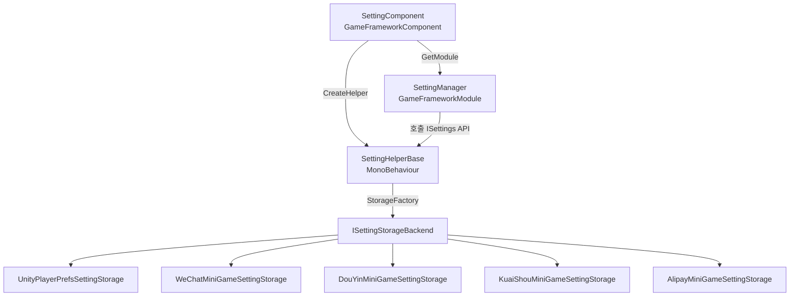

# 작동 원리: SettingComponent 아키텍처

`SettingComponent`는 GameFrameX 설정 모듈의 진입 컴포넌트로서, 게임 시작 시 `SettingManager`와 `SettingHelper`를 호출하여 설정 로드 및 후속 읽기/쓰기를 완료합니다. 이 페이지는 해당 컴포넌트가 어떻게 인스턴스화되고, 어떻게 헬퍼에 위임하며, 데이터가 최종적으로 어떤 저장소 백엔드에 도달하는지를 설명합니다.

## 빠른 시작

`SettingComponent`를 마운트하면 프레임워크가 자동으로 설정을 읽고 초기화하므로, 비즈니스 코드에서 수동으로 new 할 필요가 없습니다.

1. 시작 씬의 `GameFrameX` 오브젝트에 `SettingComponent`가 추가되어 있는지 확인합니다(기본적으로 프레임워크와 함께 등록됨).
2. 기본적으로 [PlayerPrefsSettingHelper.cs](https://github.com/GameFrameX/com.gameframex.unity.setting/blob/main/Runtime/Setting/PlayerPrefsSettingHelper.cs)를 헬퍼로 사용합니다. WeChat 미니게임 저장소로 변경하려면 `m_SettingHelperTypeName` 필드를 해당 미니게임 헬퍼 타입명으로 변경하면 됩니다.
3. 비즈니스 코드에서 `GameFrameX.Setting.Runtime.SettingComponent`의 `GetBool` / `GetInt` / `GetString` 등의 메서드를 통해 설정을 읽고 씁니다.

## 작동 원리 개요

Setting 모듈은 "컴포넌트 → 매니저 → 헬퍼 → 저장소 백엔드"의 4단계 위임 구조로, 각 계층은 바로 아래 계층의 인터페이스에만 의존합니다.



각 계층의 책임:

| 계층 | 타입 | 책임 |
|----|------|------|
| 컴포넌트 계층 | [SettingComponent.cs](https://github.com/GameFrameX/com.gameframex.unity.setting/blob/main/Runtime/Setting/SettingComponent.cs#L48-L100) | `Awake`에서 `ISettingManager`를 가져오고, `SettingHelperBase` 인스턴스를 생성하여 매니저에 주입함. `Start`에서 첫 `Load()`를 트리거함 |
| 매니저 계층 | [SettingManager.cs](https://github.com/GameFrameX/com.gameframex.unity.setting/blob/main/Runtime/Setting/Setting/SettingManager.cs#L43-L134) | [ISettingManager.cs](https://github.com/GameFrameX/com.gameframex.unity.setting/blob/main/Runtime/Setting/Setting/ISettingManager.cs)를 구현하여 상위 계층에 `Get/Set*` 시리즈 API를 노출하고, 내부적으로 호출을 `ISettingHelper`에 전달함 |
| 헬퍼 계층 | [SettingHelperBase.cs](https://github.com/GameFrameX/com.gameframex.unity.setting/blob/main/Runtime/Setting/SettingHelperBase.cs#L43-L335) | 추상 `MonoBehaviour`로, 설정 읽기/쓰기, 로드/언로드, 직렬화 등 일반 기능을 제공함 |
| 저장소 백엔드 | [SettingStorageBackendFactory.cs](https://github.com/GameFrameX/com.gameframex.unity.setting/blob/main/Runtime/Setting/Storage/SettingStorageBackendFactory.cs) 및 각 `ISettingStorageBackend` 구현체 | 실제로 디스크에 쓰는 어댑터 계층: Unity는 `UnityPlayerPrefsSettingStorage`를, 미니게임 플랫폼은 해당 플랫폼의 storage 구현을 사용함 |

## 시작 프로세스

시작期间的的关键步骤如下,顺序与 `SettingComponent` 的 `Awake` / `Start` 一一对应:

1. **컴포넌트 타입 해석** —— `ImplementationComponentType = Utility.Assembly.GetType(componentType)`로, 프레임워크에 해당 인터페이스의 구현이 `SettingManager`임을 알림.
2. **매니저 가져오기** —— `GameFrameworkEntry.GetModule<ISettingManager>()`를 통해 전역 유일한 매니저 인스턴스를 가져옴.
3. **헬퍼 생성** —— `Helper.CreateHelper(m_SettingHelperTypeName, m_CustomSettingHelper)` 호출. 기본 타입명은 `"GameFrameX.Setting.Runtime.PlayerPrefsSettingHelper"`이며, Inspector에서 `m_CustomSettingHelper`를 지정했다면 커스텀 구현이 우선적으로 사용됨.
4. **헬퍼 마운트** —— 생성된 helper의 이름을 `"SettingHelper"`로 변경하고 `SettingComponent` 자신에게 마운트함 ([SettingComponent.cs](https://github.com/GameFrameX/com.gameframex.unity.setting/blob/main/Runtime/Setting/SettingComponent.cs#L94-L99) 참조).
5. **매니저 주입** —— `m_SettingManager.SetSettingHelper(settingHelper)`를 호출하며, 이 단계에서 helper가 null이 아닌지 검증함.
6. **최초 로드** —— `Start`에서 `m_SettingManager.Load()`를 실행하여 플레이어의 로컬 영구화된 설정을 읽음. 실패 시 로그만 기록하고 게임을 중단하지 않음.
7. **Shutdown 저장** —— `SettingManager.Shutdown()`은 프레임워크 종료 시 자동으로 `Save()`를 호출하여 메모리의 최신 값이 디스크에 기록되도록 보장함.

## API 위임 관계

`SettingComponent`의 각 공개 메서드는 `ISettingManager`의 해당 메서드를 단순히 래핑한 것에 불과하며, 비즈니스 호출자가 받는 `Count` / `GetBool` / `SetInt` 등의 인터페이스 시그니처는 [ISettingManager.cs](https://github.com/GameFrameX/com.gameframex.unity.setting/blob/main/Runtime/Setting/Setting/ISettingManager.cs)와 완전히 동일합니다.

| SettingComponent 메서드 | 위임 대상 | ISettingManager 시그니처 |
|----------------------|--------|----------------------|
| `Count` | → | `int Count { get; }` |
| `Save()` / `Load()` | → | `bool Load()` / `bool Save()` |
| `GetBool/SetBool(name[,defaultValue], value)` | → | 동일 이름의 메서드 |
| `GetInt/SetInt` | → | 동일 이름의 메서드 |
| `GetFloat/SetFloat` | → | 동일 이름의 메서드 |
| `GetString/SetString` | → | 동일 이름의 메서드 |
| `GetBool/Int/Float/String(..., object)` | → | 객체 직렬화를 지원하는 제네릭 버전 |
| `HasSetting/RemoveSetting/RemoveAllSettings` | → | 동일 이름의 메서드 |
| `GetAllSettingNames()` | → | `string[]` 반환 |
| `GetAllSettingNames(List<string>)` | → | 리스트에 채움 |

`SettingManager`는 매 호출 전에 `EnsureSettingHelper()`와 `EnsureSettingName()`을 수행하며([SettingManager.cs L47-L61](https://github.com/GameFrameX/com.gameframex.unity.setting/blob/main/Runtime/Setting/Setting/SettingManager.cs#L47-L61) 참조), helper가 주입되지 않은 경우 `GameFrameworkException("Setting helper is invalid.")`을 던지고, settingName이 비어 있으면 `"Setting name is invalid."`를 던집니다.

## 헬퍼와 저장소 백엔드

`SettingHelperBase` 자체는 추상 인터페이스만 정의하며, 실제 읽기/쓰기는 그 서브클래스에서 구현됩니다. 저장소에서 제공하는 기본 구현은 다음과 같습니다:

- [PlayerPrefsSettingHelper.cs](https://github.com/GameFrameX/com.gameframex.unity.setting/blob/main/Runtime/Setting/PlayerPrefsSettingHelper.cs): Unity `PlayerPrefs` 기반으로, 모든 일반 플랫폼에 적합함.
- 미니게임 플랫폼 helper: [WeChatMiniGameSettingStorage.cs](https://github.com/GameFrameX/com.gameframex.unity.setting/blob/main/Runtime/MiniGame/WeChat/WeChatMiniGameSettingStorage.cs), [DouYinMiniGameSettingStorage.cs](https://github.com/GameFrameX/com.gameframex.unity.setting/blob/main/Runtime/MiniGame/DouYin/DouYinMiniGameSettingStorage.cs), [KuaiShouMiniGameSettingStorage.cs](https://github.com/GameFrameX/com.gameframex.unity.setting/blob/main/Runtime/MiniGame/KuaiShou/KuaiShouMiniGameSettingStorage.cs), [AlipayMiniGameSettingStorage.cs](https://github.com/GameFrameX/com.gameframex.unity.setting/blob/main/Runtime/MiniGame/Alipay/AlipayMiniGameSettingStorage.cs).

헬퍼는 `SettingStorageBackendFactory`를 통해 현재 플랫폼에 해당하는 `ISettingStorageBackend` 구현체를 선택하므로, 비즈니스 코드는 신경 쓸 필요가 없습니다.

## 커스텀 헬퍼

```csharp
public class MySettingHelper : SettingHelperBase
{
    public override int Count => 0;
    public override bool Load() { /* 읽기 로직 */ return true; }
    public override bool Save() { /* 쓰기 로직 */ return true; }
    // ... 나머지 추상 멤버는 필요에 따라 구현
}
```

스크립트가 포함된 프리팹을 `SettingComponent.m_CustomSettingHelper` 필드에 드래그하면, 프레임워크가 `Awake`에서 이를 우선적으로 사용합니다. 이 필드가 비어 있으면 `m_SettingHelperTypeName`을 통해 리플렉션으로 생성됩니다.

## 다음 단계

- Inspector에서 저장 플랫폼 전환: 《설정 저장소 백엔드 선택 방법》 참조
- 비즈니스 코드에서 설정 읽기/쓰기 예시: 《게임 설정 읽기/쓰기 방법》 참조
- 플랫폼 저장소 백엔드 오류 트러블슈팅: 《Setting 로드 실패 시 대처 방법》 참조