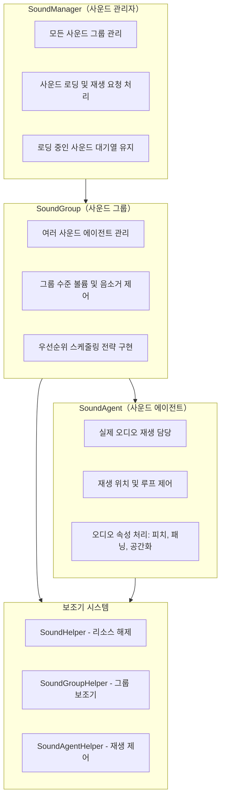
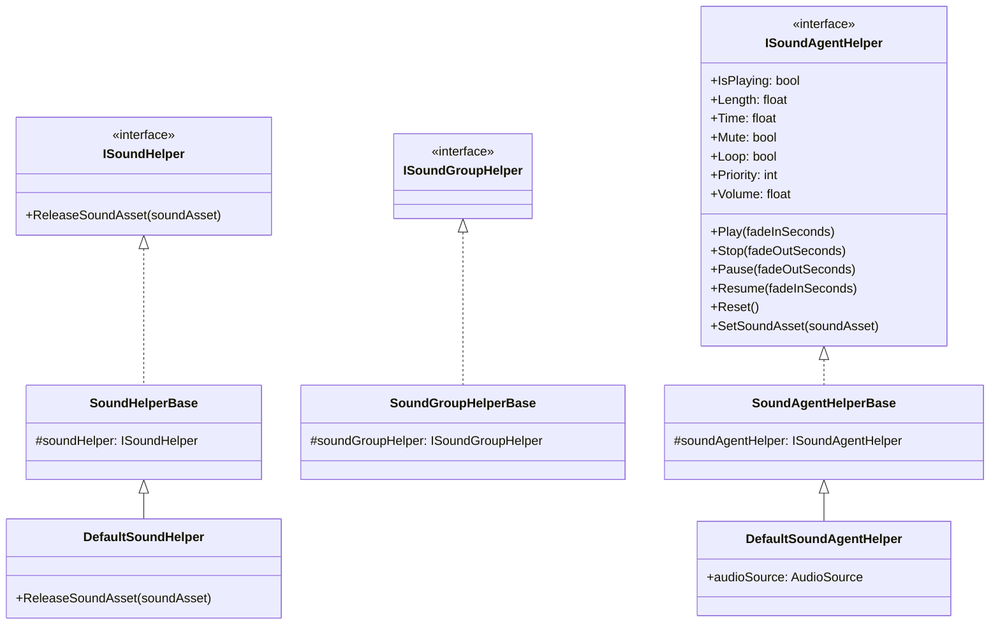
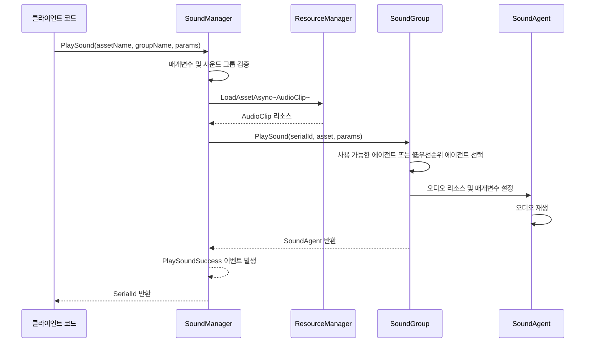
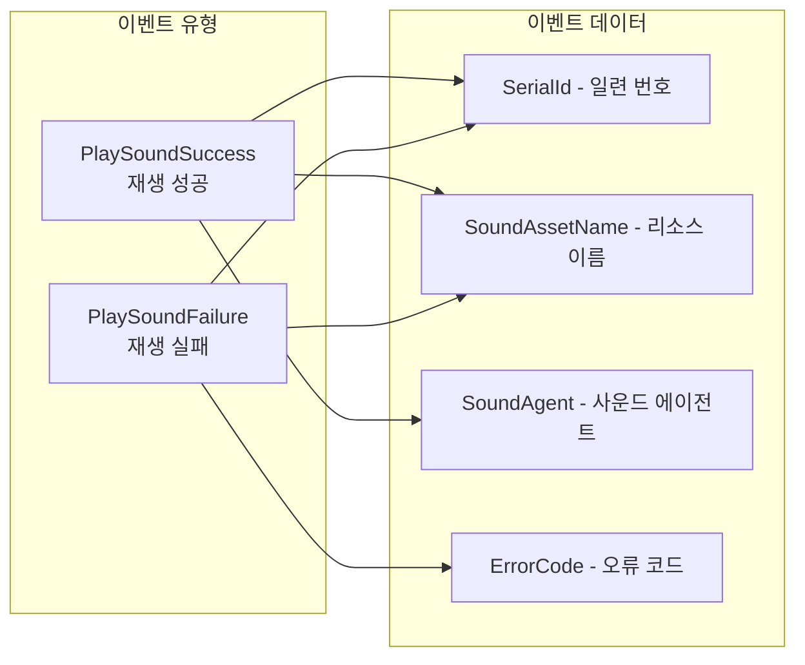

# 개요

GameFrameX Sound는 GameFrameX 게임 프레임워크의音频 관리 시스템으로, Unity 게임 엔진용으로 설계되었습니다. 완전한 소리 재생, 관리 및 제어 솔루션을 제공하며, 다중 사운드 그룹, 우선순위 스케줄링, 페이드 인/아웃 등의 고급 오디오 기능을 지원합니다.

## 시스템 아키텍처

GameFrameX Sound는 관리자(SoundManager) → 사운드 그룹(SoundGroup) → 사운드 에이전트(SoundAgent)의 3층 아키텍처 설계를 채택합니다. 이러한分层 설계는 오디오 시스템이 다양한 복잡한 게임 오디오 요구를 충족할 수 있는 좋은 확장성과 유연성을 가지도록 합니다.



## 핵심 개념

### 사운드 관리자 (SoundManager)

사운드 관리자는 전체 오디오 시스템의 핵심 컴포넌트로, 모든 사운드 그룹을 관리하고 사운드 재생 요청을 처리합니다. `GameFrameworkModule`을 상속하며 다음 핵심 기능을 제공합니다:

- **사운드 그룹 관리**: 사운드 그룹 생성, 조회 및 소멸
- **사운드 재생**: 오디오 리소스의 비동기 로딩 및 재생
- **재생 제어**: 단일 또는 모든 사운드 일시정지, 재개, 중지
- **상태 조회**: 로딩 중이거나 재생 중인 사운드 조회

> 상세 API 설명은 [사운드 관리자](./05.sound-manager)를 참조하세요

### 사운드 그룹 (SoundGroup)

사운드 그룹은 유사한 특성을 가진 사운드를 구성하고 제어하는 데 사용됩니다. 예를 들어 배경 음악을 위한 "Music" 그룹, 효과음을 위한 "SFX" 그룹을 만들 수 있으며, 각 그룹은 볼륨과 음소거 상태를 독립적으로 제어할 수 있습니다.

사운드 그룹의 핵심 특성:
- **독립 볼륨 제어**: 각 그룹에는 독립적인 볼륨 설정이 있습니다
- **음소거 관리**: 다른 그룹에 영향을 주지 않고 단일 그룹을 음소거할 수 있습니다
- **우선순위 전략**: 동일한 우선순위의 사운드가 서로 대체되는지 구성할 수 있습니다
- **에이전트 풀 관리**: 동시 재생을 위한 일组 사운드 에이전트 유지

> 상세 API 설명은 [사운드 그룹](./06.sound-group)를 참조하세요

### 사운드 에이전트 (SoundAgent)

사운드 에이전트는 오디오 재생을 실제로 수행하는 컴포넌트입니다. 각 사운드 에이전트는 `AudioSource`(또는 사용자 정의 오디오 구현)에 해당하며 다음을 담당합니다:
- 오디오 재생/일시정지/중지
- 재생 위치 설정
- 루프 재생 제어
- 피치(Pitch) 조정
- 스테레오 패닝(SpatialBlend) 설정
- 공간 오디오 믹싱(SpatialBlend)
- 도플러 효과(DopplerLevel)

> 상세 API 설명은 [사운드 에이전트](./07.sound-agent)를 참조하세요

### 보조기 시스템

GameFrameX Sound는 Helper 패턴을 채택하여高度的 확장성을 구현합니다:



이러한 보조기 베이스 클래스를 상속함으로써 개발자는 오디오 시스템의底层 구현을 완전히 사용자 정의할 수 있습니다, 예를 들어:
- 서드파티 오디오 미들웨어(FMOD, Wwise 등) 사용
- 특수 오디오 효과 구현
- 사용자 정의 리소스 로딩 전략 구현

## 소리 재생 흐름

`PlaySound` 메서드를 호출하면 시스템이 다음 흐름으로 처리합니다:



1. **매개변수 검증**: 사운드 그룹是否存在하는지, 사용 가능한 사운드 에이전트가 있는지 확인
2. **리소스 로딩**: 리소스 관리자를 통해 오디오 리소스를 비동기 로딩
3. **에이전트 배분**: 사운드 그룹에서 적합한 에이전트 선택(유휴 또는 低우선순위)
4. **재생 제어**: 오디오 매개변수 설정 및 재생 시작
5. **이벤트 알림**: 성공 또는 실패 이벤트 발생

## 재생 매개변수

`PlaySoundParams` 클래스는 구성 가능한 모든 재생 매개변수를 포함합니다:

| 매개변수 | 유형 | 기본값 | 설명 |
|------|------|--------|------|
| Time | float | 0f | 재생 시작 위치(초) |
| MuteInSoundGroup | bool | false | 그룹 내에서 음소거 여부 |
| Loop | bool | false | 루프 재생 여부 |
| Priority | int | 0 | 재생 우선순위(숫자가 높을수록 우선) |
| VolumeInSoundGroup | float | 1.0f | 그룹 내 볼륨 계수 |
| FadeInSeconds | float | 0f | 페이드 인 시간(초) |
| Pitch | float | 1.0f | 피치(0.5-3.0) |
| PanStereo | float | 0f | 스테레오 위치(-1~1) |
| SpatialBlend | float | 0f | 공간 혼합량(2D/3D) |
| MaxDistance | float | 100f | 최대 3D 거리 |
| DopplerLevel | float | 1f | 도플러 효과 레벨 |

> 상세 설명은 [재생 매개변수](./08.play-sound-params)를 참조하세요

## 이벤트 시스템

GameFrameX Sound는 완전한 이벤트 메커니즘을 제공합니다:



- **PlaySoundSuccess**: 재생 성공 시 발생하며, 일련 번호, 리소스 이름, 사운드 에이전트 등의 정보를 포함합니다
- **PlaySoundFailure**: 재생 실패 시 발생하며, 오류 코드와 오류 정보를 포함합니다

> 상세 설명은 [이벤트 매개변수](./09.event-args)를 참조하세요

## 사용 예제

### 기본 사용법

```csharp
// SoundComponent를 통해 사운드 재생
var soundComponent = GameEntry.GetComponent<SoundComponent>();
int serialId = await soundComponent.PlaySound("Assets/Audio/BGM_Main.mp3", "Music");
```

### 매개변수와 함께 재생

```csharp
var playParams = PlaySoundParams.Create();
playParams.Loop = true;
playParams.VolumeInSoundGroup = 0.8f;
playParams.FadeInSeconds = 1.0f;

int serialId = await soundComponent.PlaySound("Assets/Audio/BGM_Battle.mp3", "Music", playParams);
```

### 재생 제어

```csharp
// 재생 일시정지
soundComponent.PauseSound(serialId);

// 재생 재개
soundComponent.ResumeSound(serialId);

// 재생 중지
soundComponent.StopSound(serialId);
```

## 설계 철학

GameFrameX Sound의 설계는 다음 원칙을 따릅니다:

1. **分层 관리**: Manager → Group → Agent의分层 구조를 통해 세분화된 오디오 제어 실현
2. **우선순위 스케줄링**: 우선순위 기반 에이전트 배분 전략으로 중요한 사운드가 적시에 재생되도록 보장
3. **보조기 확장**: Helper 패턴을 통해 사용자 정의 오디오 구현 지원, 서드파티 오디오 라이브러리 통합 용이
4. **비동기 로딩**: UniTask를 사용하여 논블로킹 오디오 리소스 로딩 구현
5. **페이드 인/아웃**: 내장된 볼륨 서서히 변화 지원으로 오디오 경험 향상

## 관련 링크

- [설치 가이드](./02.installation)
- [빠른 시작](./03.getting-started)
- [API 참조 - 인터페이스 정의](./04.interfaces)
- [API 참조 - 재생 매개변수](./08.play-sound-params)
- [구성 설명](./10.configuration)
- [확장 가이드](./11.extending)
- [자주 묻는 질문](./12.troubleshooting)