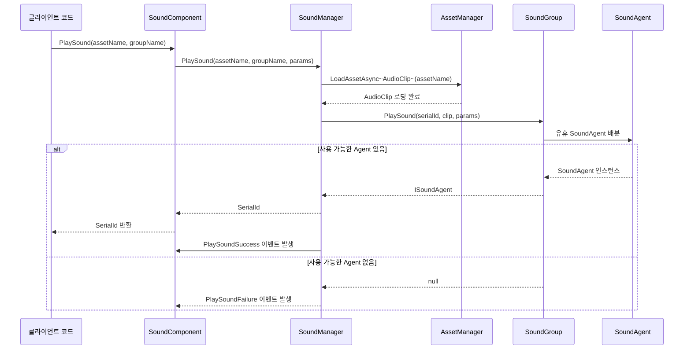

# 빠른 시작

이 가이드는 GameFrameX Sound 사운드 관리 컴포넌트를 빠르게 시작할 수 있도록 도와주며, 간단한 단계로 Unity 프로젝트에 전문적인 오디오 시스템을 통합할 수 있습니다.

## 개요

GameFrameX Sound는 GameFrameX 프레임워크의 사운드 관리 컴포넌트로, 완전한 소리 재생, 관리 및 제어 기능을 제공합니다. 이 컴포넌트는 다중 사운드 그룹 관리, 비동기 리소스 로딩, 공간 오디오, 소리 페이드 인/아웃 등의 고급 특성을 지원하여 다양한 게임 오디오 요구를 충족할 수 있습니다.

**핵심 기능:**
- 다중 사운드 그룹 관리: 동시에 여러 사운드 그룹을 관리할 수 있으며, 각 그룹은 볼륨과 음소거를 독립적으로 제어할 수 있습니다
- 비동기 로딩: UniTask를 사용하여 비동기 리소스 로딩을 구현하며 게임 메인 스레드를 차단하지 않습니다
- 유연한 이벤트 시스템: 재생 성공/실패 이벤트 콜백 제공
- 공간 오디오 지원: 3D 공간 효과음 지원
- 소리 페이드 인/아웃: 재생 시 페이드 인, 중지 시 페이드 아웃 지원
- AudioMixer 통합: Unity AudioMixer와 완벽하게 연동 가능

## 빠른 사용 흐름

다음은 Unity 프로젝트에서 Sound 컴포넌트를 빠르게 통합하는 5단계입니다:

### 단계 1: 컴포넌트 설치

Unity 프로젝트의 `manifest.json` 파일에 의존을 추가합니다:

```json
{
  "dependencies": {
    "com.gameframex.unity.sound": "https://github.com/GameFrameX/com.gameframex.unity.sound.git"
  }
}
```

> Source: [README.md](https://github.com/GameFrameX/com.gameframex.unity.sound/blob/main/README.md#L10-L14)

### 단계 2: SoundComponent 추가

Unity 씬에서 빈 GameObject를 생성한 다음 `SoundComponent` 컴포넌트를 추가합니다:

1. Hierarchy 패널에서 우클릭하고 **Create Empty**를 선택하여 빈 오브젝트를 생성합니다
2. 적절한 이름(예: "SoundSystem")으로 변경합니다
3. Inspector 패널에서 **Add Component**를 클릭합니다
4. **GameFrameX/Sound** 컴포넌트를 검색하여 선택합니다

> Source: [SoundComponent.cs](https://github.com/GameFrameX/com.gameframex.unity.sound/blob/main/Runtime/Sound/SoundComponent.cs#L50-L51)

```csharp
[DisallowMultipleComponent]
[AddComponentMenu("GameFrameX/Sound")]
public sealed partial class SoundComponent : GameFrameworkComponent
```

### 단계 3: 사운드 그룹 구성

SoundComponent의 Inspector 패널에서 사운드 그룹을 구성합니다. **Sound Groups** 배열에서 각 요소에 대해 다음을 설정합니다:

| 속성 | 설명 | 예시 값 |
|------|------|--------|
| Name | 사운드 그룹 이름으로, 코드에서 참조에 사용됩니다 | "Music", "SFX", "Voice" |
| Avoid Being Replaced By Same Priority | 동일한 우선순위 사운드로 대체되지 않도록 할지 여부 | false |
| Mute | 음소거 여부 | false |
| Volume | 볼륨 크기 (0-1) | 1.0 |
| Agent Helper Count | 동시 재생 에이전트 수 | 3 |

> Source: [SoundComponent.cs](https://github.com/GameFrameX/com.gameframex.unity.sound/blob/main/Runtime/Sound/SoundComponent.cs#L175-L183)

일반적인 구성 방안:
- **배경 음악 그룹**: 에이전트 1개, 루프 재생
- **효과음 그룹**: 에이전트 3-5개, 다중 효과음 동시 재생 지원
- **음성 그룹**: 에이전트 1-2개, 음성 명확성 보장

### 단계 4: 코드에서 사운드 재생

`SoundComponent`를 통해 사운드를 재생하는 것은 매우 간단합니다:

```csharp
// SoundComponent 인스턴스 가져오기
var soundComponent = GameEntry.GetComponent<SoundComponent>();

// 배경 음악 재생(루프)
var musicParams = PlaySoundParams.Create(true); // true는 루프 재생 의미
await soundComponent.PlaySound("Assets/Audio/Music/MainTheme.mp3", "Music", musicParams);

// 효과음 재생(비루프)
await soundComponent.PlaySound("Assets/Audio/SFX/Click.wav", "SFX");

// 3D 공간 효과음 재생
await soundComponent.PlaySound("Assets/Audio/SFX/Explosion.wav", "SFX", transform.position);
```

> Source: [SoundComponent.cs](https://github.com/GameFrameX/com.gameframex.unity.sound/blob/main/Runtime/Sound/SoundComponent.cs#L356-L430)

### 단계 5: 재생 제어

반환된 일련 번호(SerialId)를 사용하여 사운드 재생을 제어합니다:

```csharp
// 사운드 일시정지
soundComponent.PauseSound(serialId);

// 재생 재개
soundComponent.ResumeSound(serialId);

// 사운드 중지(페이드 아웃 효과 포함)
soundComponent.StopSound(serialId, 0.5f); // 0.5초 페이드 아웃

// 모든 사운드 중지
soundComponent.StopAllLoadedSounds();
```

> Source: [SoundComponent.cs](https://github.com/GameFrameX/com.gameframex.unity.sound/blob/main/Runtime/Sound/SoundComponent.cs#L532-L614)

## 재생 흐름

다음 흐름도는 PlaySound 호출부터 소리 실제 재생까지의 완전한 과정을 보여줍니다:



## 재생 매개변수 구성

`PlaySoundParams` 클래스는 풍부한 재생 매개변수 구성을 제공합니다:

```csharp
// 재생 매개변수 생성
var playSoundParams = ReferencePool.Acquire<PlaySoundParams>();

// 재생 매개변수 구성
playSoundParams.Loop = true;                    // 루프 재생
playSoundParams.VolumeInSoundGroup = 0.8f;    // 그룹 내 볼륨
playSoundParams.Priority = 100;                // 우선순위
playSoundParams.FadeInSeconds = 1.0f;         // 페이드 인 시간(초)
playSoundParams.Pitch = 1.0f;                  // 피치
playSoundParams.SpatialBlend = 1.0f;           // 공간 혼합(3D 효과음)
playSoundParams.MaxDistance = 50f;             // 최대 거리

// 사용 후 오브젝트 풀에 반환
ReferencePool.Release(playSoundParams);
```

> Source: [PlaySoundParams.cs](https://github.com/GameFrameX/com.gameframex.unity.sound/blob/main/Runtime/Sound/Sound/PlaySoundParams.cs#L40-L258)

**자주 사용되는 매개변수 설명:**

| 매개변수 | 유형 | 기본값 | 설명 |
|------|------|--------|------|
| Loop | bool | false | 루프 재생 여부 |
| VolumeInSoundGroup | float | 1.0 | 사운드 그룹 내 볼륨 (0-1) |
| Priority | int | 0 | 재생 우선순위, 숫자가 높을수록 우선 |
| FadeInSeconds | float | 0 | 페이드 인 시간(초) |
| Pitch | float | 1.0 | 재생 피치 (0.5-2.0) |
| SpatialBlend | float | 0 | 공간 혼합량 (0=2D, 1=3D) |
| MaxDistance | float | 100 | 3D 효과음 최대 감쇠 거리 |

## 완전 사용 예제

다음은 완전한 사용 예제로, 게임 시작 시 배경 음악을 재생하고 플레이어가 버튼을 클릭할 때 효과음을 재생하는 방법을 보여줍니다:

```csharp
using UnityEngine;
using GameFrameX.Sound.Runtime;
using GameFrameX.Runtime;
using Cysharp.Threading.Tasks;

public class AudioExample : MonoBehaviour
{
    private SoundComponent _soundComponent;
    private int _bgMusicSerialId;

    private void Start()
    {
        // SoundComponent 가져오기
        _soundComponent = GameEntry.GetComponent<SoundComponent>();

        // 재생 이벤트 구독
        _soundComponent.PlaySoundSuccess += OnPlaySoundSuccess;
        _soundComponent.PlaySoundFailure += OnPlaySoundFailure;

        // 배경 음악 재생
        PlayBackgroundMusic();
    }

    private async void PlayBackgroundMusic()
    {
        // 루프 재생 매개변수 생성
        var musicParams = PlaySoundParams.Create(true);
        musicParams.FadeInSeconds = 2.0f;
        musicParams.VolumeInSoundGroup = 0.6f;

        _bgMusicSerialId = await _soundComponent.PlaySound(
            "Assets/Audio/Music/GameTitle.mp3",
            "Music",
            musicParams
        );
    }

    // 플레이어가 버튼을 클릭할 때 호출
    public void OnButtonClick()
    {
        // 클릭 효과음 재생
        _ = _soundComponent.PlaySound(
            "Assets/Audio/SFX/ButtonClick.wav",
            "SFX"
        );
    }

    // 재생 성공 콜백
    private void OnPlaySoundSuccess(object sender, PlaySoundSuccessEventArgs e)
    {
        Debug.Log($"사운드 재생 성공: {e.SoundAssetName}, SerialId: {e.SerialId}");
    }

    // 재생 실패 콜백
    private void OnPlaySoundFailure(object sender, PlaySoundFailureEventArgs e)
    {
        Debug.LogWarning($"사운드 재생 실패: {e.SoundAssetName}, 오류: {e.ErrorMessage}");
    }

    private void OnDestroy()
    {
        if (_soundComponent != null)
        {
            _soundComponent.PlaySoundSuccess -= OnPlaySoundSuccess;
            _soundComponent.PlaySoundFailure -= OnPlaySoundFailure;
        }
    }
}
```

> Source: [SoundComponent.cs](https://github.com/GameFrameX/com.gameframex.unity.sound/blob/main/Runtime/Sound/SoundComponent.cs#L655-L688)

## 사운드 그룹 관리

런타임에서 사운드 그룹을 동적으로 관리합니다:

```csharp
var soundComponent = GameEntry.GetComponent<SoundComponent>();

// 사운드 그룹 존재 여부 확인
if (soundComponent.HasSoundGroup("Music"))
{
    // 사운드 그룹 가져오기
    var musicGroup = soundComponent.GetSoundGroup("Music");

    // 볼륨 설정
    musicGroup.Volume = 0.5f;

    // 음소거/음소거 해제
    musicGroup.Mute = true;

    // 재생 중인지 확인
    bool isPlaying = musicGroup.IsPlaying(serialId);
}

// 현재 재생 중인 모든 사운드 중지
soundComponent.StopAllLoadedSounds();
soundComponent.StopAllLoadingSounds();
```

> Source: [ISoundGroup.cs](https://github.com/GameFrameX/com.gameframex.unity.sound/blob/main/Runtime/Interface/ISoundGroup.cs#L38-L87)

## 관련 링크

- [사운드 관리자](./05.sound-manager) - SoundManager의 상세 기능 이해
- [사운드 그룹](./06.sound-group) - 사운드 그룹 개념 심층 이해
- [사운드 에이전트](./07.sound-agent) - 사운드 에이전트 메커니즘 이해
- [API 참조 - 인터페이스 정의](./04.interfaces) - ISoundManager, ISoundGroup 등 인터페이스 상세
- [API 참조 - 재생 매개변수](./08.play-sound-params) - PlaySoundParams 완전한 매개변수 설명
- [API 참조 - 이벤트 매개변수](./09.event-args) - 재생 이벤트 상세
- [구성 설명](./10.configuration) - 사운드 시스템 구성 옵션