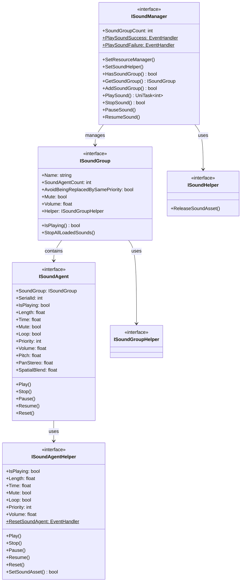

# 인터페이스 정의

이 문서는 GameFrameX 사운드 시스템에서 정의된 모든 핵심 인터페이스를 상세히 소개합니다. 인터페이스는 계층화 설계を採用하여 사운드 관리자, 사운드 그룹, 사운드 에이전트 및 헬퍼에 대한 완전한 추상화를 제공합니다.

## 개요

GameFrameX 사운드 시스템은 전형적인 계층화 아키텍처를 채택하고 인터페이스 정의를 통해高度의 확장성과 테스트 가능성을 실현합니다. 시스템은 다음 핵심 인터페이스를 포함합니다:

- **ISoundManager** - 사운드 관리자 인터페이스, 전역 사운드 리소스 관리 및 재생 제어 담당
- **ISoundGroup** - 사운드 그룹 인터페이스,一组 관련 사운드의 재생 동작 관리
- **ISoundAgent** - 사운드 에이전트 인터페이스,单个 사운드 인스턴스의 재생 제어
- **ISoundHelper** - 사운드 헬퍼 인터페이스, 리소스 해제용
- **ISoundGroupHelper** - 사운드 그룹 헬퍼 인터페이스
- **ISoundAgentHelper** - 사운드 에이전트 헬퍼 인터페이스

이러한 계층화 설계를 통해 개발자는 다양한 플랫폼(FMOD, CRIWARE 등)에 대해 특정 헬퍼를 구현할 수 있으며, 상위 레이어 코드의 일관성을 유지할 수 있습니다.

## 인터페이스 아키텍처



## ISoundManager 인터페이스

ISoundManager는 사운드 시스템의 핵심 인터페이스로, GameFrameworkModule을 상속하여 전역 사운드 관리 기능을 제공합니다.

### 핵심 속성

| 속성 | 유형 | 설명 |
|------|------|------|
| SoundGroupCount | `int` | 현재 추가된 사운드 그룹 수량 가져오기 |
| PlaySoundSuccess | `EventHandler<PlaySoundSuccessEventArgs>`` | 사운드 재생 성공 이벤트 |
| PlaySoundFailure | `EventHandler<PlaySoundFailureEventArgs>` | 사운드 재생 실패 이벤트 |

### 핵심 메서드

#### 리소스 관리자 설정

```csharp
void SetResourceManager(IAssetManager assetManager)
```

비동기 로딩을 위해 리소스 관리자를 설정합니다.

> Source: [ISoundManager.cs](https://github.com/GameFrameX/com.gameframex.unity.sound/blob/main/Runtime/Interface/ISoundManager.cs#L62-L64)

#### 사운드 헬퍼 설정

```csharp
void SetSoundHelper(ISoundHelper soundHelper)
```

사운드 리소스 해제를 위해 사운드 헬퍼를 설정합니다.

> Source: [ISoundManager.cs](https://github.com/GameFrameX/com.gameframex.unity.sound/blob/main/Runtime/Interface/ISoundManager.cs#L67-L70)

#### 사운드 그룹 추가

```csharp
bool AddSoundGroup(string soundGroupName, ISoundGroupHelper soundGroupHelper)
bool AddSoundGroup(string soundGroupName, bool soundGroupAvoidBeingReplacedBySamePriority, bool soundGroupMute, float soundGroupVolume, ISoundGroupHelper soundGroupHelper)
```

새 사운드 그룹을 추가합니다. 첫 번째 오버로드는 기본 파라미터를 사용하고, 두 번째 오버로드는 완전한 구성을 지정할 수 있습니다.

**파라미터:**
- `soundGroupName` - 사운드 그룹 이름, 식별 및 검색에 사용
- `soundGroupAvoidBeingReplacedBySamePriority` - 동일 우선순위 사운드 교체 방지 여부
- `soundGroupMute` - 사운드 그룹 음소거 여부
- `soundGroupVolume` - 사운드 그룹 볼륨 (0.0-1.0)
- `soundGroupHelper` - 사운드 그룹 헬퍼 인스턴스

> Source: [ISoundManager.cs](https://github.com/GameFrameX/com.gameframex.unity.sound/blob/main/Runtime/Interface/ISoundManager.cs#L98-L115)

#### 사운드 그룹 가져오기

```csharp
bool HasSoundGroup(string soundGroupName)
ISoundGroup GetSoundGroup(string soundGroupName)
ISoundGroup[] GetAllSoundGroups()
void GetAllSoundGroups(List<ISoundGroup> results)
```

추가된 사운드 그룹을 가져옵니다. 이름으로 검색 및 모든 사운드 그룹 가져오기를 지원합니다.

> Source: [ISoundManager.cs](https://github.com/GameFrameX/com.gameframex.unity.sound/blob/main/Runtime/Interface/ISoundManager.cs#L72-L96)

#### 사운드 재생

```csharp
UniTask<int> PlaySound(string soundAssetName, string soundGroupName)
UniTask<int> PlaySound(string soundAssetName, string soundGroupName, int priority)
UniTask<int> PlaySound(string soundAssetName, string soundGroupName, PlaySoundParams playSoundParams)
UniTask<int> PlaySound(string soundAssetName, string soundGroupName, object userData)
UniTask<int> PlaySound(string soundAssetName, string soundGroupName, int priority, PlaySoundParams playSoundParams)
UniTask<int> PlaySound(string soundAssetName, string soundGroupName, int priority, object userData)
UniTask<int> PlaySound(string soundAssetName, string soundGroupName, PlaySoundParams playSoundParams, object userData)
UniTask<int> PlaySound(string soundAssetName, string soundGroupName, int priority, PlaySoundParams playSoundParams, object userData, int serialId)
```

사운드 리소스의 핵심 재생 메서드로, 다양한 장면에 맞는 여러 오버로드를 제공합니다. 사운드의 일련 번호(SerialId)를 반환하여后续 재생 제어를 위해 사용합니다.

**파라미터:**
- `soundAssetName` - 사운드 리소스 이름
- `soundGroupName` - 사운드 그룹 이름
- `priority` - 로딩 우선순위
- `playSoundParams` - 재생 파라미터 (음표, 볼륨, 루프 등)
- `userData` - 사용자 정의 데이터, 이벤트에서 回传
- `serialId` - 지정 일련 번호

> Source: [ISoundManager.cs](https://github.com/GameFrameX/com.gameframex.unity.sound/blob/main/Runtime/Interface/ISoundManager.cs#L143-L218)

#### 사운드 중지

```csharp
bool StopSound(int serialId)
bool StopSound(int serialId, float fadeOutSeconds)
```

지정된 일련 번호의 사운드 재생을 중지합니다. 두 번째 오버로드는 페이드 아웃 효과를 지원합니다.

> Source: [ISoundManager.cs](https://github.com/GameFrameX/com.gameframex.unity.sound/blob/main/Runtime/Interface/ISoundManager.cs#L220-L233)

#### 모든 사운드 중지

```csharp
void StopAllLoadedSounds()
void StopAllLoadedSounds(float fadeOutSeconds)
void StopAllLoadingSounds()
```

로드되었거나 로딩 중인 모든 사운드를 중지합니다.

> Source: [ISoundManager.cs](https://github.com/GameFrameX/com.gameframex.unity.sound/blob/main/Runtime/Interface/ISoundManager.cs#L235-L249)

#### 사운드 일시정지/재개

```csharp
void PauseSound(int serialId)
void PauseSound(int serialId, float fadeOutSeconds)
void ResumeSound(int serialId)
void ResumeSound(int serialId, float fadeInSeconds)
```

지정 사운드의 재생을 일시정지 및 재개합니다. 페이드 인/아웃 효과를 지원합니다.

> Source: [ISoundManager.cs](https://github.com/GameFrameX/com.gameframex.unity.sound/blob/main/Runtime/Interface/ISoundManager.cs#L251-L275)

#### 로딩 상태 조회

```csharp
int[] GetAllLoadingSoundSerialIds()
void GetAllLoadingSoundSerialIds(List<int> results)
bool IsLoadingSound(int serialId)
```

현재 로딩 중인 사운드의 일련 번호를 조회합니다.

> Source: [ISoundManager.cs](https://github.com/GameFrameX/com.gameframex.unity.sound/blob/main/Runtime/Interface/ISoundManager.cs#L124-L141)

---

## ISoundGroup 인터페이스

ISoundGroup은 사운드 그룹을 나타내며,一组 관련 사운드를 관리하는 데 사용됩니다. 각 사운드 그룹은 독립적인 볼륨 제어, 음소거 설정 및 교체 전략을 가집니다.

### 속성

| 속성 | 유형 | 읽기/쓰기 | 설명 |
|------|------|------|------|
| Name | `string` | 읽기 전용 | 사운드 그룹 이름 |
| SoundAgentCount | `int` | 읽기 전용 | 사운드 에이전트 수량 |
| AvoidBeingReplacedBySamePriority | `bool` | 읽기/쓰기 | 동일 우선순위 사운드 교체 방지 여부 |
| Mute | `bool` | 읽기/쓰기 | 사운드 그룹 음소거 상태 |
| Volume | `float` | 읽기/쓰기 | 사운드 그룹 볼륨 (0.0-1.0) |
| Helper | `ISoundGroupHelper` | 읽기 전용 | 사운드 그룹 헬퍼 |

> Source: [ISoundGroup.cs](https://github.com/GameFrameX/com.gameframex.unity.sound/blob/main/Runtime/Interface/ISoundGroup.cs#L38-L68)

### 메서드

#### 재생 상태 확인

```csharp
bool IsPlaying(int serialId)
```

지정된 일련 번호의 사운드가 재생 중인지 확인합니다. 지정된 일련 번호를 찾을 수 없는 경우에도 false를 반환합니다.

> Source: [ISoundGroup.cs](https://github.com/GameFrameX/com.gameframex.unity.sound/blob/main/Runtime/Interface/ISoundGroup.cs#L70-L75)

#### 모든 사운드 중지

```csharp
void StopAllLoadedSounds()
void StopAllLoadedSounds(float fadeOutSeconds)
```

해당 사운드 그룹의 모든 로드된 사운드를 중지합니다.

> Source: [ISoundGroup.cs](https://github.com/GameFrameX/com.gameframex.unity.sound/blob/main/Runtime/Interface/ISoundGroup.cs#L77-L86)

---

## ISoundAgent 인터페이스

ISoundAgent는 사운드 에이전트를 나타내며, 실제 오디오 재생을 제어하는 최소 단위입니다. 각 사운드 에이전트는 재생 중이거나 일시정지된 사운드 인스턴스에 대응합니다.

### 속성

| 속성 | 유형 | 읽기/쓰기 | 설명 |
|------|------|------|------|
| SoundGroup | `ISoundGroup` | 읽기 전용 | 소속 사운드 그룹 |
| SerialId | `int` | 읽기 전용 | 일련 번호 |
| IsPlaying | `bool` | 읽기 전용 | 재생 중 여부 |
| Length | `float` | 읽기 전용 | 사운드 길이 (초) |
| Time | `float` | 읽기/쓰기 | 현재 재생 위치 (초) |
| Mute | `bool` | 읽기 전용 | 음소거 상태 |
| MuteInSoundGroup | `bool` | 읽기/쓰기 | 그룹 내 음소거 여부 |
| Loop | `bool` | 읽기/쓰기 | 루프 재생 여부 |
| Priority | `int` | 읽기/쓰기 | 재생 우선순위 |
| Volume | `float` | 읽기 전용 | 현재 볼륨 |
| VolumeInSoundGroup | `float` | 읽기/쓰기 | 그룹 내 볼륨 |
| Pitch | `float` | 읽기/쓰기 | 음표 |
| PanStereo | `float` | 읽기/쓰기 | 스테레오 페닝 (-1.0~1.0) |
| SpatialBlend | `float` | 읽기/쓰기 | 공간 혼합량 (0.0~1.0) |
| MaxDistance | `float` | 읽기/쓰기 | 최대 거리 |
| DopplerLevel | `float` | 읽기/쓰기 | 도플러 등급 |
| Helper | `ISoundAgentHelper` | 읽기 전용 | 에이전트 헬퍼 |

> Source: [ISoundAgent.cs](https://github.com/GameFrameX/com.gameframex.unity.sound/blob/main/Runtime/Interface/ISoundAgent.cs#L38-L123)

### 메서드

#### 재생

```csharp
void Play()
void Play(float fadeInSeconds)
```

사운드 재생을 시작하거나 재개합니다. 두 번째 오버로드는 페이드 인 효과를 지원합니다.

> Source: [ISoundAgent.cs](https://github.com/GameFrameX/com.gameframex.unity.sound/blob/main/Runtime/Interface/ISoundAgent.cs#L125-L134)

#### 중지

```csharp
void Stop()
void Stop(float fadeOutSeconds)
```

사운드 재생을 중지합니다. 두 번째 오버로드는 페이드 아웃 효과를 지원합니다.

> Source: [ISoundAgent.cs](https://github.com/GameFrameX/com.gameframex.unity.sound/blob/main/Runtime/Interface/ISoundAgent.cs#L136-L145)

#### 일시정지

```csharp
void Pause()
void Pause(float fadeOutSeconds)
```

사운드 재생을 일시정지합니다. 두 번째 오버로드는 페이드 아웃 효과를 지원합니다.

> Source: [ISoundAgent.cs](https://github.com/GameFrameX/com.gameframex.unity.sound/blob/main/Runtime/Interface/ISoundAgent.cs#L147-L156)

#### 재개

```csharp
void Resume()
void Resume(float fadeInSeconds)
```

일시정지된 사운드 재생을 재개합니다. 두 번째 오버로드는 페이드 인 효과를 지원합니다.

> Source: [ISoundAgent.cs](https://github.com/GameFrameX/com.gameframex.unity.sound/blob/main/Runtime/Interface/ISoundAgent.cs#L158-L167)

#### 초기화

```csharp
void Reset()
```

사운드 에이전트를 초기 상태로 재설정합니다.

> Source: [ISoundAgent.cs](https://github.com/GameFrameX/com.gameframex.unity.sound/blob/main/Runtime/Interface/ISoundAgent.cs#L169-L172)

---

## ISoundHelper 인터페이스

ISoundHelper는 가장 간단한 인터페이스로, 사운드 리소스 해제에 사용됩니다.

### 메서드

```csharp
void ReleaseSoundAsset(object soundAsset)
```

지정된 사운드 리소스를 해제합니다.

> Source: [ISoundHelper.cs](https://github.com/GameFrameX/com.gameframex.unity.sound/blob/main/Runtime/Interface/ISoundHelper.cs#L38-L45)

---

## ISoundGroupHelper 인터페이스

ISoundGroupHelper는 사운드 그룹 헬퍼의 마커 인터페이스입니다. 현재 아무런 메서드도 정의되지 않았으며, 基类 식별자로만 사용됩니다.

> Source: [ISoundGroupHelper.cs](https://github.com/GameFrameX/com.gameframex.unity.sound/blob/main/Runtime/Interface/ISoundGroupHelper.cs#L38-L40)

---

## ISoundAgentHelper 인터페이스

ISoundAgentHelper는 사운드 에이전트 헬퍼 인터페이스로, 하위 레벨 오디오 재생 제어를 제공합니다. 이 인터페이스는 ISoundAgent와 유사하지만 하위 레벨 구현을 대상으로 합니다.

### 속성

| 속성 | 유형 | 읽기/쓰기 | 설명 |
|------|------|------|------|
| IsPlaying | `bool` | 읽기 전용 | 재생 중 여부 |
| Length | `float` | 읽기 전용 | 사운드 길이 (초) |
| Time | `float` | 읽기/쓰기 | 현재 재생 위치 (초) |
| Mute | `bool` | 읽기/쓰기 | 음소거 상태 |
| Loop | `bool` | 읽기/쓰기 | 루프 재생 여부 |
| Priority | `int` | 읽기/쓰기 | 재생 우선순위 |
| Volume | `float` | 읽기/쓰기 | 볼륨 크기 |
| Pitch | `float` | 읽기/쓰기 | 음표 |
| PanStereo | `float` | 읽기/쓰기 | 스테레오 페닝 |
| SpatialBlend | `float` | 읽기/쓰기 | 공간 혼합량 |
| MaxDistance | `float` | 읽기/쓰기 | 최대 거리 |
| DopplerLevel | `float` | 읽기/쓰기 | 도플러 등급 |

### 이벤트

```csharp
event EventHandler<ResetSoundAgentEventArgs> ResetSoundAgent
```

사운드 에이전트가 재설정될 때 트리거되는 이벤트입니다.

### 메서드

#### 재생

```csharp
void Play(float fadeInSeconds)
```

지정된 페이드 인 시간으로 사운드를 재생합니다.

> Source: [ISoundAgentHelper.cs](https://github.com/GameFrameX/com.gameframex.unity.sound/blob/main/Runtime/Interface/ISoundAgentHelper.cs#L107-L111)

#### 중지

```csharp
void Stop(float fadeOutSeconds)
```

지정된 페이드 아웃 시간으로 사운드를 중지합니다.

> Source: [ISoundAgentHelper.cs](https://github.com/GameFrameX/com.gameframex.unity.sound/blob/main/Runtime/Interface/ISoundAgentHelper.cs#L113-L117)

#### 일시정지

```csharp
void Pause(float fadeOutSeconds)
```

지정된 페이드 아웃 시간으로 사운드를 일시정지합니다.

> Source: [ISoundAgentHelper.cs](https://github.com/GameFrameX/com.gameframex.unity.sound/blob/main/Runtime/Interface/ISoundAgentHelper.cs#L119-L123)

#### 재개

```csharp
void Resume(float fadeInSeconds)
```

지정된 페이드 인 시간으로 사운드를 재개합니다.

> Source: [ISoundAgentHelper.cs](https://github.com/GameFrameX/com.gameframex.unity.sound/blob/main/Runtime/Interface/ISoundAgentHelper.cs#L125-L129)

#### 초기화

```csharp
void Reset()
```

헬퍼를 초기 상태로 재설정합니다.

> Source: [ISoundAgentHelper.cs](https://github.com/GameFrameX/com.gameframex.unity.sound/blob/main/Runtime/Interface/ISoundAgentHelper.cs#L131-L134)

#### 사운드 리소스 설정

```csharp
bool SetSoundAsset(object soundAsset)
```

재생할 사운드 리소스를 설정합니다. 설정 성공 여부를 반환합니다.

> Source: [ISoundAgentHelper.cs](https://github.com/GameFrameX/com.gameframex.unity.sound/blob/main/Runtime/Interface/ISoundAgentHelper.cs#L136-L141)

---

## 이벤트 파라미터

시스템은 콜백에 사용되는 다음 이벤트 파라미터 타입을 정의합니다:

### PlaySoundSuccessEventArgs

사운드 재생 성공 시 트리거되는 이벤트 파라미터입니다.

| 속성 | 유형 | 설명 |
|------|------|------|
| SerialId | `int` | 사운드의 일련 번호 |
| SoundAssetName | `string` | 사운드 리소스 이름 |
| SoundAgent | `ISoundAgent` | 재생에 사용되는 사운드 에이전트 |
| Duration | `float` | 로딩 지속 시간 |
| UserData | `object` | 사용자 정의 데이터 |

> Source: [PlaySoundSuccessEventArgs.cs](https://github.com/GameFrameX/com.gameframex.unity.sound/blob/main/Runtime/EventArgs/PlaySoundSuccessEventArgs.cs)

### PlaySoundFailureEventArgs

사운드 재생 실패 시 트리거되는 이벤트 파라미터입니다.

| 속성 | 유형 | 설명 |
|------|------|------|
| SerialId | `int` | 사운드의 일련 번호 |
| SoundAssetName | `string` | 사운드 리소스 이름 |
| SoundGroupName | `string` | 사운드 그룹 이름 |
| PlaySoundParams | `PlaySoundParams` | 재생 파라미터 |
| ErrorCode | `PlaySoundErrorCode` | 오류 코드 |
| ErrorMessage | `string` | 오류 정보 |
| UserData | `object` | 사용자 정의 데이터 |

> Source: [PlaySoundFailureEventArgs.cs](https://github.com/GameFrameX/com.gameframex.unity.sound/blob/main/Runtime/EventArgs/PlaySoundFailureEventArgs.cs)

---

## 사용 예제

### 재생 이벤트 리스닝

```csharp
var soundManager = GameFrameworkEntry.GetModule<ISoundManager>();
soundManager.PlaySoundSuccess += OnPlaySoundSuccess;
soundManager.PlaySoundFailure += OnPlaySoundFailure;

private void OnPlaySoundSuccess(object sender, PlaySoundSuccessEventArgs e)
{
    Debug.Log($"사운드 재생 성공: {e.SoundAssetName}, 일련 번호: {e.SerialId}");
}

private void OnPlaySoundFailure(object sender, PlaySoundFailureEventArgs e)
{
    Debug.LogError($"사운드 재생 실패: {e.SoundAssetName}, 오류: {e.ErrorMessage}");
}
```

### 파라미터와 함께 사운드 재생

```csharp
var playParams = PlaySoundParams.Create(loop: false);
playParams.Pitch = 1.0f;
playParams.VolumeInSoundGroup = 0.8f;
playParams.Priority = 100;

int serialId = await soundManager.PlaySound("bgm_music", "BGM", playParams);
```

### 사운드 그룹 볼륨 제어

```csharp
ISoundGroup bgmGroup = soundManager.GetSoundGroup("BGM");
if (bgmGroup != null)
{
    bgmGroup.Volume = 0.5f;
    bgmGroup.Mute = false;
}
```

---

## 관련 링크

- [재생 파라미터](./5-api-reference.2-play-sound-params) - PlaySoundParams 상세 구성
- [이벤트 파라미터](./5-api-reference.3-event-args) - 이벤트 파라미터 상세 설명
- [사운드 관리자](./4-core-concepts.1-sound-manager) - 사운드 관리자 핵심 개념
- [사운드 그룹](./4-core-concepts.2-sound-group) - 사운드 그룹 핵심 개념
- [사운드 에이전트](./4-core-concepts.3-sound-agent) - 사운드 에이전트 핵심 개념