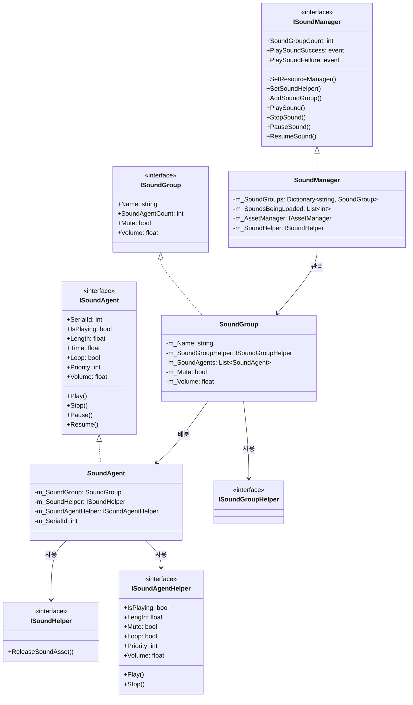
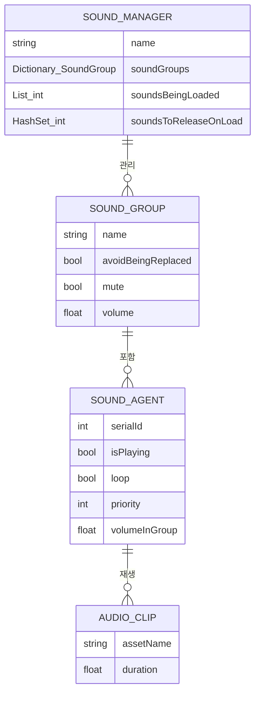
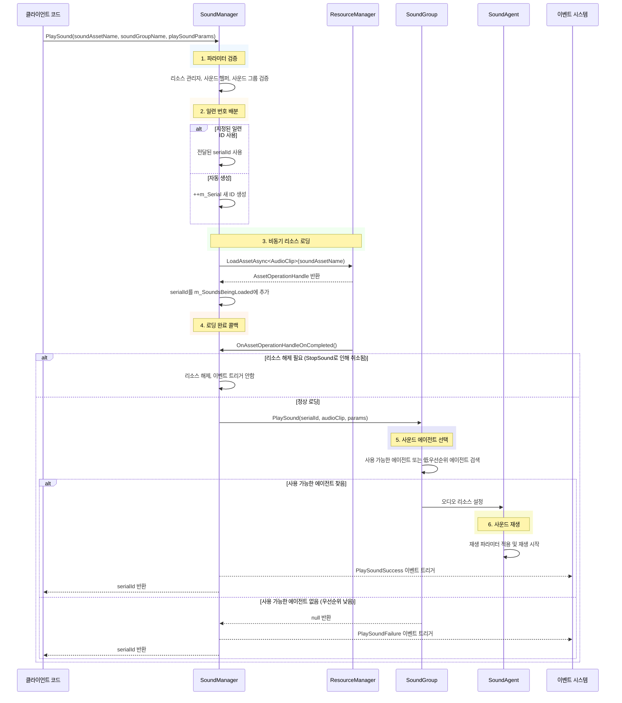
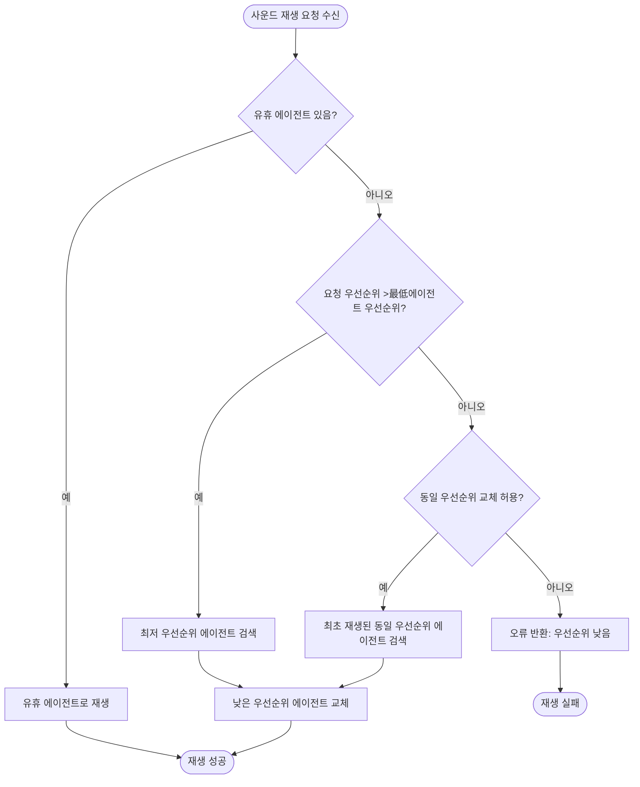

# 사운드 관리자

사운드 관리자(SoundManager)는 GameFrameX 오디오 모듈의 핵심 컴포넌트로, 게임의 사운드 재생, 사운드 그룹, 사운드 에이전트 및 리소스 로딩 등 핵심 기능을 관리합니다. 배경 음악, 효과음, 음성 등 다양한 오디오 리소스를 통일된 인터페이스로 제어하며, 우선순위 관리, 볼륨 제어, 페이드 인/아웃 등의 고급 특성을 지원합니다.

## 개요

SoundManager는 GameFrameX 프레임워크에서 모든 오디오 관련 작업을 처리하는 핵심 모듈입니다. GameFrameworkModule의 구현 클래스로, 프레임워크의 模块化 설계 원칙을 따르며 다른 프레임워크 모듈(리소스 관리자, 이벤트 시스템 등)과 원활하게 통합할 수 있습니다.

**핵심 책임:**
- 다중 사운드 그룹(SoundGroup) 관리, 각 그룹은 볼륨 및 음소거 상태를 독립적으로 제어 가능
- 사운드 에이전트(SoundAgent)의 배분 조정, 우선순위 스케줄링 및 리소스 재활용 실현
- YooAsset 리소스 관리 시스템을 통한 비동기 오디오 리소스 로딩
- 재생 성공/실패 이벤트 트리거, 게임 로직이 오디오 상태 변화에 반응하도록 지원

**설계 의도:**
SoundManager는 계층화 아키텍처 설계를 채택하여 오디오 재생의 하위 구현(SoundAgent)과 관리 층(SoundManager)을 분리합니다. 이러한 설계를 통해 개발자는 다양한 오디오 엔진(Unity AudioSource, Fmod, AudioKit 등)에맞춰 커스텀 헬퍼를 사용하여 적응할 수 있으며, 상위 레이어 코드의 일관성을 유지합니다. 우선순위 메커니즘은 중요한 효과음이 즉시 재생되도록 보장하며, 에이전트 풀 penuh로 인한 사운드 손실을 방지합니다.

```mermaid
flowchart TD
    subgraph SoundManager["사운드 관리자 (SoundManager)"]
        SM[핵심 관리자]
        SG[사운드 그룹 딕셔너리]
        SL[로드 중인 사운드 리스트]
        SR[해제 대기 리소스 집합]
    end
    
    subgraph External["외부 의존성"]
        AM[리소스 관리자]
        SH[사운드 헬퍼]
        EC[이벤트 컴포넌트]
    end
    
    subgraph SoundGroup["사운드 그룹 (SoundGroup)"]
        SGH[헬퍼]
        SAG[사운드 에이전트 리스트]
    end
    
    subgraph SoundAgent["사운드 에이전트 (SoundAgent)"]
        SAH[에이전트 헬퍼]
        ASSET[오디오 리소스]
    end
    
    AM --> SM : 오디오 리소스 로딩
    SH --> SM : 리소스 해제 콜백
    SM --> SG : 사운드 그룹 관리
    SG --> SGH
    SGH --> SAG
    SAG --> SAH
    SAH --> ASSET : 오디오 재생
    SM --> EC : 재생 이벤트 트리거
```

## 핵심 아키텍처

### 모듈 계층 구조

SoundManager는三层 아키텍처 설계를 채택하며, 각 층은 다른 책임을 부담합니다:

1. **인터페이스 층**: ISoundManager, ISoundGroup, ISoundAgent 등 인터페이스 정의, 비즈니스 로직 캡슐화
2. **구현 층**: SoundManager, SoundGroup, SoundAgent의 구체적 구현
3. **헬퍼 층**: 다양한 헬퍼 인터페이스 및 기본 구현, 플랫폼 특정 오디오 처리 능력 제공



### 핵심 데이터 구조

SoundManager는 세 가지 핵심 데이터 구조를 내부적으로 유지합니다:



- **m_SoundGroups**: 모든 사운드 그룹을 저장하는 딕셔너리로, 그룹명을 키로 사용, O(1) 조회 지원
- **m_SoundsBeingLoaded**: 비동기 로딩 중인 사운드 일련 번호를 기록, 로딩 상태 추적에 사용
- **m_SoundsToReleaseOnLoad**: 다음 로딩 완료 시 즉시 해제해야 하는 사운드 ID를 기록, StopSound가 로딩 중에 호출된 상황을 처리하는 데 사용

## 사운드 재생 흐름

### 완전한 재생 흐름

PlaySound 메서드를 호출하면 SoundManager는 다음 단계를 실행합니다:



### 사운드 에이전트 선택 전략

SoundGroup은 스마트 에이전트 선택 전략을 채택하여 높은 우선순위 사운드가 즉시 재생되도록 보장합니다:



**에이전트 선택 로직:**
1. 유휴 에이전트 우선 사용
2. 유휴 에이전트가 없으면 요청 우선순위와 현재 재생 사운드의 우선순위 비교
3. 요청 우선순위가 높으면 최저 우선순위의 에이전트 교체
4. 우선순위가 같으면 `AvoidBeingReplacedBySamePriority` 설정에 따라 동일 우선순위 사운드 교체 여부 결정

## 사용 예제

### 기본 사용 방식

Unity 씬에 SoundComponent를 추가한 후 다음 방식으로 사운드를 재생할 수 있습니다:

```csharp
// SoundComponent를 통해 효과음 재생
var soundComponent = GameEntry.GetComponent<SoundComponent>();
int serialId = await soundComponent.PlaySound("Assets/Sounds/click.wav", "UI");
```

> Source: [SoundComponent.cs](https://github.com/GameFrameX/com.gameframex.unity.sound/blob/main/Runtime/Sound/SoundComponent.cs#L356-L359)

### 파라미터와 함께 재생

```csharp
// 재생 파라미터 생성
var playParams = PlaySoundParams.Create(false);
playParams.VolumeInSoundGroup = 0.8f;
playParams.Priority = 100;
playParams.Loop = false;
playParams.FadeInSeconds = 0.3f;

// 효과음 재생
int serialId = await soundComponent.PlaySound("Assets/Sounds/bgm_main.wav", "Background", playParams);
```

> Source: [PlaySoundParams.cs](https://github.com/GameFrameX/com.gameframex.unity.sound/blob/main/Runtime/Sound/Sound/PlaySoundParams.cs#L233-L239)

### 이벤트 리스닝

```csharp
// 재생 성공 이벤트 리스닝
soundComponent.PlaySoundSuccess += OnPlaySoundSuccess;

// 재생 실패 이벤트 리스닝
soundComponent.PlaySoundFailure += OnPlaySoundFailure;

private void OnPlaySoundSuccess(object sender, PlaySoundSuccessEventArgs e)
{
    Debug.Log($"사운드 재생 성공: {e.SoundAssetName}, SerialId: {e.SerialId}");
    // e.SoundAgent를 통해 재생 에이전트에 대한 더 세밀한 제어 가능
}

private void OnPlaySoundFailure(object sender, PlaySoundFailureEventArgs e)
{
    Debug.LogWarning($"사운드 재생 실패: {e.SoundAssetName}, 오류 코드: {e.ErrorCode}, 이유: {e.ErrorMessage}");
}
```

> Source: [PlaySoundSuccessEventArgs.cs](https://github.com/GameFrameX/com.gameframex.unity.sound/blob/main/Runtime/EventArgs/PlaySoundSuccessEventArgs.cs#L89-L98)

### 사운드 제어

```csharp
// 지정 사운드 일시정지
soundComponent.PauseSound(serialId);

// 재생 재개
soundComponent.ResumeSound(serialId);

// 재생 중지 (페이드 아웃 효과 포함)
soundComponent.StopSound(serialId, 0.5f);

// 로드된 모든 사운드 중지
soundComponent.StopAllLoadedSounds(1.0f);

// 로딩 중인 모든 사운드 중지
soundComponent.StopAllLoadingSounds();
```

> Source: [SoundManager.cs](https://github.com/GameFrameX/com.gameframex.unity.sound/blob/main/Runtime/Sound/Sound/SoundManager.cs#L584-L609)

### 사운드 그룹 관리

```csharp
// 새 사운드 그룹 추가
soundComponent.AddSoundGroup("Combat", false, false, 1.0f, 4);

// 사운드 그룹 가져오기
var soundGroup = soundComponent.GetSoundGroup("UI");

// 그룹 볼륨 설정
soundGroup.Volume = 0.5f;

// 그룹 음소거 설정
soundGroup.Mute = true;

// 사운드 그룹 존재 여부 확인
if (soundComponent.HasSoundGroup("Background"))
{
    // 배경 음악 재생
}
```

> Source: [SoundComponent.cs](https://github.com/GameFrameX/com.gameframex.unity.sound/blob/main/Runtime/Sound/SoundComponent.cs#L199-L212)

## 기본 상수 값

SoundManager는 다음 기본 상수 값을 사용하며, Constant.cs에서 확인할 수 있습니다:

> Source: [Constant.cs](https://github.com/GameFrameX/com.gameframex.unity.sound/blob/main/Runtime/Sound/Sound/Constant.cs#L38-L99)

| 속성 | 기본값 | 설명 |
|------|--------|------|
| DefaultTime | 0f | 기본 재생 위치 |
| DefaultMute | false | 기본 음소거 안함 |
| DefaultLoop | false | 기본 루프 안함 |
| DefaultPriority | 0 | 기본 우선순위 |
| DefaultVolume | 1f | 기본 볼륨 (만음량) |
| DefaultFadeInSeconds | 0f | 기본 페이드 인 시간 |
| DefaultFadeOutSeconds | 0f | 기본 페이드 아웃 시간 |
| DefaultPitch | 1f | 기본 음표 |
| DefaultPanStereo | 0f | 기본 스테레오 위치 |
| DefaultSpatialBlend | 0f | 기본 공간 혼합량 |
| DefaultMaxDistance | 100f | 기본 최대 거리 |
| DefaultDopplerLevel | 1f | 기본 도플러 등급 |

## 오류 코드 설명

사운드 재생 시 발생할 수 있는 오류 코드:

> Source: [PlaySoundErrorCode.cs](https://github.com/GameFrameX/com.gameframex.unity.sound/blob/main/Runtime/Sound/Sound/PlaySoundErrorCode.cs#L38-L69)

| 오류 코드 | 설명 |
|--------|------|
| Unknown | 알 수 없는 오류 |
| SoundGroupNotExist | 지정된 사운드 그룹이 존재하지 않음 |
| SoundGroupHasNoAgent | 사운드 그룹에 사용 가능한 사운드 에이전트가 없음 |
| LoadAssetFailure | 오디오 리소스 로딩 실패 |
| IgnoredDueToLowPriority | 우선순위 낮음으로 인해 무시됨 |
| SetSoundAssetFailure | 에이전트에 오디오 리소스 설정 실패 |

## 관련 링크

- [사운드 그룹](./4-core-concepts.2-sound-group) - 사운드 그룹의 상세 구성 및 관리 이해
- [사운드 에이전트](./4-core-concepts.3-sound-agent) - 사운드 에이전트의 작동 원리 이해
- [인터페이스 정의](./5-api-reference.1-interfaces) - 완전한 인터페이스 정의 보기
- [재생 파라미터](./5-api-reference.2-play-sound-params) - PlaySoundParams 상세 파라미터 보기
- [이벤트 파라미터](./5-api-reference.3-event-args) - 이벤트 파라미터 정의 보기
- [구성 설명](./6-configuration) - 모듈 구성 설명 보기
- [확장 가이드](./7-extending) - 오디오 시스템 확장 방법 이해