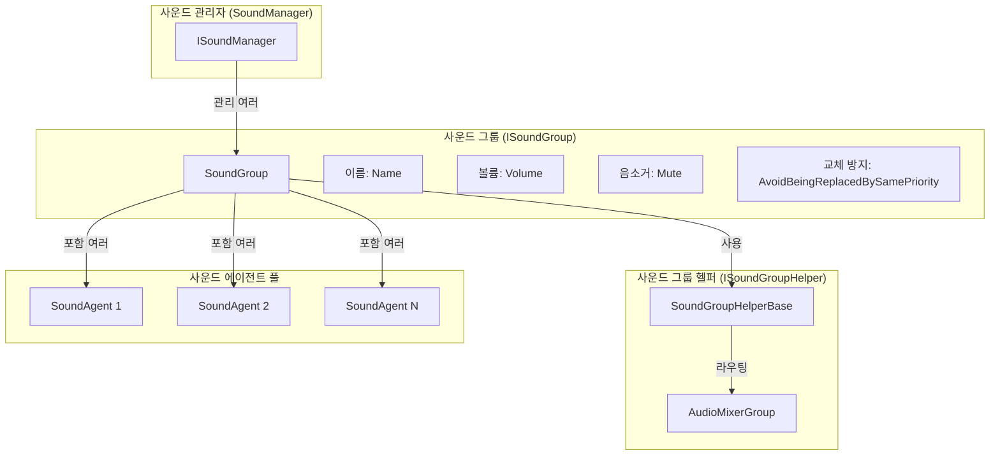
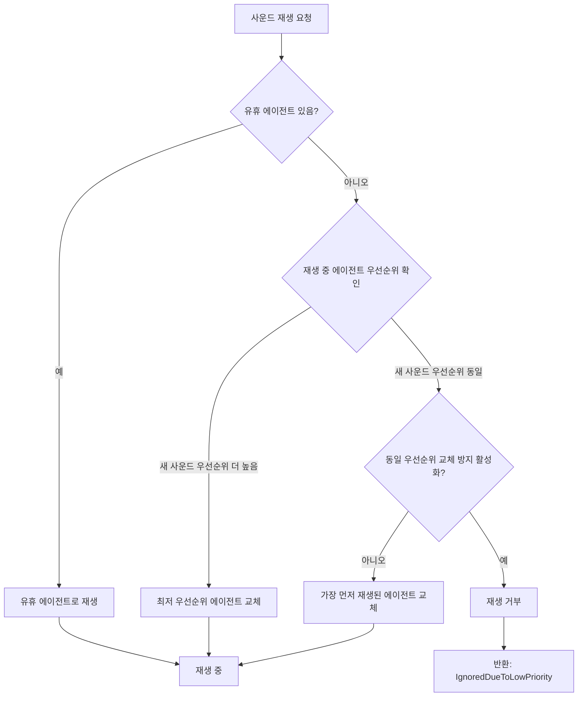

# 사운드 그룹

사운드 그룹(Sound Group)은 GameFrameX 사운드 시스템의 핵심 개념으로, 관련 오디오 재생 채널을 구성하고 관리하는 데 사용됩니다. 각 사운드 그룹은 볼륨, 음소거 상태 및 우선순위 전략을 독립적으로 제어하여, 다양한 오디오 분류 재생 능력을 제공합니다.

## 개요

사운드 그룹은 게임 개발에서 흔히 사용되는 오디오 관리 요구를 해결합니다: 배경 음악, 효과음, UI 사운드 등 다양한 유형의 오디오를 구분하고 각각을 독립적으로 제어하는 방법입니다. 사운드 그룹을 통해 개발자는 다음을 수행할 수 있습니다:

- **분류 관리**: 서로 다른 유형의 오디오를 서로 다른 그룹에 할당 (예: BGM, SE, Voice)
- **독립 제어**: 각 그룹의 볼륨이나 음소거 상태를 개별적으로 조절
- **우선순위 관리**: 우선순위 전략을 통해 사운드 교체 로직 제어
- **믹서 통합**: AudioMixerGroup을 통해 Unity 믹서 시스템에 연결

사운드 그룹은 여러 사운드 에이전트(Sound Agent)로 구성되며, 각 에이전트는 실제 오디오 재생을 담당합니다. 각 사운드 그룹에는 최소 하나의 에이전트가 필요하며, 에이전트 수는 해당 그룹이 동시에 재생할 수 있는 사운드 수의 상한을 결정합니다.

## 아키텍처



### 핵심 컴포넌트

| 컴포넌트 | 역할 | 파일 위치 |
|------|------|----------|
| `ISoundGroup` | 사운드 그룹 인터페이스 정의 | [Runtime/Interface/ISoundGroup.cs](https://github.com/GameFrameX/com.gameframex.unity.sound/blob/main/Runtime/Interface/ISoundGroup.cs#L38-L87) |
| `SoundGroup` | 사운드 그룹 구현 클래스 | [Runtime/Sound/Sound/SoundManager.SoundGroup.cs](https://github.com/GameFrameX/com.gameframex.unity.sound/blob/main/Runtime/Sound/Sound/SoundManager.SoundGroup.cs#L43-L324) |
| `ISoundGroupHelper` | 헬퍼 인터페이스 | [Runtime/Interface/ISoundGroupHelper.cs](https://github.com/GameFrameX/com.gameframex.unity.sound/blob/main/Runtime/Interface/ISoundGroupHelper.cs#L38-L40) |
| `SoundGroupHelperBase` | 헬퍼 기본 클래스 | [Runtime/Sound/SoundGroupHelperBase.cs](https://github.com/GameFrameX/com.gameframex.unity.sound/blob/main/Runtime/Sound/SoundGroupHelperBase.cs#L42-L54) |
| `DefaultSoundGroupHelper` | 기본 헬퍼 구현 | [Runtime/Sound/DefaultSoundGroupHelper.cs](https://github.com/GameFrameX/com.gameframex.unity.sound/blob/main/Runtime/Sound/DefaultSoundGroupHelper.cs#L38-L40) |

## 핵심 기능

### 사운드 그룹 속성

```csharp
public interface ISoundGroup
{
    // 사운드 그룹 이름 가져오기
    string Name { get; }

    // 사운드 에이전트 수량 가져오기
    int SoundAgentCount { get; }

    // 동일 우선순위 사운드로 교체되는 것을 방지할지 여부
    // true이면 같은 우선순위의 오디오가 서로 교체되지 않음
    bool AvoidBeingReplacedBySamePriority { get; set; }

    // 음소거 상태
    bool Mute { get; set; }

    // 볼륨 (0.0 - 1.0)
    float Volume { get; set; }

    // 사운드 그룹 헬퍼
    ISoundGroupHelper Helper { get; }
}
```

> Source: [ISoundGroup.cs](https://github.com/GameFrameX/com.gameframex.unity.sound/blob/main/Runtime/Interface/ISoundGroup.cs#L38-L87)

### 우선순위 교체 전략

사운드 그룹의 핵심 기능은 우선순위에 따라 사운드 에이전트 배분을 관리하는 것입니다. 새 사운드를 재생해야 할 때 시스템은 다음 로직으로 에이전트를 선택합니다:



구체적인 구현 로직은 다음과 같습니다:

```csharp
// 사운드 재생 시 에이전트 배분 로직
public ISoundAgent PlaySound(int serialId, object soundAsset, PlaySoundParams playSoundParams, out PlaySoundErrorCode? errorCode)
{
    errorCode = null;
    SoundAgent candidateAgent = null;
    foreach (SoundAgent soundAgent in m_SoundAgents)
    {
        if (!soundAgent.IsPlaying)
        {
            candidateAgent = soundAgent;
            break;
        }

        // 우선순위가 더 낮거나, 동일 우선순위이지만 재생 시간이 더 오래된 에이전트 찾기
        if (soundAgent.Priority < playSoundParams.Priority)
        {
            if (candidateAgent == null || soundAgent.Priority < candidateAgent.Priority)
            {
                candidateAgent = soundAgent;
            }
        }
        else if (!m_AvoidBeingReplacedBySamePriority && soundAgent.Priority == playSoundParams.Priority)
        {
            if (candidateAgent == null || soundAgent.SetSoundAssetTime < candidateAgent.SetSoundAssetTime)
            {
                candidateAgent = soundAgent;
            }
        }
    }
    // ...
}
```

> Source: [SoundManager.SoundGroup.cs](https://github.com/GameFrameX/com.gameframex.unity.sound/blob/main/Runtime/Sound/Sound/SoundManager.SoundGroup.cs#L175-L228)

### 볼륨과 음소거

사운드 그룹의 볼륨과 음소거 상태는 연결된 모든 사운드 에이전트에 자동으로 동기화됩니다:

```csharp
// 음소거 상태 설정 시 모든 에이전트에 동기화
public bool Mute
{
    get { return m_Mute; }
    set
    {
        m_Mute = value;
        foreach (SoundAgent soundAgent in m_SoundAgents)
        {
            soundAgent.RefreshMute();  // 음소거 상태 새로고침
        }
    }
}

// 볼륨 설정 시 모든 에이전트에 동기화
public float Volume
{
    get { return m_Volume; }
    set
    {
        m_Volume = value;
        foreach (SoundAgent soundAgent in m_SoundAgents)
        {
            soundAgent.RefreshVolume();  // 볼륨 새로고침
        }
    }
}
```

> Source: [SoundManager.SoundGroup.cs](https://github.com/GameFrameX/com.gameframex.unity.sound/blob/main/Runtime/Sound/Sound/SoundManager.SoundGroup.cs#L102-L129)

이러한 설계는 볼륨 조절과 음소거 작업의 즉각성과 일관성을 보장합니다.

## 사운드 그룹 헬퍼

### AudioMixerGroup 통합

사운드 그룹은 `SoundGroupHelperBase`를 통해 Unity의 오디오 믹서 시스템에 연결됩니다:

```csharp
public abstract class SoundGroupHelperBase : MonoBehaviour, ISoundGroupHelper
{
    [SerializeField] private AudioMixerGroup m_AudioMixerGroup = null;

    /// <summary>
    /// 사운드 그룹 헬퍼가 있는 믹서 그룹을 가져오거나 설정합니다.
    /// </summary>
    public AudioMixerGroup AudioMixerGroup
    {
        get { return m_AudioMixerGroup; }
        set { m_AudioMixerGroup = value; }
    }
}
```

> Source: [SoundGroupHelperBase.cs](https://github.com/GameFrameX/com.gameframex.unity.sound/blob/main/Runtime/Sound/SoundGroupHelperBase.cs#L42-L54)

이 설계를 통해 개발자는 다음을 수행할 수 있습니다:
- Unity Editor에서 각 사운드 그룹에 다른 AudioMixerGroup 할당
- Unity의 AudioMixer를 사용하여 복잡한 오디오 처리(EQ, 컴프레서, 리버브 등) 구현
- 서로 다른 유형의 사운드에 다른 믹서 효과 적용

### 커스텀 헬퍼

`SoundGroupHelperBase`를 상속하여 커스텀 헬퍼를 생성할 수 있습니다:

```csharp
public class CustomSoundGroupHelper : SoundGroupHelperBase
{
    // 커스텀 확장 로직
    protected override void Start()
    {
        base.Start();
        // 커스텀 초기화 로직
    }
}
```

## 사용 예제

### SoundComponent를 통해 사운드 그룹 구성

Unity Editor에서 사운드 그룹을 구성하는 것이 가장 일반적인 방식입니다:

```csharp
// SoundComponent.cs의 사운드 그룹 구성 클래스
[Serializable]
private sealed class SoundGroup
{
    [SerializeField] private string m_Name = null;                              // 사운드 그룹 이름
    [SerializeField] private bool m_AvoidBeingReplacedBySamePriority = false;   // 동일 우선순위 교체 방지
    [SerializeField] private bool m_Mute = false;                                 // 기본 음소거 상태
    [SerializeField, Range(0f, 1f)] private float m_Volume = 1f;                  // 기본 볼륨
    [SerializeField] private int m_AgentHelperCount = 1;                        // 에이전트 수량
}
```

> Source: [SoundComponent.SoundGroup.cs](https://github.com/GameFrameX/com.gameframex.unity.sound/blob/main/Runtime/Sound/SoundComponent.SoundGroup.cs#L44-L112)

### 런타임에서 동적 생성

런타임에서도 동적으로 사운드 그룹을 추가할 수 있습니다:

```csharp
// SoundComponent에서 동적으로 사운드 그룹 추가
public bool AddSoundGroup(string soundGroupName, bool soundGroupAvoidBeingReplacedBySamePriority, bool soundGroupMute, float soundGroupVolume, int soundAgentHelperCount)
{
    if (m_SoundManager.HasSoundGroup(soundGroupName))
    {
        return false;
    }

    var soundGroupHelper = CreateCustomSoundGroupHelper(soundGroupName, soundAgentHelperCount);
    if (!m_SoundManager.AddSoundGroup(soundGroupName, soundGroupAvoidBeingReplacedBySamePriority, soundGroupMute, soundGroupVolume, soundGroupHelper))
    {
        return false;
    }
    return true;
}
```

> Source: [SoundComponent.cs](https://github.com/GameFrameX/com.gameframex.unity.sound/blob/main/Runtime/Sound/SoundComponent.cs#L252-L287)

### 사운드 그룹 제어

사운드 그룹을 가져와서 해당 속성을 제어합니다:

```csharp
// 사운드 그룹 가져오기
var soundGroup = soundComponent.GetSoundGroup("BGM");

// 볼륨 설정
soundGroup.Volume = 0.5f;

// 음소거
soundGroup.Mute = true;

// 재생 중인 모든 사운드 중지
soundGroup.StopAllLoadedSounds();

// 페이드 아웃과 함께 중지
soundGroup.StopAllLoadedSounds(1.0f);
```

## 구성 설명

### 사운드 그룹 구성 파라미터

| 파라미터 | 유형 | 기본값 | 설명 |
|------|------|--------|------|
| Name | string | - | 사운드 그룹 이름, 고유해야 함 |
| AvoidBeingReplacedBySamePriority | bool | false | 동일 우선순위 사운드로 교체되는 것을 방지할지 여부 |
| Mute | bool | false | 기본 음소거 상태 |
| Volume | float | 1.0 | 기본 볼륨 (0.0-1.0) |
| AgentHelperCount | int | 1 | 사운드 에이전트 수량, 동시에 재생 가능한 수의 상한 결정 |

### 전형적인 구성 방안

| 장면 | 이름 | 에이전트 수 | 우선순위 전략 | 용도 |
|------|------|--------|------------|------|
| 배경 음악 | BGM | 1-2 | 교체 방지 활성화 | 음악 재생 |
| 효과음 | SE | 5-10 | 교체 방지 비활성화 | 다양한 효과음 |
| 음성 | Voice | 2-3 | 교체 방지 활성화 | 캐릭터 대사 |
| UI 효과음 | UI | 3-5 | 교체 방지 활성화 | 인터페이스 피드백 |

## 관련 링크

- [사운드 관리자](./4-core-concepts.1-sound-manager) - 사운드 그룹의 상위 관리 컴포넌트
- [사운드 에이전트](./4-core-concepts.3-sound-agent) - 사운드 그룹이 관리하는 오디오 재생 단위
- [인터페이스 정의](./5-api-reference.1-interfaces) - ISoundGroup 완전한 인터페이스 정의
- [재생 파라미터](./5-api-reference.2-play-sound-params) - 사운드 재생 파라미터 구성