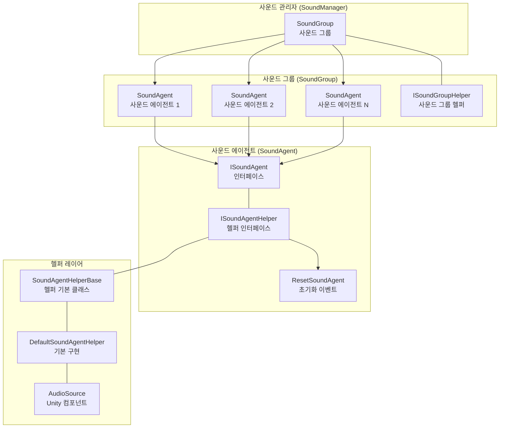
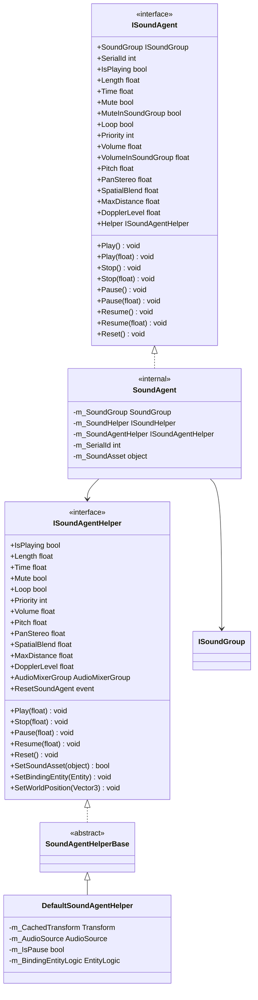
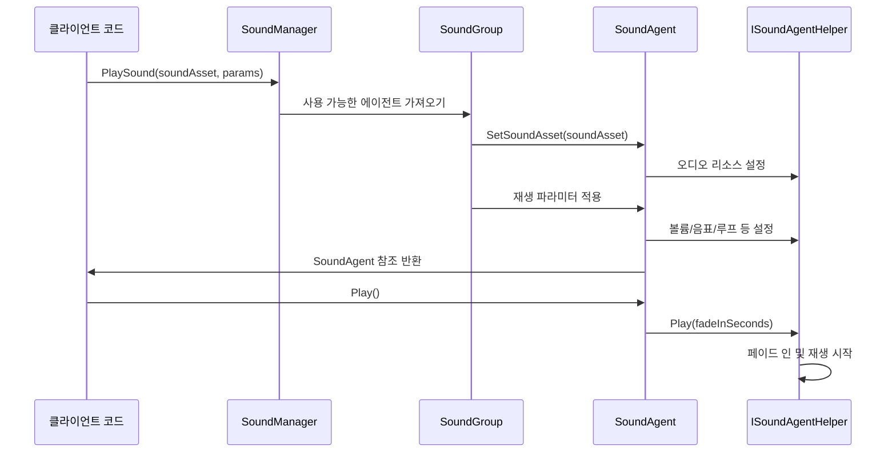
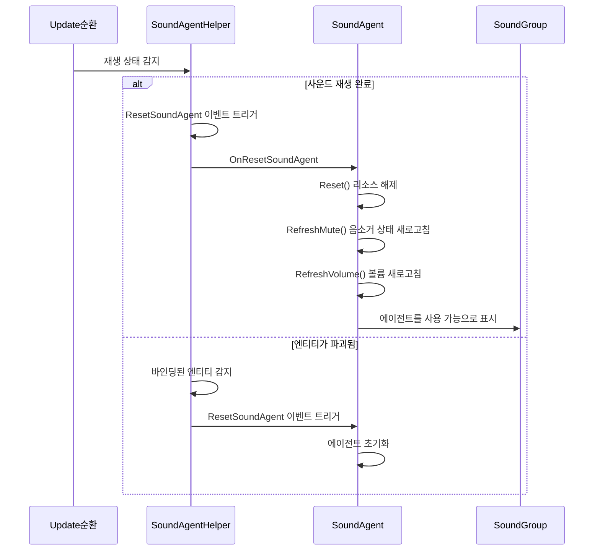

# 사운드 에이전트

사운드 에이전트(Sound Agent)는 GameFrameX 사운드 시스템의 최소 재생 단위로, 개별 오디오 인스턴스의 재생, 제어 및 상태 관리를 담당합니다. 각 사운드 에이전트는 구체적인 사운드 재생 채널을 나타내며, 볼륨, 음표, 루프, 음소거 등 속성을 독립적으로 제어할 수 있습니다.

## 개요

사운드 에이전트는 사운드 시스템 아키텍처의 핵심 컴포넌트로, 사운드 그룹(SoundGroup)의 다음 단계에 위치합니다. 게임에서 효과음이나 배경 음악을 재생해야 할 때, 사운드 시스템은 해당하는 사운드 그룹에서 사용 가능한 사운드 에이전트를 가져와 재생 작업을 수행합니다.

### 설계 의도

사운드 에이전트는 프록시 패턴(Proxy Pattern)과 객체 풀(Object Pool) 사상의 결합을 채택합니다:

1. **프록시 패턴**: 사운드 에이전트가 상위 비즈니스 로직과 하위 오디오 구현 사이의 중재자 역할을 하며, ISoundAgent 인터페이스를 통해 복잡한 재생 제어 로직을 캡슐화합니다
2. **객체 풀 사상**: 사운드 그룹이 일정 수량의 사운드 에이전트를 사전에 생성하며, 사운드 재생이 필요할 때 풀에서 가져와 사용完毕后 반납하여, 빈번한 생성 및 파괴로 인한 성능 오버헤드를 피합니다
3. **계층화 설계**: ISoundAgentHelper 인터페이스를 통해 Unity 특정 AudioSource 구현을 격리하여, 확장과 교체가 용이합니다

### 핵심 책임

사운드 에이전트의 주요 책임은 다음과 같습니다:

- **재생 제어**: 사운드 재생을 시작, 일시정지, 재개, 중지
- **파라미터 조절**: 볼륨, 음표, 스테레오 페닝, 공간 혼합 등 파라미터를 실시간으로 조정
- **상태 관리**: 재생 상태 추적 (재생 중인지, 재생 진행 상황 등)
- **리소스 관리**: 오디오 리소스 로딩 및 해제
- **이벤트 통지**: 재생 완료, 엔티티 파괴 등 이벤트 발생 시 상위에 통지

## 아키텍처

### 컴포넌트 관계도



### 클래스 다이어그램



## 핵심 기능

### 재생 제어

사운드 에이전트는 완전한 재생 제어 메서드를 제공하며, 페이드 인/아웃 효과가 있는 재생 전환을 지원합니다:

```csharp
// 직접 재생, 기본 페이드 인 시간 사용
agent.Play();

// 페이드 인 효과가 있는 재생, 0.5초 내에 목표 볼륨으로 페이드 인
agent.Play(0.5f);

// 직접 중지, 기본 페이드 아웃 시간 사용
agent.Stop();

// 페이드 아웃 효과가 있는 중지, 1초 내에 페이드 아웃
agent.Stop(1.0f);

// 재생 일시정지
agent.Pause();

// 페이드 아웃 효과가 있는 일시정지
agent.Pause(0.3f);

// 재생 재개
agent.Resume();

// 페이드 인 효과가 있는 재개
agent.Resume(0.3f);
```
> Source: [ISoundAgent.cs](https://github.com/GameFrameX/com.gameframex.unity.sound/blob/main/Runtime/Interface/ISoundAgent.cs#L125-L167)

### 볼륨 제어

사운드 에이전트는 双层 볼륨 제어 메커니즘을 채택합니다: 에이전트 자체 볼륨 × 사운드 그룹 볼륨, 이 설계를 통해 개별 효과음 볼륨을 변경하지 않고도 전체 사운드 그룹의 볼륨을 통일적으로 조절할 수 있습니다:

```csharp
// 에이전트 자체 볼륨 설정 (0.0 - 1.0)
agent.VolumeInSoundGroup = 0.8f;

// 실제 적용 볼륨 가져오기 (에이전트 볼륨 × 그룹 볼륨)
float actualVolume = agent.Volume;
```
> Source: [SoundManager.SoundAgent.cs](https://github.com/GameFrameX/com.gameframex.unity.sound/blob/main/Runtime/Sound/Sound/SoundManager.SoundAgent.cs#L209-L217)

### 공간 오디오

사운드 에이전트는 3D 공간 오디오 효과를 지원하며, 음원 위치와 청취자의 관계에 따라 볼륨 감쇠를 자동으로 계산합니다:

```csharp
// 공간 혼합량 설정 (0 = 2D, 1 = 3D)
agent.SpatialBlend = 1.0f;

// 최대 감쇠 거리 설정
agent.MaxDistance = 50.0f;

// 도플러 효과 등급 설정
agent.DopplerLevel = 0.5f;
```
> Source: [ISoundAgent.cs](https://github.com/GameFrameX/com.gameframex.unity.sound/blob/main/Runtime/Interface/ISoundAgent.cs#L105-L118)

### 엔티티 바인딩

사운드 에이전트는 게임 엔티티에 바인딩할 수 있어, 음원 위치가 엔티티 이동을 따릅니다:

```csharp
// 헬퍼를 통해 엔티티 바인딩
agent.Helper.SetBindingEntity(entity);

// 세계 좌표 위치 설정
agent.Helper.SetWorldPosition(new Vector3(10, 0, 5));
```
> Source: [DefaultSoundAgentHelper.cs](https://github.com/GameFrameX/com.gameframex.unity.sound/blob/main/Runtime/Sound/DefaultSoundAgentHelper.cs#L295-L323)

### 재생 진행 제어

```csharp
// 사운드 총 길이 가져오기
float length = agent.Length;

// 현재 재생 위치 가져오거나 설정 (초)
agent.Time = 5.0f;  // 5초로 이동
float currentTime = agent.Time;

// 재생 중인지 가져오기
if (agent.IsPlaying)
{
    Debug.Log($"재생 진행: {agent.Time}/{agent.Length}");
}
```
> Source: [ISoundAgent.cs](https://github.com/GameFrameX/com.gameframex.unity.sound/blob/main/Runtime/Interface/ISoundAgent.cs#L50-L63)

## 핵심 흐름

### 사운드 재생 흐름



### 사운드 종료 초기화 흐름

사운드 재생이 완료되면 시스템이 자동으로 초기화 흐름을 트리거하여, 현재 에이전트를 해제하여 다른 사운드에서 사용할 수 있도록 합니다:


> Source: [DefaultSoundAgentHelper.cs](https://github.com/GameFrameX/com.gameframex.unity.sound/blob/main/Runtime/Sound/DefaultSoundAgentHelper.cs#L333-L367)

## 커스텀 헬퍼 확장

`SoundAgentHelperBase`를 상속하여 커스텀 사운드 에이전트 헬퍼를 구현하여 다양한 오디오 구현 체계(FMOD, Wwise 등)를 지원할 수 있습니다:

```csharp
using UnityEngine;
using GameFrameX.Sound.Runtime;

public class CustomSoundAgentHelper : SoundAgentHelperBase
{
    private AudioSource m_AudioSource;
    private AudioClip m_CurrentClip;

    public override bool IsPlaying => m_AudioSource?.isPlaying ?? false;

    public override float Length => m_CurrentClip?.length ?? 0f;

    public override float Time
    {
        get => m_AudioSource?.time ?? 0f;
        set { if (m_AudioSource != null) m_AudioSource.time = value; }
    }

    // ... 기타 속성 구현

    public override void Play(float fadeInSeconds)
    {
        m_AudioSource.Play();
        // 커스텀 페이드 인 로직 구현
    }

    public override bool SetSoundAsset(object soundAsset)
    {
        m_CurrentClip = soundAsset as AudioClip;
        if (m_CurrentClip == null) return false;
        
        m_AudioSource.clip = m_CurrentClip;
        return true;
    }

    // ... 기타 메서드 구현
}
```
> Source: [SoundAgentHelperBase.cs](https://github.com/GameFrameX/com.gameframex.unity.sound/blob/main/Runtime/Sound/SoundAgentHelperBase.cs#L38-L162)

## 속성 설명

| 속성 | 유형 | 기본값 | 설명 |
|------|------|--------|------|
| SerialId | int | 0 | 사운드의 일련 번호, 이번 재생 요청을 식별하는 데 사용 |
| IsPlaying | bool | - | 현재 재생 중인지 여부 |
| Length | float | 0 | 사운드 총 길이 (초) |
| Time | float | 0 | 현재 재생 위치 (초) |
| Mute | bool | false | 음소거 여부 (읽기 전용, 그룹이 제어) |
| MuteInSoundGroup | bool | false | 사운드 그룹 내에서 음소거 여부 |
| Loop | bool | false | 루프 재생 여부 |
| Priority | int | 0 | 사운드 우선순위 (숫자가 클수록 높음) |
| Volume | float | 1.0 | 실제 적용 볼륨 (에이전트×그룹) |
| VolumeInSoundGroup | float | 1.0 | 에이전트 자체 볼륨 |
| Pitch | float | 1.0 | 음표 (0.5-2.0) |
| PanStereo | float | 0 | 스테레오 페닝 (-1 왼쪽 → 1 오른쪽) |
| SpatialBlend | float | 0 | 공간 혼합량 (0=2D → 1=3D) |
| MaxDistance | float | 100 | 3D 모드 최대 감쇠 거리 |
| DopplerLevel | float | 1 | 도플러 효과 등급 |

> Source: [Constant.cs](https://github.com/GameFrameX/com.gameframex.unity.sound/blob/main/Runtime/Sound/Sound/Constant.cs#L38-L99)

## 관련 링크

- [사운드 관리자](./4-core-concepts.1-sound-manager) - 사운드 시스템의 핵심 관리자
- [사운드 그룹](./4-core-concepts.2-sound-group) - 다중 사운드 에이전트를 관리하는 그룹
- [인터페이스 정의](./5-api-reference.1-interfaces) - ISoundAgent 및 ISoundAgentHelper 인터페이스 상세
- [이벤트 파라미터](./5-api-reference.3-event-args) - 사운드 관련 이벤트 파라미터 설명