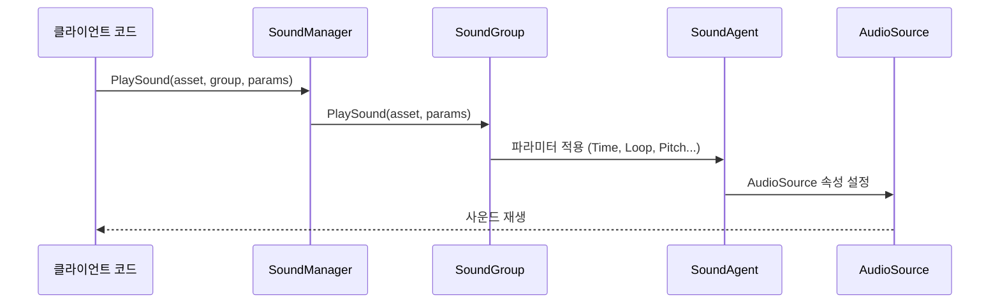

# 재생 파라미터

PlaySoundParams 클래스는 볼륨, 음표, 루프, 페이드 인/아웃 등 사운드 재생의 다양한 속성을 구성하는 데 사용됩니다. 이러한 파라미터는 사운드를 재생할 때 SoundManager에 전달되어 사운드의 구체적인 재생 방식을 제어합니다.

## 개요

PlaySoundParams는 사운드 시스템의 핵심 파라미터 클래스로, 사운드 재생에 필요한 모든 구성 옵션을 캡슐화합니다. 이 클래스는 IReference 인터페이스를 구현하여 객체 풀化管理를 지원하며, 재사용하여 메모리 할당을 줄입니다.

ISoundManager.PlaySound 메서드를 호출할 때 PlaySoundParams 인스턴스를 전달하여 사운드의 재생 동작을定制할 수 있습니다. null 또는 파라미터를 전달하지 않으면 시스템이 기본 파라미터 값을 사용합니다.

### 설계 의도

PlaySoundParams는 파라미터 객체 패턴(Parameter Object Pattern)을 채택하여, 여러 관련 재생 파라미터를 하나의 객체로 캡슐화합니다. 이 설계의 특징:

- **API 단순화**: PlaySound 메서드에서大量 독립 파라미터를 전달하는 것을 피함
- **가독성 향상**: 명명된 속성을 통해 파라미터 의미를 명확히 함
- **기본값 지원**: 모든 파라미터에 합리한 기본값이 있어全部 설정 필요 없음
- **객체 풀링**: IReference 인터페이스를 구현하여 ReferencePool 회수 및 재활용 지원

### 파라미터 적용 흐름



## 파라미터 설명

### 재생 제어 파라미터

| 파라미터 | 유형 | 기본값 | 설명 |
|------|------|--------|------|
| Time | float | 0f | 재생 위치 (초), 지정된 시간부터 재생 시작 |
| Loop | bool | false | 루프 재생 여부 |
| FadeInSeconds | float | 0f | 페이드 인 시간 (초), 재생 시작 시 볼륨이 서서히 증가 |

### 사운드 그룹 파라미터

| 파라미터 | 유형 | 기본값 | 설명 |
|------|------|--------|------|
| MuteInSoundGroup | bool | false | 소속 사운드 그룹 내에서 음소거 여부 |
| VolumeInSoundGroup | float | 1f | 소속 사운드 그룹 내 볼륨 (0.0-1.0) |
| Priority | int | 0 | 사운드 우선순위, 숫자가 높을수록 우선순위 높음 |

### 음향 효과 파라미터

| 파라미터 | 유형 | 기본값 | 설명 |
|------|------|--------|------|
| Pitch | float | 1f | 음표, 1.0은 정상 속도 |
| PanStereo | float | 0f | 스테레오 위치, -1은 좌 채널, 1은 우 채널 |

### 공간 오디오 파라미터

| 파라미터 | 유형 | 기본값 | 설명 |
|------|------|--------|------|
| SpatialBlend | float | 0f | 공간 혼합량, 0은 2D 사운드, 1은 3D 사운드 |
| MaxDistance | float | 100f | 최대 감쇠 거리 (3D 사운드만 유효) |
| DopplerLevel | float | 1f | 도플러 효과 등급, 0은 비활성화 |

## 상세 파라미터 설명

### Time - 재생 위치

사운드 재생 시작 위치를 설정합니다 (초 단위). 이는断점续播, 미리보기 기능 또는 片头 건너뛰기를 구현하는 데 유용합니다.

```csharp
var playSoundParams = PlaySoundParams.Create();
playSoundParams.Time = 5.5f; // 5.5초부터 재생 시작
await soundManager.PlaySound("bgm_music", "MusicGroup", playSoundParams);
```
> Source: [PlaySoundParams.cs](https://github.com/GameFrameX/com.gameframex.unity.sound/blob/main/Runtime/Sound/Sound/PlaySoundParams.cs#L124-L128)

### Loop - 루프 재생

사운드 루프 재생 여부를 제어합니다. 배경 음악이나 환경音效에는 일반적으로 true로 설정하고, 일회성 효과음에는 false로 설정합니다.

```csharp
// 루프 배경 음악 재생
var musicParams = PlaySoundParams.Create(isLoop: true);
// 또는
var musicParams = PlaySoundParams.Create();
musicParams.Loop = true;
await soundManager.PlaySound("bgm_forest", "MusicGroup", musicParams);
```
> Source: [PlaySoundParams.cs](https://github.com/GameFrameX/com.gameframex.unity.sound/blob/main/Runtime/Sound/Sound/PlaySoundParams.cs#L142-L146)

### FadeInSeconds - 페이드 인 시간

사운드 재생 시작 시 페이드 인 시간을 설정하여, 볼륨이 0에서 목표 볼륨으로 서서히 전환되도록 합니다. 이는突如한 사운드 폭발을 피하는 데 매우 유용합니다.

```csharp
var playSoundParams = PlaySoundParams.Create();
playSoundParams.FadeInSeconds = 2.0f; // 2초 페이드 인
await soundManager.PlaySound("ui_click", "UIGroup", playSoundParams);
```
> Source: [PlaySoundParams.cs](https://github.com/GameFrameX/com.gameframex.unity.sound/blob/main/Runtime/Sound/Sound/PlaySoundParams.cs#L169-L173)

### MuteInSoundGroup - 그룹 내 음소거

해당 사운드가 소속 사운드 그룹 내에서 음소거되었는지 여부를 제어합니다. 주의: 음소거로 설정해도 해당 사운드는 여전히 사운드 그룹의 재생 채널을 점유합니다.

```csharp
var playSoundParams = PlaySoundParams.Create();
playSoundParams.MuteInSoundGroup = true; // 일시 음소거
await soundManager.PlaySound("voice_intro", "VoiceGroup", playSoundParams);
```
> Source: [PlaySoundParams.cs](https://github.com/GameFrameX/com.gameframex.unity.sound/blob/main/Runtime/Sound/Sound/PlaySoundParams.cs#L133-L137)

### VolumeInSoundGroup - 그룹 내 볼륨

해당 사운드가 소속 사운드 그룹 내의 볼륨 계수를 설정합니다. 최종 볼륨 = 사운드 그룹 볼륨 × 개별 볼륨.

```csharp
var playSoundParams = PlaySoundParams.Create();
playSoundParams.VolumeInSoundGroup = 0.5f; // 50% 볼륨
await soundManager.PlaySound("effect_explosion", "EffectGroup", playSoundParams);
```
> Source: [PlaySoundParams.cs](https://github.com/GameFrameX/com.gameframex.unity.sound/blob/main/Runtime/Sound/Sound/PlaySoundParams.cs#L160-L164)

### Priority - 우선순위

사운드 우선순위를 설정합니다. 사운드 그룹에 사용 가능한 재생 채널이 없을 때, 낮은 우선순위의 재생 중인 사운드는 높은 우선순위의 새로운 사운드로 교체됩니다. 우선순위 범위 권장: 0-255, 숫자가 높을수록 우선순위 높음.

```csharp
var playSoundParams = PlaySoundParams.Create();
playSoundParams.Priority = 100; // 높은 우선순위
await soundManager.PlaySound("ui_important", "UIGroup", playSoundParams);
```
> Source: [PlaySoundParams.cs](https://github.com/GameFrameX/com.gameframex.unity.sound/blob/main/Runtime/Sound/Sound/PlaySoundParams.cs#L151-L155)

### Pitch - 음표

사운드 재생 속도/음표를 조정합니다. 1.0은 정상 속도이고, 1.0 미만이면慢速/低音표, 1.0 초과면快速/高音표입니다.

```csharp
var playSoundParams = PlaySoundParams.Create();
playSoundParams.Pitch = 0.8f; // 음표를 약간 낮춤
await soundManager.PlaySound("npc_voice", "VoiceGroup", playSoundParams);
```
> Source: [PlaySoundParams.cs](https://github.com/GameFrameX/com.gameframex.unity.sound/blob/main/Runtime/Sound/Sound/PlaySoundParams.cs#L178-L182)

### PanStereo - 스테레오 위치

사운드 위치가左右 채널 사이에서 제어합니다. -1.0은 완전 좌 채널, 0.0은 중앙, 1.0은 완전 우 채널입니다.

```csharp
var playSoundParams = PlaySoundParams.Create();
playSoundParams.PanStereo = -0.5f; // 약간 왼쪽
await soundManager.PlaySound("footstep_left", "EffectGroup", playSoundParams);
```
> Source: [PlaySoundParams.cs](https://github.com/GameFrameX/com.gameframex.unity.sound/blob/main/Runtime/Sound/Sound/PlaySoundParams.cs#L187-L191)

### SpatialBlend - 공간 혼합

사운드가 2D(스테레오)에서 3D(공간화)로의 전환을 제어합니다. 0.0은 완전 2D 사운드이고, 1.0은 완전 3D 사운드입니다.

```csharp
var playSoundParams = PlaySoundParams.Create();
playSoundParams.SpatialBlend = 1.0f; // 완전 3D 사운드
playSoundParams.MaxDistance = 50f;
await soundManager.PlaySound("ambient_bird", "WorldGroup", playSoundParams);
```
> Source: [PlaySoundParams.cs](https://github.com/GameFrameX/com.gameframex.unity.sound/blob/main/Runtime/Sound/Sound/PlaySoundParams.cs#L196-L200)

### MaxDistance - 최대 거리

3D 사운드의 최대 감쇠 거리를 설정합니다. 이 거리를 초과하면 사운드 볼륨이 더 이상 감쇠하지 않습니다.

```csharp
var playSoundParams = PlaySoundParams.Create();
playSoundParams.SpatialBlend = 1.0f;
playSoundParams.MaxDistance = 30f; // 30미터 밖에서는 들리지 않음
await soundManager.PlaySound("car_engine", "WorldGroup", playSoundParams);
```
> Source: [PlaySoundParams.cs](https://github.com/GameFrameX/com.gameframex.unity.sound/blob/main/Runtime/Sound/Sound/PlaySoundParams.cs#L205-L209)

### DopplerLevel - 도플러 등급

3D 사운드의 도플러 효과 강도를 설정합니다. 음원과 청취자가 상대적으로 이동할 때 도플러 주파수偏移 효과가 발생합니다. 0.0은 비활성화이고, 1.0은 정상 강도입니다.

```csharp
var playSoundParams = PlaySoundParams.Create();
playSoundParams.SpatialBlend = 1.0f;
playSoundParams.DopplerLevel = 0.5f; // 도플러 효과 약화
await soundManager.PlaySound("car_passing", "WorldGroup", playSoundParams);
```
> Source: [PlaySoundParams.cs](https://github.com/GameFrameX/com.gameframex.unity.sound/blob/main/Runtime/Sound/Sound/PlaySoundParams.cs#L214-L218)

## 사용 방법

### 재생 파라미터 생성

정적 팩토리 메서드 `Create()`를 사용하여 PlaySoundParams 인스턴스를 생성할 것을 권장하며, 이 메서드는 객체 풀에서 인스턴스를 가져옵니다:

```csharp
// 기본 사용: 기본 파라미터 사용
var playSoundParams = PlaySoundParams.Create();

// 루프 파라미터와 함께
var loopParams = PlaySoundParams.Create(isLoop: true);
```
> Source: [PlaySoundParams.cs](https://github.com/GameFrameX/com.gameframex.unity.sound/blob/main/Runtime/Sound/Sound/PlaySoundParams.cs#L233-L239)

### 완전한 사용 예제

```csharp
// 재생 파라미터 생성 및 구성
var playSoundParams = PlaySoundParams.Create();
playSoundParams.Loop = true;                      // 루프 재생
playSoundParams.VolumeInSoundGroup = 0.8f;        // 80% 볼륨
playSoundParams.Priority = 100;                   // 높은 우선순위
playSoundParams.FadeInSeconds = 1.0f;             // 1초 페이드 인
playSoundParams.Pitch = 1.0f;                      // 정상 음표

// 사운드 재생
int serialId = await soundManager.PlaySound("bgm_battle", "MusicGroup", playSoundParams);
```
> Source: [ISoundManager.cs](https://github.com/GameFrameX/com.gameframex.unity.sound/blob/main/Runtime/Interface/ISoundManager.cs#L165-L167)

### 파라미터에서 AudioSource로의 매핑

PlaySoundParams의 파라미터는 결국 Unity의 AudioSource 컴포넌트에 매핑됩니다:

| PlaySoundParams | AudioSource | 설명 |
|-----------------|-------------|------|
| Time | time | 재생 위치 |
| MuteInSoundGroup | mute × groupMute | 그룹 내 음소거 |
| Loop | loop | 루프 재생 |
| Priority | priority | 우선순위 |
| VolumeInSoundGroup | volume × groupVolume | 그룹 내 볼륨 |
| FadeInSeconds | Play() 시渐渐变化 | 페이드 인 시간 |
| Pitch | pitch | 음표 |
| PanStereo | panStereo | 스테레오 위치 |
| SpatialBlend | spatialBlend | 공간 혼합 |
| MaxDistance | maxDistance | 최대 거리 |
| DopplerLevel | dopplerLevel | 도플러 등급 |

> Source: [SoundManager.SoundGroup.cs](https://github.com/GameFrameX/com.gameframex.unity.sound/blob/main/Runtime/Sound/Sound/SoundManager.SoundGroup.cs#L216-L226)

## 주의 사항

1. **객체 풀 관리**: `PlaySoundParams.Create()`로 생성한 파라미터는 재생 완료 후 자동으로 풀에 반환되므로 수동으로 해제할 필요가 없습니다.

2. **파라미터가 null인 경우**: PlaySound 호출 시 null 파라미터를 전달하면 시스템이 자동으로 기본 파라미터의 PlaySoundParams를 생성합니다.

3. **우선순위와 채널**: 사운드 그룹의 모든 채널이 점유되면, 낮은 우선순위의 재생 중 사운드가 새로운 높은 우선순위 사운드로 교체됩니다.

4. **볼륨叠加**: 최종 볼륨 = 사운드 그룹 볼륨 (SoundGroup.Volume) × 개별 볼륨 (VolumeInSoundGroup).

5. **공간 오디오**: 공간 관련 파라미터(MaxDistance, DopplerLevel)는 SpatialBlend를 0보다 큰 값으로 설정해야만 유효합니다.

## 관련 링크

- [인터페이스 정의](./5-api-reference.1-interfaces) - ISoundManager 및 관련 인터페이스
- [이벤트 파라미터](./5-api-reference.3-event-args) - 재생 이벤트 관련 파라미터
- [사운드 관리자](./4-core-concepts.1-sound-manager) - 사운드 관리자 상세
- [사운드 그룹](./4-core-concepts.2-sound-group) - 사운드 그룹 관리
- [사운드 에이전트](./4-core-concepts.3-sound-agent) - 사운드 에이전트 상세