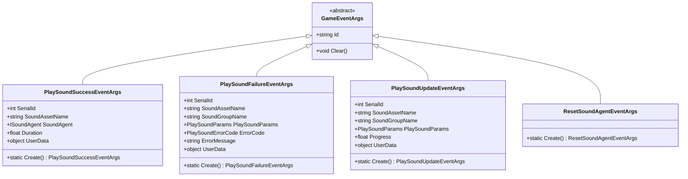
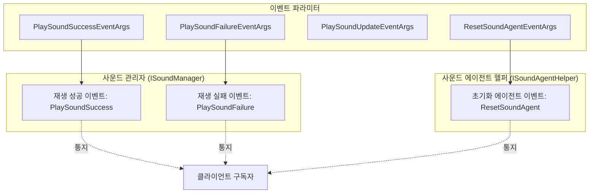
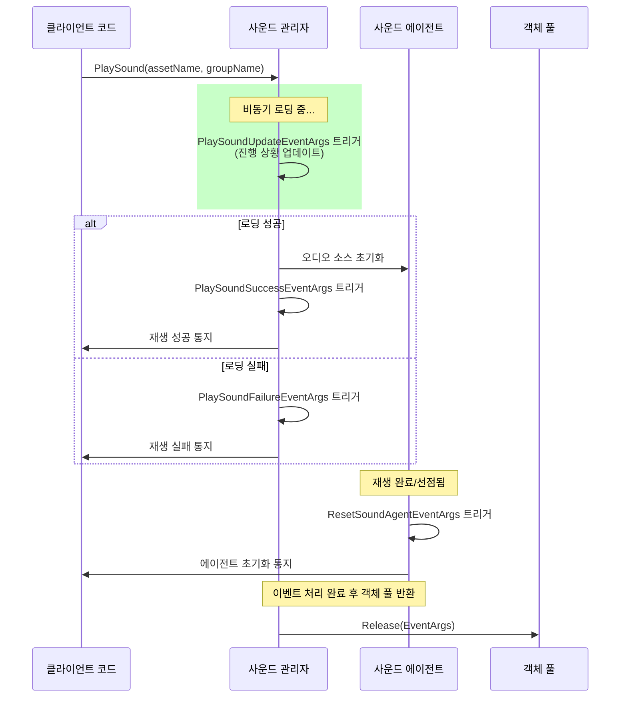

# 이벤트 파라미터

이 섹션에서는 GameFrameX 사운드 시스템에서 사용되는 이벤트 파라미터 클래스를 상세히 소개합니다. 이러한 클래스는 사운드 재생 과정에서 이벤트 데이터를 전달하는 데 사용되며, 외부 컴포넌트가 사운드 재생의 성공, 실패, 업데이트 및 사운드 에이전트 초기화 등 상태 변화를 반응할 수 있도록 합니다.

## 개요

GameFrameX 사운드 시스템은 이벤트驱动 아키텍처를 채택하며, 사운드 재생 상태가 변화할 때 시스템이相应 이벤트를 발생시키고 상세한 이벤트 파라미터를 전달합니다. 이러한 이벤트 파라미터 클래스는 모두 `GameFrameX.Event.Runtime.GameEventArgs` 기본 클래스를 상속하며, 메모리 사용 최적화를 위해 통일된 객체 풀 관리 메커니즘을 제공합니다.

이벤트 파라미터의 주요 역할:

- **상태 통지**: 사운드 재생 결과(성공 또는 실패)를 구독자에게 통지
- **진행 추적**: 비동기 로딩 진행 정보를 제공하여 UI 표시에 사용
- **오류 처리**: 오류 코드 및 오류 정보를 제공하여 문제 진단 용이
- **에이전트 관리**: 사운드 에이전트를 초기화하여 리소스를 재활용해야 함을 통지

## 이벤트 파라미터 클래스 체계

GameFrameX 사운드 시스템은 네 가지 핵심 이벤트 파라미터 클래스를 정의하며, 각각 서로 다른 사운드 시스템 상태 변화에 대응합니다.



### 이벤트 흐름과 컴포넌트 관계



## 핵심 이벤트 파라미터 상세

### PlaySoundSuccessEventArgs

`PlaySoundSuccessEventArgs`는 사운드가 성공적으로 재생 시작될 때 트리거되며, 재생 작업의 완전한 결과 정보를 포함합니다.

```csharp
public sealed class PlaySoundSuccessEventArgs : GameEventArgs
{
    /// <summary>
    /// 사운드의 일련 번호를 가져옵니다.
    /// </summary>
    public int SerialId { get; private set; }

    /// <summary>
    /// 사운드 리소스 이름을 가져옵니다.
    /// </summary>
    public string SoundAssetName { get; private set; }

    /// <summary>
    /// 재생에 사용되는 사운드 에이전트를 가져옵니다.
    /// </summary>
    public ISoundAgent SoundAgent { get; private set; }

    /// <summary>
    /// 로딩 지속 시간을 가져옵니다.
    /// </summary>
    public float Duration { get; private set; }

    /// <summary>
    /// 사용자 정의 데이터를 가져옵니다.
    /// </summary>
    public object UserData { get; private set; }

    public static PlaySoundSuccessEventArgs Create(int serialId, string soundAssetName, 
        ISoundAgent soundAgent, float duration, object userData)
    {
        // 객체 풀에서 인스턴스를 가져와서 초기화
    }
}
```
> Source: [PlaySoundSuccessEventArgs.cs](https://github.com/GameFrameX/com.gameframex.unity.sound/blob/main/Runtime/EventArgs/PlaySoundSuccessEventArgs.cs#L41-L98)

**사용 장면**: 사운드가 성공적으로 재생되었는지 알 필요 있을 때, 재생 제어를 위한 SoundAgent 프록시 인스턴스를 얻거나, 로딩 소요 시간을 기록하는 장면에서 이 이벤트를 구독합니다.

---

### PlaySoundFailureEventArgs

`PlaySoundFailureEventArgs`는 사운드 재생 실패 시 트리거되며, 상세한 오류 정보를 제공하여 문제 진단을 용이하게 합니다.

```csharp
public sealed class PlaySoundFailureEventArgs : GameEventArgs
{
    /// <summary>
    /// 사운드의 일련 번호를 가져옵니다.
    /// </summary>
    public int SerialId { get; private set; }

    /// <summary>
    /// 사운드 리소스 이름을 가져옵니다.
    /// </summary>
    public string SoundAssetName { get; private set; }

    /// <summary>
    /// 사운드 그룹 이름을 가져옵니다.
    /// </summary>
    public string SoundGroupName { get; private set; }

    /// <summary>
    /// 사운드 재생 파라미터를 가져옵니다.
    /// </summary>
    public PlaySoundParams PlaySoundParams { get; private set; }

    /// <summary>
    /// 오류 코드를 가져옵니다.
    /// </summary>
    public PlaySoundErrorCode ErrorCode { get; private set; }

    /// <summary>
    /// 오류 정보를 가져옵니다.
    /// </summary>
    public string ErrorMessage { get; private set; }

    /// <summary>
    /// 사용자 정의 데이터를 가져옵니다.
    /// </summary>
    public object UserData { get; private set; }

    public static PlaySoundFailureEventArgs Create(int serialId, string soundAssetName, 
        string soundGroupName, PlaySoundParams playSoundParams, PlaySoundErrorCode errorCode, 
        string errorMessage, object userData)
    {
        // 객체 풀에서 인스턴스를 가져와서 초기화
    }
}
```
> Source: [PlaySoundFailureEventArgs.cs](https://github.com/GameFrameX/com.gameframex.unity.sound/blob/main/Runtime/EventArgs/PlaySoundFailureEventArgs.cs#L41-L115)

**오류 코드 열거 (PlaySoundErrorCode)**:

| 오류 코드 | 설명 |
|--------|------|
| `Unknown` | 알 수 없는 오류 |
| `SoundGroupNotExist` | 사운드 그룹이 존재하지 않음 |
| `SoundGroupHasNoAgent` | 사운드 그룹에 사운드 에이전트가 없음 |
| `LoadAssetFailure` | 리소스 로딩 실패 |
| `IgnoredDueToLowPriority` | 우선순위 낮아서 무시됨 |
| `SetSoundAssetFailure` | 사운드 리소스 설정 실패 |

> Source: [PlaySoundErrorCode.cs](https://github.com/GameFrameX/com.gameframex.unity.sound/blob/main/Runtime/Sound/Sound/PlaySoundErrorCode.cs#L38-L69)

---

### PlaySoundUpdateEventArgs

`PlaySoundUpdateEventArgs`는 비동기 로딩 과정에서 주기적으로 트리거되어 로딩 진행 상황을 보고합니다.

```csharp
public sealed class PlaySoundUpdateEventArgs : GameEventArgs
{
    /// <summary>
    /// 사운드의 일련 번호를 가져옵니다.
    /// </summary>
    public int SerialId { get; private set; }

    /// <summary>
    /// 사운드 리소스 이름을 가져옵니다.
    /// </summary>
    public string SoundAssetName { get; private set; }

    /// <summary>
    /// 사운드 그룹 이름을 가져옵니다.
    /// </summary>
    public string SoundGroupName { get; private set; }

    /// <summary>
    /// 사운드 재생 파라미터를 가져옵니다.
    /// </summary>
    public PlaySoundParams PlaySoundParams { get; private set; }

    /// <summary>
    /// 로딩 사운드 진행 상황을 가져옵니다.
    /// </summary>
    public float Progress { get; private set; }

    /// <summary>
    /// 사용자 정의 데이터를 가져옵니다.
    /// </summary>
    public object UserData { get; private set; }

    public static PlaySoundUpdateEventArgs Create(int serialId, string soundAssetName, 
        string soundGroupName, PlaySoundParams playSoundParams, float progress, object userData)
    {
        // 객체 풀에서 인스턴스를 가져와서 초기화
    }
}
```
> Source: [PlaySoundUpdateEventArgs.cs](https://github.com/GameFrameX/com.gameframex.unity.sound/blob/main/Runtime/EventArgs/PlaySoundUpdateEventArgs.cs#L41-L106)

**사용 장면**: UI에 로딩 진행률 표시줄을 표시하거나, 로딩 진행 상황을 알아야 하는 다른 작업에서 이 이벤트를 구독합니다.

---

### ResetSoundAgentEventArgs

`ResetSoundAgentEventArgs`는 가벼운 이벤트 파라미터로, 사운드 에이전트를 초기화해야 할 때(예: 재생 완료 또는 선점됨) 트리거됩니다.

```csharp
public sealed class ResetSoundAgentEventArgs : GameEventArgs
{
    /// <summary>
    /// 사운드 에이전트 초기화 이벤트의 새 인스턴스를 초기화합니다.
    /// </summary>
    public ResetSoundAgentEventArgs()
    {
    }

    /// <summary>
    /// 사운드 에이전트 초기화 이벤트를 생성합니다.
    /// </summary>
    public static ResetSoundAgentEventArgs Create()
    {
        ResetSoundAgentEventArgs resetSoundAgentEventArgs = ReferencePool.Acquire<ResetSoundAgentEventArgs>();
        return resetSoundAgentEventArgs;
    }

    /// <summary>
    /// 사운드 에이전트 초기화 이벤트를 정리합니다.
    /// </summary>
    public override void Clear()
    {
    }

    public static readonly string EventId = typeof(ResetSoundAgentEventArgs).FullName;

    public override string Id => EventId;
}
```
> Source: [ResetSoundAgentEventArgs.cs](https://github.com/GameFrameX/com.gameframex.unity.sound/blob/main/Runtime/EventArgs/ResetSoundAgentEventArgs.cs#L41-L76)

**사용 장면**: 사운드 에이전트의 초기화 상태를 리스닝하여 리소스 정리 또는 상태 동기화를 수행합니다.

---

## 이벤트 구독 및 사용 예제

### 재생 성공 이벤트 구독

```csharp
// 사운드 관리자 인스턴스 가져오기
var soundManager = GameEntry.GetManager<ISoundManager>();

// 재생 성공 이벤트 구독
soundManager.PlaySoundSuccess += OnPlaySoundSuccess;

private void OnPlaySoundSuccess(object sender, PlaySoundSuccessEventArgs e)
{
    UnityEngine.Debug.Log($"사운드 재생 성공: {e.SoundAssetName}, 지속 시간: {e.Duration}");
    // e.SoundAgent를 통해 재생 제어 가능 (일시정지, 중지 등)
    // e.UserData는 재생 시 전달된 사용자 정의 데이터 포함
}
```

> Source: [ISoundManager.cs](https://github.com/GameFrameX/com.gameframex.unity.sound/blob/main/Runtime/Interface/ISoundManager.cs#L50-L53)

### 재생 실패 이벤트 구독

```csharp
soundManager.PlaySoundFailure += OnPlaySoundFailure;

private void OnPlaySoundFailure(object sender, PlaySoundFailureEventArgs e)
{
    UnityEngine.Debug.LogError($"사운드 재생 실패: {e.SoundAssetName}, 오류 코드: {e.ErrorCode}, 오류 정보: {e.ErrorMessage}");
    // 오류 코드에 따라 다른 처리 가능
    if (e.ErrorCode == PlaySoundErrorCode.SoundGroupNotExist)
    {
        // 사운드 그룹이 존재하지 않는 상황 처리
    }
}
```

> Source: [ISoundManager.cs](https://github.com/GameFrameX/com.gameframex.unity.sound/blob/main/Runtime/Interface/ISoundManager.cs#L55-L58)

### 사운드 에이전트 초기화 이벤트 구독

```csharp
// 사운드 에이전트 헬퍼 인터페이스
public interface ISoundAgentHelper
{
    /// <summary>
    /// 사운드 에이전트 초기화 이벤트.
    /// </summary>
    event EventHandler<ResetSoundAgentEventArgs> ResetSoundAgent;
}
```
> Source: [ISoundAgentHelper.cs](https://github.com/GameFrameX/com.gameframex.unity.sound/blob/main/Runtime/Interface/ISoundAgentHelper.cs#L102-L105)

---

## 객체 풀 메커니즘

모든 이벤트 파라미터 클래스는 객체 풀 패턴을 채택하여 관리되며, 이는 GameFrameX 프레임워크의 메모리 최적화 전략입니다:

1. **생성**: 정적 `Create()` 메서드를 사용하여 객체 풀에서 인스턴스를 가져옴
2. **사용**: 이벤트 속성 채우기
3. **해제**: 이벤트 처리 완료 후 프레임워크가 자동으로 `ReferencePool.Release()`를 호출하여 객체 풀에 반환
4. **초기화**: 반환 시 `Clear()` 메서드를 호출하여 모든 속성을 기본값으로 재설정

이 설계는频繁한 객체 할당과垃圾 회수를 피하여 성능을 향상시키며, 특히频繁하게 이벤트 발생하는 장면에서 효과가顕著합니다.

```csharp
// 이벤트 파라미터 생성 예제
PlaySoundSuccessEventArgs args = PlaySoundSuccessEventArgs.Create(
    serialId: 1,
    soundAssetName: "bgm_music",
    soundAgent: soundAgent,
    duration: 180.5f,
    userData: null
);

// 이벤트 트리거
soundManager.PlaySoundSuccess?.Invoke(this, args);

// 객체 풀에 반환
ReferencePool.Release(args);
```

---

## 이벤트 발생 시퀀스



---

## 관련 링크

- [인터페이스 정의](./5-api-reference.1-interfaces) - ISoundManager 및 ISoundAgentHelper 인터페이스 상세 정의
- [재생 파라미터](./5-api-reference.2-play-sound-params) - PlaySoundParams 파라미터 구성 설명
- [사운드 관리자](./4-core-concepts.1-sound-manager) - 사운드 관리자 핵심 개념 및 구현
- [사운드 에이전트](./4-core-concepts.3-sound-agent) - 사운드 에이전트 컴포넌트 상세