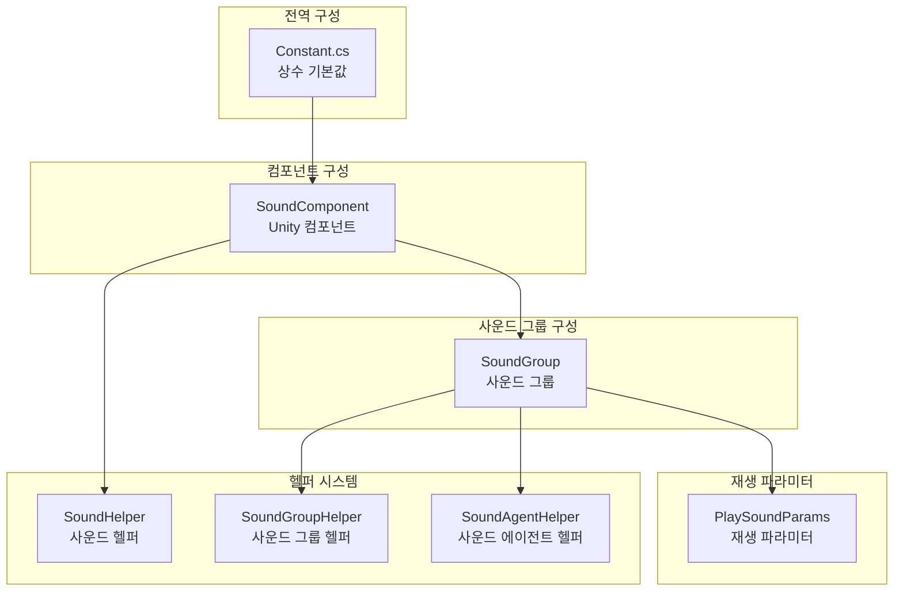
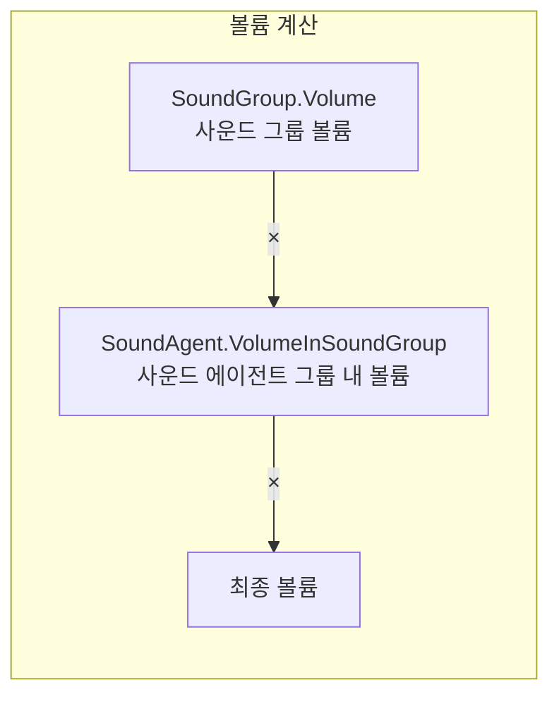

# 구성 설명

이 문서는 GameFrameX Sound 사운드 컴포넌트의 구성 시스템을 상세히 소개하며, 모든 구성 가능한 옵션과 기본값을 포함합니다.

## 개요

GameFrameX Sound 컴포넌트는 계층화 구성 아키텍처를 채택하며, 전역 기본값에서 개별 사운드의 재생 파라미터까지 완전한 구성 체계를 형성합니다. 이러한 설계를 통해 개발자는 서로 다른 레이어에서 사운드 속성을 설정할 수 있으며, 전역 기본값을 설정할 수도 있고, 필요할 때 개별 사운드의 재생 동작을 덮어쓸 수도 있습니다.

구성 시스템은 주로 다음 레이어를 포함합니다:

1. **상수 기본값** - 시스템 레벨의 전역 기본값
2. **사운드 그룹 구성** - 사운드 그룹의 볼륨, 음소거, 동일 우선순위 교체 전략
3. **재생 파라미터 구성** - 개별 사운드의 재생 파라미터
4. **헬퍼 구성** - 확장 가능한 헬퍼 시스템

## 구성 아키텍처



### 구성 흐름 설명

시스템 초기화 시 먼저 `Constant.cs`의 상수 기본값을 모든 사운드의 기준으로 로드합니다. 그런 다음 `SoundComponent`가 Unity 씬에서 시작할 때 Inspector 패널의 설정에 따라 사운드 그룹을 생성합니다. 각 사운드 그룹은 볼륨, 음소거 상태 및 에이전트 수량을 독립적으로 구성할 수 있습니다. 사운드를 재생할 때 `PlaySoundParams`를 통해 기본 재생 파라미터를 덮어쓸 수 있습니다.

## 상수 기본값

상수는 `Runtime/Sound/Sound/Constant.cs` 파일에 정의되어 있으며, 이 값은 전체 시스템의 기본 기본값입니다.

> Source: [Constant.cs](https://github.com/GameFrameX/com.gameframex.unity.sound/blob/main/Runtime/Sound/Sound/Constant.cs#L38-L99)

| 상수 | 유형 | 기본값 | 설명 |
|------|------|--------|------|
| DefaultTime | float | 0f | 재생 위치 (초) |
| DefaultMute | bool | false | 기본 음소거 여부 |
| DefaultLoop | bool | false | 기본 루프 재생 여부 |
| DefaultPriority | int | 0 | 사운드 로딩 우선순위 |
| DefaultVolume | float | 1f | 기본 볼륨 (0.0-1.0) |
| DefaultFadeInSeconds | float | 0f | 페이드 인 시간 (초) |
| DefaultFadeOutSeconds | float | 0f | 페이드 아웃 시간 (초) |
| DefaultPitch | float | 1f | 음표 (0.5-2.0) |
| DefaultPanStereo | float | 0f | 스테레오 위치 (-1.0~1.0) |
| DefaultSpatialBlend | float | 0f | 공간 혼합량 (0.0~1.0) |
| DefaultMaxDistance | float | 100f | 최대 거리 |
| DefaultDopplerLevel | float | 1f | 도플러 등급 |

## 사운드 그룹 구성

사운드 그룹(SoundGroup)은 관련 사운드의 공유 설정을 구성하는 데 사용됩니다. 각 사운드 그룹은 볼륨, 음소거 상태 및 사운드 에이전트 수량을 독립적으로 제어할 수 있습니다.

### SoundComponent의 사운드 그룹 구성

Unity 편집기에서 `SoundComponent` 컴포넌트의 Inspector 패널을 통해 사운드 그룹을 구성합니다:

> Source: [SoundComponent.SoundGroup.cs](https://github.com/GameFrameX/com.gameframex.unity.sound/blob/main/Runtime/Sound/SoundComponent.SoundGroup.cs#L45-L111)

```csharp
[Serializable]
private sealed class SoundGroup
{
    [SerializeField] private string m_Name = null;
    [SerializeField] private bool m_AvoidBeingReplacedBySamePriority = false;
    [SerializeField] private bool m_Mute = false;
    [SerializeField, Range(0f, 1f)] private float m_Volume = 1f;
    [SerializeField] private int m_AgentHelperCount = 1;
}
```

### 사운드 그룹 파라미터 설명

| 파라미터 | 유형 | 기본값 | 설명 |
|------|------|--------|------|
| Name | string | - | 사운드 그룹 이름, 식별 및 검색에 사용 |
| AvoidBeingReplacedBySamePriority | bool | false | 동일 우선순위 사운드로 교체되는 것을 방지할지 여부 |
| Mute | bool | false | 사운드 그룹 음소거 여부 |
| Volume | float | 1f | 사운드 그룹 볼륨 (0.0-1.0) |
| AgentHelperCount | int | 1 | 사운드 에이전트 헬퍼 수량, 동시에 재생 가능한 사운드 수 결정 |

### 런타임 동적 구성

`ISoundGroup` 인터페이스를 통해 런타임에 동적으로 사운드 그룹 구성을 수정할 수 있습니다:

> Source: [ISoundGroup.cs](https://github.com/GameFrameX/com.gameframex.unity.sound/blob/main/Runtime/Interface/ISoundGroup.cs#L38-L87)

```csharp
public interface ISoundGroup
{
    string Name { get; }
    int SoundAgentCount { get; }
    bool AvoidBeingReplacedBySamePriority { get; set; }
    bool Mute { get; set; }
    float Volume { get; set; }
    ISoundHelper Helper { get; }
}
```

### 구성 예제: 사운드 그룹 생성

```csharp
// SoundComponent를 통해 사운드 그룹 추가
var soundComponent = GameEntry.GetComponent<SoundComponent>();
soundComponent.AddSoundGroup("배경 음악", 1);  // 이름 및 에이전트 수량
soundComponent.AddSoundGroup("효과음", 5);      // 5개 효과음 동시 지원

// 더 상세한 사운드 그룹 구성으로 추가
soundComponent.AddSoundGroup(
    "음성",                    // 사운드 그룹 이름
    true,                      // 동일 우선순위 교체 방지
    false,                     // 음소거 안함
    0.8f,                      // 볼륨 80%
    3                          // 3개 에이전트
);

// 사운드 그룹 가져와서 동적으로 조정
var soundGroup = soundComponent.GetSoundGroup("배경 음악");
soundGroup.Volume = 0.5f;  // 볼륨 조정
soundGroup.Mute = true;    // 음소거
```

## 재생 파라미터 구성

`PlaySoundParams` 클래스는 개별 사운드의 재생 파라미터를 구성하는 데 사용됩니다. 이 파라미터는 `PlaySound` 메서드 호출 시 선택적 파라미터로 전달됩니다.

> Source: [PlaySoundParams.cs](https://github.com/GameFrameX/com.gameframex.unity.sound/blob/main/Runtime/Sound/Sound/PlaySoundParams.cs#L40-L258)

### PlaySoundParams 속성

| 속성 | 유형 | 기본값 | 설명 |
|------|------|--------|------|
| Time | float | 0f | 재생 위치, 지정된 시간부터 재생 |
| MuteInSoundGroup | bool | false | 사운드 그룹 내에서 음소거 여부 |
| Loop | bool | false | 루프 재생 여부 |
| Priority | int | 0 | 사운드 우선순위 (숫자가 높을수록 우선순위 높음) |
| VolumeInSoundGroup | float | 1f | 사운드 그룹 내 볼륨 계수 |
| FadeInSeconds | float | 0f | 페이드 인 시간 (초) |
| Pitch | float | 1f | 음표 (0.5-2.0, 1은 정상) |
| PanStereo | float | 0f | 스테레오 위치 (-1은 좌 채널, 1은 우 채널) |
| SpatialBlend | float | 0f | 공간 혼합 (0은 2D, 1은 3D) |
| MaxDistance | float | 100f | 3D 사운드의 최대 거리 |
| DopplerLevel | float | 1f | 도플러 효과 등급 |

### PlaySoundParams 사용

```csharp
// 재생 파라미터 생성
var playParams = PlaySoundParams.Create();

// 파라미터 구성
playParams.Loop = true;                    // 루프 재생
playParams.VolumeInSoundGroup = 0.8f;      // 80% 볼륨
playParams.Pitch = 1.2f;                   // 약간 빠르게
playParams.FadeInSeconds = 0.5f;           // 0.5초 페이드 인
playParams.Priority = 100;                  // 높은 우선순위

// 사운드 재생 시 파라미터 전달
await soundComponent.PlaySound("bgm_music", "배경 음악", playParams);

// 사용 후 해제 (참조 카운트가 활성화된 경우)
if (playParams.Referenced)
{
    ReferencePool.Release(playParams);
}
```

## SoundComponent 컴포넌트 구성

`SoundComponent`는 Unity 씬에서 사운드 시스템을 초기화하는 주요 컴포넌트입니다. Inspector 패널 또는 코드를 통해 구성합니다.

> Source: [SoundComponent.cs](https://github.com/GameFrameX/com.gameframex.unity.sound/blob/main/Runtime/Sound/SoundComponent.cs#L46-L75)

### Inspector 구성 가능 항목

| 속성 | 유형 | 기본값 | 설명 |
|------|------|--------|------|
| Instance Root | Transform | null | 사운드 인스턴스의 루트 노드 |
| Audio Mixer | AudioMixer | null | Unity 오디오 믹서 |
| Sound Helper Type Name | string | "GameFrameX.Sound.Runtime.DefaultSoundHelper" | 사운드 헬퍼 유형 |
| Custom Sound Helper | SoundHelperBase | null | 커스텀 사운드 헬퍼 인스턴스 |
| Sound Group Helper Type Name | string | "GameFrameX.Sound.Runtime.DefaultSoundGroupHelper" | 사운드 그룹 헬퍼 유형 |
| Custom Sound Group Helper | SoundGroupHelperBase | null | 커스텀 사운드 그룹 헬퍼 인스턴스 |
| Sound Agent Helper Type Name | string | "GameFrameX.Sound.Runtime.DefaultSoundAgentHelper" | 사운드 에이전트 헬퍼 유형 |
| Custom Sound Agent Helper | SoundAgentHelperBase | null | 커스텀 사운드 에이전트 헬퍼 인스턴스 |
| Sound Groups | SoundGroup[] | null | 사운드 그룹 배열 |

### 코드로 SoundComponent 구성

```csharp
// SoundComponent 생성 및 구성
var soundGameObject = new GameObject("Sound");
var soundComponent = soundGameObject.AddComponent<SoundComponent>();

// 헬퍼 유형 코드로 구성
// 주의: 이러한 구성은 일반적으로 Inspector에서 구성
// soundComponent.m_SoundHelperTypeName = "MyCustomSoundHelper";
// soundComponent.m_SoundGroupHelperTypeName = "MyCustomSoundGroupHelper";
// soundComponent.m_SoundAgentHelperTypeName = "MyCustomSoundAgentHelper";

// AudioMixer 구성
// soundComponent.m_AudioMixer = myAudioMixer;

// 인스턴스 루트 노드 구성
// soundComponent.m_InstanceRoot = myInstanceRoot;
```

## 헬퍼 시스템 구성

GameFrameX Sound는 헬퍼(Helper) 패턴을 채택하여 확장 가능성을 실현합니다. 개발자는 기본 클래스를 상속하여 커스텀 헬퍼를 생성할 수 있습니다.

### 헬퍼 유형

| 헬퍼 | 기본 클래스 | 용도 |
|--------|------|------|
| SoundHelper | SoundHelperBase | 사운드 리소스의 로딩 및 해제 관리 |
| SoundGroupHelper | SoundGroupHelperBase | 사운드 그룹의 오디오 믹싱 관리 |
| SoundAgentHelper | SoundAgentHelperBase | 개별 사운드의 재생 동작 제어 |

> Source: [SoundHelperBase.cs](https://github.com/GameFrameX/com.gameframex.unity.sound/blob/main/Runtime/Sound/SoundHelperBase.cs#L41-L48)

### 커스텀 헬퍼 예제

```csharp
// 커스텀 사운드 에이전트 헬퍼
public class MyCustomSoundAgentHelper : SoundAgentHelperBase
{
    private AudioSource _audioSource;

    public override bool IsPlaying => _audioSource?.isPlaying ?? false;
    public override float Length => _audioSource?.clip?.length ?? 0;
    public override float Time { get => _audioSource?.time ?? 0; set { if (_audioSource) _audioSource.time = value; } }
    public override bool Mute { get => _audioSource?.mute ?? false; set { if (_audioSource) _audioSource.mute = value; } }
    public override bool Loop { get => _audioSource?.loop ?? false; set { if (_audioSource) _audioSource.loop = value; } }
    public override int Priority { get => _audioSource?.priority ?? 128; set { if (_audioSource) _audioSource.priority = value; } }
    public override float Volume { get => _audioSource?.volume ?? 1f; set { if (_audioSource) _audioSource.volume = value; } }
    public override float Pitch { get => _audioSource?.pitch ?? 1f; set { if (_audioSource) _audioSource.pitch = value; } }
    public override float PanStereo { get => _audioSource?.panStereo ?? 0; set { if (_audioSource) _audioSource.panStereo = value; } }
    public override float SpatialBlend { get => _audioSource?.spatialBlend ?? 0; set { if (_audioSource) _audioSource.spatialBlend = value; } }
    public override float MaxDistance { get => _audioSource?.maxDistance ?? 100f; set { if (_audioSource) _audioSource.maxDistance = value; } }
    public override float DopplerLevel { get => _audioSource?.dopplerLevel ?? 1f; set { if (_audioSource) _audioSource.dopplerLevel = value; } }
    public override AudioMixerGroup AudioMixerGroup { get; set; }

    public override event EventHandler<ResetSoundAgentEventArgs> ResetSoundAgent;

    public override void Play(float fadeInSeconds)
    {
        _audioSource.Play();
    }

    public override void Stop(float fadeOutSeconds)
    {
        _audioSource.Stop();
    }

    public override void Pause(float fadeOutSeconds)
    {
        _audioSource.Pause();
    }

    public override void Resume(float fadeInSeconds)
    {
        _audioSource.UnPause();
    }

    public override void Reset()
    {
        if (_audioSource)
        {
            _audioSource.clip = null;
            _audioSource.Stop();
        }
    }

    public override bool SetSoundAsset(object soundAsset)
    {
        if (soundAsset is AudioClip clip)
        {
            _audioSource.clip = clip;
            return true;
        }
        return false;
    }

    public override void SetBindingEntity(Entity.Runtime.Entity bindingEntity)
    {
        // 3D 사운드 바인딩 로직 구현
    }

    public override void SetWorldPosition(Vector3 worldPosition)
    {
        if (_audioSource)
        {
            _audioSource.transform.position = worldPosition;
        }
    }

    private void Awake()
    {
        _audioSource = gameObject.AddComponent<AudioSource>();
        _audioSource.spatialBlend = 1f; // 기본값 3D 사운드
    }
}
```

## 볼륨 계산 레이어

최종 재생 볼륨은 여러 레이어가 곱해져서 결정됩니다:



계산 공식: `최종 볼륨 = SoundGroup.Volume × SoundAgent.VolumeInSoundGroup`

예시:
- 사운드 그룹 볼륨 = 0.8 (80%)
- 사운드 재생 볼륨 = 0.5 (50%)
- 최종 볼륨 = 0.8 × 0.5 = 0.4 (40%)

## 완전한 구성 예제

다음은 완전한 사운드 시스템 구성 예제입니다:

```csharp
// 1. SoundComponent 초기화
var soundGameObject = new GameObject("SoundSystem");
var soundComponent = soundGameObject.AddComponent<SoundComponent>();

// 2. 사운드 그룹 구성 (Start에서 자동 처리, 동등한 코드 표시)
soundComponent.AddSoundGroup("음악", 1);                    // 배경 음악 그룹, 1개 에이전트
soundComponent.AddSoundGroup("효과음", 10);                   // 효과음 그룹, 10개 에이전트
soundComponent.AddSoundGroup("음성", 3, true, false, 0.8f, 3); // 음성 그룹, 3개 에이전트, 80% 볼륨

// 3. 다양한 유형의 사운드 재생
// 배경 음악 재생 - 루프
var bgmParams = PlaySoundParams.Create(true);
bgmParams.VolumeInSoundGroup = 0.6f;
bgmParams.FadeInSeconds = 1.0f;
await soundComponent.PlaySound("assets/audio/bgm_title", "음악", bgmParams);

// 효과음 재생 - 일회성 재생
var sfxParams = PlaySoundParams.Create(false);
sfxParams.VolumeInSoundGroup = 1.0f;
sfxParams.Priority = 100;  // 높은 우선순위
await soundComponent.PlaySound("assets/audio/sfx_click", "효과음", sfxParams);

// 3D 효과음 재생
var posParams = PlaySoundParams.Create(false);
posParams.SpatialBlend = 1.0f;  // 3D 사운드
posParams.MaxDistance = 50f;
await soundComponent.PlaySound("assets/audio/sfx_footstep", "효과음", posParams, Vector3.one * 10);

// 4. 런타임 제어
var musicGroup = soundComponent.GetSoundGroup("음악");
musicGroup.Volume = 0.5f;  // 배경 음악 볼륨 조정
musicGroup.Mute = false;   // 음소거 해제

// 5. 사운드 중지
soundComponent.StopAllLoadedSounds(0.5f);  // 0.5초 페이드 아웃
```

## 관련 링크

- [핵심 개념 - 사운드 관리자](./4-core-concepts.1-sound-manager)
- [핵심 개념 - 사운드 그룹](./4-core-concepts.2-sound-group)
- [핵심 개념 - 사운드 에이전트](./4-core-concepts.3-sound-agent)
- [API 참조 - 인터페이스 정의](./5-api-reference.1-interfaces)
- [API 참조 - 재생 파라미터](./5-api-reference.2-play-sound-params)
- [확장 가이드](./7-extending)