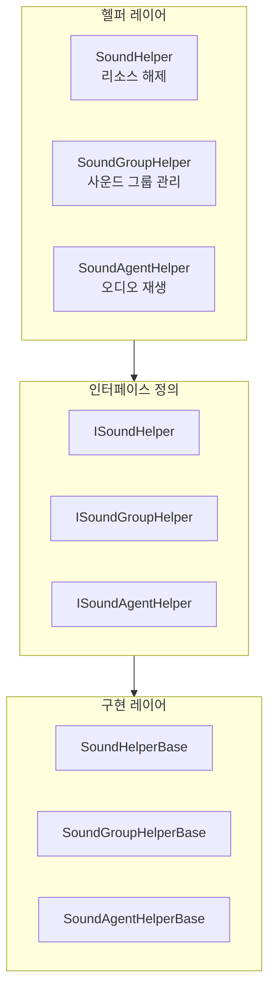

# 확장 가이드

이 문서는 GameFrameX 사운드 시스템을 확장하는 방법을 상세히 소개하며, 커스텀 사운드 헬퍼, 사운드 그룹 및 사운드 에이전트 구현 방법을 포함합니다.

## 개요

GameFrameX 사운드 시스템은 모듈화된 설계를 채택하여 다양한 확장 포인트를 제공합니다. 이러한 확장 포인트를 통해 개발자는 다음을 수행할 수 있습니다:

- 커스텀 사운드 리소스 로딩 및 해제 로직 구현
- 특수한 사운드 그룹 관리 방식 생성
- 기본 오디오 재생 구현 교체 (FMOD, CRIWARE 등 서드파티 오디오 미들웨어 사용)
- 동적으로 커스텀 사운드 그룹 및 사운드 에이전트 추가

## 확장 포인트 아키텍처

시스템은 사운드 시스템의 서로 다른 컴포넌트에 대응하는 세 가지 주요 확장 레이어를 제공합니다:



### 확장 포인트 설명

| 확장 포인트 | 인터페이스 | 기본 클래스 | 용도 |
|--------|------|------|------|
| 사운드 헬퍼 | ISoundHelper | SoundHelperBase | 커스텀 리소스 해제 로직 |
| 사운드 그룹 헬퍼 | ISoundGroupHelper | SoundGroupHelperBase | 사운드 그룹 관리 및 믹싱 |
| 사운드 에이전트 헬퍼 | ISoundAgentHelper | SoundAgentHelperBase | 오디오 재생 구현 (주요 확장 포인트) |

## 커스텀 사운드 헬퍼

사운드 헬퍼(SoundHelper)는 사운드 리소스의 해제 로직을 담당합니다. 시스템은 Unity 리소스 시스템 기반의 기본 구현을 제공합니다.

### 인터페이스 정의

> Source: [ISoundHelper.cs](https://github.com/GameFrameX/com.gameframex.unity.sound/blob/main/Runtime/Interface/ISoundHelper.cs#L35-L46)

```csharp
namespace GameFrameX.Sound.Runtime
{
    public interface ISoundHelper
    {
        void ReleaseSoundAsset(object soundAsset);
    }
}
```

### 기본 클래스 구현

> Source: [SoundHelperBase.cs](https://github.com/GameFrameX/com.gameframex.unity.sound/blob/main/Runtime/Sound/SoundHelperBase.cs#L38-L49)

```csharp
public abstract class SoundHelperBase : MonoBehaviour, ISoundHelper
{
    public abstract void ReleaseSoundAsset(object soundAsset);
}
```

### 구현 예제

다음은 사운드 리소스의 해제 로직을 커스텀하는 예제입니다:

```csharp
using GameFrameX.Sound.Runtime;
using UnityEngine;

public class CustomSoundHelper : SoundHelperBase
{
    public override void ReleaseSoundAsset(object soundAsset)
    {
        if (soundAsset == null)
        {
            return;
        }

        // 커스텀 리소스 해제 로직
        // 예: 객체 풀을 사용하여 AudioClip 관리
        AudioClip clip = soundAsset as AudioClip;
        if (clip != null)
        {
            // 예시: 지연 해제 또는 객체 풀에 넣기
            Resources.UnloadAsset(clip);
        }
    }
}
```

## 커스텀 사운드 그룹 헬퍼

사운드 그룹 헬퍼(SoundGroupHelper)는 사운드 그룹 관리를 담당하며, 믹서 그룹(AudioMixerGroup) 구성을 포함합니다.

### 인터페이스 정의

> Source: [ISoundGroupHelper.cs](https://github.com/GameFrameX/com.gameframex.unity.sound/blob/main/Runtime/Interface/ISoundGroupHelper.cs#L35-L41)

```csharp
namespace GameFrameX.Sound.Runtime
{
    public interface ISoundGroupHelper
    {
    }
}
```

### 기본 클래스 구현

> Source: [SoundGroupHelperBase.cs](https://github.com/GameFrameX/com.gameframex.unity.sound/blob/main/Runtime/Sound/SoundGroupHelperBase.cs#L38-L55)

```csharp
public abstract class SoundGroupHelperBase : MonoBehaviour, ISoundGroupHelper
{
    [SerializeField] private AudioMixerGroup m_AudioMixerGroup = null;

    public AudioMixerGroup AudioMixerGroup
    {
        get { return m_AudioMixerGroup; }
        set { m_AudioMixerGroup = value; }
    }
}
```

### 구현 예제

```csharp
using GameFrameX.Sound.Runtime;
using UnityEngine;
using UnityEngine.Audio;

public class CustomSoundGroupHelper : SoundGroupHelperBase
{
    [SerializeField] private float m_CustomVolume = 1.0f;

    protected override void Awake()
    {
        base.Awake();
        
        // 커스텀 초기화 로직
        if (AudioMixerGroup != null)
        {
            Debug.Log($"SoundGroup initialized with mixer: {AudioMixerGroup.name}");
        }
    }

    public float CustomVolume
    {
        get { return m_CustomVolume; }
        set { m_CustomVolume = value; }
    }
}
```

## 커스텀 사운드 에이전트 헬퍼 (주요 확장 포인트)

사운드 에이전트 헬퍼(SoundAgentHelper)는 시스템의 핵심 확장 포인트로, 실제 오디오 재생 구현을 담당합니다. 커스텀 SoundAgentHelper를 통해:

- Unity AudioSource 구현 교체 가능
- 서드파티 오디오 미들웨어(FMOD, CRIWARE, Wwise 등) 통합 가능
- 특수한 오디오 처리 효과 구현 가능
- 커스텀 공간 오디오 계산 추가 가능

### 인터페이스 정의

> Source: [ISoundAgentHelper.cs](https://github.com/GameFrameX/com.gameframex.unity.sound/blob/main/Runtime/Interface/ISoundAgentHelper.cs#L35-L143)

```csharp
namespace GameFrameX.Sound.Runtime
{
    public interface ISoundAgentHelper
    {
        // 속성
        bool IsPlaying { get; }
        float Length { get; }
        float Time { get; set; }
        bool Mute { get; set; }
        bool Loop { get; set; }
        int Priority { get; set; }
        float Volume { get; set; }
        float Pitch { get; set; }
        float PanStereo { get; set; }
        float SpatialBlend { get; set; }
        float MaxDistance { get; set; }
        float DopplerLevel { get; set; }

        // 이벤트
        event EventHandler<ResetSoundAgentEventArgs> ResetSoundAgent;

        // 메서드
        void Play(float fadeInSeconds);
        void Stop(float fadeOutSeconds);
        void Pause(float fadeOutSeconds);
        void Resume(float fadeInSeconds);
        void Reset();
        bool SetSoundAsset(object soundAsset);
    }
}
```

### 기본 클래스 정의

> Source: [SoundAgentHelperBase.cs](https://github.com/GameFrameX/com.gameframex.unity.sound/blob/main/Runtime/Sound/SoundAgentHelperBase.cs#L38-L163)

기본 클래스는 `MonoBehaviour`를 상속하며, 커스텀 구현은 모두 이 클래스를 상속해야 합니다.

### 구현 예제: 서드파티 오디오 미들웨어 사용

다음 예제는 커스텀 오디오 시스템을 사용하는 SoundAgentHelper를 생성하는 방법을 보여줍니다:

```csharp
using GameFrameX.Sound.Runtime;
using GameFrameX.Entity.Runtime;
using GameFrameX.Runtime;
using UnityEngine;
using UnityEngine.Audio;
using System;

public class CustomAudioSourceAgentHelper : SoundAgentHelperBase
{
    private AudioSource m_AudioSource;
    private bool m_IsPlaying;
    private float m_CurrentVolume = 1.0f;
    private EventHandler<ResetSoundAgentEventArgs> m_ResetEventHandler;

    public override bool IsPlaying => m_IsPlaying;

    public override float Length => m_AudioSource?.clip?.length ?? 0f;

    public override float Time
    {
        get => m_AudioSource.time;
        set => m_AudioSource.time = value;
    }

    public override bool Mute
    {
        get => m_AudioSource.mute;
        set => m_AudioSource.mute = value;
    }

    public override bool Loop
    {
        get => m_AudioSource.loop;
        set => m_AudioSource.loop = value;
    }

    public override int Priority
    {
        get => 128 - m_AudioSource.priority;
        set => m_AudioSource.priority = 128 - value;
    }

    public override float Volume
    {
        get => m_CurrentVolume;
        set
        {
            m_CurrentVolume = value;
            m_AudioSource.volume = value;
        }
    }

    public override float Pitch
    {
        get => m_AudioSource.pitch;
        set => m_AudioSource.pitch = value;
    }

    public override float PanStereo
    {
        get => m_AudioSource.panStereo;
        set => m_AudioSource.panStereo = value;
    }

    public override float SpatialBlend
    {
        get => m_AudioSource.spatialBlend;
        set => m_AudioSource.spatialBlend = value;
    }

    public override float MaxDistance
    {
        get => m_AudioSource.maxDistance;
        set => m_AudioSource.maxDistance = value;
    }

    public override float DopplerLevel
    {
        get => m_AudioSource.dopplerLevel;
        set => m_AudioSource.dopplerLevel = value;
    }

    public override AudioMixerGroup AudioMixerGroup
    {
        get => m_AudioSource.outputAudioMixerGroup;
        set => m_AudioSource.outputAudioMixerGroup = value;
    }

    public override event EventHandler<ResetSoundAgentEventArgs> ResetSoundAgent
    {
        add => m_ResetEventHandler += value;
        remove => m_ResetEventHandler -= value;
    }

    public override void Play(float fadeInSeconds)
    {
        m_IsPlaying = true;
        m_AudioSource.Play();
        // 페이드 인 로직 추가 가능
    }

    public override void Stop(float fadeOutSeconds)
    {
        m_IsPlaying = false;
        m_AudioSource.Stop();
    }

    public override void Pause(float fadeOutSeconds)
    {
        m_IsPlaying = false;
        m_AudioSource.Pause();
    }

    public override void Resume(float fadeInSeconds)
    {
        m_IsPlaying = true;
        m_AudioSource.UnPause();
    }

    public override void Reset()
    {
        m_IsPlaying = false;
        m_AudioSource.clip = null;
    }

    public override bool SetSoundAsset(object soundAsset)
    {
        if (soundAsset is AudioClip clip)
        {
            m_AudioSource.clip = clip;
            return true;
        }
        return false;
    }

    public override void SetBindingEntity(Entity bindingEntity)
    {
        // 엔티티 바인딩 로직 구현
    }

    public override void SetWorldPosition(Vector3 worldPosition)
    {
        transform.position = worldPosition;
    }

    private void Awake()
    {
        m_AudioSource = gameObject.GetOrAddComponent<AudioSource>();
        m_AudioSource.playOnAwake = false;
    }
}
```

## 커스텀 확장 구성

SoundComponent에서 커스텀 확장을 구성하는 세 가지 방식:

### 방식 1: Inspector를 통한 구성 (권장)

Unity 편집기에서 SoundComponent가 연결된 게임 오브젝트를 선택하고, Inspector 패널에서 구성합니다:

```csharp
// SoundComponent 필드 설명
[SerializeField] private string m_SoundHelperTypeName = "GameFrameX.Sound.Runtime.DefaultSoundHelper";
[SerializeField] private SoundHelperBase m_CustomSoundHelper = null;

[SerializeField] private string m_SoundGroupHelperTypeName = "GameFrameX.Sound.Runtime.DefaultSoundGroupHelper";
[SerializeField] private SoundGroupHelperBase m_CustomSoundGroupHelper = null;

[SerializeField] private string m_SoundAgentHelperTypeName = "GameFrameX.Sound.Runtime.DefaultSoundAgentHelper";
[SerializeField] private SoundAgentHelperBase m_CustomSoundAgentHelper = null;
```

### 방식 2: 코드 동적 추가

런타임에 동적으로 커스텀 사운드 그룹 및 에이전트를 추가합니다:

```csharp
// SoundComponent 가져오기
var soundComponent = GameEntry.GetComponent<SoundComponent>();

// 커스텀 사운드 그룹 추가
soundComponent.AddSoundGroup("CustomGroup", 4);

// 커스텀 사운드 그룹 가져오기
var customGroup = soundComponent.GetSoundGroup("CustomGroup");
```

### 방식 3: SoundComponent 상속

SoundComponent를 상속하는 하위 클래스를 생성하여 커스텀 초기화 로직을 정의합니다:

```csharp
using GameFrameX.Sound.Runtime;
using UnityEngine;

public class CustomSoundComponent : SoundComponent
{
    protected override void Awake()
    {
        // 커스텀 초기화 전 로직
        base.Awake();
        // 커스텀 초기화 후 로직
    }

    private void Start()
    {
        // 동적으로 커스텀 사운드 그룹 추가
        AddSoundGroup("Music", 2);
        AddSoundGroup("SFX", 8);
        AddSoundGroup("Voice", 4);
    }
}
```

## 동적 사운드 그룹 관리

### 사운드 그룹 추가

```csharp
var soundComponent = GameEntry.GetComponent<SoundComponent>();

// 기본 추가
soundComponent.AddSoundGroup("Music", 4);

// 완전한 파라미터 추가
soundComponent.AddSoundGroup(
    "Music",                      // 사운드 그룹 이름
    false,                        // 동일 우선순위 교체 방지
    false,                        // 음소거
    1.0f,                         // 볼륨
    4                             // 에이전트 수량
);
```

### 사운드 그룹 접근

```csharp
var soundComponent = GameEntry.GetComponent<SoundComponent>();

// 지정 사운드 그룹 가져오기
var musicGroup = soundComponent.GetSoundGroup("Music");

// 모든 사운드 그룹 가져오기
var allGroups = soundComponent.GetAllSoundGroups();

// 사운드 그룹 존재 여부 확인
if (soundComponent.HasSoundGroup("Music"))
{
    // 처리 로직
}
```

### 사운드 그룹 제어

```csharp
var musicGroup = soundComponent.GetSoundGroup("Music") as ISoundGroup;

// 볼륨 설정
musicGroup.Volume = 0.8f;

// 음소거 설정
musicGroup.Mute = false;

// 로드된 모든 사운드 중지
musicGroup.StopAllLoadedSounds();

// 페이드 아웃과 함께 중지
musicGroup.StopAllLoadedSounds(0.5f);
```

## 재생 파라미터 확장

PlaySoundParams를 통해 재생 동작을 커스텀할 수 있습니다:

```csharp
using GameFrameX.Sound.Runtime;

// 재생 파라미터 생성
var playParams = PlaySoundParams.Create(isLoop: false);

// 재생 파라미터 구성
playParams.Priority = 100;                    // 우선순위 (0-255)
playParams.VolumeInSoundGroup = 1.0f;        // 그룹 내 볼륨
playParams.Pitch = 1.0f;                      // 음표
playParams.PanStereo = 0f;                    // 스테레오 (-1~1)
playParams.SpatialBlend = 0f;                 // 공간 혼합 (2D-3D)
playParams.MaxDistance = 50f;                 // 최대 거리
playParams.DopplerLevel = 1f;                 // 도플러 등급
playParams.FadeInSeconds = 0.3f;             // 페이드 인 시간
playParams.Loop = false;                      // 루프 재생

// 사운드 재생
int serialId = await soundComponent.PlaySound(
    "Assets/Audio/BGM_Main.mp3",
    "Music",
    playParams
);
```

## 확장 모범 사례

### 1. 올바른 기본 클래스 상속

항상 시스템에서 제공하는 기본 클래스를 상속하고, 직접 인터페이스를 구현하지 않습니다:

```csharp
// 올바름: 기본 클래스 상속
public class MySoundAgentHelper : SoundAgentHelperBase { }

// 오류: 직접 인터페이스 구현
public class MySoundAgentHelper : MonoBehaviour, ISoundAgentHelper { }
```

### 2. 리소스 참조 처리

커스텀 SoundAgentHelper에서 오디오 리소스의 생명 주기를 올바르게 처리합니다:

```csharp
public override void Reset()
{
    base.Reset();
    // 오디오 리소스 참조 정리
    if (m_AudioSource != null)
    {
        m_AudioSource.clip = null;
    }
}
```

### 3. 이벤트 트리거

사운드 재생이 완료되거나 초기화해야 할 때 이벤트를 올바르게 트리거합니다:

```csharp
public override void Update()
{
    // 재생 완료 감지
    if (!IsPlaying && m_AudioSource.clip != null && m_ResetEventHandler != null)
    {
        var eventArgs = ResetSoundAgentEventArgs.Create();
        m_ResetEventHandler(this, eventArgs);
        ReferencePool.Release(eventArgs);
    }
}
```

### 4. 믹서 구성

AudioMixerGroup을 올바르게 구성하여 믹싱을 지원합니다:

```csharp
public override AudioMixerGroup AudioMixerGroup
{
    get => m_AudioSource.outputAudioMixerGroup;
    set
    {
        m_AudioSource.outputAudioMixerGroup = value;
        // 추가 믹서 구성 로직 가능
    }
}
```

### 5. 서드파티 미들웨어 통합

FMOD 등 서드파티 오디오 미들웨어 통합 시 권장 사항:

```csharp
public class FmodSoundAgentHelper : SoundAgentHelperBase
{
    private FMOD.Studio.EventInstance m_EventInstance;

    public override bool IsPlaying
    {
        get
        {
            m_EventInstance.getPlaybackState(out var state);
            return state == FMOD.Studio.PLAYBACK_STATE.PLAYING;
        }
    }

    public override float Length
    {
        get
        {
            m_EventInstance.getDescription(out var description);
            description.getLength(out var length);
            return length / 1000f; // 초로 변환
        }
    }

    public override void Play(float fadeInSeconds)
    {
        m_EventInstance.start();
    }

    public override void Stop(float fadeOutSeconds)
    {
        m_EventInstance.stop(FMOD.Studio.STOP_MODE.ALLOWFADEOUT);
    }

    public override bool SetSoundAsset(object soundAsset)
    {
        // 리소스 경로를 FMOD 이벤트로 변환
        string eventPath = soundAsset as string;
        if (!string.IsNullOrEmpty(eventPath))
        {
            FMODUnity.RuntimeManager.StudioSystem.createEvent(eventPath, out m_EventInstance);
            return true;
        }
        return false;
    }
}
```

## 관련 링크

- [핵심 개념 - 사운드 관리자](./4-core-concepts.1-sound-manager)
- [핵심 개념 - 사운드 그룹](./4-core-concepts.2-sound-group)
- [핵심 개념 - 사운드 에이전트](./4-core-concepts.3-sound-agent)
- [API 참조 - 인터페이스 정의](./5-api-reference.1-interfaces)
- [API 참조 - 재생 파라미터](./5-api-reference.2-play-sound-params)
- [API 참조 - 이벤트 파라미터](./5-api-reference.3-event-args)
- [구성 설명](./6-configuration)
- [빠른 시작](./3-getting-started)