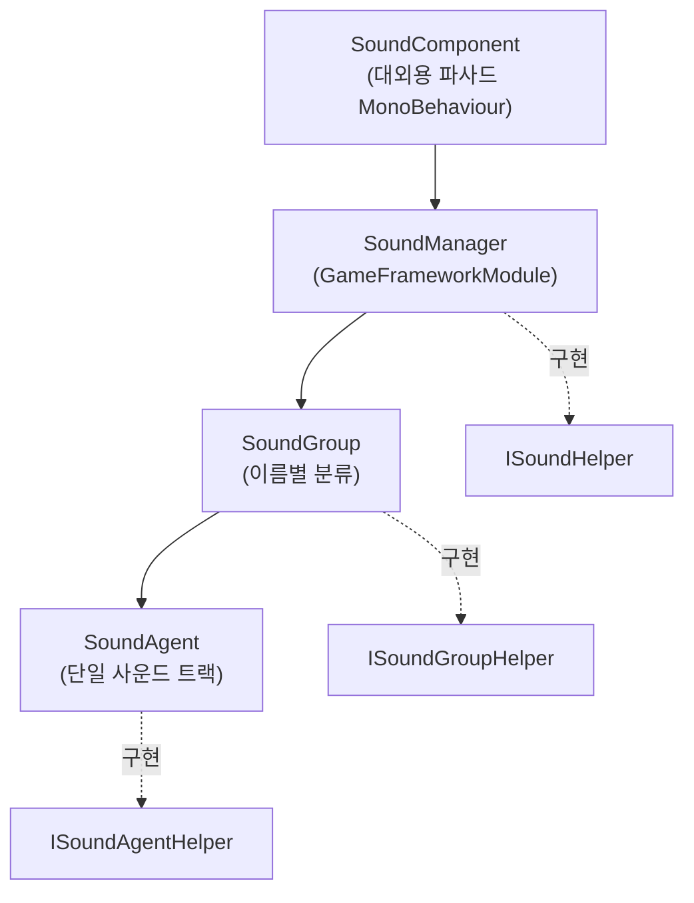

# 아키텍처 한눈에 보기: Component / Manager / Group / Agent

GameFrameX 사운드 모듈은 4계층 구조로 설계되어 있습니다. `SoundComponent`가 대외용 파사드로서 프레임워크 모듈 `SoundManager`를 호출하고, 매니저 내부에서는 `SoundGroup`(사운드 그룹)별로 리소스를 분류하며, 각 사운드 그룹에는 실제로 사운드 효과를 재생하는 여러 개의 `SoundAgent`(사운드 에이전트)가 마운트됩니다. 각 계층에는 하위 구현을 교체하기 위한 `*Helper` 인터페이스가 마련되어 있습니다(예: 서로 다른 오디오 엔진 연동).

## 작동 원리 한눈에 보기

네 개의 `*Helper`(`ISoundHelper` / `ISoundGroupHelper` / `ISoundAgentHelper` / `ISoundHelperBase`)는 주입 지점이며, 기본 구현은 [DefaultSoundHelper.cs](https://github.com/GameFrameX/com.gameframex.unity.sound/blob/main/Runtime/Sound/DefaultSoundHelper.cs#L1-L80), [DefaultSoundGroupHelper.cs](https://github.com/GameFrameX/com.gameframex.unity.sound/blob/main/Runtime/Sound/DefaultSoundGroupHelper.cs), [DefaultSoundAgentHelper.cs](https://github.com/GameFrameX/com.gameframex.unity.sound/blob/main/Runtime/Sound/DefaultSoundAgentHelper.cs)에서 확인할 수 있습니다.

## 각 계층의 역할

| 계층 | 타입 / 파일 | 역할 |
|------|------------|------|
| Component | [SoundComponent](https://github.com/GameFrameX/com.gameframex.unity.sound/blob/main/Runtime/Sound/SoundComponent.cs)는 `MonoBehaviour`를 상속 | 대외용 파사드로서 상위(UI, 전투 등)의 호출을 받아 `SoundManager`로 전달합니다. `PlaySound` / `StopSound` / 볼륨 증감, 사운드 그룹 등록 등의 API를 제공합니다 |
| Manager | [SoundManager](https://github.com/GameFrameX/com.gameframex.unity.sound/blob/main/Runtime/Sound/Sound/SoundManager.cs)는 `GameFrameworkModule`을 상속 | 모듈의 핵심으로, 모든 `SoundGroup` 딕셔너리를 관리하며 로드, 해제, 성공/실패 이벤트를 일괄 처리합니다 |
| Group | [SoundGroup](https://github.com/GameFrameX/com.gameframex.unity.sound/blob/main/Runtime/Sound/Sound/SoundManager.SoundGroup.cs)는 [ISoundGroup](https://github.com/GameFrameX/com.gameframex.unity.sound/blob/main/Runtime/Interface/ISoundGroup.cs)을 구현 | 이름별로 구분되는 사운드 그룹(예: BGM, UI, 전투)으로, 해당 그룹에서 동시에 재생할 수 있는 사운드 트랙 수(`SoundAgentCount`)와 믹싱 속성을 결정합니다 |
| Agent | [SoundAgent](https://github.com/GameFrameX/com.gameframex.unity.sound/blob/main/Runtime/Sound/Sound/SoundManager.SoundAgent.cs)는 [ISoundAgent](https://github.com/GameFrameX/com.gameframex.unity.sound/blob/main/Runtime/Interface/ISoundAgent.cs)을 구현 | 개별 사운드 재생 에이전트로, 재생 상태, 볼륨, 음소거, 소속 그룹 등의 속성을 유지 관리합니다 |

## 핵심 호출 체인

`PlaySound`를 한 번 호출하면 파라미터가 다음 체인을 따라 전달됩니다:

1. `SoundComponent.PlaySound(soundGroup, soundAssetName, ...)`는 `PlaySoundParams`를 수집하여 `serialId`로 직렬화합니다.
2. `SoundManager.PlaySound(serialId, soundGroupName, ...)`는 `m_SoundGroups` 딕셔너리에서 해당 그룹을 찾거나 생성합니다.
3. 대상 `SoundGroup`은 자체 `Helper`(`ISoundGroupHelper`)를 통해 유휴 상태의 `SoundAgent`를 신청하거나 재사용합니다.
4. `SoundAgent`가 실제로 리소스를 로드하고(의존성 주입된 `IAssetManager` 사용), 로드가 완료되면 `Helper`를 통해 오디오를 실제로 재생합니다.
5. 로드/재생 성공 및 실패는 각각 `PlaySoundSuccess` / `PlaySoundFailure` 이벤트를 트리거합니다 [SoundManager.cs#90-L103](https://github.com/GameFrameX/com.gameframex.unity.sound/blob/main/Runtime/Sound/Sound/SoundManager.cs#L90-L103).

## 인터페이스 및 확장 지점

| 인터페이스 | 기본 구현 | 교체 시나리오 |
|------|---------|---------|
| [ISoundHelper](https://github.com/GameFrameX/com.gameframex.unity.sound/blob/main/Runtime/Interface/ISoundHelper.cs) | [DefaultSoundHelper.cs](https://github.com/GameFrameX/com.gameframex.unity.sound/blob/main/Runtime/Sound/DefaultSoundHelper.cs) | 오디오 백엔드 교체(예: FMOD / Wwise) |
| [ISoundGroupHelper](https://github.com/GameFrameX/com.gameframex.unity.sound/blob/main/Runtime/Interface/ISoundGroupHelper.cs) | [DefaultSoundGroupHelper.cs](https://github.com/GameFrameX/com.gameframex.unity.sound/blob/main/Runtime/Sound/DefaultSoundGroupHelper.cs) | 그룹 생성 및 회수 정책 커스터마이징 |
| [ISoundAgentHelper](https://github.com/GameFrameX/com.gameframex.unity.sound/blob/main/Runtime/Interface/ISoundAgentHelper.cs) | [DefaultSoundAgentHelper.cs](https://github.com/GameFrameX/com.gameframex.unity.sound/blob/main/Runtime/Sound/DefaultSoundAgentHelper.cs) | 재생, 볼륨, 음소거, 로우패스 필터 등의 동작 커스터마이징 |
| `ISoundManager` | `SoundManager`(구현) | 일반적으로 교체할 필요 없음 |

`SoundComponent`는 `Awake`에서 `GameFrameXSound` 훅의 `[Preserve]` 참조 목록([GameFrameXSoundCroppingHelper.cs](https://github.com/GameFrameX/com.gameframex.unity.sound/blob/main/Runtime/GameFrameXSoundCroppingHelper.cs#L1-L36))에 따라 기본 Helper 타입을 유지하여, 코드 스트리핑에 의해 제거되는 것을 방지합니다.

## 다음 단계

- 연동 및 초기화 단계: 《사운드 모듈 연동 방법》 참고
- BGM 재생 및 전환: 《사운드 재생 및 제어 방법》 참고
- 재생 실패, 사운드가 잘려나가는 등의 문제 해결: 《사운드 재생 실패 시 대처 방법》 참고
- API 및 오류 코드 빠른 조회: 《API 참조》 참고