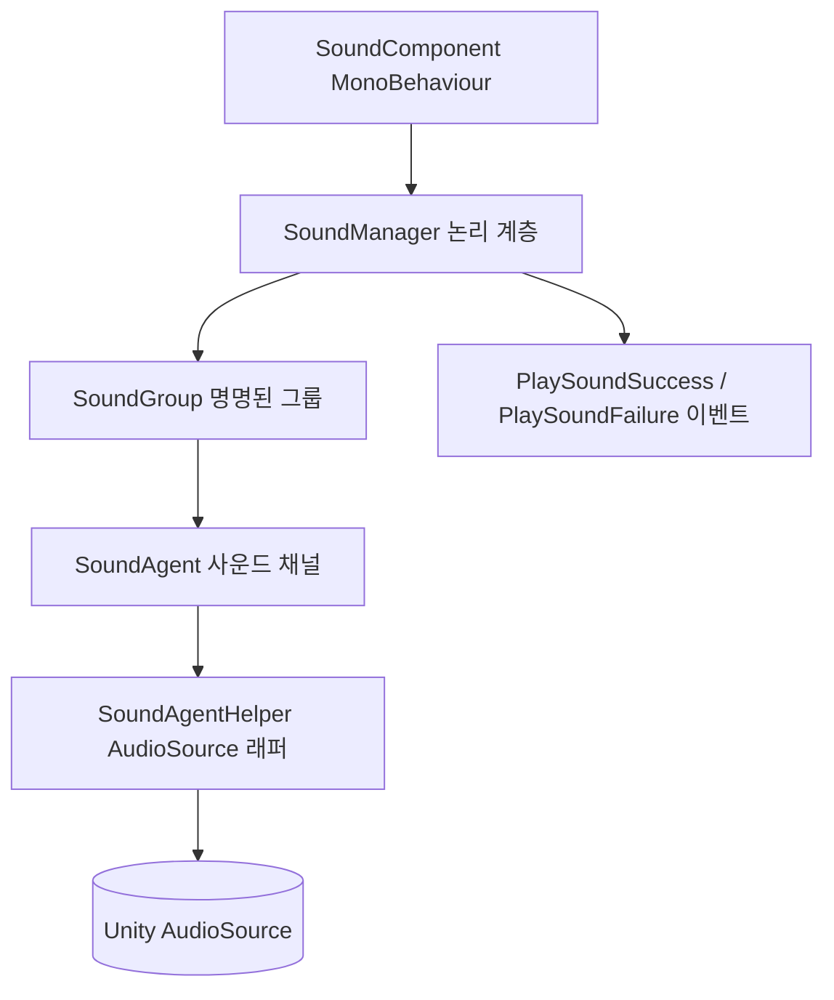

# 사운드 모듈 소개

GameFrameX Sound는 GameFrameX 프레임워크의 사운드 하위 모듈로, Unity AudioSource 기반의 그룹 재생, 공간 오디오, 우선순위 선점 및 이벤트 기반 알림 기능을 제공하여 게임에서 BGM, SFX, Voice 등 다양한 오디오 리소스를 효율적으로 관리할 수 있습니다.

## 빠른 시작

### 1. 설치

다음 방법 중 하나를 선택하여 `com.gameframex.unity.sound`를 Unity 프로젝트에 추가합니다:

1. `Packages/manifest.json`에 scopedRegistries와 종속성을 추가합니다:

```json
{
  "scopedRegistries": [
    {
      "name": "GameFrameX",
      "url": "https://gameframex.upm.alianblank.uk",
      "scopes": ["com.gameframex"]
    }
  ],
  "dependencies": {
    "com.gameframex.unity.sound": "1.2.0"
  }
}
```

출처: [README.zh-CN.md](https://github.com/GameFrameX/com.gameframex.unity.sound/blob/main/README.zh-CN.md#L38-L58)

2. Git 종속성을 직접 추가합니다:
```json
{
  "dependencies": {
    "com.gameframex.unity.sound": "https://github.com/gameframex/com.gameframex.unity.sound.git"
  }
}
```

출처: [README.zh-CN.md](https://github.com/GameFrameX/com.gameframex.unity.sound/blob/main/README.zh-CN.md#L60-L65)

3. Unity `Package Manager`에 `Git URL`을 붙여넣어 설치하거나, 저장소를 프로젝트의 `Packages` 디렉터리에 직접 넣습니다.

### 2. 최소 재생 예제

`SoundManager`를 통해 그룹을 가져와 `PlaySound`를 호출하는 것만으로 오디오를 재생할 수 있습니다:

```csharp
using GameFrameX.Sound.Runtime;

SoundManager soundManager = GameFrameworkEntry.GetModule<SoundManager>();
soundManager.PlaySound("SFX", "Assets/Audio/click.wav");
```

출처: [ISoundManager.cs](https://github.com/GameFrameX/com.gameframex.unity.sound/blob/main/Runtime/Interface/ISoundManager.cs#L43-L80)

주요 재생 매개변수는 모두 `PlaySoundParams`에 집약되어 있으며, 볼륨, 피치, 페이드 인/아웃, 루프, 우선순위, 공간 블렌드 등의 속성을 설정할 수 있습니다:

```csharp
PlaySoundParams param = new PlaySoundParams
{
    Loop = false,
    Volume = 1f,
    Pitch = 1f,
    FadeInSeconds = 0.2f,
    Priority = 0,
};
```

출처: [PlaySoundParams.cs](https://github.com/GameFrameX/com.gameframex.unity.sound/blob/main/Runtime/Sound/Sound/PlaySoundParams.cs#L40-L80)

### 3. 재생 결과 수신

`PlaySoundSuccess`와 `PlaySoundFailure` 이벤트를 통해 비동기 재생 결과를 얻을 수 있습니다:

```csharp
soundManager.PlaySoundSuccess += (sender, e) => { /* 재생 성공 */ };
soundManager.PlaySoundFailure += (sender, e) => { /* 재생 실패 */ };
```

출처: [SoundManager.cs](https://github.com/GameFrameX/com.gameframex.unity.sound/blob/main/Runtime/Sound/Sound/SoundManager.cs#L90-L100)

## 작동 원리 개요

사운드 모듈은 GameFrameX의 클래식한 「Manager + Helper + Agent」 계층 구조를 따르며, 런타임에 가장 바깥쪽의 MonoBehaviour 컴포넌트에서 실제 `AudioSource`까지 파고듭니다:



- **SoundGroup**: 명명된 그룹(예: `BGM`, `SFX`, `Voice`)으로, 독립적인 볼륨, 음소거 상태 및 동시 에이전트 수를 관리합니다.
- **SoundAgent**: 그룹 내 동시 사운드 출력 채널입니다. 에이전트가 모두 사용 중일 때는 우선순위가 낮은 요청이 자동으로 축출됩니다.
- **SoundAgentHelper**: `AudioSource`를 감싸는 래퍼로, 실제 재생, 페이드 인/아웃 및 수명 주기 관리를 담당합니다.
- **PlaySoundParams**: 풀링되는 재생 매개변수 객체로, 모든 속성을 필요에 따라 재정의할 수 있습니다.
- **이벤트 시스템**: 재생 성공/실패는 GameFrameX 이벤트 버스를 통해 일괄 전달되며, 이벤트 인자 역시 참조 풀에서 가져옵니다.

## 기능 특징

| 특징 | 설명 |
|------|------|
| 사운드 그룹 | 사운드를 명명된 그룹(BGM, SFX, Voice 등)으로 구성하며, 그룹별로 독립적인 볼륨, 음소거, 에이전트 수를 관리합니다 |
| 우선순위 재생 | 비동기 재생을 지원하며, 에이전트가 사용 중일 때 우선순위가 낮은 사운드를 자동으로 축출합니다 |
| 완전한 수명 주기 | 재생, 일시 정지, 정지 및 페이드 인/아웃을 지원합니다 |
| 공간 오디오 | 사운드를 게임 엔티티에 바인딩하거나 지정된 월드 좌표에 배치할 수 있습니다 |
| AudioMixer 통합 | 그룹을 지정된 AudioMixer Group으로 라우팅하여 정밀한 믹싱을 구현합니다 |
| 이벤트 기반 알림 | GameFrameX 이벤트 시스템을 통해 재생 성공/실패 알림을 전달합니다 |
| 참조 풀링 | 모든 이벤트 인자와 재생 매개변수를 참조 풀에서 가져와 GC를 최소화합니다 |

출처: [README.zh-CN.md](https://github.com/GameFrameX/com.gameframex.unity.sound/blob/main/README.zh-CN.md#L24-L32)

## 종속성

| 패키지 | 설명 |
|----|------|
| `com.gameframex.unity` | 핵심 프레임워크(모듈 시스템, 참조 풀, 유틸리티 클래스) |
| `com.gameframex.unity.asset` | 에셋 로딩(YooAsset 통합) |
| `com.gameframex.unity.entity` | 엔티티 시스템, 공간 오디오 바인딩에 사용 |
| `com.gameframex.unity.event` | 이벤트 시스템, 재생 알림에 사용 |

출처: [README.zh-CN.md](https://github.com/GameFrameX/com.gameframex.unity.sound/blob/main/README.zh-CN.md#L85-L93)

## 다음 단계

- 오디오를 로드하고 재생을 트리거하는 방법은 《사운드 재생 방법》(추가 예정)을 참고하세요
- 이벤트 구독 및 실패 원인 코드는 《재생 이벤트 및 오류 코드 참조》(추가 예정)를 참고하세요
- 사용자 지정 Helper 및 그룹 구성은 《그룹과 Helper 확장》(추가 예정)을 참고하세요