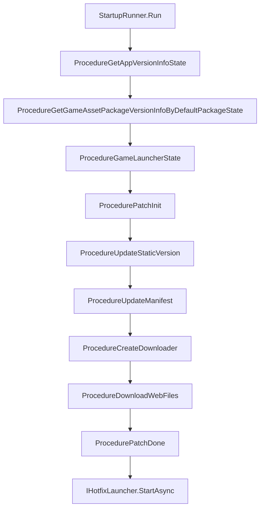

# 시작 프로세스 개요

`com.gameframex.unity.startup`는 "게임이 실행되어 플레이 가능해지기까지"의 과정을 구성 가능하고 플러그형으로 교체할 수 있는 시작 파이프라인으로 나눕니다: 먼저 기본/백업 URL로 전역 정보를 가져오기 → App 및 리소스 버전 검증 → YooAsset 패치 프로세스(초기화 → 정적 버전 → 매니페스트 → 다운로드 → 완료) → 핫픽스 진입점 시작. 개발자는 `IStartupUIHandler`(안내 UI)와 `IHotfixLauncher`(핫픽스 진입점)만 구현하면 기본 구현을 교체할 수 있습니다.

## 빠른 시작

1. `Packages/manifest.json`에 의존성을 추가합니다:

    ```json
    {
      "dependencies": {
        "com.gameframex.unity.startup": "1.1.0"
      },
      "scopedRegistries": [
        {
          "name": "GameFrameX",
          "url": "https://gameframex.upm.alianblank.uk",
          "scopes": ["com.gameframex"]
        }
      ]
    }
    ```

    `scopes`는 어떤 패키지가 이 레지스트리를 통해 해석되는지 제어하며, `com.gameframex`로 시작하는 패키지만 여기서 가져옵니다.

2. Unity Editor에서 `Create > GameFrameX > Startup Options`를 통해 구성 에셋을 생성하고, 기본/백업 URL, PlayMode, 핫픽스 진입점, HTTP 공용 파라미터 등을 입력합니다.

3. `IStartupUIHandler`(FairyGUI / UGUI / 커스텀 UI 모두 가능)와 `IHotfixLauncher`(HybridCLR 또는 기타 핫픽스 솔루션)를 구현합니다.

4. 씬에서 한 줄의 진입 코드를 호출합니다:

    ```csharp
    var result = await StartupRunner.Run(_options, uiHandler, hotfixLauncher);
    if (result.Success) { /* 시작 완료, 게임 준비됨 */ }
    ```

    Source: [README.zh-CN.md](https://github.com/GameFrameX/com.gameframex.unity.startup/blob/main/README.zh-CN.md#L1-L100)

## 작동 원리 개요

시작 파이프라인은 유한 상태 머신(FSM) 형태로 `Procedure` 노드를 구성하며, 각 노드는 자신의 역할을 완료한 후 `ChangeState<T>`를 통해 다음 노드로 전환됩니다.



노드 설명:

| 프로세스 노드 | 역할 |
|----------|------|
| `ProcedureGetAppVersionInfoState` | 전역 정보 가져오기(URL 기본/백업 failover) |
| `ProcedureGetGameAssetPackageVersionInfoByDefaultPackageState` | App 및 리소스 패키지 버전 가져오기 |
| `ProcedureGameLauncherState` | YooAsset 리소스 모드로 전환 |
| `ProcedurePatchInit` | PlayMode에 따라 YooAsset 리소스 패키지 초기화 |
| `ProcedureUpdateStaticVersion` | 리소스 패키지 정적 버전 번호 요청 |
| `ProcedureUpdateManifest` | 리소스 매니페스트 업데이트 |
| `ProcedureCreateDownloader` | 다운로더 생성 |
| `ProcedureDownloadWebFiles` | 패치 파일 다운로드 및 진행률 갱신 |
| `ProcedurePatchDone` | 패치 프로세스 완료 |
| `IHotfixLauncher.StartAsync` | 핫픽스 어셈블리 로드 및 진입점 실행 |

두 개의 완료 알림 경로가 동시에 트리거됩니다: `UniTask<StartupResult>`의 await 결과, 그리고 `StartupCompletedEventArgs` / `StartupFailedEventArgs` 이벤트이며, 개발자는 둘 중 하나를 선택하여 수신하면 됩니다.

## 주요 구성 항목 빠른 참조

`StartupOptions` ScriptableObject의 주요 필드:

| 필드 | 용도 |
|------|------|
| `GlobalInfoUrls` | 전역 정보 인터페이스의 기본/백업 URL 목록, `MaxAttemptsPerUrl` 재시도 전략과 함께 사용 |
| `GamePlayMode` | 리소스 실행 모드, 시작 프로세스가 로드 전에 Asset 컴포넌트로 동기화 |
| `HotfixAssemblyName` / `HotfixEntryTypeName` / `HotfixEntryMethodName` | 핫픽스 진입점(어셈블리 / 타입 / 메서드) |
| `PackageName` / `Channel` / `SubChannel` | HTTP 공용 파라미터(순수 데이터, SDK 의존성 없음) |
| `LauncherUIResName` | 시작 UI 리소스 경로, 기본값 `UI/UILauncher` |
| `SkipRemoteStartupRequests` | 모든 원격 시작 요청 건너뛰기, WebGL 단독 실행 또는 백엔드 없는 배포 시 활성화 |

PlayMode 자동 분기: `EditorSimulateMode` / `OfflinePlayMode` / `HostPlayMode` / `WebPlayMode`이며, `ProcedurePatchInit`은 현재 모드에 따라 빈 URL 또는 실제 URL을 선택하여 YooAsset을 초기화합니다:

Source: [ProcedurePatchInit.cs](https://github.com/GameFrameX/com.gameframex.unity.startup/blob/main/Runtime/Procedures/Patch/ProcedurePatchInit.cs#L33-L48)

## 다음 단계

- 시작 UI 구현: 《IStartupUIHandler 구현 방법》 참조
- HybridCLR 연동: 《IHotfixLauncher 구현 방법》 참조
- 기본/백업 URL 재시도 전략: 《URL Failover 참조》 참조
- 단독 실행/백엔드 없는 배포: `SkipRemoteStartupRequests` 활성화