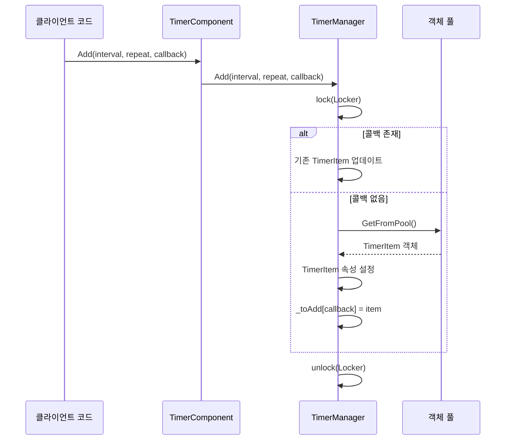
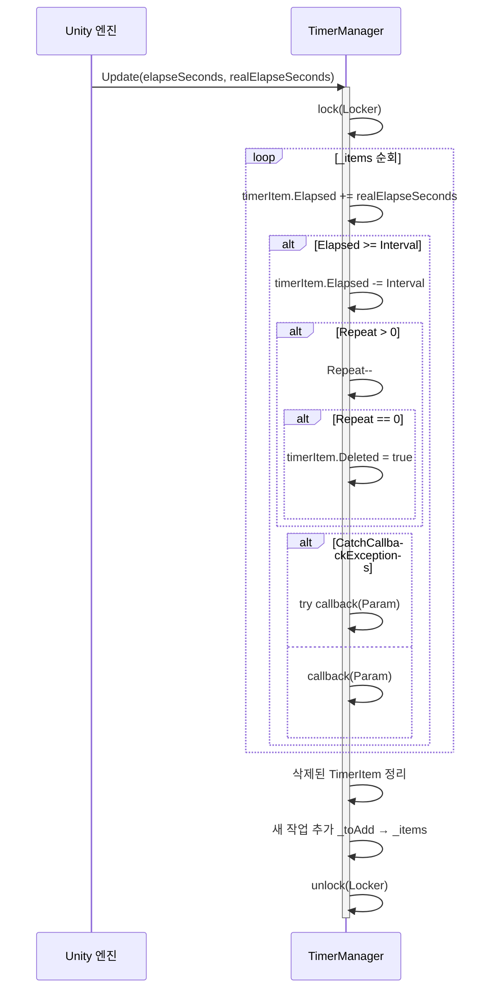

# Timer 컴포넌트 소개

Timer 컴포넌트는 GameFrameX 프레임워크가 Unity 게임 개발을 위해 제공하는 타이머 관리 모듈입니다. 이 컴포넌트는 게임에서定时 작업 추가, 관리 및 실행 기능을 제공하며, 일회성 실행, 반복 실행 및 프레임 업데이트 등 다양한定时 모드를 지원합니다.

## 개요

Timer 컴포넌트는 GameFrameX 아키텍처에서 시간 조절에 전문화된 기본 컴포넌트입니다. 게임 개발 과정에서 개발자는 종종 시간 관련 다양한 로직을 처리해야 합니다:

- 지연 실행 특정 작업
- 주기적 게임 이벤트 발생
- 카운트다운 기능
- 매 프레임 특정 로직 실행

Timer 컴포넌트는 간결한 API 설계로 개발자가 이러한 요구 사항을 쉽게 구현할 수 있도록 하며, 스레드 안전성과 성능 최적화를 제공합니다.

## 컴포넌트 아키텍처

Timer 컴포넌트는 고전적인 3층 아키텍처 설계로, 컴포넌트 계층, 인터페이스 계층 및 구현 계층을 포함합니다:

```mermaid
flowchart TD
    subgraph Unity["Unity 컴포넌트 계층"]
        TC[TimerComponent]
    end

    subgraph Interface["인터페이스 계층"]
        ITM[ITimerManager]
    end

    subgraph Implementation["구현 계층"]
        TM[TimerManager]
        Pool[객체 풀 _pool]
    end

    subgraph Data["데이터 계층"]
        Items["_items 딕셔너리"]
        ToAdd["_toAdd 딕셔너리"]
        ToRemove["_toRemove 리스트"]
    end

    TC -->|"메서드 호출"| ITM
    ITM <|..|"구현"| TM
    TM -->|"객체 재사용"| Pool
    TM -->|"관리"| Items
    TM -->|"관리"| ToAdd
    TM -->|"관리"| ToRemove
```

### 아키텍처 설명

| 계층 | 클래스명 | 역할 |
|------|------|------|
| 컴포넌트 계층 | TimerComponent | Unity 컴포넌트로 Scene에 노출하며, 사용자 중심 API 제공 |
| 인터페이스 계층 | ITimerManager | 타이머 관리자의 추상 인터페이스 정의 |
| 구현 계층 | TimerManager | 구체적인 타이머 로직 구현 |

## 핵심 설계

### 인터페이스-구현 분리 패턴

Timer 컴포넌트는 인터페이스-구현 분리를 사용하여 단위 테스트와 확장이 용이합니다:

```csharp
> Source: [ITimerManager.cs](https://github.com/GameFrameX/com.gameframex.unity.timer/blob/main/Runtime/Timer/ITimerManager.cs#L1-L54)

public interface ITimerManager
{
    void Add(float interval, int repeat, Action<object> callback, object callbackParam = null);
    void AddOnce(float interval, Action<object> callback, object callbackParam = null);
    void AddUpdate(Action<object> callback);
    void AddUpdate(Action<object> callback, object callbackParam);
    bool Exists(Action<object> callback);
    void Remove(Action<object> callback);
}
```

이러한 설계를 통해 다양한 모듈에서 구체적 구현에 의존하지 않고 인터페이스를 통해 타이머 기능을 참조할 수 있습니다.

### 객체 풀 패턴

TimerManager 내부에서 객체 풀을 사용하여 TimerItem 객체를 재사용하고 가비지 컬렉션 부담을 줄입니다:

```csharp
> Source: [TimerManager.cs](https://github.com/GameFrameX/com.gameframex.unity.timer/blob/main/Runtime/Timer/TimerManager.cs#L266-L289)

private TimerItem GetFromPool()
{
    TimerItem t;
    int cnt = _pool.Count;
    if (cnt > 0)
    {
        t = _pool[cnt - 1];
        _pool.RemoveAt(cnt - 1);
        t.Deleted = false;
        t.Elapsed = 0;
    }
    else
    {
        t = new TimerItem();
    }
    return t;
}
```

### 스레드 안전 설계

TimerManager는 `lock` 잠금 메커니즘을 사용하여 멀티스레드 환경에서 데이터 보안을 보장합니다:

```csharp
> Source: [TimerManager.cs](https://github.com/GameFrameX/com.gameframex.unity.timer/blob/main/Runtime/Timer/TimerManager.cs#L38-L38)

private static readonly object Locker = new object();
```

`_items`, `_toAdd`, `_toRemove` 등 공유 데이터에 대한 모든 조작은 잠금 보호 하에 이루어집니다.

### 예외 처리 전략

정적 속성 `CatchCallbackExceptions`을 통해 콜백 예외 포획 여부를 제어할 수 있습니다:

```csharp
> Source: [TimerManager.cs](https://github.com/GameFrameX/com.gameframex.unity.timer/blob/main/Runtime/Timer/TimerManager.cs#L40-L43)

/// <summary>
/// 콜백 예외 발생 여부
/// </summary>
public static bool CatchCallbackExceptions = false;
```

`true`로 설정하면 콜백의 예외가 포획되어 경고 로그에 기록되며, 타이머의 메인 루프가 중단되지 않습니다.

## 핵심 프로세스

### 작업 추가 프로세스



### 작업 실행 프로세스



## 핵심 기능

Timer 컴포넌트는 다음과 같은 핵심 기능을 제공합니다:

| 메서드 | 기능 설명 |
|------|----------|
| Add | 반복 실행 타이머 작업 추가 |
| AddOnce | 한 번만 실행되는 작업 추가 |
| AddUpdate | 매 프레임 업데이트 실행 작업 추가 |
| Exists | 지정 작업 존재 여부 확인 |
| Remove | 지정 작업 제거 |

### 타이머 추가 (Add)

지정 간격 시간과 반복 횟수를 지원하는 반복 실행 타이머 작업을 추가합니다:

```csharp
> Source: [README.md](https://github.com/GameFrameX/com.gameframex.unity.timer/blob/main/README.md#L30-L32)

Add(1000, 5, MyMethod);
```

매개변수 설명:
- `interval`: 간격 시간 (밀리초 단위)
- `repeat`: 반복 횟수, 0은 무한 반복을 의미
- `callback`: 콜백 함수
- `callbackParam`: 콜백 매개변수 (선택)

### 일회성 작업 추가 (AddOnce)

지연 실행 한 번 작업을 추가합니다:

```csharp
> Source: [README.md](https://github.com/GameFrameX/com.gameframex.unity.timer/blob/main/README.md#L46-L48)

AddOnce(5000, MyMethod);
```

### 프레임 업데이트 작업 추가 (AddUpdate)

연속 모니터링 또는 업데이트가 필요한 시나리오에 적합한 매 프레임 실행 작업을 추가합니다:

```csharp
> Source: [README.md](https://github.com/GameFrameX/com.gameframex.unity.timer/blob/main/README.md#L60-L63)

AddUpdate(MyMethod);
```

### 작업 확인 및 제거

작업 존재 여부를 확인하고 필요에 따라 제거합니다:

```csharp
> Source: [README.md](https://github.com/GameFrameX/com.gameframex.unity.timer/blob/main/README.md#L78-L95)

bool exists = GetComponent<TimerComponent>().Exists(MyMethod);
GetComponent<TimerComponent>().Remove(MyMethod);
```

## 사용 예시

완전한 사용 예시:

```csharp
// 이것은 트리거할 메서드입니다
void MyMethod(object param)
{
    Debug.Log("메서드가 트리거됨");
}

// 타이머 작업 생성, 1초마다 MyMethod 실행, 총 5회
GetComponent<TimerComponent>().Add(1000, 5, MyMethod);

// 타이머 작업 생성, 5초 후 MyMethod 한 번 실행
GetComponent<TimerComponent>().AddOnce(5000, MyMethod);

// 특정 작업 존재 여부 확인
bool exists = GetComponent<TimerComponent>().Exists(MyMethod);

// 특정 작업 제거
GetComponent<TimerComponent>().Remove(MyMethod);
```

> Source: [README.md](https://github.com/GameFrameX/com.gameframex.unity.timer/blob/main/README.md#L101-L119)

## 구성 옵션

Timer 컴포넌트는 다음과 같은 구성 항목을 제공합니다:

| 옵션 | 타입 | 기본값 | 설명 |
|------|------|--------|------|
| CatchCallbackExceptions | static bool | false | 콜백 예외 포획 여부, 타이머 메인 루프 중단 방지 |

### 구성 예시

```csharp
// 예외 포획 활성화, 콜백 예외로 인한 타이머 중단 방지
TimerManager.CatchCallbackExceptions = true;
```

## 주의 사항

1. **초기화 요구**: 타이머 사용 전 TimerManager가 올바르게 초기화되어 GameFrameworkEntry 모듈에 등록되었는지 확인하세요.

2. **성능 고려**: 너무 작은 간격 시간(예: 프레임 시간 미만) 사용을 피하세요. 성능 문제가 발생할 수 있습니다. 최소 간격은 100밀리초 이상을 권장합니다.

3. **콜백 시그니처**: 모든 콜백 함수는 `Action<object>` 시그니처를 따라야 합니다. 즉, object 타입 매개변수 하나를 수용하고 void를 반환해야 합니다.

4. **스레드 안전성**: TimerManager 내부에 스레드 안전 메커니즘이 구현되어 있지만, 멀티스레드 환경에서는 콜백 함수의 스레드 안전성을 주의해야 합니다.

## 관련 링크

- [기능 특성](./1-overview.features) - Timer 컴포넌트의 기능 세부사항 자세히 알아보기
- [설치 가이드](./2-installation) - Timer 컴포넌트 설치 및 구성 방법
- [빠른 시작](./3-getting-started) - Timer 컴포넌트 빠르게 시작하기
- [타이머 추가](./4-core-functions.add-timer) - 타이머 작업 상세 사용법
- [일회성 작업 추가](./4-core-functions.add-once) - 일회성 작업 상세 사용법
- [프레임 업데이트 작업 추가](./4-core-functions.add-update) - 프레임 업데이트 작업 상세 사용법
- [작업 확인 및 제거](./4-core-functions.exists-remove) - 작업 관리 상세 사용법
- [API 참고](./5-api-reference.timer-component) - TimerComponent 전체 API