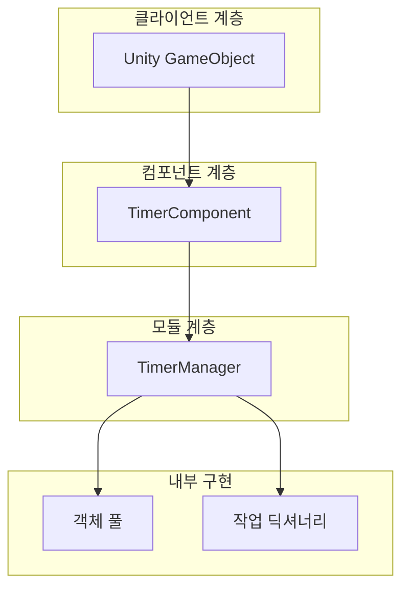

# 빠른 시작

Timer 컴포넌트는 GameFrameX 프레임워크가 제공하는 타이머 기능 모듈로, Unity 프로젝트에서定时 작업 관리 및 실행을 지원합니다. 주기적 이벤트, 일회성 지연 실행 또는 매 프레임 업데이트든, Timer 컴포넌트가 간단하고 효율적인 솔루션을 제공합니다.

## 개요

Timer 컴포넌트는 다음과 같은 핵심 기능을 제공합니다:

- **타이머 작업**: 지정 시간 간격으로 반복 실행되는 작업
- **일회성 작업**: 지정 시간 지연 후 한 번 실행되는 작업
- **프레임 업데이트 작업**: 매 프레임 실행되는 작업으로,高频 업데이트 시나리오에 적합
- **작업 관리**: 작업 존재 여부 확인, 지정 작업 제거

이 컴포넌트는 GameFrameX 프레임워크 아키텍처를 기반으로 설계되어 프레임워크의 모듈 시스템에 자동으로 통합되며, 스레드 안전 작업과 객체 풀 최적화를 지원합니다.

## 아키텍처

Timer 컴포넌트는 계층화 아키텍처 설계를 채택하며, 핵심 컴포넌트는 다음과 같습니다:



**아키텍처 설명:**

- **TimerComponent**: Unity 컴포넌트 계층으로, 개발자에게 직접 사용할 수 있는 인터페이스를 제공, `GameFrameworkComponent` 상속
- **TimerManager**: 핵심 모듈 계층으로, `GameFrameworkModule` 상속 및 `ITimerManager` 인터페이스 구현, 타이머 작업 스케줄링 및 실행 담당
- **객체 풀**: 객체 풀 패턴을 사용하여 TimerItem 관리, 메모리 할당 및 GC 부담 감소
- **작업 딕셔너리**: 스레드 안전 딕셔너리를 사용하여 작업 저장, 동적 추가 및 제거 지원

## 기본 사용

### 첫 번째 단계: 컴포넌트 추가

Unity 편집기에서 타이머를 사용할 GameObject를 선택하고, **Add Component** 클릭, **Timer** 검색하여 추가:

> Source: [TimerComponent.cs](https://github.com/GameFrameX/com.gameframex.unity.timer/blob/main/Runtime/Timer/TimerComponent.cs#L11-L13)

```csharp
[DisallowMultipleComponent]
[AddComponentMenu("Game Framework/Timer")]
public class TimerComponent : GameFrameworkComponent
```

### 두 번째 단계: 컴포넌트 인스턴스 가져오기

스크립트에서 TimerComponent 인스턴스 가져오기:

```csharp
// TimerComponent 컴포넌트 가져오기
var timerComponent = gameObject.GetComponent<TimerComponent>();
```

### 세 번째 단계: 타이머 기능 사용

#### 타이머 작업 추가

지정 시간마다 작업 실행, 반복 횟수 설정 가능:

```csharp
// 1초마다 실행, 총 5회
timerComponent.Add(1f, 5, (param) => {
    Debug.Log("타이머 작업 실행");
});

// 2초마다 실행, 무한 반복 (repeat = 0)
timerComponent.Add(2f, 0, (param) => {
    Debug.Log("무한 반복 작업");
});
```

> Source: [TimerComponent.cs](https://github.com/GameFrameX/com.gameframex.unity.timer/blob/main/Runtime/Timer/TimerComponent.cs#L37-L40)

#### 일회성 작업 추가

지정 시간 지연 후 한 번 실행:

```csharp
// 5초 후 한 번 실행
timerComponent.AddOnce(5f, (param) => {
    Debug.Log("일회성 작업 실행");
});
```

> Source: [TimerComponent.cs](https://github.com/GameFrameX/com.gameframex.unity.timer/blob/main/Runtime/Timer/TimerComponent.cs#L48-L51)

#### 프레임 업데이트 작업 추가

매 프레임 실행되는 작업으로,高频 업데이트 시나리오에 적합:

```csharp
// 매 프레임 실행
timerComponent.AddUpdate((param) => {
    // 매 프레임 실행 로직
});

// 매개변수 있는 버전
timerComponent.AddUpdate((param) => {
    int frameCount = (int)param;
    Debug.Log($"현재 프레임: {frameCount}");
}, 0);
```

> Source: [TimerComponent.cs](https://github.com/GameFrameX/com.gameframex.unity.timer/blob/main/Runtime/Timer/TimerComponent.cs#L57-L70)

#### 작업 존재 여부 확인

```csharp
// 지정 콜백의 작업 존재 여부 확인
bool exists = timerComponent.Exists((param) => {
    Debug.Log("작업");
});

Debug.Log($"작업 존재 여부: {exists}");
```

> Source: [TimerComponent.cs](https://github.com/GameFrameX/com.gameframex.unity.timer/blob/main/Runtime/Timer/TimerComponent.cs#L77-L80)

#### 작업 제거

```csharp
// 지정 작업 제거
timerComponent.Remove((param) => {
    Debug.Log("제거할 작업");
});
```

> Source: [TimerComponent.cs](https://github.com/GameFrameX/com.gameframex.unity.timer/blob/main/Runtime/Timer/TimerComponent.cs#L86-L89)

## 완전한 예시

TimerComponent 사용 방법을 보여주는 완전한 스크립트 예시:

```csharp
using UnityEngine;
using GameFrameX.Timer.Runtime;

public class TimerExample : MonoBehaviour
{
    private TimerComponent _timerComponent;
    private int _executeCount = 0;

    void Start()
    {
        // TimerComponent 가져오기
        _timerComponent = gameObject.AddComponent<TimerComponent>();

        // 예시 1: 1초마다 실행, 총 10회
        _timerComponent.Add(1f, 10, OnTimerTick);

        // 예시 2: 5초 후 한 번 실행
        _timerComponent.AddOnce(5f, OnDelayComplete);

        // 예시 3: 매 프레임 실행
        _timerComponent.AddUpdate(OnFrameUpdate);
    }

    void OnTimerTick(object param)
    {
        _executeCount++;
        Debug.Log($"타이머 작업 실행 횟수: {_executeCount}");
    }

    void OnDelayComplete(object param)
    {
        Debug.Log("지연 작업 실행 완료");
        
        // 프레임 업데이트 작업 제거
        _timerComponent.Remove(OnFrameUpdate);
    }

    void OnFrameUpdate(object param)
    {
        // 매 프레임 실행 로직
    }

    void OnDestroy()
    {
        // 모든 작업 정리
        if (_timerComponent != null)
        {
            _timerComponent.Remove(OnTimerTick);
            _timerComponent.Remove(OnDelayComplete);
            _timerComponent.Remove(OnFrameUpdate);
        }
    }
}
```

> Source: [TimerComponent.cs](https://github.com/GameFrameX/com.gameframex.unity.timer/blob/main/Runtime/Timer/TimerComponent.cs#L1-L91)

## 중요 설명

### 시간 단위

Timer 컴포넌트의 시간 매개변수는**초 단위**이며, 밀리초가 아닙니다:

- `interval = 1f`는 1초 간격을 의미
- `interval = 0.5f`는 0.5초 간격을 의미
- `interval = 0.001f`는 1밀리초 간격을 의미 (프레임 업데이트용)

### 스레드 안전성

TimerManager 내부에 `lock` 메커니즘을 사용하여 스레드 안전성을 보장하고, 멀티스레드 환경에서 안전하게 사용할 수 있습니다.

### 콜백 예외 처리

`TimerManager.CatchCallbackExceptions`를 설정하여 콜백의 예외 포획 여부를 제어할 수 있습니다:

```csharp
// 콜백 예외 포획, 예외로 인한 타이머 종료 방지
TimerManager.CatchCallbackExceptions = true;
```

> Source: [TimerManager.cs](https://github.com/GameFrameX/com.gameframex.unity.timer/blob/main/Runtime/Timer/TimerManager.cs#L43)

## 관련 링크

- [기능 특성](./1-overview.features) - Timer 컴포넌트 기능 특성 자세히 알아보기
- [설치 가이드](./2-installation) - 완전한 설치 단계 보기
- [타이머 추가](./4-core-functions.add-timer) - 타이머 작업 상세 사용법
- [일회성 작업 추가](./4-core-functions.add-once) - 일회성 작업 상세 사용법
- [프레임 업데이트 작업 추가](./4-core-functions.add-update) - 프레임 업데이트 작업 상세 사용법
- [작업 확인 및 제거](./4-core-functions.exists-remove) - 작업 관리 상세 사용법
- [API 참고 - TimerComponent](./5-api-reference.timer-component) - TimerComponent 전체 API
- [API 참고 - ITimerManager](./5-api-reference.itimer-manager) - ITimerManager 인터페이스 정의
- [API 참고 - TimerManager](./5-api-reference.timer-manager) - TimerManager 구현 세부사항
- [사용 예시](./6-samples) - 더 많은 사용 예시
- [자주 묻는 질문](./7-troubleshooting) - 자주 묻는 질문 답변