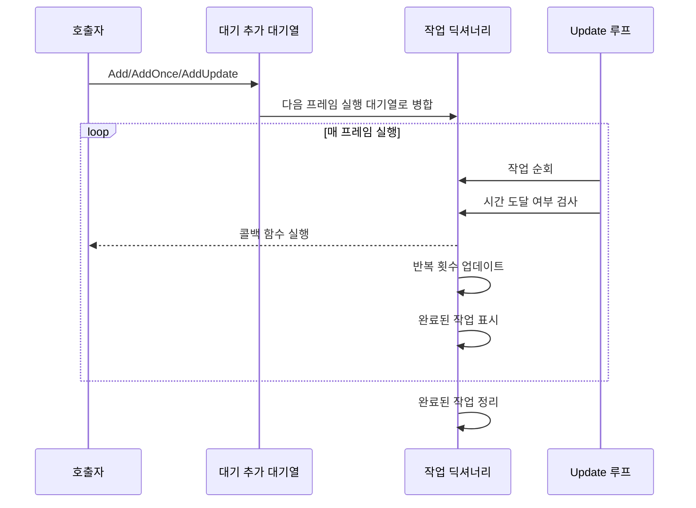

# 기능 특성

Timer 컴포넌트는 GameFrameX 프레임워크의 타이머 모듈로, 완전한 시간 스케줄링 솔루션을 제공하여 타이머 반복 작업, 일회성 지연 작업 및 프레임 업데이트 작업의 관리를 지원합니다.

## 개요

Timer 컴포넌트는 Unity 게임 개발을 위해 설계되었으며,高精度, 제어 가능한 타이머 작업 스케줄링 능력을 제공합니다. 이 컴포넌트는 계층화 아키텍처 설계를 채택하며, 상위는 TimerComponent 컴포넌트를 통해 Unity Scene에 사용되고, 하위는 TimerManager가 핵심 로직을 구현하며, ITimerManager 인터페이스가 표준화된 타이머 서비스를 정의합니다.

## 핵심 기능

### 1. 타이머 반복 작업

타이머 반복 작업(Add 메서드)은 개발자가 간격 시간과 반복 횟수를 설정할 수 있게 하며, 작업이 지정 간격으로 반복 실행됩니다.

**기능 특성:**
- 반복 횟수 지정 지원 (0은 무한 반복)
- 정확한 시간 간격 제어 (초 단위)
- 작업 실행 시 사용자 정의 매개변수 전달

**전형적 응용 시나리오:**
- 주기적 HP 회복
- 타이머 갱신 게임 도구
- 주기적 게임 데이터 저장

### 2. 일회성 지연 작업

일회성 작업(AddOnce 메서드)은 지정 지연 시간 후 실행되며, 지연 실행이 필요한 시나리오에 적합합니다.

**기능 특성:**
- 지연 시간 정밀 제어 가능
- 실행 완료 후 자동 제거, 수동 관리 불필요
- Add(interval, 1, callback)과 동등

**전형적 응용 시나리오:**
- 몇 초 후 대화상자 표시
- 카운트다운 종료 후 게임 종료
- 스킬 쿨다운 완료 알림

### 3. 프레임 업데이트 작업

프레임 업데이트 작업(AddUpdate 메서드)은 매 프레임 실행되며,高频 업데이트 시나리오에 적합합니다.

**기능 특성:**
- 최소 간격 약 0.001초 (1밀리초)
- 무한 반복 실행
- 실시간 모니터링 또는 지속적 검사 주로 사용

**전형적 응용 시나리오:**
- 실시간 진행률 표시줄 업데이트
- 애니메이션 상태 머신 업데이트
- 조건 충족 여부 지속적 검사

### 4. 작업 존재성 검사

Exists 메서드는 지정 콜백 함수가 작업 대기열에 존재하는지 검사하는 데 사용됩니다.

**기능 특성:**
- 대기 추가 대기열과 실행 대기열 동시 검사
- 부울 값 반환으로 존재 여부 표시

**전형적 응용 시나리오:**
- 중복 추가 동일 작업 방지
- 추가 전 작업 상태 검증

### 5. 작업 제거

Remove 메서드는 지정 작업을 제거하여 실행을 중지하는 데 사용됩니다.

**기능 특성:**
- 대기 중인 작업 제거 지원
- 실행 중인 작업 제거 지원 (삭제 표시)
- 객체 풀에 리소스 자동 회수

**전형적 응용 시나리오:**
- 플레이어 사망 시 전투 관련 모든 타이머 작업 중지
- 인터페이스 닫을 때 관련 타이머 갱신 정리
- 카운트다운 취소

## 아키텍처 설계

```mermaid
graph TD
    subgraph Unity 계층
        TC[TimerComponent<br/>Unity 컴포넌트]
    end

    subgraph 인터페이스 계층
        ITM[ITimerManager<br/>타이머 인터페이스]
    end

    subgraph 구현 계층
        TM[TimerManager<br/>타이머 관리자]
        GFM[GameFrameworkModule<br/>프레임워크 모듈 기본 클래스]
    end

    subgraph 내부 구현
        Pool[객체 풀]
        Dict[작업 딕셔너리]
    end

    TC --> ITM
    ITM <|.. TM
    TM --> GFM
    TM --> Pool
    TM --> Dict
```

**컴포넌트 설명:**

| 컴포넌트 | 역할 | 계층 |
|------|------|------|
| TimerComponent | Unity 컴포넌트 캡슐화, Scene에서 타이머 기능 제공 | Unity 계층 |
| ITimerManager | 타이머의 표준 인터페이스 정의, 모든 핵심 메서드 포함 | 인터페이스 계층 |
| TimerManager | 타이머 핵심 로직 구현, 작업 스케줄링 및 실행 포함 | 구현 계층 |
| 객체 풀 | TimerItem 객체 재사용, 메모리 할당 감소 | 내부 구현 |

## 작업 실행 프로세스



## 기술 특성

### 스레드 안전성

TimerManager 내부에 `lock` 키워드를 사용하여 모든 작업을 보호하며, 멀티스레드 환경에서 안전하게 실행됩니다.

### 성능 최적화

- **객체 풀 패턴**: `_pool` 리스트를 사용하여 TimerItem 객체를 재사용하고 빈번한 GC 회피
- **지연 추가**: 새 작업은 `_toAdd` 대기열에 추가되며, 다음 프레임 Update 시 주 대기열과 병합
- **증분 시간 처리**: 시간 드리프트 처리, 작업 완료 후 타이머 재설정

### 예외 처리

`TimerManager.CatchCallbackExceptions` 정적 속성을 통해 콜백 예외 포획 여부를 제어합니다:
- `false`(기본값): 예외가 직접 발생하고 게임 루프 중단 가능
- `true`: 예외를 포획하여 경고 로그 출력, 작업 삭제 표시

## 사용 방식

### 컴포넌트를 통한 사용

Unity Scene에서 TimerComponent를 게임 객체에 추가하여 사용:

```csharp
// 타이머 작업 추가, 1초마다 실행, 총 10회
GetComponent<TimerComponent>().Add(1f, 10, OnTimerTick);

// 일회성 작업 추가, 5초 후 실행
GetComponent<TimerComponent>().AddOnce(5f, OnDelayedExecute);

// 프레임 업데이트 작업 추가
GetComponent<TimerComponent>().AddUpdate(OnFrameUpdate);

// 작업 존재 여부 확인
bool exists = GetComponent<TimerComponent>().Exists(OnTimerTick);

// 작업 제거
GetComponent<TimerComponent>().Remove(OnTimerTick);
```

> Source: [TimerComponent.cs](https://github.com/GameFrameX/com.gameframex.unity.timer/blob/main/Runtime/Timer/TimerComponent.cs#L30-L89)

### 모듈을 통한 사용

프레임워크 내부에서 GameFrameworkEntry를 통해 ITimerManager 모듈을 가져올 수 있습니다:

```csharp
var timerManager = GameFrameworkEntry.GetModule<ITimerManager>();
timerManager.Add(1f, 5, OnTick);
```

> Source: [TimerManager.cs](https://github.com/GameFrameX/com.gameframex.unity.timer/blob/main/Runtime/Timer/TimerManager.cs#L156-L188)

## 콜백 함수 정의

모든 타이머 작업은 통합된 콜백 함수 시그니처를 사용합니다:

```csharp
void CallbackName(object param)
{
    // param은 전달된 매개변수이며, 임의의 객체 가능
    // 매개변수가 필요하지 않으면 null 전달 가능
}
```

> Source: [ITimerManager.cs](https://github.com/GameFrameX/com.gameframex.unity.timer/blob/main/Runtime/Timer/ITimerManager.cs#L18)

## 매개변수 설명

| 메서드 | 매개변수 | 타입 | 설명 |
|------|------|------|------|
| Add | interval | float | 간격 시간 (초) |
| Add | repeat | int | 반복 횟수 (0=무한) |
| Add | callback | Action\<object\> | 콜백 함수 |
| Add | callbackParam | object | 콜백 매개변수 |
| AddOnce | interval | float | 지연 시간 (초) |
| AddOnce | callback | Action\<object\> | 콜백 함수 |
| AddOnce | callbackParam | object | 콜백 매개변수 |
| AddUpdate | callback | Action\<object\> | 콜백 함수 |
| AddUpdate | callbackParam | object | 콜백 매개변수 |
| Exists | callback | Action\<object\> | 검사할 콜백 |
| Remove | callback | Action\<object\> | 제거할 콜백 |

## 관련 링크

- [Timer 컴포넌트 소개](./1-overview.introduction)
- [설치 가이드](./2-installation)
- [빠른 시작](./3-getting-started)
- [핵심 기능 - 타이머 추가](./4-core-functions.add-timer)
- [핵심 기능 - 1회성 작업 추가](./4-core-functions.add-once)
- [핵심 기능 - 프레임 업데이트 작업 추가](./4-core-functions.add-update)
- [핵심 기능 - 작업 확인 및 제거](./4-core-functions.exists-remove)
- [API 참고 - TimerComponent](./5-api-reference.timer-component)
- [API 참고 - ITimerManager](./5-api-reference.itimer-manager)
- [API 참고 - TimerManager](./5-api-reference.timer-manager)