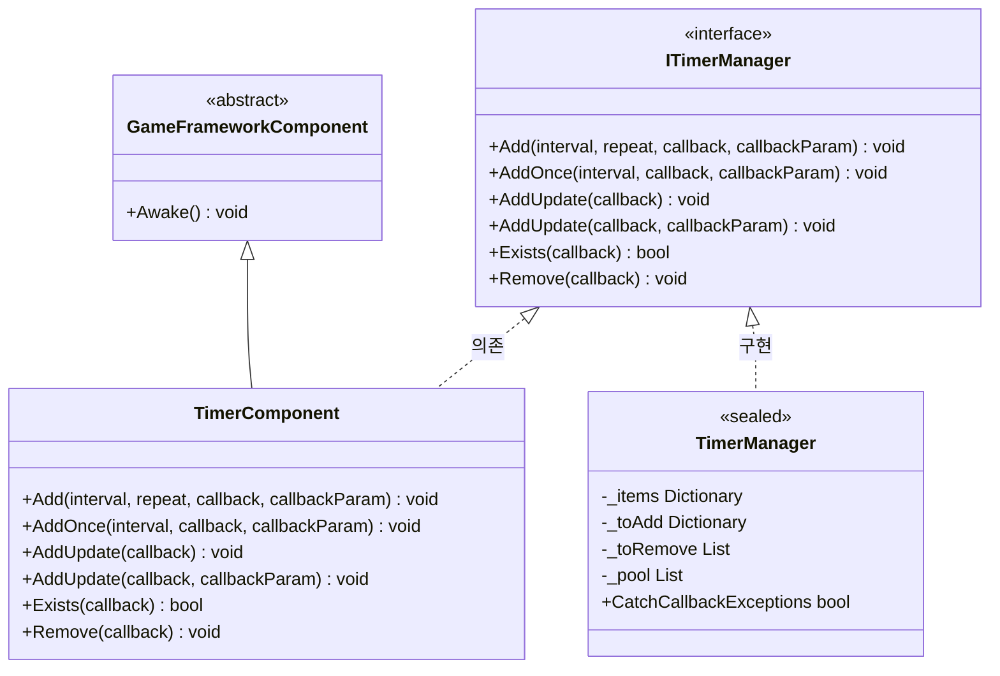
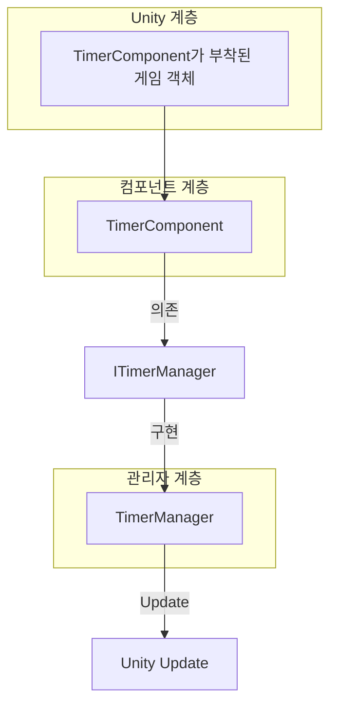
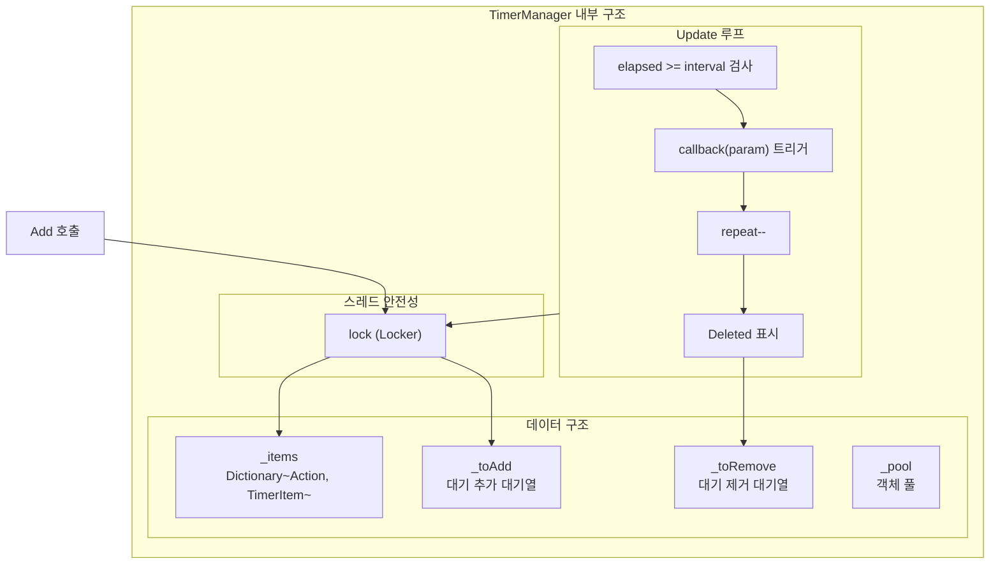

# TimerComponent

TimerComponent는 Timer 모듈의 Unity 컴포넌트 캡슐화이며, 타이머 작업 관리 기능을 제공합니다. GameFrameX 프레임워크의 핵심 컴포넌트 중 하나로, 개발자가 다양한定时 실행 작업(반복 실행, 일회성 실행, 매 프레임 업데이트 실행 작업)을 추가할 수 있게 합니다.

## 개요

TimerComponent는 GameFrameworkComponent를 상속하며, Unity 컴포넌트([DisallowMultipleComponent])로, Unity 게임 객체에 부착하여 사용해야 합니다. 이 컴포넌트는 내부적으로 ITimerManager(TimerManager 구현)에 타이머 작업 로직 처리를 위임하며, 자신은 간결한 Unity API 인터페이스만 제공합니다.

**상속 계층:**



## 아키텍처 설명

TimerComponent는 아키텍처에서 **API 계층**에 위치하며, Unity 개발자에게便捷한 호출 인터페이스를 제공합니다:



**작업 프로세스:**
1. 개발자가 Unity 편집기에서 TimerComponent를 게임 객체에 부착
2. TimerComponent의 공개 메서드를 호출하여 타이머 작업 추가
3. TimerComponent가 요청을 TimerManager에 전달
4. TimerManager가 Update 루프에서 타이머 콜백을 감지하고 트리거

## API 참고

### `Add(interval, repeat, callback, callbackParam)`

반복 실행 타이머 작업을 추가합니다.

```csharp
public void Add(float interval, int repeat, Action<object> callback, object callbackParam = null)
```
> Source: [TimerComponent.cs](https://github.com/GameFrameX/com.gameframex.unity.timer/blob/main/Runtime/Timer/TimerComponent.cs#L37-L40)

**매개변수:**
| 매개변수명 | 타입 | 필수 | 설명 |
|--------|------|------|------|
| interval | float | 예 | 간격 시간 (초 단위) |
| repeat | int | 예 | 반복 횟수, 0은 무한 반복 |
| callback | Action\<object\> | 예 | 타이머 트리거 시 실행할 콜백 함수 |
| callbackParam | object | 아니오 | 콜백 함수에 전달할 매개변수 |

**반환값:** 없음

**사용 예시:**

```csharp
// 1초마다 실행, 총 10회
timerComponent.Add(1f, 10, OnTimerTick, "tick data");

// 무한 반복 실행 (매초)
timerComponent.Add(1f, 0, OnTimerTick);
```

---

### `AddOnce(interval, callback, callbackParam)`

일회성 타이머 작업을 추가합니다.

```csharp
public void AddOnce(float interval, Action<object> callback, object callbackParam = null)
```
> Source: [TimerComponent.cs](https://github.com/GameFrameX/com.gameframex.unity.timer/blob/main/Runtime/Timer/TimerComponent.cs#L48-L51)

**매개변수:**
| 매개변수명 | 타입 | 필수 | 설명 |
|--------|------|------|------|
| interval | float | 예 | 지연 시간 (초 단위), 지연 후 한 번 실행 |
| callback | Action\<object\> | 예 | 지연 도달 시 실행할 콜백 함수 |
| callbackParam | object | 아니오 | 콜백 함수에 전달할 매개변수 |

**반환값:** 없음

**사용 예시:**

```csharp
// 5초 후 한 번 실행
timerComponent.AddOnce(5f, OnDelayedAction, "delayed");

// 1초 후 한 번 실행
timerComponent.AddOnce(1f, OnGameStart);
```

---

### `AddUpdate(callback)`

매 프레임 업데이트 실행 작업 추가 (매개변수 없음 버전).

```csharp
public void AddUpdate(Action<object> callback)
```
> Source: [TimerComponent.cs](https://github.com/GameFrameX/com.gameframex.unity.timer/blob/main/Runtime/Timer/TimerComponent.cs#L57-L60)

**매개변수:**
| 매개변수명 | 타입 | 필수 | 설명 |
|--------|------|------|------|
| callback | Action\<object\> | 예 | 매 프레임 실행할 콜백 함수 |

**반환값:** 없음

**참고:** 내부 구현은 간격 0.001초의 무한 반복 작업이며, 실제 실행 빈도는 Unity Update 프레임률에 영향을 받습니다.

**사용 예시:**

```csharp
// 매 프레임 실행
timerComponent.AddUpdate(OnFrameUpdate);
```

---

### `AddUpdate(callback, callbackParam)`

매 프레임 업데이트 실행 작업 추가 (매개변수 있음 버전).

```csharp
public void AddUpdate(Action<object> callback, object callbackParam)
```
> Source: [TimerComponent.cs](https://github.com/GameFrameX/com.gameframex.unity.timer/blob/main/Runtime/Timer/TimerComponent.cs#L67-L70)

**매개변수:**
| 매개변수명 | 타입 | 필수 | 설명 |
|--------|------|------|------|
| callback | Action\<object\> | 예 | 매 프레임 실행할 콜백 함수 |
| callbackParam | object | 예 | 콜백 함수에 전달할 매개변수 |

**반환값:** 없음

**사용 예시:**

```csharp
// 매 프레임 실행 및 매개변수 전달
timerComponent.AddUpdate(OnFrameUpdate, frameCounter);
```

---

### `Exists(callback)`

지정 작업이 존재하는지 확인합니다.

```csharp
public bool Exists(Action<object> callback)
```
> Source: [TimerComponent.cs](https://github.com/GameFrameX/com.gameframex.unity.timer/blob/main/Runtime/Timer/TimerComponent.cs#L77-L80)

**매개변수:**
| 매개변수명 | 타입 | 필수 | 설명 |
|--------|------|------|------|
| callback | Action\<object\> | 예 | 검사할 콜백 함수 |

**반환값:** bool - 작업이 존재하면 true, 존재하지 않으면 false

**사용 예시:**

```csharp
if (timerComponent.Exists(OnTimerTick))
{
    Debug.Log("작업 실행 중");
}
```

---

### `Remove(callback)`

지정 타이머 작업을 제거합니다.

```csharp
public void Remove(Action<object> callback)
```
> Source: [TimerComponent.cs](https://github.com/GameFrameX/com.gameframex.unity.timer/blob/main/Runtime/Timer/TimerComponent.cs#L86-L89)

**매개변수:**
| 매개변수명 | 타입 | 필수 | 설명 |
|--------|------|------|------|
| callback | Action\<object\> | 예 | 제거할 콜백 함수 |

**반환값:** 없음

**사용 예시:**

```csharp
// 지정 작업 제거
timerComponent.Remove(OnTimerTick);

// 모든 프레임 업데이트 작업 제거
timerComponent.Remove(OnFrameUpdate);
```

---

## 내부 구현 메커니즘

### TimerManager 핵심 로직

TimerComponent의 실제 처리는 TimerManager가 완료합니다. TimerManager는 다음 메커니즘을 사용하여 효율성과 스레드 안전성을 보장합니다:



### 핵심 설계 특성

1. **지연 추가/제거 대기열**: `_toAdd`와 `_toRemove` 대기열을 사용하여 Update 순회 과정에서 집합 수정으로 인한 문제 회피
2. **객체 풀 패턴**: `_pool` 리스트가 TimerItem 객체를 재사용하여 GC开销 감소
3. **스레드 안전성**: 모든 작업이 `lock (Locker)`로 보호됨
4. **예외 처리 옵션**: `TimerManager.CatchCallbackExceptions` 정적 속성을 통해 콜백 예외 포획 여부 제어

## 흔한 사용 패턴

### 기본 패턴

```csharp
// 컴포넌트 참조 가져오기
var timer = GetComponent<TimerComponent>();

// 반복 작업 추가
timer.Add(1f, 5, OnTick, "data");

// 콜백 정의
void OnTick(object param)
{
    Debug.Log($"Timer tick: {param}");
}
```

### 게임 개발 흔한 시나리오

```csharp
// 지연 실행 (일회성)
timerComponent.AddOnce(3f, OnLevelStart);

// 지속 효과 (예: 중독 데미지)
timerComponent.Add(1f, 0, OnPoisonDamage, 10);

// 매 프레임 검사
timerComponent.AddUpdate(OnCheckInput);

// 조건부 제거
if (timerComponent.Exists(myCallback))
{
    timerComponent.Remove(myCallback);
}
```

## 관련 링크

- [ITimerManager 인터페이스 참고](./5-api-reference.itimer-manager)
- [TimerManager 구현 참고](./5-api-reference.timer-manager)
- [핵심 기능 - 타이머 추가](./4-core-functions.add-timer)
- [핵심 기능 - 1회성 작업 추가](./4-core-functions.add-once)
- [핵심 기능 - 프레임 업데이트 작업 추가](./4-core-functions.add-update)
- [핵심 기능 - 작업 확인 및 제거](./4-core-functions.exists-remove)
- [빠른 시작](./3-getting-started)