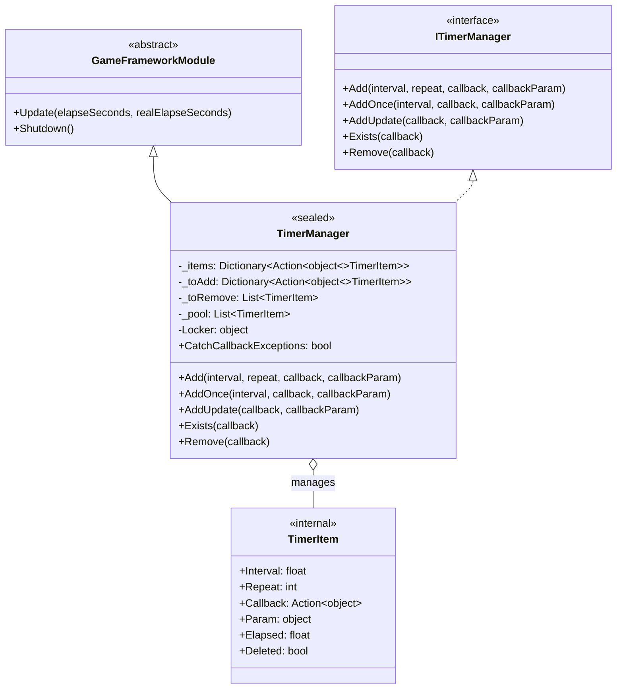
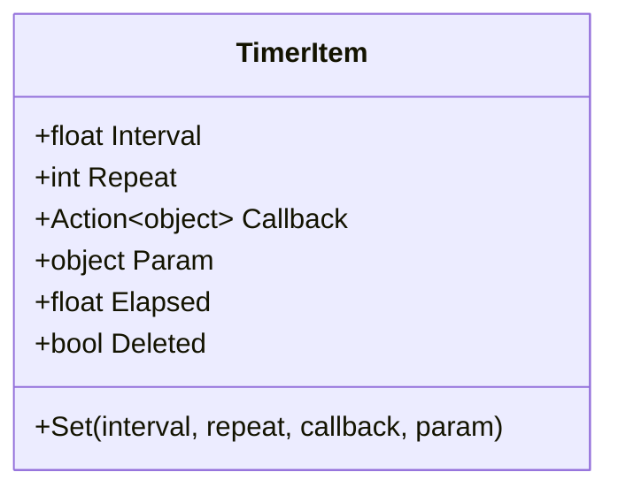

# TimerManager

TimerManager는 GameFrameX 타이머 모듈의 핵심 구현 클래스로, 타이머 작업의 스케줄링 및 실행을 담당합니다. `GameFrameworkModule`을 상속하고 `ITimerManager` 인터페이스를 구현하며, 정밀한 시간 간격 제어, 반복 횟수 관리 및 스레드 안전한 작업 메커니즘을 제공합니다.

## 개요

TimerManager는 전체 타이머 시스템의 핵심 엔진으로, 게임 실행 중 모든 타이머 작업의 생명 주기를 관리합니다. 이 클래스는 객체 풀 패턴을 채택하여 가비지 컬렉션 부담을 줄이고, 이중 버퍼링 메커니즘(대기 추가/대기 제거 리스트)을 사용하여 Update 순회 중 안전하게 작업을 추가 및 제거하며, 잠금 메커니즘을 통해 멀티스레드 환경에서의 스레드 안전성을 보장합니다.

GameFrameX 프레임워크의 핵심 모듈로서, TimerManager는 매 프레임의 Update 콜백에서 모든 활성 작업을 순회하며, 트리거 조건을 충족하는지 확인하고, 조건 충족 시 해당 콜백 함수를 실행합니다. 세 가지 유형의 타이머 작업을 지원합니다: 고정 간격 반복 작업, 일회성 지연 작업 및 매 프레임 업데이트 작업.

### 핵심 책임

- 타이머 작업의 추가, 제거 및 실행 관리
- 작업 실행 시간 누적 및 트리거 로직 유지
- 객체 풀 재사용 메커니즘을 통한 성능 최적화 제공
- 멀티스레드 환경에서의 작업 안전성 보장

### 설계 특성

TimerManager는高性能 및 안정성을 보장하기 위해 여러 최적화 전략을 채택했습니다. 먼저, 객체 풀 기술이 빈번한 TimerItem 객체 생성 및 파괴를 피하고, GC(가비지 컬렉션) 부담을 현저히 줄입니다. 다음으로, 작업의 이중 버퍼링 메커니즘이 순회 과정에서 새 작업 추가 및 삭제 표시 작업이集合 수정 예외를 발생시키지 않도록 허용합니다. 마지막으로, 스레드 잠금이 멀티스레드 접근 시 데이터 일관성을 보장합니다.



## 핵심 프로세스

TimerManager의 핵심 실행 프로세스는 매 프레임의 Update 메서드에서 발생합니다. 이 프로세스는 타이머 작업이 정밀한 시간 간격으로 트리거되도록 보장하며, 작업의 동적 추가 및 제거를 처리합니다.

```mermaid
flowchart TD
    subgraph UpdateLoop["Update 루프"]
        Start([Update 시작]) --> Lock["잠금 Locker 획득"]
        Lock --> CheckItems{"_items 수\n> 0?"}
        
        CheckItems -->|예| Iterate["_items 집합 순회"]
        CheckItems -->|아니오| CheckToRemove["_toRemove 검사"]
        
        Iterate --> CheckDeleted{현재 TimerItem\n삭제됨?"}
        CheckDeleted -->|예| AddToRemove["_toRemove에 추가"]
        CheckDeleted -->|아니오| UpdateElapsed["Elapsed 누적"]
        
        UpdateElapsed --> CheckInterval{Elapsed \n>= Interval?"}
        CheckInterval -->|아니오| ContinueIterate["다음으로 계속"]
        CheckInterval -->|예| ResetElapsed["Elapsed 재설정"]
        
        ResetElapsed --> CheckRepeat{Repeat \n> 0?"}
        CheckRepeat -->|예| DecrementRepeat["Repeat--"]
        DecrementRepeat --> CheckRepeatZero{Repeat == 0?"}
        CheckRepeatZero -->|예| MarkDeleted["Deleted 표시"]
        CheckRepeatZero -->|아니오| ExecuteCallback["콜백 실행"]
        
        MarkDeleted --> AddToRemove
        ExecuteCallback --> ContinueIterate
        
        AddToRemove --> ContinueIterate
        
        ContinueIterate --> HasNext{" ещё 작업\n있음?"}
        HasNext -->|예| Iterate
        HasNext -->|아니오| CheckToRemove
        
        CheckToRemove --> ProcessRemove{"_toRemove\n수 > 0?"}
        ProcessRemove -->|예| RemoveItems["표시된 작업 제거\n객체 풀에 반환"]
        ProcessRemove -->|아니오| CheckToAdd
        
        RemoveItems --> CheckToAdd
        CheckToAdd --> ProcessAdd{"_toAdd\n수 > 0?"}
        ProcessAdd -->|예| AddNewItems["새 작업\n_items에 추가"]
        ProcessAdd -->|아니오| Release["잠금 해제"]
        ProcessAdd -->|아니오| End([Update 종료])
        
        AddNewItems --> Release
        Release --> End
    end
```

### 프로세스 설명

Update 메서드의 실행 프로세스는 네 가지 주요 단계로 나뉩니다. 첫 번째는 작업 순회 단계로, 현재 모든 활성 작업을 순회하고, 각 작업의 경과 시간(Elapsed)을 누적하며, 트리거 간격에 도달했는지 확인합니다. 두 번째는 콜백 실행 단계로, 작업이 트리거 조건을 충족하면绑定了 콜백 함수를 실행하고, Repeat 매개변수에 따라 반복 횟수를 감소시킬지 결정합니다. 세 번째는 제거 처리 단계로, 삭제 표시된 작업을 집합에서 제거하고, 객체 풀에 반환하여 재사용합니다. 네 번째는 추가 처리 단계로, 대기 추가 대기열의 새 작업을 활성 작업 집합과 병합합니다.

이러한 설계는 콜백 실행 과정에서 다른 작업을 추가 또는 제거해도 순회 정확성에 영향을 주지 않도록 보장합니다. 실제 추가 및 제거 작업은 순회 종료 후에만 실행되기 때문입니다.

## 내부 클래스 TimerItem

TimerItem은 TimerManager의 내부 중첩 클래스로, 단일 타이머 작업의 완전한 상태 정보를 저장하는 데 사용됩니다. 각 TimerItem 객체는 작업의 실행 간격, 남은 반복 횟수, 콜백 함수, 콜백 매개변수 및 내부 상태 플래그를 포함합니다.



| 속성 | 타입 | 설명 |
|------|------|------|
| Interval | float | 작업 트리거 간격, 초 단위 |
| Repeat | int | 남은 반복 횟수, 0은 무한 반복 |
| Callback | Action\<object\> | 작업 트리거 시 실행할 콜백 함수 |
| Param | object | 콜백 함수에 전달할 매개변수 |
| Elapsed | float | 마지막 트리거 이후 경과한 시간 |
| Deleted | bool | 작업 삭제 여부 표시 |

## 사용 예시

### 기본 사용법

반복 타이머 작업을 추가하는 방법을 보여주는 예시:

```csharp
// 타이머 작업 생성, 1초마다 실행, 총 10회
TimerManager.Instance.Add(1.0f, 10, callback: (param) => 
{
    Debug.Log($"타이머 작업 실행, 매개변수: {param}");
}, callbackParam: "Hello Timer");
```
> Source: [TimerManager.cs](https://github.com/GameFrameX/com.gameframex.unity.timer/blob/main/Runtime/Timer/TimerManager.cs#L156-L188)

### 일회성 작업 사용법

AddOnce 메서드를 사용하여 지연 실행 한 번 작업을 추가합니다:

```csharp
// 5초 후 한 번 작업 실행
TimerManager.Instance.AddOnce(5.0f, callback: (param) => 
{
    Debug.Log("작업 한 번만 실행");
}, callbackParam: null);
```
> Source: [TimerManager.cs](https://github.com/GameFrameX/com.gameframex.unity.timer/blob/main/Runtime/Timer/TimerManager.cs#L197-L200)

### 매 프레임 업데이트 작업

AddUpdate 메서드를 사용하여 매 프레임 실행되는 경량 작업 추가:

```csharp
// 매 프레임 실행 작업 (간격 약 0.001초)
TimerManager.Instance.AddUpdate(callback: (param) => 
{
    // 매 프레임 실행 로직
    transform.Rotate(Vector3.up, 10f * Time.deltaTime);
});
```
> Source: [TimerManager.cs](https://github.com/GameFrameX/com.gameframex.unity.timer/blob/main/Runtime/Timer/TimerManager.cs#L206-L219)

### 작업 검사 및 제거

Exists 및 Remove 메서드를 사용하여 작업 생명 주기 관리:

```csharp
private Action<object> _myTimerCallback;

void Start()
{
    // 작업 추가 및 콜백 참조 저장
    _myTimerCallback = OnTimerTick;
    TimerManager.Instance.Add(1.0f, 5, _myTimerCallback, "test");
}

void OnTimerTick(object param)
{
    Debug.Log($"Tick: {param}");
}

// 다른 메서드에서 검사 및 제거
void StopTimer()
{
    if (TimerManager.Instance.Exists(_myTimerCallback))
    {
        TimerManager.Instance.Remove(_myTimerCallback);
        Debug.Log("작업 제거됨");
    }
}
```
> Source: [TimerManager.cs](https://github.com/GameFrameX/com.gameframex.unity.timer/blob/main/Runtime/Timer/TimerManager.cs#L226-L264)

## API 참고

### `TimerManager`

완전한 클래스 선언:

```csharp
public sealed class TimerManager : GameFrameworkModule, ITimerManager
```
> Source: [TimerManager.cs](https://github.com/GameFrameX/com.gameframex.unity.timer/blob/main/Runtime/Timer/TimerManager.cs#L12)

**상속 관계:**
- 부모 클래스: GameFrameworkModule
- 인터페이스: ITimerManager

---

### `CatchCallbackExceptions`

```csharp
public static bool CatchCallbackExceptions = false;
```
> Source: [TimerManager.cs](https://github.com/GameFrameX/com.gameframex.unity.timer/blob/main/Runtime/Timer/TimerManager.cs#L43)

**설명:** 콜백 함수 실행 과정에서 발생하는 예외를 포획할지 여부를 제어하는 전역 정적 속성.

**기본값:** false

**사용 시나리오:**
- `true`로 설정 시, 콜백 함수 실행 중 예외가 포획되어 경고 로그에 기록되고, 작업이 삭제 표시됨
- `false`로 설정 시, 콜백 함수 실행 중 예외가 직접 발생하여 응용 프로그램 크래시 가능

---

### `Add(interval, repeat, callback, callbackParam)`

```csharp
public void Add(float interval, int repeat, Action<object> callback, object callbackParam = null)
```
> Source: [TimerManager.cs](https://github.com/GameFrameX/com.gameframex.unity.timer/blob/main/Runtime/Timer/TimerManager.cs#L156-L188)

**설명:** 반복 실행 타이머 작업을 추가합니다.

**매개변수:**
| 매개변수명 | 타입 | 필수 | 기본값 | 설명 |
|--------|------|------|--------|------|
| interval | float | 예 | - | 작업 트리거 간격 시간, 초 단위 |
| repeat | int | 예 | - | 반복 횟수, 0은 무한 반복 |
| callback | Action\<object\> | 예 | - | 작업 트리거 시 실행할 콜백 함수 |
| callbackParam | object | 아니오 | null | 콜백 함수에 전달할 매개변수 |

**반환 타입:** void

**내부 로직:**
1. 콜백 함수가 비었는지 확인, 비었으면 경고 로그 기록 및 반환
2. 작업이 이미 존재하는지 확인, 존재하면 매개변수 업데이트 및 상태 재설정
3. 객체 풀에서 가져오거나 새 TimerItem 생성
4. 작업을 대기 추가 대기열에 추가, 다음 프레임 병합을 위해 대기

**예외 처리:**
- callback이 null이면 경고 로그 기록하지만 예외 발생 안 함

---

### `AddOnce(interval, callback, callbackParam)`

```csharp
public void AddOnce(float interval, Action<object> callback, object callbackParam = null)
```
> Source: [TimerManager.cs](https://github.com/GameFrameX/com.gameframex.unity.timer/blob/main/Runtime/Timer/TimerManager.cs#L197-L200)

**설명:** 한 번만 실행되는 타이머 작업을 추가합니다. 본질적으로 repeat 매개변수가 1인 Add 호출입니다.

**매개변수:**
| 매개변수명 | 타입 | 필수 | 기본값 | 설명 |
|--------|------|------|--------|------|
| interval | float | 예 | - | 지연 시간, 초 단위 |
| callback | Action\<object\> | 예 | - | 작업 트리거 시 실행할 콜백 함수 |
| callbackParam | object | 아니오 | null | 콜백 함수에 전달할 매개변수 |

**반환 타입:** void

**동등 구현:**
```csharp
Add(interval, 1, callback, callbackParam);
```

---

### `AddUpdate(callback)`

```csharp
public void AddUpdate(Action<object> callback)
```
> Source: [TimerManager.cs](https://github.com/GameFrameX/com.gameframex.unity.timer/blob/main/Runtime/Timer/TimerManager.cs#L206-L209)

**설명:** 매 프레임 업데이트 실행 작업을 추가합니다.

**매개변수:**
| 매개변수명 | 타입 | 필수 | 설명 |
|--------|------|------|------|
| callback | Action\<object\> | 예 | 매 프레임 실행 콜백 함수 |

**반환 타입:** void

**동등 구현:**
```csharp
Add(0.001f, 0, callback);
```

**주의:** 간격 시간이 0.001초(매 프레임과 동등)로 설정되었고, repeat이 0이면 무한 반복입니다.

---

### `AddUpdate(callback, callbackParam)`

```csharp
public void AddUpdate(Action<object> callback, object callbackParam)
```
> Source: [TimerManager.cs](https://github.com/GameFrameX/com.gameframex.unity.timer/blob/main/Runtime/Timer/TimerManager.cs#L216-L219)

**설명:** 매 프레임 업데이트 실행 작업을 추가하고 매개변수를 전달합니다.

**매개변수:**
| 매개변수명 | 타입 | 필수 | 설명 |
|--------|------|------|------|
| callback | Action\<object\> | 예 | 매 프레임 실행 콜백 함수 |
| callbackParam | object | 예 | 콜백 함수에 전달할 매개변수 |

**반환 타입:** void

**동등 구현:**
```csharp
Add(0.001f, 0, callback, callbackParam);
```

---

### `Exists(callback)`

```csharp
public bool Exists(Action<object> callback)
```
> Source: [TimerManager.cs](https://github.com/GameFrameX/com.gameframex.unity.timer/blob/main/Runtime/Timer/TimerManager.cs#L226-L243)

**설명:** 지정 콜백 함수의 작업이 존재하는지 확인합니다.

**매개변수:**
| 매개변수명 | 타입 | 필수 | 설명 |
|--------|------|------|------|
| callback | Action\<object\> | 예 | 검사할 콜백 함수 |

**반환 타입:** bool

**반환 설명:**
- 작업이 대기 추가 대기열(_toAdd)에 있으면 true 반환
- 작업이 활성 대기열(_items)에 있고 삭제 표시되지 않으면 true 반환
- 기타 상황은 false 반환

**스레드 안전성:** 이 메서드는 스레드 안전성을 보장하기 위해 내부적으로 잠금을 획득합니다.

---

### `Remove(callback)`

```csharp
public void Remove(Action<object> callback)
```
> Source: [TimerManager.cs](https://github.com/GameFrameX/com.gameframex.unity.timer/blob/main/Runtime/Timer/TimerManager.cs#L249-L264)

**설명:** 지정 콜백 함수에 해당하는 작업을 제거합니다.

**매개변수:**
| 매개변수명 | 타입 | 필수 | 설명 |
|--------|------|------|------|
| callback | Action\<object\> | 예 | 제거할 콜백 함수 |

**반환 타입:** void

**내부 로직:**
1. 작업이 대기 추가 대기열에 있는지 확인, 있으면 대기열에서 제거하고 객체 풀에 반환
2. 작업이 활성 대기열에 있는지 확인, 있으면 Deleted 상태로 표시, 다음 프레임 제거 대기

**주의:** 작업이 콜백 실행 과정에서 제거되면 콜백은 완료될 때까지 실행되며, 그후 정리됩니다.

---

### `Update(elapseSeconds, realElapseSeconds)`

```csharp
protected override void Update(float elapseSeconds, float realElapseSeconds)
```
> Source: [TimerManager.cs](https://github.com/GameFrameX/com.gameframex.unity.timer/blob/main/Runtime/Timer/TimerManager.cs#L45-L137)

**설명:** 프레임워크 업데이트 메서드로, GameFrameX 프레임워크가 매 프레임 자동으로 호출합니다.

**매개변수:**
| 매개변수명 | 타입 | 설명 |
|--------|------|------|
| elapseSeconds | float | 게임 로직 경과 시간 (시간 스케일 영향 가능) |
| realElapseSeconds | float | 실제 경과한 실제 시간 |

**반환 타입:** void

**내부 로직:**
1. 스레드 안전성을 위해 잠금 획득
2. 모든 활성 작업을 순회, 시간 누적 및 트리거 조건 확인
3. 조건 충족 콜백 함수 실행
4. 작업 삭제 및 추가 처리
5. 잠금 해제

**주의:** 이것은 프레임워크 내부 메서드로, 일반적으로 직접 호출할 필요 없습니다.

---

### `Shutdown()`

```csharp
protected override void Shutdown()
```
> Source: [TimerManager.cs](https://github.com/GameFrameX/com.gameframex.unity.timer/blob/main/Runtime/Timer/TimerManager.cs#L139-L147)

**설명:** 프레임워크 종료 메서드로, GameFrameX 프레임워크가 시스템 종료 시 호출합니다.

**반환 타입:** void

**내부 로직:**
1. 스레드 안전성을 위해 잠금 획득
2. 대기 제거 대기열, 대기 추가 대기열 및 활성 작업 집합 비우기

**주의:** 이것은 프레임워크 내부 메서드로, 일반적으로 직접 호출할 필요 없습니다.

---

### 내부 메서드

#### `GetFromPool()`

```csharp
private TimerItem GetFromPool()
```
> Source: [TimerManager.cs](https://github.com/GameFrameX/com.gameframex.unity.timer/blob/main/Runtime/Timer/TimerManager.cs#L266-L283)

**설명:** 객체 풀에서 TimerItem 인스턴스를 가져옵니다.

**반환 타입:** TimerItem

**내부 로직:**
1. 객체 풀에 사용 가능한 인스턴스가 있는지 확인
2. 있으면 재사용 및 상태 재설정
3. 없으면 새 인스턴스 생성

---

#### `ReturnToPool(timerItem)`

```csharp
private void ReturnToPool(TimerItem timerItem)
```
> Source: [TimerManager.cs](https://github.com/GameFrameX/com.gameframex.unity.timer/blob/main/Runtime/Timer/TimerManager.cs#L285-L289)

**설명:** TimerItem 인스턴스를 객체 풀에 반환합니다.

**매개변수:**
| 매개변수명 | 타입 | 설명 |
|--------|------|------|
| timerItem | TimerItem | 반환할 인스턴스 |

**반환 타입:** void

---

## 관련 링크

- [TimerComponent](./5-api-reference.timer-component) - Unity 컴포넌트 캡슐화
- [ITimerManager](./5-api-reference.itimer-manager) - 타이머 인터페이스 정의
- [빠른 시작](./3-getting-started) - 빠른 시작 가이드
- [핵심 기능](./4-core-functions.add-timer) - 타이머 작업 작업 상세 설명
- [사용 예시](./6-samples) - 더 많은 사용 사례