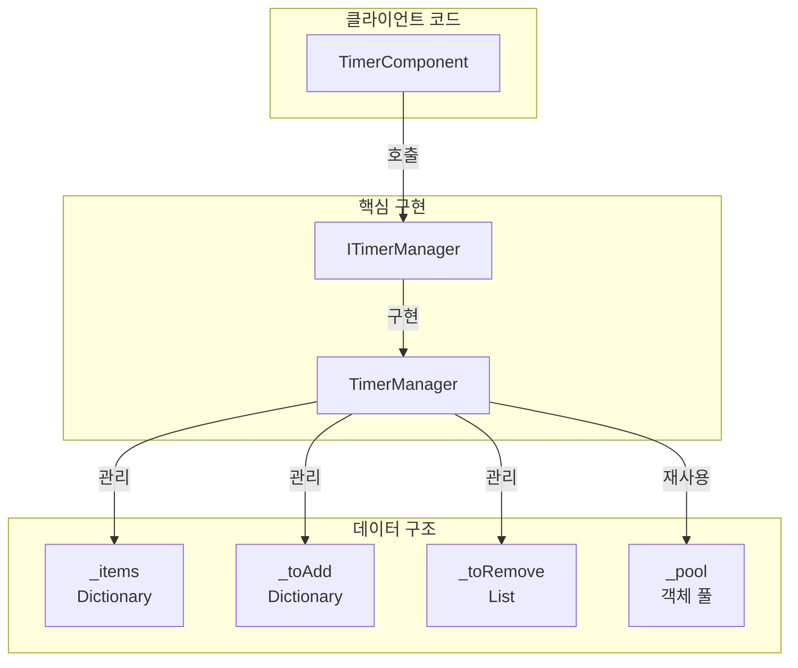
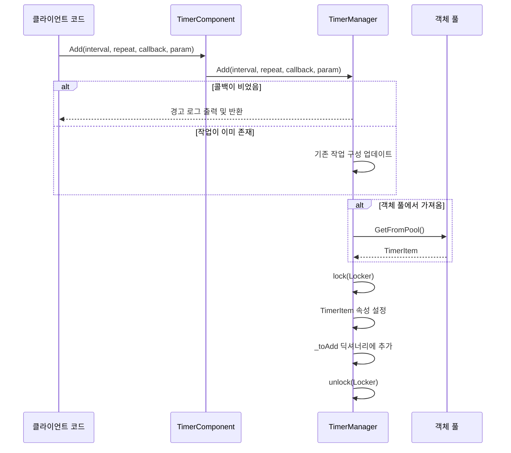

# 타이머 추가

이 문서는 GameFrameX Timer 컴포넌트에서 다양한 타이머 작업을 추가하는 방법을 소개합니다.

## 개요

Timer 컴포넌트는 타이머 작업을 추가하는 세 가지 방법을 제공합니다:

1. **Add 메서드** - 반복 실행 가능한 타이머 작업 추가
2. **AddOnce 메서드** - 한 번만 실행되는 작업 추가
3. **AddUpdate 메서드** - 매 프레임 실행 작업 추가

모든 작업은 TimerComponent를 통해 Unity 컴포넌트에 노출되며, 내부적으로 TimerManager가 구체적인 타이머 로직을 구현합니다.

## 핵심 개념

### 타이머 작업 매개변수

| 매개변수 | 타입 | 설명 |
|------|------|------|
| interval | float | 간격 시간 (초) |
| repeat | int | 반복 횟수 (0은 무한 반복) |
| callback | Action\<object\> | 콜백 함수 |
| callbackParam | object | 콜백에 전달할 매개변수 (선택) |

### 작업 상태 관리

TimerManager는 다음 데이터 구조를 사용하여 작업을 관리합니다:

- `_items` - 실행 중인 작업 딕셔너리
- `_toAdd` - 실행 대기열에 추가 대기 중인 작업
- `_toRemove` - 제거 대기 중인 작업
- `_pool` - 객체 풀, TimerItem 객체 재사용



## 작업 추가 프로세스



### 작업 실행 프로세스

```mermaid
flowchart TD
    Start([Update 호출]) --> CheckItems{실행 중인 작업 있음?}

    CheckItems -->|아니오| End([반환])
    CheckItems -->|예| Iterate[작업 순회]

    Iterate --> CheckDeleted{삭제됨?"}
    CheckDeleted -->|예| AddToRemove[제거 대기열에 추가]
    CheckDeleted -->|아니오| UpdateElapsed[경과 시간 업데이트]

    AddToRemove --> NextTask
    UpdateElapsed --> CheckTime{시간 도달?"}
    CheckTime -->|아니오| NextTask
    CheckTime -->|예| Execute[콜백 실행]
    Execute --> DecRepeat{반복 횟수>0?"}
    DecRepeat -->|예| Decrement[카운트 감소]
    DecRepeat -->|아니오| SetInfinite[무한 유지]
    
    Decrement --> CheckZero{카운트=0?"}
    CheckZero -->|예| MarkDeleted[삭제 표시]
    CheckZero -->|아니오| NextTask
    SetInfinite --> NextTask

    MarkDeleted --> AddToRemove
    NextTask --> Iterate

    subgraph Cleanup["정리 단계"]
        AddToRemove --> ProcessRemove[제거 처리]
        ProcessRemove --> RemoveFromItems[딕셔너리에서 제거]
        RemoveFromItems --> ReturnToPool[객체 풀에 반환]
    end

    ReturnToPool --> AddPending{추가 대기 있음?"}
    AddPending -->|예| ProcessAdd[추가 처리]
    AddPending -->|아니오| End
    ProcessAdd --> End
```

## 사용 예시

### 기본 타이머 작업

1초마다 실행, 총 10회 실행하는 작업 추가:

```csharp
// TimerComponent를 통해 타이머 작업 추가
var timerComponent = gameObject.GetComponent<TimerComponent>();
timerComponent.Add(1.0f, 10, callback, null);

void callback(object param)
{
    Debug.Log("타이머 작업 실행!");
}
```

> Source: [TimerComponent.cs](https://github.com/GameFrameX/com.gameframex.unity.timer/blob/main/Runtime/Timer/TimerComponent.cs#L37-L40)

### 무한 반복 작업

2초마다 실행하는 무한 반복 작업 추가 (repeat = 0은 무한):

```csharp
// repeat이 0이면 무한 반복 실행
timerComponent.Add(2.0f, 0, onInfiniteTick, "myData");

void onInfiniteTick(object param)
{
    string data = param as string;
    Debug.Log($"무한 작업 실행, 데이터: {data}");
}
```

> Source: [TimerManager.cs](https://github.com/GameFrameX/com.gameframex.unity.timer/blob/main/Runtime/Timer/TimerManager.cs#L156-L188)

### 매개변수 있는 작업

callbackParam을 통해 사용자 정의 데이터 전달:

```csharp
// 복잡한 데이터 객체 전달
var myData = new { Name = "Player", Score = 100 };
timerComponent.Add(1.0f, 5, onScoreUpdate, myData);

void onScoreUpdate(object param)
{
    var data = param as dynamic;
    Debug.Log($"플레이어: {data.Name}, 점수: {data.Score}");
}
```

> Source: [TimerManager.cs](https://github.com/GameFrameX/com.gameframex.unity.timer/blob/main/Runtime/Timer/TimerManager.cs#L24-L30)

## 내부 구현 상세

### TimerItem 데이터 구조

```csharp
class TimerItem
{
    public float Interval;      // 간격 시간
    public int Repeat;           // 남은 반복 횟수
    public Action<object> Callback;  // 콜백 함수
    public object Param;        // 콜백 매개변수
    
    public float Elapsed;       // 경과 시간
    public bool Deleted;        // 삭제 표시
}
```

> Source: [TimerManager.cs](https://github.com/GameFrameX/com.gameframex.unity.timer/blob/main/Runtime/Timer/TimerManager.cs#L14-L31)

### 시간 정밀도 처리

TimerManager는 Update에서 시간 누적 처리:

```csharp
timerItem.Elapsed += realElapseSeconds;
if (timerItem.Elapsed < timerItem.Interval)
{
    continue;  // 시간 미도달, 건너뛰기
}

timerItem.Elapsed -= timerItem.Interval;
// 시간 드리프트 처리: elapsed가 너무 작거나 크면 재설정
if (timerItem.Elapsed < 0 || timerItem.Elapsed > 0.03f)
    timerItem.Elapsed = 0;
```

이러한 설계는 다음을 보장합니다:
- 작업이 정밀한 간격 후 실행
- 누적된 시간 오차가 자동으로 수정됨
- 프레임률 변동에도 상대적 정확성 유지

> Source: [TimerManager.cs](https://github.com/GameFrameX/com.gameframex.unity.timer/blob/main/Runtime/Timer/TimerManager.cs#L63-L71)

### 객체 풀 메커니즘

가비지 컬렉션 부담을 줄이기 위해 TimerManager는 객체 풀을 구현했습니다:

```csharp
private TimerItem GetFromPool()
{
    if (_pool.Count > 0)
    {
        var item = _pool[_pool.Count - 1];
        _pool.RemoveAt(_pool.Count - 1);
        item.Deleted = false;
        item.Elapsed = 0;
        return item;
    }
    return new TimerItem();
}

private void ReturnToPool(TimerItem t)
{
    t.Callback = null;
    _pool.Add(t);
}
```

> Source: [TimerManager.cs](https://github.com/GameFrameX/com.gameframex.unity.timer/blob/main/Runtime/Timer/TimerManager.cs#L266-L289)

### 스레드 안전성

모든 작업 딕셔너리 조작은 잠금으로 보호됩니다:

```csharp
private static readonly object Locker = new object();

public void Add(float interval, int repeat, Action<object> callback, object callbackParam = null)
{
    lock (Locker)
    {
        // ... 작업 추가 로직
    }
}
```

> Source: [TimerManager.cs](https://github.com/GameFrameX/com.gameframex.unity.timer/blob/main/Runtime/Timer/TimerManager.cs#L38)

## 예외 처리

TimerManager는 콜백 예외 처리를 제어하기 위한 정적 구성을 제공합니다:

```csharp
// 기본적으로 예외 포획 안 함, 예외가 직접 발생
public static bool CatchCallbackExceptions = false;

// 예외 포획 활성화
TimerManager.CatchCallbackExceptions = true;
```

활성화하면 예외가 포획되어 경고 로그에 기록되고, 작업이 자동 삭제됩니다.

> Source: [TimerManager.cs](https://github.com/GameFrameX/com.gameframex.unity.timer/blob/main/Runtime/Timer/TimerManager.cs#L42-L43)

## 관련 링크

- [1회성 작업 추가](./4-core-functions.add-once) - AddOnce 메서드 상세히 알아보기
- [프레임 업데이트 작업 추가](./4-core-functions.add-update) - AddUpdate 메서드 상세히 알아보기
- [작업 확인 및 제거](./4-core-functions.exists-remove) - 작업 확인 및 제거 방법 알아보기
- [TimerComponent API 참고](./5-api-reference.timer-component) - 완전한 API 문서
- [ITimerManager 인터페이스](./5-api-reference.itimer-manager) - 인터페이스 정의
- [TimerManager 구현](./5-api-reference.timer-manager) - 내부 구현 세부사항