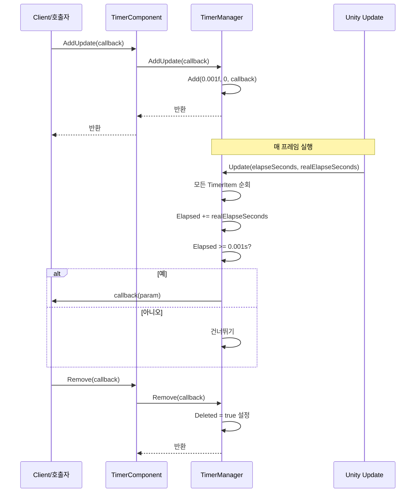

# 프레임 업데이트 작업 추가

프레임 업데이트 작업 추가는 Timer 컴포넌트의 핵심 기능 중 하나로, 매 프레임 실행되는 콜백 함수를 등록하는 데 사용됩니다. 타이머 작업 및 1회성 작업과 달리, 프레임 업데이트 작업은高频 실행이 필요한 시나리오(예: 게임의 입력 감지, 애니메이션 업데이트 또는 매 프레임 실행해야 하는 로직)에 적합합니다.

## 개요

프레임 업데이트 작업(AddUpdate)은 특수한 타이머 작업으로, 내부 구현은 간격 시간을 극단적으로 짧게 설정(0.001초)하고, 반복 횟수를 무한(0은 무한 반복)으로 설정합니다. 즉, 등록된 콜백 함수는 Unity의 매 프레임 업데이트에서 호출됩니다.

```mermaid
flowchart TD
    subgraph TimerManager["TimerManager 내부 프로세스"]
        A[AddUpdate 호출] --> B{콜백이 이미 존재하는지 확인}
        B -->|존재함| C[기존 작업 매개변수 업데이트]
        B -->|존재 안 함| D[객체 풀에서 TimerItem 가져오기]
        D --> E[Interval=0.001s, Repeat=0 설정]
        E --> F[_toAdd 대기열에 추가]
        F --> G[다음 프레임 Update에서 실행]
        
        G --> H[모든 TimerItem 순회]
        H --> I[Elapsed 시간 누적]
        I --> J{Elapsed >= Interval?"}
        J -->|예| K[콜백 함수 실행]
        J -->|아니오| L[건너뛰기]
        K --> M{Repeat == 0?"}
        M -->|예| H
        M -->|아니오| N[Repeat--, 계속]
        N --> H
    end
    
    style A fill:#e1f5fe
    style G fill:#fff3e0
    style K fill:#e8f5e9
```

### 핵심 특성

- **무한 실행**: repeat 매개변수가 0이면 작업이 계속 실행되어 수동 제거까지 중지되지 않음
- **高频 호출**: 매 프레임 실행 (약 16ms마다 1회, 프레임률에 따라 다름)
- **매개변수 지원**: 사용자 정의 매개변수를 콜백 함수에 전달 가능
- **중복 등록 감지**: 동일한 콜백이 이미 존재하면 새 작업을 생성하는 대신 기존 작업 매개변수를 업데이트함

## 동작 원리

### 내부 구현

프레임 업데이트 작업은 특수한 타이머 작업으로, 다음 방식으로 매 프레임 실행을 구현합니다:

> Source: [TimerManager.cs#L206-L219](https://github.com/GameFrameX/com.gameframex.unity.timer/blob/main/Runtime/Timer/TimerManager.cs#L206-L219)

```csharp
/// <summary>
/// 매 프레임 업데이트 실행 작업 추가
/// </summary>
/// <param name="callback">실행할 콜백 함수</param>
public void AddUpdate(Action<object> callback)
{
    Add(0.001f, 0, callback);
}

/// <summary>
/// 매 프레임 업데이트 실행 작업 추가
/// </summary>
/// <param name="callback">실행할 콜백 함수</param>
/// <param name="callbackParam">콜백 함수의 매개변수</param>
public void AddUpdate(Action<object> callback, object callbackParam)
{
    Add(0.001f, 0, callback, callbackParam);
}
```

핵심 로직 해석:
1. **Interval = 0.001f**: 극단적으로 짧은 간격 시간(약 1밀리초)을 설정하여 매 프레임 트리거되도록 보장
2. **Repeat = 0**: 0으로 설정하면 무한 반복을 의미하며, 작업이 자동 제거되지 않음
3. **Add 메서드**: 기존 타이머 작업 추가 로직을 재사용하여 통합 관리

### 실행 프로세스



## 사용 예시

### 기본 사용법

다음은 게임 루프에서 매 프레임 메서드를 실행하는 방법을 보여줍니다:

```csharp
using GameFrameX.Timer.Runtime;
using UnityEngine;

public class PlayerController : MonoBehaviour
{
    private TimerComponent _timerComponent;
    
    private void Start()
    {
        // TimerComponent 컴포넌트 가져오기
        _timerComponent = GetComponent<TimerComponent>();
        
        // 매 프레임 실행 작업 등록
        _timerComponent.AddUpdate(OnEveryFrame);
    }
    
    private void OnEveryFrame(object param)
    {
        // 매 프레임 실행 로직
        // 예: 입력 처리, 애니메이션 상태 업데이트 등
        Debug.Log("매 프레임 실행");
    }
    
    private void OnDestroy()
    {
        // 메모리 누수 방지를 위해 프레임 업데이트 작업 제거
        if (_timerComponent != null)
        {
            _timerComponent.Remove(OnEveryFrame);
        }
    }
}
```

### 매개변수 전달 사용법

콜백에서 사용자 정의 매개변수를 전달해야 하는 경우 매개변수가 있는 오버로드 사용:

```csharp
public class GameManager : MonoBehaviour
{
    private TimerComponent _timerComponent;
    private int _frameCount = 0;
    
    private void Start()
    {
        _timerComponent = GetComponent<TimerComponent>();
        
        // 현재 객체를 매개변수로 전달
        _timerComponent.AddUpdate(OnUpdateWithParam, this);
    }
    
    private void OnUpdateWithParam(object param)
    {
        // 매개변수를 원본 타입으로 변환
        var gameManager = param as GameManager;
        if (gameManager != null)
        {
            gameManager._frameCount++;
            if (gameManager._frameCount % 60 == 0)
            {
                Debug.Log($"실행됨 {_frameCount} 프레임");
            }
        }
    }
}
```

### 람다 식 사용

간단한 로직의 경우 람다 식으로 코드를 간결하게 할 수 있습니다:

```csharp
private TimerComponent _timerComponent;

private void Start()
{
    _timerComponent = GetComponent<TimerComponent>();
    
    // 람다 식 사용
    _timerComponent.AddUpdate(param => 
    {
        var deltaTime = (float)param;
        // 프레임 기반 로직 실행
    }, Time.deltaTime);
}
```

### 작업 존재 여부 확인

프레임 업데이트 작업을 추가하기 전 동일한 콜백이 이미 존재하는지 확인 가능:

```csharp
private void Start()
{
    _timerComponent = GetComponent<TimerComponent>();
    
    // 작업 존재 여부 확인
    if (!_timerComponent.Exists(OnEveryFrame))
    {
        _timerComponent.AddUpdate(OnEveryFrame);
    }
}

private void OnEveryFrame(object param)
{
    // 비지니스 로직
}
```

## API 참고

### `TimerComponent.AddUpdate`

> 자세한 내용은 [TimerComponent API 참고](./5-api-reference.timer-component) 참조

### `ITimerManager.AddUpdate`

> 자세한 내용은 [ITimerManager API 참고](./5-api-reference.itimer-manager) 참조

### `TimerManager.AddUpdate`

> 자세한 내용은 [TimerManager API 참고](./5-api-reference.timer-manager) 참조

## 주의 사항

1. **성능 고려**: 매 프레임 실행 콜백은 간결하게 유지하고 시간이 많이 걸리는 작업을 피해야 합니다.
2. **제거 시기**: 프레임 업데이트 작업이 더 이상 필요하지 않을 때 반드시 `Remove()` 메서드를 호출하여 수동으로 제거해야 합니다. 그렇지 않으면 메모리 누수 및 지속적인 성능消耗가 발생합니다.
3. **중복 등록**: 시스템은 자동으로 중복 등록을 처리(기존 작업 매개변수 업데이트)하지만, 추가 전에 `Exists()`로 확인하는 것을 권장합니다.
4. **프레임률 의존**: 작업의 실행 빈도는 게임 프레임률에 의존하며, 낮은 프레임률에서는 실행 빈도가 낮아집니다.

## 모범 사례

| 시나리오 | 권장 방법 |
|------|----------|
| 입력 감지 | AddUpdate 사용, 매 프레임 입력 상태 확인 |
| 애니메이션 상태 머신 | AddUpdate 사용, 애니메이션 매개변수 업데이트 |
| 장시간 실행 작업 | 주기적으로 확인 및适时 `Remove()` 호출 |
| 조건 트리거 | `Exists()` 메서드를 결합하여 작업 생명 주기 관리 |

## 관련 링크

- [타이머 추가](./4-core-functions.add-timer)
- [1회성 작업 추가](./4-core-functions.add-once)
- [작업 확인 및 제거](./4-core-functions.exists-remove)
- [TimerComponent API 참고](./5-api-reference.timer-component)
- [ITimerManager API 참고](./5-api-reference.itimer-manager)
- [TimerManager API 참고](./5-api-reference.timer-manager)