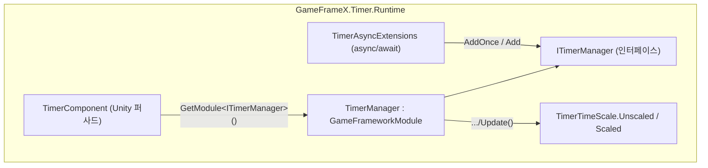

# 개요: GameFrameX Timer로 할 수 있는 일

GameFrameX Timer는 Unity용 경량 타이머/작업 스케줄링 모듈입니다. 한 줄의 코드만으로 지연 호출, 반복 호출, 매 프레임 업데이트, async/await 대기를 등록할 수 있고, ID/콜백/태그 기반의 라이프사이클 관리를 지원하며, 일시 정지/재개, 남은 시간 조회, timeScale 호환 모드를 제공합니다. 런타임 핵심은 `TimerManager`(모듈 구현), `TimerComponent`(Unity 컴포넌트 퍼사드), `TimerAsyncExtensions`(async 확장)로 구성됩니다.

## 빠른 시작

1. 프로젝트에 이 패키지(`com.gameframex.unity.timer`)가 설치되어 있고, 어셈블리가 `GameFrameX.Timer.Runtime`인지 확인합니다.
2. 씬에 GameFrameX 기본 컴포넌트가 이미 있는 경우 `TimerComponent`는 `GameFrameworkEntry.GetModule<ITimerManager>()`를 통해 매니저를 자동으로 가져옵니다; 메뉴 `GameFrameX/Timer`에서 수동으로 추가할 수도 있습니다(`[DisallowMultipleComponent]`로 표시되어 있어 씬에는 하나만 허용됩니다).

   ```csharp
   // TimerComponent.Awake의 조립 로직
   [DisallowMultipleComponent]
   [AddComponentMenu("GameFrameX/Timer")]
   [GameFrameXAutoComponent(-5000)]
   public class TimerComponent : GameFrameworkComponent
   {
       ITimerManager _timerManager;

       protected override void Awake()
       {
           ImplementationComponentType = Utility.Assembly.GetType(componentType);
           InterfaceComponentType = typeof(ITimerManager);
           base.Awake();
           _timerManager = GameFrameworkEntry.GetModule<ITimerManager>();
           if (_timerManager == null)
           {
               Log.Fatal("Timer manager is invalid.");
               return;
           }
       }
   }
   ```

   Source: [Runtime/Timer/TimerComponent.cs](https://github.com/GameFrameX/com.gameframex.unity.timer/blob/main/Runtime/Timer/TimerComponent.cs#L12-L31)

3. 비즈니스 스크립트에서 `TimerComponent`를 가져와 첫 번째 타이머를 등록합니다:

   ```csharp
   // 3초 후 한 번 실행하고 파라미터 하나를 전달
   int id = timerComponent.AddOnce(3f, param => Debug.Log($"done: {param}"), "hello");

   // 1초마다 5회 반복, 태그를 지정해 일괄 관리에 활용; Unscaled는 Time.timeScale의 영향을 받지 않음을 의미
   timerComponent.Add(1f, 5, _ => Debug.Log("tick"), null, "battle", TimerTimeScale.Unscaled, onComplete: () => Debug.Log("finished"));
   ```

4. 필요에 따라 타이머를 관리합니다:

   ```csharp
   timerComponent.Pause(id);      // 일시 정지(그동안 시간이 누적되지 않음)
   timerComponent.Resume(id);     // 재개
   float left = timerComponent.GetRemaining(id); // 남은 초 수, 존재하지 않으면 -1 반환
   timerComponent.Remove(id);     // ID로 제거
   timerComponent.RemoveByTag("battle"); // 태그로 일괄 제거
   ```

   위 API는 모두 `TimerComponent`의 실제 시그니처입니다. 예를 들어 `public int Add(float interval, int repeat, Action<object> callback, object callbackParam = null, string tag = null, TimerTimeScale timeScale = TimerTimeScale.Unscaled, Action onComplete = null)`가 있으며, [Runtime/Timer/TimerComponent.cs](https://github.com/GameFrameX/com.gameframex.unity.timer/blob/main/Runtime/Timer/TimerComponent.cs#L44-L69)를 참조하세요.

## 기능 빠른 참조

| 기능 | 진입 API | 설명 |
|------|----------|------|
| 일회성 지연 | `AddOnce(interval, callback, callbackParam)` | 만료 시 한 번 실행 후 자동 제거 |
| 반복 호출 | `Add(interval, repeat, callback, ...)` | `repeat = 0`은 무한 반복을 의미 |
| 매 프레임 업데이트 | `AddUpdate(callback)` / `AddUpdate(callback, callbackParam)` | interval을 0으로 간주하여 매 프레임 트리거 |
| async 대기 | `WaitForSecondsAsync` / `WaitForNextFrameAsync` / `WaitForFramesAsync` | 메인 스레드에서 완료, `CancellationToken` 지원 |
| 일시 정지/재개 | `Pause(id)` / `Resume(id)` / `IsPaused(id)` | 태그로도 가능: `PauseByTag` / `ResumeByTag` |
| 상태 조회 | `Exists(id|callback)` / `HasTag(tag)` / `GetRemaining` / `GetElapsed` / `GetRepeatLeft` | 타이머가 존재하지 않으면 숫자 값으로 `-1` 반환 |
| 일괄 제거 | `Remove(id|callback)` / `RemoveByTag(tag)` | 완료 시 `onComplete` 트리거 |
| 시간 스케일 | `TimerTimeScale.Unscaled` / `Scaled` | 기본값 `Unscaled`(`Time.timeScale`의 영향을 받지 않음) |

## 작동 원리 요약



매 프레임 `TimerManager.Update(elapseSeconds, realElapseSeconds)`는 락 내에서 타이머 항목을 순회합니다: `TimeScaleMode`에 따라 `elapseSeconds`(Scaled) 또는 `realElapseSeconds`(Unscaled)를 선택해 누적합니다; `interval <= 0`인 항목은 매 프레임 트리거로 간주합니다; 만료 항목의 콜백은 먼저 `_pendingCallbacks` 리스트에 수집한 뒤 일괄 디스패치하여 딕셔너리 순회 중 컬렉션이 수정되는 것을 방지합니다. 데이터 구조상 `Dictionary<Action<object>, TimerItem>`로 활성 항목을 저장하고, `Dictionary<int, Action<object>>`로 ID 매핑을, `Dictionary<string, List<int>>`로 태그 인덱스를 구성하며, `Stack<TimerItem>`로 항목을 풀링하여 재사용합니다. [Runtime/Timer/TimerManager.cs](https://github.com/GameFrameX/com.gameframex.unity.timer/blob/main/Runtime/Timer/TimerManager.cs#L42-L49)를 참조하세요.

`TimerTimeScale`은 두 개의 값을 가진 열거형으로, `Unscaled = 0`이 기본값이며 기존 동작과 호환됩니다; `Scaled = 1`인 경우에만 `UnityEngine.Time.timeScale`의 영향을 받습니다. [Runtime/Timer/TimerTimeScale.cs](https://github.com/GameFrameX/com.gameframex.unity.timer/blob/main/Runtime/Timer/TimerTimeScale.cs#L6-L13)를 참조하세요.

## 다음 단계

- 타이머 생성/제거/일시 정지의 전체 파라미터 설명과 일반적인 변형은 작업 페이지 《타이머 사용 방법》을 참조하세요.
- async/await 사용법(`WaitForSecondsAsync` 등 세 가지 확장의 구현은 [Runtime/Timer/TimerAsyncExtensions.cs](https://github.com/GameFrameX/com.gameframex.unity.timer/blob/main/Runtime/Timer/TimerAsyncExtensions.cs#L20-L37) 참조).
- 타이머가 트리거되지 않거나 콜백 파라미터가 유실되는 등의 문제 해결은 트러블슈팅 페이지 《타이머가 작동하지 않으면 어떻게 하나요》를 참조하세요.
- 에디터 확장(Inspector 디버그 뷰)은 [Editor/Inspector/TimerComponentInspector.cs](https://github.com/GameFrameX/com.gameframex.unity.timer/blob/main/Editor/Inspector/TimerComponentInspector.cs)를 참조하세요.
- 버전 히스토리는 [CHANGELOG.md](https://github.com/GameFrameX/com.gameframex.unity.timer/blob/main/CHANGELOG.md)를 참조하세요.