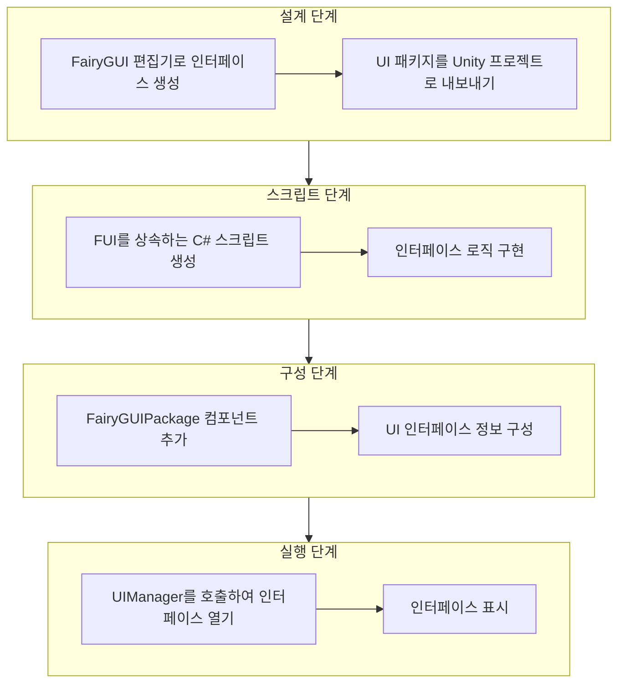
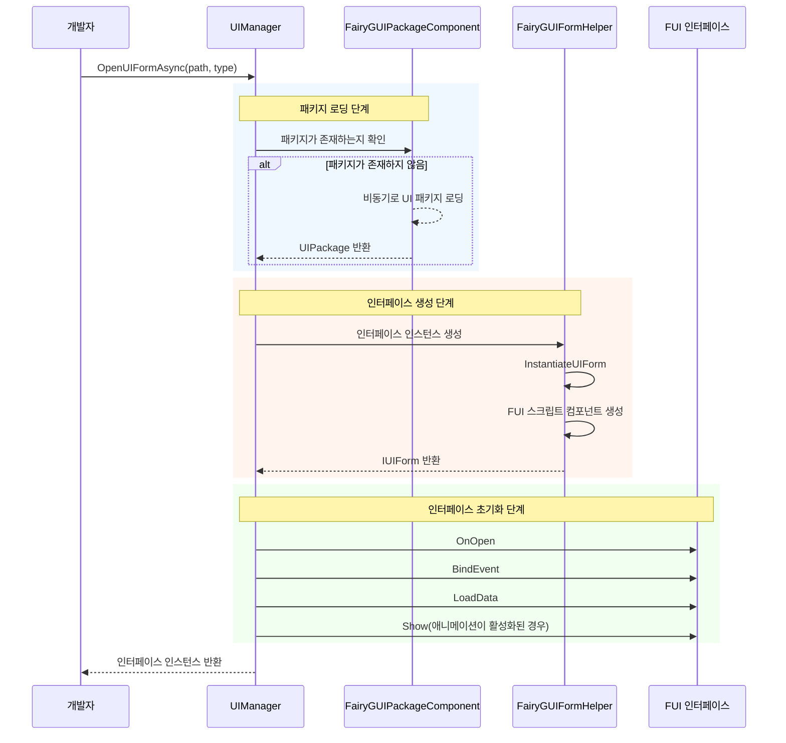
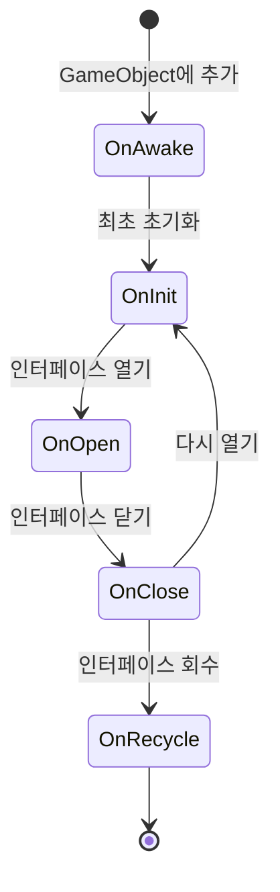

# 첫 번째 인터페이스 생성

이 가이드는 GameFrameX의 FairyGUI 플러그인을 사용하여 첫 번째 UI 인터페이스를 만드는 방법을 안내합니다. 이 가이드를 통해 FairyGUI 편집기에서 인터페이스를 디자인하는 것부터 코드에서 인터페이스를 여는 것까지의 전체 과정을 이해할 수 있습니다.

## 개요

FairyGUI 플러그인으로 UI 인터페이스를 만들기 전에 전체 UI 시스템의 아키텍처를 이해해야 합니다. GameFrameX의 FairyGUI 플러그인은 다음 핵심 컴포넌트를 기반으로 구축됩니다:

- **FUI**: FairyGUI 인터페이스의 기본 클래스, UIForm을 상속하며 인터페이스 표시/숨김, GObject 관리 등의 기능 제공
- **FairyGUIPackageComponent**: UI 패키지 관리자, UI 리소스 패키지의 로딩, 캐싱 및 언로드 담당
- **UIManager**: 인터페이스 관리자, 인터페이스의 열기, 닫기 및 생명주기 관리 담당
- **FairyGUIFormHelper**: 인터페이스 헬퍼, 인터페이스 인스턴스의 생성, 인스턴스화 및 해제 담당

전체 UI 시스템 설계는 의존성 주입 및 컴포넌트화 디자인 패턴을 따르므로, 인터페이스 생성 및 관리가 간단하고 제어 가능합니다.

## 생성流程

첫 번째 FairyGUI 인터페이스를 생성하는 전체 과정은 다음과 같습니다:



## 단계 1: FairyGUI 편집기로 인터페이스 생성

먼저 FairyGUI 편집기를 사용하여 UI 인터페이스를 디자인하고 생성해야 합니다. FairyGUI는 빠른 UI 구축을 도와주는 강력한 시각적 편집기를 제공합니다.

### 1.1 FairyGUI 편집기 설치

[FairyGUI 공식 웹사이트](https://www.fairygui.com/)에서 FairyGUI 편집기를 다운로드하여 설치합니다.

### 1.2 새 프로젝트 생성

FairyGUI 편집기에서 새 프로젝트를 생성하고 적절한 해상도 및 설정을 선택합니다.

### 1.3 인터페이스 디자인

편집기가 제공하는 다양한 컴포넌트(버튼, 텍스트, 이미지, 리스트 등)를 사용하여 인터페이스를 디자인합니다. 디자인이 완료되면 프로젝트를 저장합니다.

### 1.4 UI 패키지 내보내기

디자인한 인터페이스를 Unity에서 사용할 수 있는 리소스 패키지로 내보냅니다:

1. 메뉴에서 "게시" → "게시 설정" 클릭
2. 게시 플랫폼을 Unity로 선택
3. 출력 경로 설정 (일반적으로 Unity 프로젝트의 `Assets/Res/FairyGUI` 디렉토리)
4. 게시 버튼 클릭

내보내면 출력 디렉토리에 `.bytes` 설명 파일과 관련 이미지 리소스가 생성됩니다.

## 단계 2: FUI 인터페이스 스크립트 생성

Unity 프로젝트에서 `FUI`를 상속하는 C# 스크립트를 생성합니다. FUI는 FairyGUI 인터페이스의 기본 클래스로, FairyGUI GObject와 상호작용하는 핵심 기능을 제공합니다.

### 2.1 인터페이스 클래스 생성

```csharp
using GameFrameX.UI.FairyGUI.Runtime;
using FairyGUI;
using GameFrameX.UI.Runtime;

/// <summary>
/// 메인 메뉴 인터페이스
/// </summary>
public class MainMenuForm : FUI
{
    /// <summary>
    /// 인터페이스 초기화
    /// </summary>
    protected override void OnInit()
    {
        base.OnInit();

        // 인터페이스의 버튼을 가져와 클릭 이벤트 추가
        var startButton = GObject.asCom.GetChild("btn_start");
        startButton.onClick.Add(OnStartButtonClick);
    }

    /// <summary>
    /// 시작 버튼 클릭 이벤트
    /// </summary>
    private void OnStartButtonClick()
    {
        // 클릭 로직 처리
    }

    /// <summary>
    /// 인터페이스가 열릴 때의 콜백, 여기서 전달된 데이터를 수신할 수 있음
    /// </summary>
    /// <param name="userData">인터페이스를 열 때 전달된 데이터</param>
    protected override void OnOpen(object userData)
    {
        base.OnOpen(userData);
        // 인터페이스가 열릴 때의 초기화 로직
    }

    /// <summary>
    /// 인터페이스가 닫힐 때의 콜백
    /// </summary>
    protected override void OnClose(bool isShutdown, bool isVisible)
    {
        // 인터페이스가 닫힐 때의 정리 로직
        base.OnClose(isShutdown, isVisible);
    }
}
```
> Source: [FUI.cs](https://github.com/GameFrameX/com.gameframex.unity.ui.fairygui/blob/main/Runtime/FUI.cs#L43-L197)

### 2.2 FUI 클래스가 제공하는 핵심 기능

FUI 클래스는 UIForm을 상속하며 모든 FairyGUI 인터페이스의 기본 클래스입니다. 다음 핵심 기능을 제공합니다:

| 기능 | 설명 |
|------|------|
| GObject | 연결된 FairyGUI GObject 객체 가져오기 |
| Visible | 인터페이스 가시성 가져오기 또는 설정 |
| Show | 인터페이스 표시, 애니메이션 지원 |
| Hide | 인터페이스 숨김, 애니메이션 지원 |
| OnVisibleChanged | 가시성 변경 콜백 |

## 단계 3: FairyGUIPackageComponent 구성

FairyGUIPackageComponent는 UI 패키지 관리자 컴포넌트로, UI 패키지를 로드하려면シーン에 추가해야 합니다.

### 3.1 패키지 관리 컴포넌트 추가

Unity 편집기에서 다음 단계를 수행합니다:

1. 빈 GameObject를 생성하고 `FairyGUIPackage`로 이름 지정
2. Add Component 버튼 클릭
3. `FairyGUIPackage` 컴포넌트 검색하여 추가 (실제로는 FairyGUIPackageComponent)
4. 해당 컴포넌트가 GameFrameworkComponent의 하위 클래스로 올바르게 초기화되었는지 확인

### 3.2 패키지 관리자의 핵심 메서드

```csharp
// 비동기 로딩 UI 패키지
public Task<UIPackage> AddPackageAsync(string descFilePath, bool isLoadAsset = true)

// 동기 로딩 UI 패키지
public void AddPackageSync(string descFilePath, bool isLoadAsset = true)

// 지정된 이름의 UI 패키지 제거
public void RemovePackage(string packageName)

// UI 패키지가 존재하는지 확인
public bool Has(string uiPackageName)
```
> Source: [FairyGUIPackageComponent.cs](https://github.com/GameFrameX/com.gameframex.unity.ui.fairygui/blob/main/Runtime/FairyGUIPackageComponent.cs#L138-L290)

## 단계 4: 인터페이스 열기

UIManager를 사용하여 인터페이스를 여는 것이 마지막 단계입니다. UIManager는 패키지 로딩, 인터페이스 생성 및 표시를 자동으로 처리합니다.

### 4.1 인터페이스 여는 기본 메서드

```csharp
// 비동기로 인터페이스 열기
await GameEntry.UI.OpenUIFormAsync("UI/MainMenu", typeof(MainMenuForm));

// 사용자 데이터와 함께 인터페이스 열기
var userData = new StartGameData { LevelId = 1 };
await GameEntry.UI.OpenUIFormAsync("UI/MainMenu", typeof(MainMenuForm), userData);
```

### 4.2 인터페이스 여는 전체流程



### 4.3 인터페이스 매개변수 설명

| 매개변수 | 설명 |
|------|------|
| uiFormAssetPath | 인터페이스 리소스 경로, 예: "UI/MainMenu" |
| uiFormType | 인터페이스 유형, 인터페이스 클래스의 Type 전달 |
| pauseCoveredUIForm | 덮여있는 인터페이스를 일시정지할지 여부 |
| userData | 사용자 정의 데이터, OnOpen 메서드에 전달됨 |
| isFullScreen | 전체 화면으로 표시할지 여부 |

## 인터페이스 생명주기

UI를 올바르게 관리하려면 인터페이스의 생명주기를 이해하는 것이 중요합니다. FUI 인터페이스에는 다음과 같은 생명주기 메서드가 있습니다:



| 생명주기 메서드 | 호출时机 | 용도 |
|-------------|----------|------|
| OnAwake | 스크립트가 GameObject에 추가될 때 | 일회성 초기화 |
| OnInit | 인터페이스가 최초로 생성될 때 | 인터페이스 컴포넌트 및 이벤트 초기화 |
| OnOpen | 인터페이스가 열릴 때마다 | 데이터 수신, 인터페이스 새로고침 |
| OnClose | 인터페이스가 닫힐 때 | 리소스 정리, 상태 저장 |
| OnRecycle | 인터페이스가 회수될 때 | 메모리 완전 정리 |

## 인터페이스 닫기

UIManager를 사용하여 인터페이스를 닫습니다:

```csharp
// 지정된 인터페이스 닫기
GameEntry.UI.CloseUIForm(mainMenuForm);

// 모든 인터페이스 닫기
GameEntry.UI.CloseAllUIForms();
```
> Source: [UIManager.Close.cs](https://github.com/GameFrameX/com.gameframex.unity.ui.fairygui/blob/main/Runtime/UIManager.Close.cs)

## 일반 문제

### Q1: 인터페이스를 연 후 빈 화면으로 표시됨

다음 사항을 확인하세요:
1. UI 패키지가 올바르게 내보내져 Unity 프로젝트의 올바른 디렉토리에 있는지
2. FairyGUIPackageComponent가 장면에 추가되어 있는지
3. 인터페이스 리소스 경로가 올바른지

### Q2: 클릭 이벤트에 응답이 없음

OnInit 메서드에서 이벤트가 올바르게 바인딩되었는지, GObject 이름이 FairyGUI 편집기의 이름과 완전히 일치하는지 확인하세요.

### Q3: 인터페이스를 닫을 수 없음

OnClose 메서드에서 기본 클래스의 OnClose 메서드를 올바르게 호출했는지, 리소스가 올바르게 해제되었는지 확인하세요.

## 관련 링크

- [FUI 인터페이스 기본 클래스](./4-core-concepts.1-fui-base-class) - FUI 기본 클래스의 모든 기능 상세 설명
- [인터페이스 관리자](./4-core-concepts.2-ui-manager) - UIManager 기능 심층 학습
- [패키지 관리자](./4-core-concepts.3-package-manager) - UI 패키지 관리 메커니즘 학습
- [인터페이스 헬퍼](./4-core-concepts.4-form-helper) - 인터페이스 생성 및 해제 메커니즘 학습
- [인터페이스 열기 및 닫기](./3-getting-started.2-open-close-ui) - 인터페이스 열기 및 닫기 작업 계속 학습