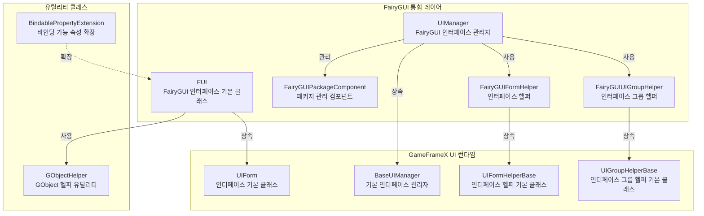

# 기능 특성

GameFrameX UI FairyGUI 플러그인은 Unity 게임 엔진용으로 설계된 FairyGUI UI 컴포넌트 통합 솔루션으로, 완전한 인터페이스 관리, 인터페이스 생명주기 제어, 패키지 리소스 관리 등의 기능을 제공합니다.

## 개요

이 플러그인은 GameFrameX 핵심 프레임워크의 UI 시스템을 FairyGUI와 완벽하게 통합하여 다음 핵심 기능을 제공합니다:

- **인터페이스 생명주기 관리**: 완전한 인터페이스 열기, 닫기, 표시, 숨김 메커니즘
- **리소스 패키지 관리**: UI 패키지의 비동기/동기 로딩, 캐싱 및 언로드 지원
- **인터페이스 그룹 시스템**: 다중 레벨 인터페이스 그룹화 및 깊이 제어 지원
- **객체 풀**: 인터페이스 인스턴스의 재사용을 지원하여 메모리 할당 감소
- **애니메이션 시스템**: 표시/숨김 애니메이션의 유연한 구성 지원
- **확장 지원**: FairyGUI 특정 데이터 바인딩 확장 제공

## 핵심 아키텍처



### 아키텍처 설명

| 컴포넌트 | 책임 | 상속/구현 |
|------|------|----------|
| **FUI** | FairyGUI 인터페이스 기본 클래스, GObject 연결 및 가시성 처리 | UIForm 상속 |
| **UIManager** | 인터페이스 관리자, 인터페이스 열기/닫기/생명주기 처리 | BaseUIManager 상속 |
| **FairyGUIPackageComponent** | 패키지 관리 컴포넌트, 비동기/동기 UI 패키지 로딩 | GameFrameworkComponent 상속 |
| **FairyGUIFormHelper** | 인터페이스 헬퍼, 인스턴스화/생성/해제 인터페이스 | UIFormHelperBase 구현 |
| **FairyGUIUIGroupHelper** | 인터페이스 그룹 헬퍼, 인터페이스 레벨 깊이 관리 | UIGroupHelperBase 상속 |
| **GObjectHelper** | GObject 유틸리티 클래스, FUI 객체 캐시 관리 | 정적 클래스 |

## 핵심 기능 특성

### 1. 인터페이스 기본 클래스 (FUI)

FUI는 FairyGUI 특정 인터페이스 기본 클래스로, 다음 기능을 제공합니다:

- **GObject 연결**: FairyGUI의 GObject와 완벽한 통합
- **가시성 관리**: `Visible` 속성을 통한 인터페이스 표시/숨김 제어
- **애니메이션 지원**: 표시/숨김 애니메이션 구성 지원
- **전체 화면 표시**: 전체 화면 모드 설정 지원
- **이벤트 시스템**: 가시성 변경 이벤트 콜백 제공

```csharp
// FUI 사용 예제
public class MainMenuForm : FUI
{
    protected override void OnInit(object userData)
    {
        base.OnInit(userData);
        // GObject 연결 설정
        GObject.onClick.Add(() => { /* 클릭 처리 */ });
    }
}
```
> Source: [FUI.cs](https://github.com/GameFrameX/com.gameframex.unity.ui.fairygui/blob/main/Runtime/FUI.cs#L36-L197)

### 2. 패키지 관리 시스템

FairyGUIPackageComponent는 FairyGUI UI 리소스 패키지 관리 담당:

- **비동기 로딩**: `AddPackageAsync()` 비동기 로딩 UI 패키지 지원
- **동기 로딩**: `AddPackageSync()` 동기 로딩 UI 패키지 지원
- **패키지 캐싱**: 로드된 패키지는 캐시되어 중복 로딩 방지
- **리소스 프리로드**: `LoadAllAssets()` 모든 리소스 프리로드 지원
- **패키지 제거**: `RemovePackage()` / `RemoveAllPackages()` 패키지 언로드 지원

```csharp
// 패키지 관리 예제
var package = await FairyGuiPackage.AddPackageAsync("UI/MainMenu");
var package = FairyGuiPackage.AddPackageSync("UI/Settings");
```
> Source: [FairyGUIPackageComponent.cs](https://github.com/GameFrameX/com.gameframex.unity.ui.fairygui/blob/main/Runtime/FairyGUIPackageComponent.cs#L138-L254)

### 3. 인터페이스 생명주기

UIManager는 완전한 인터페이스 생명주기 관리 제공:

```mermaid
sequenceDiagram
    participant Client as 클라이언트 코드
    participant UIMgr as UIManager
    participant Package as FairyGUIPackageComponent
    participant FormHelper as FairyGUIFormHelper
    participant UIForm as FUI 인터페이스

    Client->>UIMgr: OpenUIFormAsync()
    UIMgr->>Package: UI 패키지 확인/로딩
    Package-->>UIMgr: 패키지 정보 반환
    UIMgr->>FormHelper: InstantiateUIForm()
    FormHelper-->>UIMgr: GComponent 인스턴스
    UIMgr->>UIForm: CreateUIForm()
    UIForm->>UIForm: OnInit()
    UIForm->>UIForm: OnOpen()
    UIForm->>UIForm: LoadData()
    UIMgr-->>Client: IUIForm 반환

    Note over Client,UIMgr: 인터페이스 닫기 흐름

    Client->>UIMgr: CloseUIForm()
    UIMgr->>UIForm: OnClose()
    UIForm->>UIForm: OnRecycle()
    UIMgr->>FormHelper: ReleaseUIForm()
    UIMgr-->>Client: 닫기 완료
```



### 4. 인터페이스 헬퍼

FairyGUIFormHelper는 인터페이스의 인스턴스화 및 해제 담당:

- **인스턴스화**: `InstantiateUIForm()`을 통해 GComponent 인스턴스 생성
- **인터페이스 생성**: `CreateUIForm()`을 통해 인스턴스를 IUIForm으로 래핑
- **리소스 해제**: `ReleaseUIForm()`을 통해 인터페이스 및 관련 리소스 해제
- **애니메이션 구성**: 인터페이스 유형 특성의 애니메이션 구성 자동 읽기

> Source: [FairyGUIFormHelper.cs](https://github.com/GameFrameX/com.gameframex.unity.ui.fairygui/blob/main/Runtime/FairyGUIFormHelper.cs#L46-L232)

### 5. 인터페이스 그룹 시스템

FairyGUIUIGroupHelper는 인터페이스 레벨 관리 제공:

- **깊이 제어**: `SetDepth()`를 통해 인터페이스 표시 레벨 설정
- **전체 화면 어댑테이션**: 전체 화면 크기 어댑테이션 자동 설정
- **관계 바인딩**: GRoot와 자동 높이/넓이 관계 수립

```csharp
// 인터페이스 그룹 깊이 관리
public override void SetDepth(int depth)
{
    Depth = depth;
    transform.localPosition = new Vector3(0, 0, depth * 100);
}
```
> Source: [FairyGUIUIGroupHelper.cs](https://github.com/GameFrameX/com.gameframex.unity.ui.fairygui/blob/main/Runtime/FairyGUIUIGroupHelper.cs#L62-L96)

### 6. GObject 헬퍼 유틸리티

GObjectHelper는 FUI 객체의 캐시 및 관리 제공:

- **연결 FUI 획득**: `Get<T>()` GObject에서 연결된 FUI 획득
- **매핑 추가**: `Add()` GObject와 FUI 연결 추가
- **매핑 제거**: `Remove()` GObject와 FUI 연결 제거
- **캐시 정리**: `ClearAll()` 모든 캐시 정리

```csharp
// GObject와 FUI 매핑 예제
GObject obj = package.CreateObject("MainMenu", "MainMenuForm");
MainMenuForm fui = new MainMenuForm(obj);
obj.Add(fui);  // 매핑 수립

// 이후 획득
MainMenuForm cached = obj.Get<MainMenuForm>();
```
> Source: [GObjectHelper.cs](https://github.com/GameFrameX/com.gameframex.unity.ui.fairygui/blob/main/Runtime/GObjectHelper.cs#L42-L114)

### 7. 데이터 바인딩 확장

BindablePropertyExtension은 FairyGUI 환경의 속성 바인딩 제공:

- **자동 등록 취소**: GObject 파괴 시 자동 바인딩 이벤트 정리
- **생명주기 연동**: 속성 변경과 인터페이스 생명주기 연결

```csharp
// FairyGUI에서의 바인딩 가능 속성 사용
BindableProperty<int> score = new BindableProperty<int>(0);
score.Register(newValue => { textField.text = newValue.ToString(); });
score.ClearWithGObjectDestroyed(textField);
```
> Source: [BindablePropertyExtension.cs](https://github.com/GameFrameX/com.gameframex.unity.ui.fairygui/blob/main/Runtime/BindablePropertyExtension.cs#L41-L57)

## 기능 특성 비교

| 기능 | 설명 | 관련 컴포넌트 |
|------|------|------------|
| 인터페이스 기본 클래스 | FairyGUI 특정 인터페이스 기본 클래스 | FUI |
| 인터페이스 관리 | 열기/닫기/생명주기 관리 | UIManager |
| 패키지 관리 | UI 리소스 패키지 비동기/동기 로딩 | FairyGUIPackageComponent |
| 인터페이스 인스턴스화 | 인터페이스 생성/인스턴스화/해제 | FairyGUIFormHelper |
| 인터페이스 그룹 관리 | 인터페이스 레벨/깊이 제어 | FairyGUIUIGroupHelper |
| 객체 캐시 | GObject와 FUI 매핑 관리 | GObjectHelper |
| 속성 바인딩 | 바인딩 가능 속성 확장 지원 | BindablePropertyExtension |

## 설계 장점

1. **분층 설계**: 명확한分层 아키텍처로 확장 및 유지 보수가 용이
2. **인터페이스 지향**: 대량 인터페이스 사용으로 구현 교체 용이
3. **객체 풀 재사용**: 인터페이스 인스턴스 재사용으로 메모리 할당 감소
4. **비동기 지원**: 완전한 비동기 로딩 지원으로 성능 향상
5. **특성 구성**: 애니메이션 및 인터페이스 그룹 구성을 특성으로簡素화
6. **이벤트驱动**: 이벤트 시스템 기반으로 컴포넌트 간 의존성 분리

## 관련 링크

- [플러그인 소개](./1-overview.1-introduction) - 플러그인 개요 및 설계理念 이해
- [시스템 요구사항](./1-overview.3-requirements) - 실행 환경 요구사항查看
- [설치 가이드](./2-installation.1-install-methods) - 플러그인 빠른 설치
- [FUI 클래스 상세](./5-api-reference.1-fui-class) - FUI 완전한 API 참조
- [인터페이스 관리자](./4-core-concepts.2-ui-manager) - 인터페이스 관리 핵심 개념
- [패키지 관리자](./4-core-concepts.3-package-manager) - 패키지 관리 핵심 개념