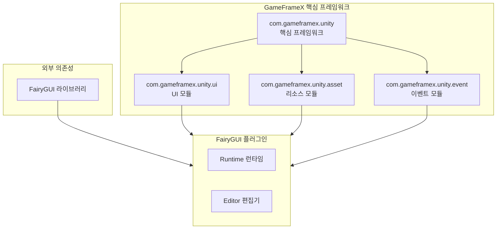
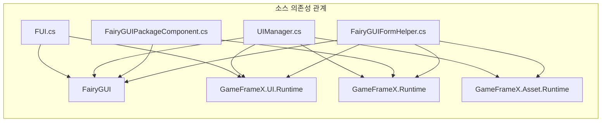

# 의존성 구성

이 문서는 GameFrameX UI FairyGUI 컴포넌트의 의존성 구성 요구사항을 소개하며, 필수 핵심 프레임워크 의존성과 외부 라이브러리 의존성을 포함합니다.

## 개요

GameFrameX UI FairyGUI 컴포넌트는 FairyGUI 기반의 Unity UI 기능 패키지로, GameFrameX 핵심 프레임워크와 FairyGUI 서드파티 라이브러리에 의존합니다. 이러한 의존성을 올바르게 구성하는 것은 플러그인이 정상적으로 작동하기 위한 전제 조건입니다.

## 의존성 아키텍처



## 핵심 의존성

### GameFrameX 프레임워크 의존성

| 의존성 패키지 | 최소 버전 | 설명 |
|--------|----------|------|
| com.gameframex.unity | 1.1.1 | GameFrameX 핵심 프레임워크, 기초 아키텍처 및 컴포넌트 시스템 제공 |
| com.gameframex.unity.ui | 1.0.0 | UI 기초 모듈, UIForm, UIComponent 등 핵심 클래스 정의 |
| com.gameframex.unity.asset | 1.0.6 | 리소스 관리 모듈, 리소스 로딩 및 언로드 담당 |
| com.gameframex.unity.event | 1.0.0 | 이벤트 시스템 모듈, 이벤트 구독 및 게시 기능 제공 |

### package.json의 의존성 구성

```json
{
  "dependencies": {
    "com.gameframex.unity": "1.1.1",
    "com.gameframex.unity.ui": "1.0.0",
    "com.gameframex.unity.asset": "1.0.6",
    "com.gameframex.unity.event": "1.0.0"
  }
}
```
> Source: [package.json](https://github.com/GameFrameX/com.gameframex.unity.ui.fairygui/blob/main/package.json#L21-L26)

## 외부 의존성

### FairyGUI 라이브러리

FairyGUI는 플러그인의 핵심 의존성으로, 완전한 UI 프레임워크 기능을 제공합니다.

| 컴포넌트 | 설명 |
|------|------|
| FairyGUI.Runtime | FairyGUI 런타임 라이브러리, GObject, GComponent, UIPackage 등 핵심 클래스 제공 |
| FairyGUI.Editor | FairyGUI 편집기 확장, Unity Editor에서 UI 편집용 |

**入手 방법:**
- [FairyGUI 공식 웹사이트](https://www.fairygui.com/)에서 공식 Unity 통합 패키지 다운로드
- Unity Package Manager를 통해 FairyGUI 가져오기

### FairyGUI와 GameFrameX의 통합

FairyGUI 플러그인은 다음 네임스페이스를 통해 GameFrameX 프레임워크에 통합됩니다:

```csharp
using FairyGUI;                           // FairyGUI 핵심 라이브러리
using GameFrameX.Runtime;                 // GameFrameX 핵심 런타임
using GameFrameX.Asset.Runtime;           // 리소스 관리
using GameFrameX.UI.Runtime;              // UI 기초 모듈
using GameFrameX.UI.FairyGUI.Runtime;     // FairyGUI 플러그인 런타임
```
> Source: [FairyGUIPackageComponent.cs](https://github.com/GameFrameX/com.gameframex.unity.ui.fairygui/blob/main/Runtime/FairyGUIPackageComponent.cs#L30-L35)

## 시스템 요구사항

### Unity 버전 요구사항

| 요구사항 | 사양 |
|------|------|
| 최소 버전 | Unity 2019.4 |
| 권장 버전 | Unity 2021.3 LTS 이상 |

### 의존성 관계 상세



### 핵심 클래스 의존성 대조표

| 플러그인 클래스 | 의존하는 GameFrameX 클래스 | 의존하는 FairyGUI 클래스 |
|--------|---------------------|-------------------|
| FUI | UIForm | GObject |
| UIManager | BaseUIManager | UIPackage |
| FairyGUIPackageComponent | GameFrameworkComponent | UIPackage |
| FairyGUIFormHelper | UIFormHelperBase | GComponent |
| GObjectHelper | - | GObject, FUI |

## Unity 프로젝트 구성

### 1. GameFrameX 핵심 프레임워크 설치

Unity 프로젝트에서 GameFrameX 핵심 프레임워크 및 의존성 설치:

```json
// manifest.json 예시
{
  "dependencies": {
    "com.gameframex.unity": "1.1.1",
    "com.gameframex.unity.ui": "1.0.0",
    "com.gameframex.unity.asset": "1.0.6",
    "com.gameframex.unity.event": "1.0.0"
  }
}
```

### 2. FairyGUI 설치

FairyGUI 공식 웹사이트에서 다운로드하여 Unity 패키지를 가져오며, 다음이 포함되어야 합니다:
- Runtime 디렉토리 (핵심 런타임)
- Editor 디렉토리 (편집기 확장)

### 3. FairyGUI 플러그인 설치

GameFrameX UI FairyGUI 컴포넌트를 프로젝트에 추가:

```json
{
  "dependencies": {
    "com.gameframex.unity.ui.fairygui": "https://github.com/gameframex/com.gameframex.unity.ui.fairygui.git"
  }
}
```

> 자세한 설치 단계는 [설치 방식](./2-installation.1-install-methods) 문서를 참조하세요.

## 의존성 검증

설치 완료 후 다음 클래스가 정상적으로 접근 가능해야 합니다:

```csharp
// GameFrameX 핵심 클래스
using GameFrameX.Runtime;
using GameFrameX.Asset.Runtime;
using GameFrameX.UI.Runtime;

// FairyGUI 클래스
using FairyGUI;

// FairyGUI 플러그인 클래스
using GameFrameX.UI.FairyGUI.Runtime;
```

## 버전 호환성

| 플러그인 버전 | Unity 버전 | GameFrameX 버전 | FairyGUI 버전 |
|----------|-----------|-----------------|---------------|
| 3.2.x | 2019.4+ | 1.1.x | 공식 최신 버전 |
| 3.1.x | 2019.4+ | 1.0.x | 공식 최신 버전 |

## 일반 문제

### Q1: 설치 후 네임스페이스를 찾을 수 없다는 오류 발생

**솔루션:** 모든 GameFrameX 의존성 패키지가 올바르게 설치되었는지 확인하세요. manifest.json에 필요한 모든 의존성이 포함되어 있는지 확인하세요.

### Q2: FairyGUI 클래스를 찾을 수 없다는 표시

**솔루션:** FairyGUI 공식 패키지가 설치되었는지, FairyGUI.dll이 프로젝트에 올바르게 배치되어 있는지 확인하세요.

### Q3: 버전 호환성 경고

**솔루션:** Unity 버전이 최소 요구사항(2019.4)을 충족하는지 확인하고, 모든 GameFrameX 의존성 패키지 버전이 요구사항에 맞는지 확인하세요.

## 관련 링크

- [설치 방식](./2-installation.1-install-methods) - 상세 설치 단계
- [플러그인 소개](./1-overview.1-introduction) - 플러그인 기능 개요
- [시스템 요구사항](./1-overview.3-requirements) - 시스템 요구사항 상세
- [GitHub 저장소](https://github.com/GameFrameX/com.gameframex.unity.ui.fairygui.git) - 공식 저장소
- [공식 문서](https://gameframex.doc.alianblank.com/) - GameFrameX 문서 센터