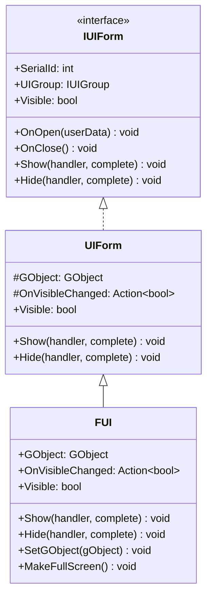
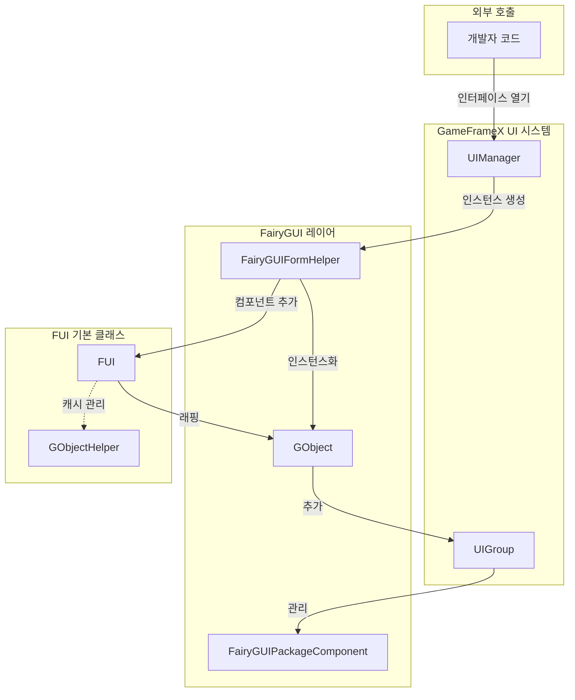
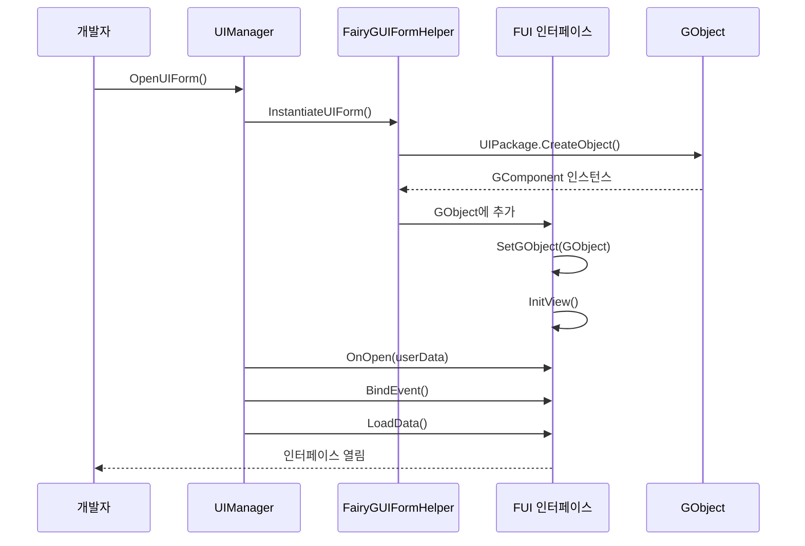

# FUI 인터페이스 기본 클래스

FUI는 GameFrameX 플러그인에서 FairyGUI 인터페이스의 기본 클래스로, UIForm을 상속하며 FairyGUI 특정 인터페이스 기능 구현을 제공합니다.

## 개요

`FUI` 클래스는 FairyGUI 인터페이스 시스템의 핵심 기본 클래스로, FairyGUI의 `GObject`와 GameFrameX의 UI 시스템을 연결합니다. `FUI`를 상속하면 개발자는 통일된 아키텍처의 FairyGUI 인터페이스를 생성할 수 있으며, 자동으로 다음 기능을 얻을 수 있습니다:

- GameFrameX UI 시스템과의 완벽한 통합
- 통일된 표시/숨김 애니메이션 지원
- 가시성 상태 관리 및 이벤트 콜백
- 전체 화면 표시 모드 지원
- GObject 생명주기 관리

### 상속 관계



## 아키텍처 설계

### 핵심 컴포넌트 상호작용



### 인터페이스 생명주기



## 핵심 기능

### 1. GObject 연결

FUI는 `GObject` 속성을 통해 FairyGUI의 인터페이스 객체에 연결하며, 이는 FairyGUI 시스템과 상호작용하는 핵심 진입점입니다.

```csharp
// 소스 경로: Runtime/FUI.cs#L45-L53
[UnityEngine.Scripting.Preserve]
public class FUI : UIForm
{
    /// <summary>
    /// 연결된 FairyGUI GObject 객체를 가져옵니다.
    /// </summary>
    [UnityEngine.Scripting.Preserve]
    public GObject GObject { get; private set; }
```
> Source: [FUI.cs](https://github.com/GameFrameX/com.gameframex.unity.ui.fairygui/blob/main/Runtime/FUI.cs#L45-L53)

### 2. 가시성 관리

FUI는 내부 설정 및 속성 접근을 포함한 완전한 가시성 관리 메커니즘을 제공합니다.

```csharp
// 소스 경로: Runtime/FUI.cs#L115-L155
/// <summary>
/// 내부적으로 인터페이스의 표시 상태를 설정하며, 이벤트를 발생시키지 않습니다.
/// </summary>
[UnityEngine.Scripting.Preserve]
protected override void InternalSetVisible(bool value)
{
    if (GObject.visible == value)
    {
        return;
    }

    GObject.visible = value;
    OnVisibleChanged?.Invoke(value);
    EventSubscriber?.Fire(UIFormVisibleChangedEventArgs.EventId, UIFormVisibleChangedEventArgs.Create(this, value));
}

/// <summary>
/// 인터페이스가 표시되는지 가져오거나 설정합니다.
/// </summary>
[UnityEngine.Scripting.Preserve]
public override bool Visible
{
    get
    {
        if (GObject == null)
        {
            return false;
        }

        return GObject.visible;
    }
    protected set
    {
        if (GObject == null)
        {
            return;
        }

        InternalSetVisible(value);
    }
}
```
> Source: [FUI.cs](https://github.com/GameFrameX/com.gameframex.unity.ui.fairygui/blob/main/Runtime/FUI.cs#L115-L155)

### 3. 표시/숨김 애니메이션

FUI는 UIForm에서 상속된 애니메이션 구성을 지원하며, 표시 및 숨김 애니메이션을 제공합니다.

```csharp
// 소스 경로: Runtime/FUI.cs#L74-L105
/// <summary>
/// 인터페이스를 표시합니다.
/// </summary>
[UnityEngine.Scripting.Preserve]
public override void Show(IUIFormShowHandler handler, Action complete)
{
    if (handler != null)
    {
        handler.Handler(GObject, EnableShowAnimation, ShowAnimationName, complete);
    }
    else
    {
        complete?.Invoke();
    }
}

/// <summary>
/// 인터페이스를 숨깁니다.
/// </summary>
[UnityEngine.Scripting.Preserve]
public override void Hide(IUIFormHideHandler handler, Action complete)
{
    if (handler != null)
    {
        handler.Handler(GObject, EnableHideAnimation, HideAnimationName, complete);
    }
    else
    {
        complete?.Invoke();
    }
}
```
> Source: [FUI.cs](https://github.com/GameFrameX/com.gameframex.unity.ui.fairygui/blob/main/Runtime/FUI.cs#L74-L105)

### 4. 전체 화면 표시

`MakeFullScreen()` 메서드는 인터페이스를 전체 화면 표시 모드로 설정합니다.

```csharp
// 소스 경로: Runtime/FUI.cs#L165-L168
/// <summary>
/// 현재 UI 객체를 전체 화면으로 표시합니다.
/// </summary>
[UnityEngine.Scripting.Preserve]
protected override void MakeFullScreen()
{
    GObject?.asCom?.MakeFullScreen();
}
```
> Source: [FUI.cs](https://github.com/GameFrameX/com.gameframex.unity.ui.fairygui/blob/main/Runtime/FUI.cs#L165-L168)

## 사용자 정의 인터페이스 생성

### 기본 단계

1. `FUI`를 상속하는 클래스 생성
2. `InitView()` 메서드를 구현하여 인터페이스 초기화
3. `OnOpen`, `OnClose` 등의 생명주기 메서드 재정의

### 예제 코드

```csharp
using FairyGUI;
using GameFrameX.UI.FairyGUI.Runtime;

public class MainMenuForm : FUI
{
    private GButton _startButton;
    private GTextField _titleText;

    public MainMenuForm(GObject gObject, bool isRoot = false) : base(gObject, isRoot)
    {
    }

    protected override void InitView()
    {
        base.InitView();

        // 인터페이스 컴포넌트 가져오기
        _startButton = GObject.GetChild("btn_start");
        _titleText = GObject.GetChild("txt_title");

        // 이벤트 바인딩
        _startButton.onClick.Add(OnStartButtonClick);
    }

    private void OnStartButtonClick()
    {
        // 시작 버튼 클릭 처리
    }

    protected override void OnOpen(object userData)
    {
        base.OnOpen(userData);
        // 인터페이스가 열릴 때의 로직
    }

    protected override void OnClose()
    {
        // 인터페이스가 닫힐 때의 정리 로직
        _startButton.onClick.Remove(OnStartButtonClick);
        base.OnClose();
    }
}
```
> Source: [FUI.cs](https://github.com/GameFrameX/com.gameframex.unity.ui.fairygui/blob/main/Runtime/FUI.cs#L179-L197)

## GObjectHelper 유틸리티 클래스

`GObjectHelper`는 FUI 객체의 캐시 및 관리 기능을 제공하여 GObject와 FUI 간의 매핑 관계를 쉽게 수립할 수 있습니다.

```csharp
// 소스 경로: Runtime/GObjectHelper.cs#L42-L115
namespace GameFrameX.UI.FairyGUI.Runtime
{
    /// <summary>
    /// GObject 헬퍼 클래스, FUI 객체의 캐시 및 관리 기능 제공.
    /// </summary>
    [UnityEngine.Scripting.Preserve]
    public static class GObjectHelper
    {
        private static readonly Dictionary<GObject, FUI> s_GObjectToFuiMap = new Dictionary<GObject, FUI>();

        /// <summary>
        /// 컴포넌트 풀에서 연결된 FUI 객체를 가져옵니다.
        /// </summary>
        [UnityEngine.Scripting.Preserve]
        public static T Get<T>(this GObject self) where T : FUI
        {
            if (self != null && s_GObjectToFuiMap.TryGetValue(self, out var pair))
            {
                return pair as T;
            }

            return default(T);
        }

        /// <summary>
        /// FUI 객체를 컴포넌트 풀에 추가합니다.
        /// </summary>
        [UnityEngine.Scripting.Preserve]
        public static void Add(this GObject self, FUI fui)
        {
            if (self != null && fui != null)
            {
                s_GObjectToFuiMap[self] = fui;
            }
        }

        /// <summary>
        /// 컴포넌트 풀에서 FUI 객체를 삭제합니다.
        /// </summary>
        [UnityEngine.Scripting.Preserve]
        public static FUI Remove(this GObject self)
        {
            if (self != null && s_GObjectToFuiMap.TryGetValue(self, out var value))
            {
                s_GObjectToFuiMap.Remove(self);
                return value;
            }

            return default;
        }

        /// <summary>
        /// 캐시된 모든 FUI 객체를 정리합니다.
        /// </summary>
        [UnityEngine.Scripting.Preserve]
        public static void ClearAll()
        {
            s_GObjectToFuiMap.Clear();
        }
    }
}
```
> Source: [GObjectHelper.cs](https://github.com/GameFrameX/com.gameframex.unity.ui.fairygui/blob/main/Runtime/GObjectHelper.cs#L42-L115)

## 바인딩 가능 속성 확장

`BindablePropertyExtension`은 FairyGUI 환경에서 바인딩 가능 속성을 사용하는便捷 메서드를 제공하며, GObject 파괴 시 속성 정리를 자동 처리합니다.

```csharp
// 소스 경로: Runtime/BindablePropertyExtension.cs#L42-L57
namespace GameFrameX.UI.FairyGUI.Runtime
{
    public static class BindablePropertyExtension
    {
        /// <summary>
        /// FairyGUI 환경에서 이 메서드를 사용하면 GObject가 파괴될 때 자동으로 바인딩 속성의 이벤트를 해제합니다.
        /// </summary>
        [UnityEngine.Scripting.Preserve]
        public static void ClearWithGObjectDestroyed<T>(this BindableProperty<T> bindableProperty, GObject gObject)
        {
            gObject.onRemovedFromStage.Add(bindableProperty.Clear);
        }
    }
}
```
> Source: [BindablePropertyExtension.cs](https://github.com/GameFrameX/com.gameframex.unity.ui.fairygui/blob/main/Runtime/BindablePropertyExtension.cs#L42-L57)

## API 참고

### FUI 클래스

#### 속성

| 속성명 | 유형 | 읽기 | 쓰기 | 설명 |
|--------|------|------|------|------|
| `GObject` | `GObject` | O | X | 연결된 FairyGUI GObject 객체 |
| `OnVisibleChanged` | `Action<bool>` | O | O | 가시성 변경 이벤트 콜백 가져오기 또는 설정 |
| `Visible` | `bool` | O | O | 인터페이스 가시성 가져오기 또는 설정 |
| `EnableShowAnimation` | `bool` | O | O | 표시 애니메이션 활성화 여부 (UIForm에서 상속) |
| `ShowAnimationName` | `string` | O | O | 표시 애니메이션 이름 (UIForm에서 상속) |
| `EnableHideAnimation` | `bool` | O | O | 숨김 애니메이션 활성화 여부 (UIForm에서 상속) |
| `HideAnimationName` | `string` | O | O | 숨김 애니메이션 이름 (UIForm에서 상속) |

#### 메서드

| 메서드명 | 반환 유형 | 설명 |
|--------|----------|------|
| `Show(handler, complete)` | `void` | 인터페이스 표시 |
| `Hide(handler, complete)` | `void` | 인터페이스 숨김 |
| `InternalSetVisible(value)` | `void` | 내부 가시성 설정 |
| `MakeFullScreen()` | `void` | 전체 화면으로 설정 |
| `SetGObject(gObject)` | `void` | 연결된 GObject 객체 설정 |
| `InitView()` | `void` | 뷰 초기화 (재정의 가능) |
| `OnOpen(userData)` | `void` | 인터페이스 열기 콜백 (재정의 가능) |
| `OnClose()` | `void` | 인터페이스 닫기 콜백 (재정의 가능) |
| `OnPause()` | `void` | 인터페이스 일시정지 콜백 (재정의 가능) |
| `OnResume()` | `void` | 인터페이스 재개 콜백 (재정의 가능) |

### GObjectHelper 정적 클래스

| 메서드명 | 반환 유형 | 설명 |
|--------|----------|------|
| `Get<T>(GObject)` | `T` | 캐시에서 연결된 FUI 객체 가져오기 |
| `Add(GObject, FUI)` | `void` | FUI 객체를 캐시에 추가 |
| `Remove(GObject)` | `FUI` | 캐시에서 FUI 객체 제거 |
| `ClearAll()` | `void` | 모든 캐시 비우기 |

## 관련 링크

- [인터페이스 관리자](./4-core-concepts.2-ui-manager)
- [패키지 관리자](./4-core-concepts.3-package-manager)
- [인터페이스 헬퍼](./4-core-concepts.4-form-helper)
- [인터페이스 그룹 헬퍼](./4-core-concepts.5-ui-group-helper)
- [FUI 클래스 API 참고](./5-api-reference.1-fui-class)
- [FairyGUIPackageComponent 클래스 API 참고](./5-api-reference.2-package-component)
- [첫 번째 인터페이스 생성](./3-getting-started.1-first-ui-form)