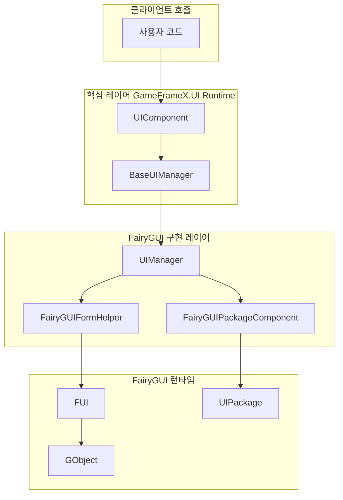
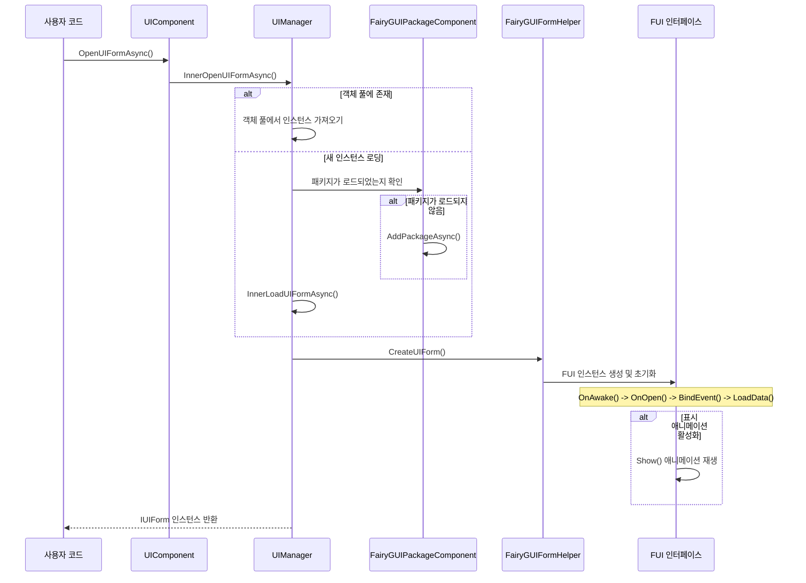
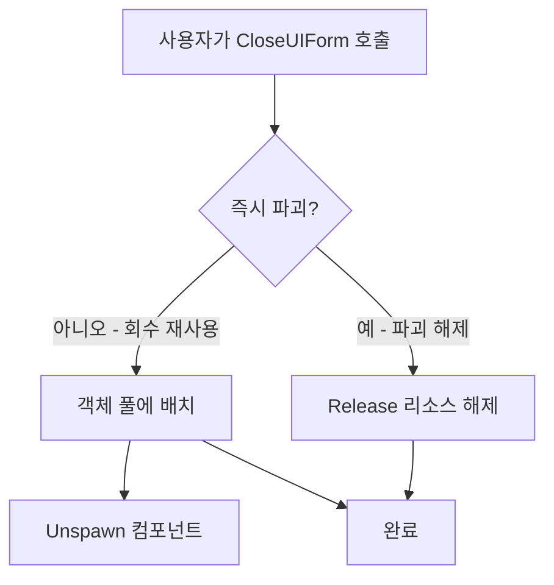
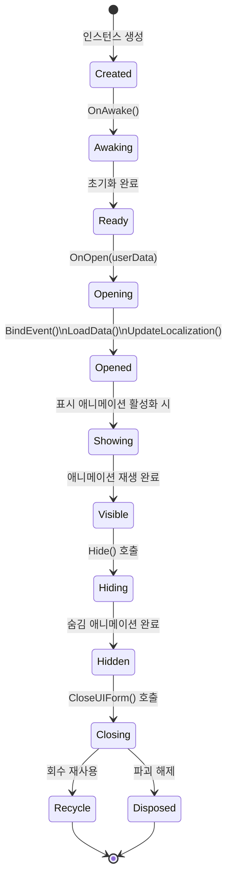

# 인터페이스 열기 및 닫기

이 문서는 GameFrameX 프레임워크에서 FairyGUI 플러그인을 사용하여 인터페이스를 열고 닫는 방법을 소개합니다.

## 개요

GameFrameX 프레임워크에서 인터페이스의 열기 및 닫기 작업은 핵심 UIComponent가統一적으로 관리하며, FairyGUI 플러그인은 `UIManager`를 통해 구체적인 기능을 구현합니다. 인터페이스 생명주기 관리를 이해하는 것은 원활한 UI 시스템을 구축하는 데 중요합니다.

인터페이스 관리는 비동기 로딩 메커니즘을 채택하며, 다음을 지원합니다:
- 객체 풀 재사용, 성능 향상
- 패키지 요청 시 로딩, 초기 로딩 시간 감소
- 표시/숨김 애니메이션, 사용자 경험 향상
- 인터페이스 그룹 관리, 레벨 제어 지원

## 아키텍처

인터페이스 열기 및 닫기에는 다음 핵심 컴포넌트의 협력이 관련됩니다:



### 컴포넌트 책임

| 컴포넌트 | 책임 |
|------|------|
| UIComponent | 공개 Open/Close 인터페이스 제공 |
| UIManager | 인터페이스 열기 닫기 구체 로직 구현 |
| FairyGUIFormHelper | UI 인터페이스 인스턴스 생성 및 해제 |
| FairyGUIPackageComponent | UI 패키지 로딩 및 캐시 관리 |
| FUI | 기본 클래스, GObject 래핑 및 생명주기 메서드 제공 |

## 인터페이스 열기流程

인터페이스 열기는 리소스 로딩, 패키지 관리, 인스턴스 생성 및 인터페이스 초기화를 포함한 비동기 과정입니다.

### 핵심流程



### 인터페이스 열기 예제

```csharp
using GameFrameX.UI.Runtime;
using GameFrameX.UI.FairyGUI.Runtime;

// 비동기로 인터페이스 열기
var uiForm = await GameEntry.UI.OpenUIFormAsync(
    "UI/TestUI",           // 인터페이스 리소스 경로
    typeof(TestUIForm),    // 인터페이스 로직 유형
    "MainUI"               // 인터페이스 그룹 이름
);

// 또는 사용자 데이터와 함께 여는 방식
var userData = new OpenFormData { Id = 1001, Name = "Player" };
var uiFormWithData = await GameEntry.UI.OpenUIFormAsync(
    "UI/PlayerInfo",
    typeof(PlayerInfoForm),
    "MainUI",
    false,                 // 덮여있는 인터페이스를 일시정지할지 여부
    userData               // 인터페이스에 전달할 데이터
);
```

> Source: [UIManager.Open.cs](https://github.com/GameFrameX/com.gameframex.unity.ui.fairygui/blob/main/Runtime/UIManager.Open.cs#L66-L107)

### 열기 매개변수 설명

| 매개변수 | 유형 | 설명 |
|------|------|------|
| uiFormAssetPath | string | 인터페이스 리소스 경로, 예: "UI/TestUI" |
| uiFormType | Type | 인터페이스 로직 클래스의 유형 |
| uiGroupName | string | 레벨 제어를 위한 인터페이스 그룹 이름 |
| pauseCoveredUIForm | bool | 덮여있는 인터페이스를 일시정지할지 여부 |
| userData | object | 인터페이스에 전달할 사용자 정의 데이터 |
| isFullScreen | bool | 전체 화면으로 표시할지 여부 |

## 인터페이스 닫기流程

인터페이스 닫기는 회수 재사용 및 파괴 해제 두 가지 모드를 지원합니다.

### 핵심流程



### 인터페이스 닫기 예제

```csharp
// 인터페이스 인스턴스로 닫기
var uiForm = GameEntry.UI.GetUIForm(serialId);
GameEntry.UI.CloseUIForm(uiForm);

// 인터페이스 유형으로 닫기 (해당 유형의 모든 인터페이스 닫기)
GameEntry.UI.CloseUIForm(typeof(TestUIForm));

// 모든 인터페이스 닫기
GameEntry.UI.CloseAllUIForms();

// 인터페이스를 닫으면서 동시에 데이터 전달
GameEntry.UI.CloseUIForm(uiForm, closeFormData);
```

> Source: [UIManager.Close.cs](https://github.com/GameFrameX/com.gameframex.unity.ui.fairygui/blob/main/Runtime/UIManager.Close.cs#L50-L79)

## 인터페이스 생명주기

FUI 인터페이스는 완전한 생명주기를 가지며, 각 단계에서 해당 콜백 메서드가 트리거됩니다.

### 생명주기 단계



### 각 단계 설명

| 단계 | 메서드 | 설명 |
|------|------|------|
| 생성 | 생성자 | 인터페이스 객체 인스턴스화 |
| 깨우기 | OnAwake() | 인터페이스 로직이 최초로 실행될 때 호출 |
| 열기 | OnOpen(userData) | 인터페이스가 열릴 때 호출, 열 때 전달된 데이터 수신 가능 |
| 이벤트 바인딩 | BindEvent() | 인터페이스 이벤트 리스너 바인딩 |
| 데이터 로딩 | LoadData() | 인터페이스에 필요한 데이터 로딩 |
| 지역화 | UpdateLocalization() | 인터페이스 텍스트 지역화 업데이트 |
| 표시 | Show() | 표시 애니메이션 재생 (활성화된 경우) |
| 숨김 | Hide() | 숨김 애니메이션 재생 (활성화된 경우) |
| 회수 | OnRecycle() | 인터페이스가 객체 풀로 회수될 때 호출 |
| 파괴 | OnClose() | 인터페이스가 실제로 파괴될 때 호출 |

### 생명주기 메서드 예제

```csharp
using FairyGUI;
using GameFrameX.UI.FairyGUI.Runtime;

public class TestUIForm : FUI
{
    // 인터페이스가 최초로 생성될 때 호출
    protected override void OnAwake()
    {
        base.OnAwake();
        // 인터페이스 컴포넌트 참조 초기화
    }

    // 인터페이스가 열릴 때 호출
    protected override void OnOpen(object userData)
    {
        base.OnOpen(userData);

        // 열 때 전달된 데이터 수신
        if (userData is OpenFormData data)
        {
            // 전달된 데이터 처리
        }
    }

    // 인터페이스가 닫힐 때 호출
    protected override void OnClose()
    {
        base.OnClose();
        // 데이터 정리, 이벤트 구독 취소 등
    }

    // 인터페이스가 회수될 때 호출
    protected override void OnRecycle()
    {
        base.OnRecycle();
        // 인터페이스 상태 초기화, 재사용 준비
    }
}
```

> Source: [FUI.cs](https://github.com/GameFrameX/com.gameframex.unity.ui.fairygui/blob/main/Runtime/FUI.cs#L43-L197)

## 인터페이스 그룹 관리

인터페이스 그룹은 다양한 레벨과 유형의 인터페이스 관리에 사용되며, 인터페이스의 표시 우선순위 제어를 실현합니다.

### 인터페이스 그룹 구성

인터페이스 그룹은 `[OptionUIGroup]` 특성을 통해 인터페이스 클래스에서 지정됩니다:

```csharp
using GameFrameX.UI.Runtime;

[OptionUIGroup("MainUI")]
public class MainMenuForm : FUI
{
    // 인터페이스 구현
}
```

> See [인터페이스 그룹 구성](./6-configuration.2-ui-group-config) for full details on configuring UI groups.

### 인터페이스 그룹 사용 예제

```csharp
// 인터페이스 열 때 그룹 지정
await GameEntry.UI.OpenUIFormAsync(
    "UI/MainMenu",
    typeof(MainMenuForm),
    "MainUI"  // 인터페이스 그룹 이름
);

// 인터페이스 그룹 가져오기
var uiGroup = GameEntry.UI.GetUIGroup("MainUI");

// 그룹 내 모든 인터페이스 가져오기
var allForms = uiGroup.GetAllUIForms();
```

## 고급 사용법

### 사용자 정의 표시 애니메이션

특성을 통해 인터페이스의 표시 및 숨김 애니메이션을 구성할 수 있습니다:

```csharp
using GameFrameX.UI.Runtime;

[OptionUIGroup("DialogUI")]
[OptionUIShowAnimation(true, "DialogOpen")]
[OptionUIHideAnimation(true, "DialogClose")]
public class DialogForm : FUI
{
    // 인터페이스 구현
}
```

### FUI 객체 가져오기

GObjectHelper 유틸리티 클래스를 사용하면 GObject에 해당하는 FUI 객체를 쉽게 가져올 수 있습니다:

```csharp
using GameFrameX.UI.FairyGUI.Runtime;

// GObject 확장 메서드를 통해 FUI 가져오기
TestUIForm fui = GObject.Get<TestUIForm>();

// FUI를 GObject에 연결
GObject.Add(fui);

// FUI 연결 제거
GObject.Remove();
```

> Source: [GObjectHelper.cs](https://github.com/GameFrameX/com.gameframex.unity.ui.fairygui/blob/main/Runtime/GObjectHelper.cs#L42-L114)

### 인터페이스 가시성 변화 감시

```csharp
public class TestUIForm : FUI
{
    protected override void OnAwake()
    {
        base.OnAwake();

        // 가시성 변화 이벤트 구독
        OnVisibleChanged = OnVisibleChangedHandler;
    }

    private void OnVisibleChangedHandler(bool visible)
    {
        if (visible)
        {
            // 인터페이스 표시
        }
        else
        {
            // 인터페이스 숨김
        }
    }
}
```

> Source: [FUI.cs](https://github.com/GameFrameX/com.gameframex.unity.ui.fairygui/blob/main/Runtime/FUI.cs#L62-L63)

## 일반 문제

### 인터페이스 열기 실패

인터페이스를 열 수 없는 경우 다음을 확인하세요:
1. 인터페이스 리소스 경로가 올바른지
2. FairyGUI 패키지가 올바르게 프로젝트에 추가되었는지
3. 인터페이스 클래스가 FUI를 상속하는지
4. 인터페이스 그룹 이름이 구성되었는지

### 인터페이스 닫은 후 데이터가 초기화되지 않음

`OnRecycle()` 메서드에서 인터페이스 상태를 초기화해야 합니다:

```csharp
protected override void OnRecycle()
{
    base.OnRecycle();
    // 입력 필드, 리스트 등 컨트롤 상태 초기화
    // 캐시 데이터 지우기
}
```

### 인터페이스 애니메이션이 재생되지 않음

다음 조건을 충족하는지 확인하세요:
1. 인터페이스 클래스에 `[OptionUIShowAnimation]`이 구성되어 있는지
2. FairyGUI 편집기에서 해당 애니메이션이 생성되었는지
3. 인터페이스 관리자에서 애니메이션 기능이 활성화되어 있는지

## 관련 링크

- [첫 번째 인터페이스 생성](./3-getting-started.1-first-ui-form) - 새 인터페이스 생성 방법 학습
- [FUI 인터페이스 기본 클래스](./4-core-concepts.1-fui-base-class) - FUI 기본 클래스 심층 학습
- [인터페이스 관리자](./4-core-concepts.2-ui-manager) - UIManager 상세 문서
- [인터페이스 헬퍼](./4-core-concepts.4-form-helper) - FairyGUIFormHelper 문서
- [패키지 관리자](./4-core-concepts.3-package-manager) - FairyGUIPackageComponent 문서
- [인터페이스 그룹 구성](./6-configuration.2-ui-group-config) - 인터페이스 그룹 구성 가이드