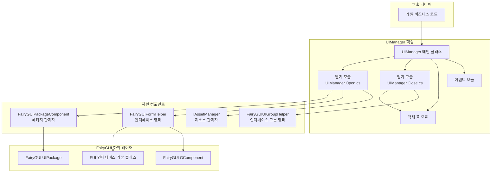
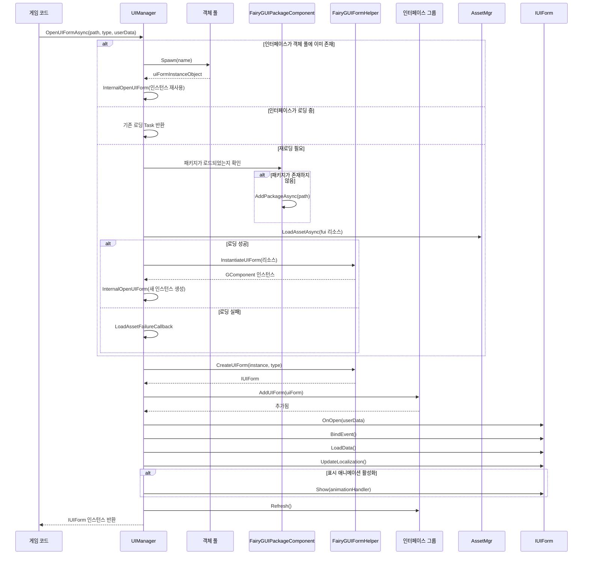

# 인터페이스 관리자

UIManager는 FairyGUI 플러그인의 핵심 컴포넌트로, 인터페이스의 열기, 닫기 및 생명주기 관리를 담당합니다. `BaseUIManager`를 상속하며, 비동기 로딩, 객체 풀 재사용, 인터페이스 그룹 관리 등의 기능을 제공하는 FairyGUI 특정 인터페이스 관리 구현을 지원합니다.

## 개요

UIManager는 GameFrameX UI 시스템에서 FairyGUI의 구체적인 구현으로, 모든 FairyGUI 인터페이스의 완전한 생명주기를 관리합니다. 개발자는 UIManager를 통해 인터페이스를 쉽게 열고, 닫고, 표시하고, 숨길 수 있으며, 시스템은 리소스 로딩, 캐싱 및 회수를 자동으로 처리합니다.

### 핵심 책임

- **인터페이스 로딩 및 인스턴스화**: Resources 디렉토리 또는 AssetBundle에서 UI 리소스를 비동기로 로딩하는 기능 지원
- **객체 풀 관리**: 객체 풀을 통해 인터페이스 인스턴스 재사용, 메모리 할당 및 GC 오버헤드 감소
- **인터페이스 그룹 관리**: 인터페이스를 다른 그룹에 할당하여 그룹 표시 및 숨김 지원
- **생명주기 관리**: 인터페이스의 초기화, 열기, 닫기, 회수 등의 상태 전환 관리

### 설계 의도

UIManager는 부분 클래스(Partial Class) 방식으로 코드를 구성하여, 다양한 기능 모듈을 독립적인 파일로 분리합니다:
- `UIManager.cs`: 기초 초기화 및 리소스 관리자 설정
- `UIManager.Open.cs`: 인터페이스 열기 및 비동기 로딩 로직
- `UIManager.Close.cs`: 인터페이스 닫기 및 리소스 회수 로직
- `UIManager.OpenUIFormInfoData.cs`: 인터페이스 열기 정보의 데이터 구조

이러한 설계는 코드의 유지보수성과 확장성을 높이며, 각 파일이 단일 책임에 집중합니다.

## 아키텍처 설계



### 컴포넌트 관계 설명

| 컴포넌트 | 책임 | 의존자 |
|------|------|--------|
| UIManager | 인터페이스 관리 핵심 | 게임 비즈니스 코드 |
| FairyGUIPackageComponent | FairyGUI 패키지 로딩 및 관리 | UIManager |
| FairyGUIFormHelper | 인터페이스 인스턴스화 및 해제 | UIManager |
| FairyGUIUIGroupHelper | 인터페이스 그룹 관리 | UIManager |
| IAssetManager | 리소스 로딩 | UIManager.Open.cs |

## 핵심 흐름

### 인터페이스 열기 흐름

`OpenUIFormAsync`를 호출하여 인터페이스를 열면, 시스템은 다음 흐름을 따릅니다:



### 인터페이스 닫기 및 회수 흐름

```mermaid
flowchart TD
    Start([CloseUIForm 호출]) --> Check{즉시 파괴 필요?}
    
    Check -->|아니오| Recycle[RecycleUIForm 호출]
    Check -->|예| Dispose[RecycleUIForm(isDispose=true) 호출]
    
    Recycle --> OnRecycle[uiForm.OnRecycle()]
    OnRecycle --> GetHandle[Handle 가져오기]
    GetHandle --> GetDisplayInfo[DisplayObjectInfo 가져오기]
    GetDisplayInfo --> Unspawn[객체 풀 Unspawn]
    
    Dispose --> OnRecycle2[uiForm.OnRecycle()]
    OnRecycle2 --> Unspawn2[객체 풀 Unspawn]
    Unspawn2 --> Release[객체 풀 Release]
    
    Unspawn --> End([완료])
    Release --> End
```

## 핵심 기능 상세

### 비동기 인터페이스 로딩

UIManager는 완전한 비동기 인터페이스 로딩 메커니즘을 지원하며, 이는大型 UI 리소스 로딩에 특히 중요합니다. 메인 스레드를 차단하지 않아 사용자 경험을 유지할 수 있습니다:

```csharp
// 비동기로 인터페이스 열기
var uiForm = await UIManager.Instance.OpenUIFormAsync("UI/MainMenu", typeof(MainMenuForm), userData);
```

> Source: [UIManager.Open.cs](https://github.com/GameFrameX/com.gameframex.unity.ui.fairygui/blob/main/Runtime/UIManager.Open.cs#L66-L107)

시스템은 먼저 객체 풀에 재사용 가능한 인터페이스 인스턴스가 있는지 확인합니다. 존재하면 직접 재사용하여 반복 생성 방지합니다. 존재하지 않으면 비동기 로딩 흐름에 진입합니다.

### 객체 풀 관리

UIManager는 인터페이스 인스턴스를 관리하기 위해 내장 객체 풀을 갖추고 있으며, 다음과 같은 이점을 가져다줍니다:

- **메모리 할당 감소**: 빈번한 인터페이스 객체 생성 및 파괴 방지
- **로딩 속도 향상**: 인스턴스 재사용으로 인터페이스를 즉시 열 수 있음
- **GC 압박 감소**: 쓰레기 객체 생성을 줄임

객체 풀 초기화는 생성자에서 완료됩니다:

```csharp
public UIManager()
{
    m_InstancePool = null;  // 객체 풀 인스턴스
    m_RecycleTime = 0;
    if (m_RecycleInterval < 10)
    {
        m_RecycleInterval = 10;  // 기본 회수 간격 10초
    }
}
```

> Source: [UIManager.cs](https://github.com/GameFrameX/com.gameframex.unity.ui.fairygui/blob/main/Runtime/UIManager.cs#L62-L77)

### 인터페이스 리소스 경로 해석

시스템은 두 가지 리소스 로딩 방식을 지원합니다:

1. **Resources에서 로딩**: 경로에 "Bundles" 디렉토리가 포함되지 않으면 Resources 디렉토리에서 로딩
2. **AssetBundle에서 로딩**: 경로에 "Bundles" 디렉토리가 포함되면 YooAsset을 사용하여 비동기 로딩

```csharp
// 리소스 로딩 방식 판단
if (assetPath.IndexOf(Utility.Asset.Path.BundlesDirectoryName, StringComparison.OrdinalIgnoreCase) < 0)
{
    // Resources에서 로딩
    if (!hasUIPackage)
    {
        FairyGuiPackage.AddPackageSync(assetPath);
    }
    return LoadAssetSuccessCallback(...);
}
```

> Source: [UIManager.Open.cs](https://github.com/GameFrameX/com.gameframex.unity.ui.fairygui/blob/main/Runtime/UIManager.Open.cs#L137-L146)

### 인터페이스 그룹 지원

각 인터페이스는 인터페이스 그룹(UIGroup)에 속하며, 인터페이스 그룹은 인터페이스의 표시 레벨과 표시 전략을 결정합니다:

```csharp
var uiGroup = uiForm.UIGroup;
if (!uiGroup.InternalHasInstanceUIForm(uiFormAssetName, uiForm))
{
    uiGroup.AddUIForm(uiForm);
}
uiGroup.Refresh();
```

> Source: [UIManager.Open.cs](https://github.com/GameFrameX/com.gameframex.unity.ui.fairygui/blob/main/Runtime/UIManager.Open.cs#L236-L250)

### 인터페이스 회수 메커니즘

인터페이스를 닫을 때, 시스템은 구성에 따라 회수 또는 파괴를 결정합니다:

```csharp
protected override void RecycleUIForm(IUIForm uiForm, bool isDispose = false)
{
    uiForm.OnRecycle();
    var formHandle = uiForm.Handle as GameObject;
    if (!formHandle) return;

    var displayObjectInfo = formHandle.GetComponent<DisplayObjectInfo>();
    if (!displayObjectInfo) return;

    var component = displayObjectInfo.displayObject.gOwner as GComponent;
    if (component == null) return;

    m_InstancePool.Unspawn(component);
    if (isDispose)
    {
        m_InstancePool.ReleaseObject(component);
    }
}
```

> Source: [UIManager.Close.cs](https://github.com/GameFrameX/com.gameframex.unity.ui.fairygui/blob/main/Runtime/UIManager.Close.cs#L52-L79)

## 인터페이스 열기 정보 데이터

OpenUIFormInfoData는 인터페이스 로딩 과정에서 정보를 전달하는 참조 유형 데이터 클래스입니다:

```csharp
internal sealed class OpenUIFormInfoData : IReference
{
    private int m_SerialId = 0;
    private bool m_PauseCoveredUIForm = false;
    private object m_UserData = null;
    private string m_PackageName;
    private string m_UIName;
    private Type m_FormType;
    
    public static OpenUIFormInfoData Create(int serialId, string packageName, string uiName, 
        Type uiFormType, bool pauseCoveredUIForm, object userData)
    {
        // 참조 풀에서 인스턴스 가져오기
        OpenUIFormInfoData openUIFormInfo = ReferencePool.Acquire<OpenUIFormInfoData>();
        // ... 필드 초기화
        return openUIFormInfo;
    }
    
    public void Clear()
    {
        // 모든 필드 초기화
    }
}
```

> Source: [UIManager.OpenUIFormInfoData.cs](https://github.com/GameFrameX/com.gameframex.unity.ui.fairygui/blob/main/Runtime/UIManager.OpenUIFormInfoData.cs#L41-L177)

## 이벤트 시스템

UIManager는 인터페이스 열기 성공 또는 실패를 알리기 위한 완전한 이벤트 시스템을 제공합니다:

```csharp
// 인터페이스 열기 성공 이벤트
m_OpenUIFormSuccessEventHandler = null;

// 인터페이스 열기 실패 이벤트  
m_OpenUIFormFailureEventHandler = null;
```

인터페이스가 성공적으로 열릴 때 성공 이벤트가 트리거됩니다:

```csharp
if (m_OpenUIFormSuccessEventHandler != null)
{
    OpenUIFormSuccessEventArgs openUIFormSuccessEventArgs = 
        OpenUIFormSuccessEventArgs.Create(uiForm, duration, userData);
    m_OpenUIFormSuccessEventHandler(this, openUIFormSuccessEventArgs);
}
```

> Source: [UIManager.Open.cs](https://github.com/GameFrameX/com.gameframex.unity.ui.fairygui/blob/main/Runtime/UIManager.Open.cs#L252-L258)

## 초기화 구성

UIManager는 런타임에서 올바르게 초기화되어야 하며, 일반적으로 게임 시작 시 의존성 주입을 통해 완료됩니다:

```csharp
public override void SetResourceManager(IAssetManager assetManager)
{
    base.SetResourceManager(assetManager);
    // FairyGUI 패키지 관리 컴포넌트 가져오기
    FairyGuiPackage = GameEntry.GetComponent<FairyGUIPackageComponent>();
    GameFrameworkGuard.NotNull(FairyGuiPackage, nameof(FairyGuiPackage));
}
```

> Source: [UIManager.cs](https://github.com/GameFrameX/com.gameframex.unity.ui.fairygui/blob/main/Runtime/UIManager.cs#L87-L92)

## 관련 링크

- [FUI 인터페이스 기본 클래스](./4-core-concepts.1-fui-base-class) - 모든 FairyGUI 인터페이스의 기본 클래스 구현 학습
- [패키지 관리자](./4-core-concepts.3-package-manager) - FairyGUI 패키지의 로딩 및 관리 학습
- [인터페이스 헬퍼](./4-core-concepts.4-form-helper) - 인터페이스 인스턴스화 및 해제 메커니즘 학습
- [인터페이스 그룹 헬퍼](./4-core-concepts.5-ui-group-helper) - 인터페이스 그룹 관리 메커니즘 학습
- [빠른 시작: 인터페이스 열기 및 닫기](./3-getting-started.2-open-close-ui) - 실습 튜토리얼