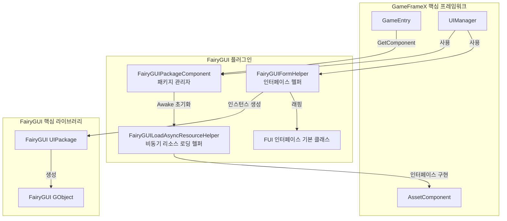
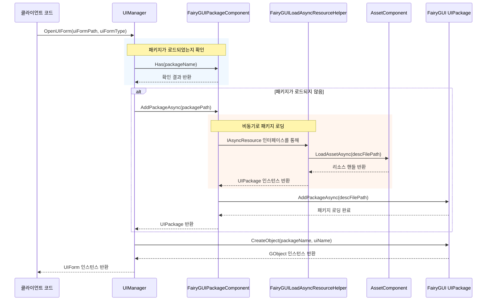

# 패키지 관리자

패키지 관리자는 FairyGUI 플러그인의 핵심 컴포넌트로, 모든 UI 패키지의 로딩, 캐싱 및 언로드 작업을 담당합니다. 동기 및 비동기 두 가지 로딩 방식을 지원하며, GameFrameX의 리소스 관리 시스템과 깊이 통합되어 있습니다.

## 개요

`FairyGUIPackageComponent`는 `GameFrameworkComponent`를 상속하는 Unity 컴포넌트로, FairyGUI와 GameFrameX 리소스 시스템 간의 다리 역할을 합니다. 주요 책임은 다음과 같습니다:

- **패키지 로딩 관리**: 동기 및 비동기 UI 패키지 로딩 지원
- **패키지 캐싱 메커니즘**: 로드된 패키지는 캐시되어 중복 로딩 방지
- **리소스 정리**: 패키지 언로드 기능 제공, 메모리 리소스 해제
- **비동기 리소스 로딩**: `IAsyncResource` 인터페이스를 구현하여 FairyGUI의 비동기 리소스 로딩 요구 충족

### 핵심 책임

패키지 관리자의 설계 목표는 UI 패키지 관리 프로세스를 단순화하여, 개발자가 인터페이스 로직而非 리소스 로딩 세부 사항에 집중할 수 있도록 하는 것입니다. UI 인터페이스를 표시해야 할 때, 패키지 관리자는 자동으로 대상 패키지가 로드되었는지 확인합니다:

- 패키지가 로드됨 → 캐시된 패키지를 사용하여 직접 인터페이스 인스턴스 생성
- 패키지가 로드되지 않음 → 패키지를 로드한 후 인터페이스 인스턴스 생성

이러한 설계는 UI 개발 프로세스를 크게 단순화하고 개발 효율성을 향상시킵니다.

## 아키텍처 설계

패키지 관리자의 시스템 내 위치 및 상호작용 관계는 다음과 같습니다:



### 핵심 클래스 설명

| 클래스명 | 책임 | 접근 수준 |
|------|------|----------|
| `FairyGUIPackageComponent` | UI 패키지 관리 핵심 컴포넌트 | `public` |
| `FairyGUILoadAsyncResourceHelper` | IAsyncResource 인터페이스를 구현하여 비동기 리소스 로딩 처리 | `internal` |
| `UIPackageData` | 로드된 패키지 정보 저장 | `public` (중첩 클래스) |

## 핵심 기능

### 패키지 로딩 메커니즘

패키지 관리자는 이중 로딩 전략을 채택하여 동기 및 비동기 로딩 방식을 모두 지원합니다:

#### 비동기 로딩 (권장)

```csharp
/// <summary>
/// 비동기로 UI 패키지를 추가합니다.
/// </summary>
/// <param name="descFilePath">설명 파일 경로</param>
/// <param name="isLoadAsset">리소스를 로드할지 여부</param>
/// <returns>UI 패키지를 나타내는 비동기 작업</returns>
public Task<UIPackage> AddPackageAsync(string descFilePath, bool isLoadAsset = true)
```

비동기 로딩은 권장되는 사용 방식으로, 특히 대규모 UI 리소스를 동적으로 로딩해야 하는 시나리오에 적합합니다. 로딩 과정에서 메인 스레드를 차단하지 않아 부드러운 사용자 경험을 유지할 수 있습니다.

> Source: [FairyGUIPackageComponent.cs#L148-L179](https://github.com/GameFrameX/com.gameframex.unity.ui.fairygui/blob/main/Runtime/FairyGUIPackageComponent.cs#L148-L179)

#### 동기 로딩

```csharp
/// <summary>
/// 동기식으로 UI 패키지를 추가합니다.
/// </summary>
/// <param name="descFilePath">설명 파일 경로</param>
/// <param name="isLoadAsset">리소스를 로드할지 여부</param>
public void AddPackageSync(string descFilePath, bool isLoadAsset = true)
```

동기 로딩은 편집기 환경이나 게임 시작 시 사전 로딩 시나리오에 적합합니다.

> Source: [FairyGUIPackageComponent.cs#L190-L203](https://github.com/GameFrameX/com.gameframex.unity.ui.fairygui/blob/main/Runtime/FairyGUIPackageComponent.cs#L190-L203)

### 패키지 조회 작업

```csharp
/// <summary>
/// 지정된 이름의 UI 패키지가 존재하는지 확인합니다.
/// </summary>
public bool Has(string uiPackageName)

/// <summary>
/// 지정된 이름의 UI 패키지를 가져옵니다.
/// </summary>
public UIPackage Get(string uiPackageName)
```

> Source: [FairyGUIPackageComponent.cs#L265-L290](https://github.com/GameFrameX/com.gameframex.unity.ui.fairygui/blob/main/Runtime/FairyGUIPackageComponent.cs#L265-L290)

### 패키지 언로드 메커니즘

패키지 관리자는 정밀한 언로드 제어를 제공합니다:

```csharp
/// <summary>
/// 지정된 이름의 UI 패키지를 제거합니다.
/// </summary>
public void RemovePackage(string packageName)

/// <summary>
/// 모든 UI 패키지를 제거합니다.
/// </summary>
public void RemoveAllPackages()
```

언로드 작업은 다음 단계를 실행합니다:
1. `Package.UnloadAssets()`를 호출하여 리소스 언로드
2. FairyGUI에서 패키지 제거
3. 리소스 헬퍼를 통해 하위 리소스 해제
4. 캐시 딕셔너리에서 레코드 제거

> Source: [FairyGUIPackageComponent.cs#L213-L254](https://github.com/GameFrameX/com.gameframex.unity.ui.fairygui/blob/main/Runtime/FairyGUIPackageComponent.cs#L213-L254)

## 로딩 흐름

인터페이스 관리자(UIManager)가 UI 인터페이스를 열 때, 패키지 관리자의 호출 흐름은 다음과 같습니다:



### 핵심 설계 포인트

1. **자동 패키지 로딩**: 인터페이스 관리자가 필요한 UI 패키지를 자동으로 확인하고 로딩하므로, 개발자가 수동으로 관리할 필요 없음
2. **동시 로딩 제어**: `m_UIPackageLoading` 딕셔너리를 통해同一 패키지의 반복 로딩 요청 방지
3. **리소스 유형 구분**: 리소스 유형(이미지, 오디오, 폰트 등)에 따라 다른 로딩 전략 사용

## 비동기 리소스 로딩 헬퍼

`FairyGUILoadAsyncResourceHelper`는 패키지 관리자의 내부 컴포넌트로, FairyGUI의 `IAsyncResource` 인터페이스를 구현합니다. 주요 기능은 다음과 같습니다:

- GameFrameX의 `AssetComponent`를 FairyGUI에서 사용하도록 래핑
- UI 패키지 리소스의 비동기 로딩 관리
- 다양한 유형 리소스의 로딩 로직 처리 (이미지, 图集, 폰트, 오디오 등)

### 지원되는 리소스 유형

| 리소스 유형 | FairyGUI 유형 | 로딩 방식 |
|----------|---------------|----------|
| 이미지 | `PackageItemType.Image` | Texture |
| 图集 | `PackageItemType.Atlas` | Texture |
| 오디오 | `PackageItemType.Sound` | AudioClip |
| 폰트 | `PackageItemType.Font` | Font |
| Spine 애니메이션 | `PackageItemType.Spine` | TextAsset |
| 드래곤본 애니메이션 | `PackageItemType.DragoneBones` | DragonBonesData |

> Source: [FairyGUILoadAsyncResourceHelper.cs#L124-L252](https://github.com/GameFrameX/com.gameframex.unity.ui.fairygui/blob/main/Runtime/FairyGUILoadAsyncResourceHelper.cs#L124-L252)

## 사용 예제

### 패키지 관리자 인스턴스 가져오기

```csharp
var packageComponent = GameEntry.GetComponent<FairyGUIPackageComponent>();
```

### 패키지가 존재하는지 확인

```csharp
bool exists = packageComponent.Has("MyUIPackage");
```

### 수동으로 패키지 로딩

```csharp
// 비동기 로딩
var package = await packageComponent.AddPackageAsync("UIPackages/MyUIPackage");

// 동기 로딩
packageComponent.AddPackageSync("UIPackages/MyUIPackage");
```

### 로드된 패키지 가져오기

```csharp
var package = packageComponent.Get("MyUIPackage");
if (package != null)
{
    // 패키지를 사용하여 객체 생성
    var obj = package.CreateObject("MainPanel");
}
```

### 패키지 언로드

```csharp
// 지정된 패키지 언로드
packageComponent.RemovePackage("MyUIPackage");

// 모든 패키지 언로드
packageComponent.RemoveAllPackages();
```

## 내부 구현 상세

### 패키지 데이터 저장

각 로드된 패키지는 `UIPackageData` 인스턴스를 생성하여 저장합니다:

```csharp
[Serializable]
public sealed class UIPackageData
{
    public string DescFilePath { get; }      // 설명 파일 경로
    public bool IsLoadAsset { get; }          // 리소스를 로드할지 여부
    public UIPackage Package { get; }         // 패키지 인스턴스
    public string Name { get; }               // 패키지 이름
}
```

> Source: [FairyGUIPackageComponent.cs#L64-L136](https://github.com/GameFrameX/com.gameframex.unity.ui.fairygui/blob/main/Runtime/FairyGUIPackageComponent.cs#L64-L136)

### 컴포넌트 초기화

패키지 관리자는 `Awake` 단계에서 초기화를 수행합니다:

```csharp
protected override void Awake()
{
    IsAutoRegister = false;
    base.Awake();
    m_ResourceHelper = new FairyGUILoadAsyncResourceHelper();
    UIPackage.SetAsyncLoadResource(m_ResourceHelper);
}
```

여기서 `IsAutoRegister = false`를 설정하여 GameEntry에 자동 등록하지 않도록 하는데, 이는 초기화 순서를 수동으로 제어하기 위함입니다.

> Source: [FairyGUIPackageComponent.cs#L300-L306](https://github.com/GameFrameX/com.gameframex.unity.ui.fairygui/blob/main/Runtime/FairyGUIPackageComponent.cs#L300-L306)

## API 참고

### `FairyGUIPackageComponent` 클래스

#### 메서드

| 메서드 | 반환 유형 | 설명 |
|------|----------|------|
| `AddPackageAsync(string, bool)` | `Task<UIPackage>` | UI 패키지를 비동기로 추가 |
| `AddPackageSync(string, bool)` | `void` | UI 패키지를 동기식으로 추가 |
| `RemovePackage(string)` | `void` | 지정된 이름의 UI 패키지 제거 |
| `RemoveAllPackages()` | `void` | 모든 UI 패키지 제거 |
| `Has(string)` | `bool` | 지정된 이름의 UI 패키지가 존재하는지 확인 |
| `Get(string)` | `UIPackage` | 지정된 이름의 UI 패키지 가져오기 |

#### 속성

| 속성 | 유형 | 설명 |
|------|------|------|
| `m_UILoadedPackages` | `Dictionary<string, UIPackageData>` | 로드된 패키지의 캐시 딕셔너리 |
| `m_UIPackageLoading` | `Dictionary<string, TaskCompletionSource<UIPackage>>` | 로딩 중인 패키지 딕셔너리 |

### `UIPackageData` 중첩 클래스

| 속성 | 유형 | 설명 |
|------|------|------|
| `DescFilePath` | `string` | 설명 파일 경로 가져오기 |
| `IsLoadAsset` | `bool` | 리소스를 로드할지 여부 가져오기 |
| `Package` | `UIPackage` | UI 패키지 인스턴스 가져오기 |
| `Name` | `string` | UI 패키지 이름 가져오기 |

## 일반 문제

### 패키지 로딩 실패

패키지 로딩에 실패한 경우 다음을 확인하세요:
1. 설명 파일 경로가 올바른지
2. 패키지 리소스가 지정된 경로에 존재하는지
3. 리소스 시스템이 올바르게 초기화되었는지

### 메모리 누수

UI 패키지가 필요하지 않을 때 `RemovePackage` 또는 `RemoveAllPackages`를 호출하여 해제해야 하며, 그렇지 않으면 메모리 누수가 발생할 수 있습니다.

### 리소스 유형 미지원

현재 버전은 이미지, 图集, 오디오, 폰트, Spine 및 드래곤본 애니메이션을 지원합니다. 다른 유형을 지원해야 하는 경우 `FairyGUILoadAsyncResourceHelper`의 로딩 로직을 참조하여 확장하세요.

## 관련 링크

- [FUI 인터페이스 기본 클래스](./4-core-concepts.1-fui-base-class) - FairyGUI 인터페이스 생성 방법 학습
- [인터페이스 관리자](./4-core-concepts.2-ui-manager) - 인터페이스 열기 및 닫기 흐름 학습
- [인터페이스 헬퍼](./4-core-concepts.4-form-helper) - 인터페이스 인스턴스화 및 해제 메커니즘 학습
- [FairyGUIPackageComponent API 참고](./5-api-reference.2-package-component) - 완전한 API 문서