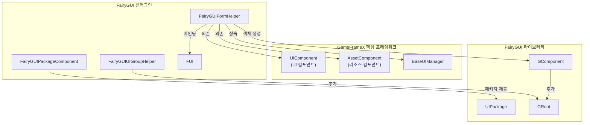
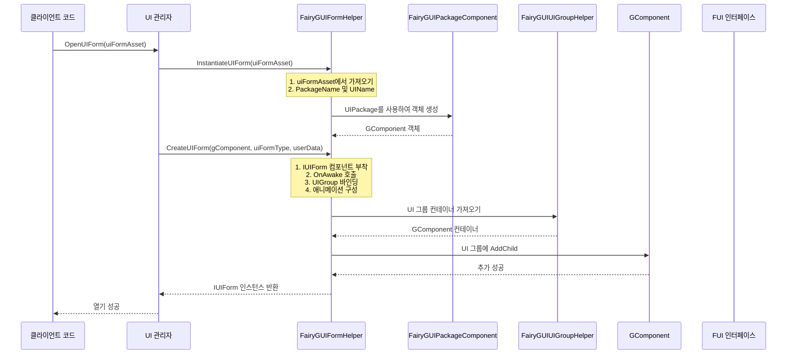
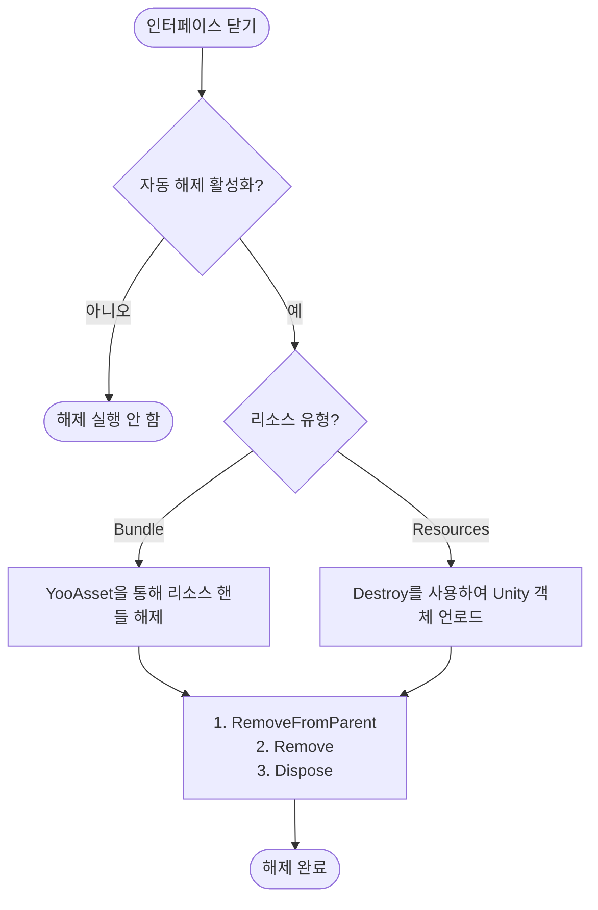

# 인터페이스 헬퍼

`FairyGUIFormHelper`는 GameFrameX 플러그인에서 FairyGUI 인터페이스 인스턴스화, 생성 및 해제의 핵심 컴포넌트입니다. `UIFormHelperBase`를 상속하여 FairyGUI 인터페이스에 프레임워크의 다른 부분과 완벽하게 통합할 수 있는 기능을 제공합니다.

## 개요

인터페이스 헬퍼는 UI 시스템의 핵심 컴포넌트로, UI 인터페이스의 생명주기 관리를 처리합니다. GameFrameX의 FairyGUI 플러그인에서 `FairyGUIFormHelper`는 다음과 같은 핵심 책임을承担합니다:

- **인스턴스화 인터페이스**: UI 리소스를 상호작용 가능한 인터페이스 객체로 변환
- **인터페이스 생성**: 인터페이스 로직 유형을 뷰 객체에 부착하고 인터페이스 그룹 바인딩 완료
- **인터페이스 해제**: 뷰 객체 및 관련 리소스를 포함한 올바른 인터페이스 리소스 정리

이 컴포넌트는 `UIFormHelperBase`에서 정의한 추상 메서드를 구현하여 FairyGUI 특정 인터페이스 관리 구현을 제공합니다.

> Source: [FairyGUIFormHelper.cs](https://github.com/GameFrameX/com.gameframex.unity.ui.fairygui/blob/main/Runtime/FairyGUIFormHelper.cs#L1-L233)

## 아키텍처

### 컴포넌트 관계

`FairyGUIFormHelper`의 UI 시스템 내 위치는 다음과 같습니다:



### 설계 의도

**왜 인터페이스 헬퍼가 필요한가?**

1. **뷰와 로직 분리**: FairyGUI는 GComponent를 뷰 레이어로 사용하고, 게임 비즈니스 로직은 `IUIForm` 인터페이스를 구현한 클래스로 처리해야 합니다. 인터페이스 헬퍼는 두 사이의 다리 역할을 합니다.

2. **통합 리소스 관리**: `AssetComponent`를 통합하여 인터페이스 헬퍼는 UI 리소스의 로딩 및 해제를 올바르게 관리하여 리소스 누수를 방지할 수 있습니다.

3. **구성 기반**: 특성(Attribute)을 사용하여 인터페이스 동작(소속 인터페이스 그룹, 표시/숨김 애니메이션 등)을 구성하면 인터페이스 구성이 코드와 분리됩니다.

## 핵심 기능

### 1. 인스턴스화 인터페이스

`InstantiateUIForm` 메서드는 UI 리소스 데이터를 FairyGUI의 GComponent 객체로 변환하는 역할을 담당합니다:

```csharp
public override object InstantiateUIForm(object uiFormAsset)
{
    var openUIFormInfoData = (OpenUIFormInfoData)uiFormAsset;
    GameFrameworkGuard.NotNull(openUIFormInfoData, nameof(uiFormAsset));

    return UIPackage.CreateObject(openUIFormInfoData.PackageName, openUIFormInfoData.UIName);
}
```

> Source: [FairyGUIFormHelper.cs#L63-L69](https://github.com/GameFrameX/com.gameframex.unity.ui.fairygui/blob/main/Runtime/FairyGUIFormHelper.cs#L63-L69)

**핵심 포인트**:
- `OpenUIFormInfoData` 객체를 수신하여 包名과 인터페이스명을 포함
- FairyGUI의 `UIPackage.CreateObject()` 메서드를 사용하여 객체 생성
- 후속 처리를 위해 `GComponent` 인스턴스 반환

### 2. 인터페이스 생성

`CreateUIForm` 메서드는 UI 로직 유형을 GComponent에 부착하고 인터페이스 그룹 바인딩을 완료합니다:

```csharp
public override IUIForm CreateUIForm(object uiFormInstance, Type uiFormType, object userData)
{
    GComponent component = uiFormInstance as GComponent;
    if (component == null)
    {
        Log.Error("UI form instance is invalid.");
        return null;
    }

    // UI 로직 유형을 컴포넌트로 GameObject에 추가
    var componentType = component.displayObject.gameObject.GetOrAddComponent(uiFormType);
    var uiForm = componentType as IUIForm;
    if (uiForm == null)
    {
        Log.Error("UI form instance is invalid.");
        return null;
    }

    // OnAwake 초기화 호출
    if (uiForm.IsAwake == false)
    {
        uiForm.OnAwake();
    }

    // 인터페이스 그룹 가져오기 또는 생성
    var uiGroup = uiForm.UIGroup;
    if (uiGroup == null)
    {
        var attribute = uiFormType.GetCustomAttribute(typeof(OptionUIGroupAttribute));
        if (attribute is OptionUIGroupAttribute optionUIGroup)
        {
            uiGroup = m_UIComponent.GetUIGroup(optionUIGroup.GroupName);
        }
        uiForm.UIGroup = uiGroup;
    }

    // 표시 애니메이션 구성
    var showAnimationAttribute = uiFormType.GetCustomAttribute(typeof(OptionUIShowAnimationAttribute));
    if (showAnimationAttribute is OptionUIShowAnimationAttribute optionShowAnimation)
    {
        uiForm.EnableShowAnimation = optionShowAnimation.Enable;
        uiForm.ShowAnimationName = optionShowAnimation.AnimationName;
    }
    else
    {
        uiForm.EnableShowAnimation = m_UIComponent.IsEnableUIShowAnimation;
    }

    // 숨김 애니메이션 구성
    var hideAnimationAttribute = uiFormType.GetCustomAttribute(typeof(OptionUIHideAnimationAttribute));
    if (hideAnimationAttribute is OptionUIHideAnimationAttribute optionHideAnimation)
    {
        uiForm.EnableHideAnimation = optionHideAnimation.Enable;
        uiForm.HideAnimationName = optionHideAnimation.AnimationName;
    }
    else
    {
        uiForm.EnableHideAnimation = m_UIComponent.IsEnableUIHideAnimation;
    }

    // 인터페이스 그룹 검증
    if (uiGroup == null)
    {
        Log.Error("UI group is invalid.");
        return null;
    }

    // 인터페이스 그룹 컨테이너를 가져와 자식 컴포넌트 추가
    DisplayObjectInfo displayObjectInfo = ((MonoBehaviour)uiGroup.Helper).gameObject.GetComponent<DisplayObjectInfo>();
    if (displayObjectInfo == null)
    {
        Log.Error("Display object info is invalid.");
        return null;
    }

    var uiGroupComponent = displayObjectInfo.displayObject.gOwner as GComponent;
    if (uiGroupComponent == null)
    {
        Log.Error("UI group component is invalid.");
        return null;
    }

    uiGroupComponent.AddChild(component);
    return uiForm;
}
```

> Source: [FairyGUIFormHelper.cs#L82-L161](https://github.com/GameFrameX/com.gameframex.unity.ui.fairygui/blob/main/Runtime/FairyGUIFormHelper.cs#L82-L161)

**핵심 처리 흐름**:

1. **유형 변환**: UI 인스턴스를 `GComponent`로 변환
2. **컴포넌트 부착**: `GetOrAddComponent`를 사용하여 UI 로직 유형을 GameObject에 추가
3. **초기화 호출**: `OnAwake()` 메서드를 호출하여 인터페이스 초기화 완료
4. **인터페이스 그룹 바인딩**: 특성 또는 기본 구성을 통해 인터페이스 그룹 가져오기
5. **애니메이션 구성**: 특성에서 읽거나 전역 구성을 사용하여 표시/숨김 애니메이션 설정
6. **컨테이너 추가**: 컴포넌트를 인터페이스 그룹의 GComponent 컨테이너에 추가

### 3. 인터페이스 해제

`ReleaseUIForm` 메서드는 올바른 인터페이스 리소스 해제를 담당합니다:

```csharp
public override void ReleaseUIForm(object uiFormAsset, object uiFormInstance, object assetHandle, string uiFormAssetPath, string uiFormAssetName)
{
    if (!m_UIComponent.EnableAutoReleaseUIForm)
    {
        return;
    }

    if (uiFormInstance is GComponent component)
    {
        component.RemoveFromParent();
        component.Remove();
        component.Dispose();
    }

    if (uiFormAssetPath.IndexOf(Utility.Asset.Path.BundlesDirectoryName, StringComparison.OrdinalIgnoreCase) >= 0)
    {
        if (assetHandle is YooAsset.AssetHandle handle)
        {
            handle.Release();
        }
        m_AssetComponent.UnloadAsset(uiFormAssetPath);
    }
    else
    {
        // Resources 리소스 언로드: 인스턴스가 GComponent가 아닌 경우에만 Unity 객체 파괴 필요
        if (!(uiFormInstance is GComponent) && uiFormInstance is UnityEngine.Object unityObject)
        {
            Destroy(unityObject);
            UnityEngine.Resources.UnloadAsset(unityObject);
        }
    }
}
```

> Source: [FairyGUIFormHelper.cs#L175-L207](https://github.com/GameFrameX/com.gameframex.unity.ui.fairygui/blob/main/Runtime/FairyGUIFormHelper.cs#L175-L207)

**리소스 해제 로직**:

1. **자동 해제 스위치**: 자동 해제 기능이 활성화되었는지 확인
2. **GComponent 정리**: 부모 컨테이너 제거, 자식 객체 제거, 리소스 해제
3. **Bundle 리소스**: YooAsset을 통해 리소스 핸들 처리 및 언로드
4. **Resources 리소스**: Unity의 Destroy 및 UnloadAsset 메서드 사용

## 인터페이스 생성 흐름

다음 시퀀스図는 인터페이스를 열어서 완전히 생성되기까지의 전체 흐름을 보여줍니다:



## 인터페이스 해제 흐름



## 구성 옵션

### 인터페이스 그룹 구성

특성을 통해 인터페이스가 소속된 인터페이스 그룹을 지정할 수 있습니다:

```csharp
[OptionUIGroup("MainUI")]
public class MainForm : FUI
{
    // 인터페이스 로직
}
```

### 표시/숨김 애니메이션 구성

특성을 통해 인터페이스의 표시 및 숨김 애니메이션을 구성할 수 있습니다:

```csharp
[OptionUIShowAnimation(true, "FadeIn")]
[OptionUIHideAnimation(true, "FadeOut")]
public class MainForm : FUI
{
    // 인터페이스 로직
}
```

> 참고: 이 특성들은 GameFrameX.Runtime 패키지에 정의되어 있으며, 자세한 사용법은 관련 문서를 참조하세요.

## 의존 컴포넌트

`FairyGUIFormHelper`는 런타임에서 다음 컴포넌트에 의존합니다:

| 컴포넌트 | 설명 |
|------|------|
| `UIComponent` | 인터페이스 그룹 정보, 애니메이션 구성, 전역 해제 설정 가져오기 |
| `AssetComponent` | UI 리소스 언로드 (Bundle 모드) |

이 컴포넌트들은 `Awake()` 메서드를 통해 자동으로 가져옵니다:

```csharp
private void Awake()
{
    m_AssetComponent = GameEntry.GetComponent<AssetComponent>();
    if (m_AssetComponent == null)
    {
        Log.Fatal("Asset component is invalid.");
        return;
    }

    m_UIComponent = GameEntry.GetComponent<UIComponent>();
    if (m_UIComponent == null)
    {
        Log.Fatal("UI component is invalid.");
        return;
    }
}
```

> Source: [FairyGUIFormHelper.cs#L216-L231](https://github.com/GameFrameX/com.gameframex.unity.ui.fairygui/blob/main/Runtime/FairyGUIFormHelper.cs#L216-L231)

## 관련 링크

- [FUI 인터페이스 기본 클래스](./4-core-concepts.1-fui-base-class) - FairyGUI 인터페이스의 기본 클래스 구현
- [인터페이스 관리자](./4-core-concepts.2-ui-manager) - 인터페이스 열기, 닫기 및 생명주기 관리 담당
- [패키지 관리자](./4-core-concepts.3-package-manager) - FairyGUI 패키지의 로딩 및 언로드 관리
- [인터페이스 그룹 헬퍼](./4-core-concepts.5-ui-group-helper) - 인터페이스 그룹의 생성 및 깊이 관리
- [API 참고 - FairyGUIFormHelper 클래스](./5-api-reference.3-form-helper) - 완전한 API 문서
- [GObjectHelper 유틸리티 클래스](./5-api-reference.4-gobject-helper) - GObject와 FUI의 매핑 관리