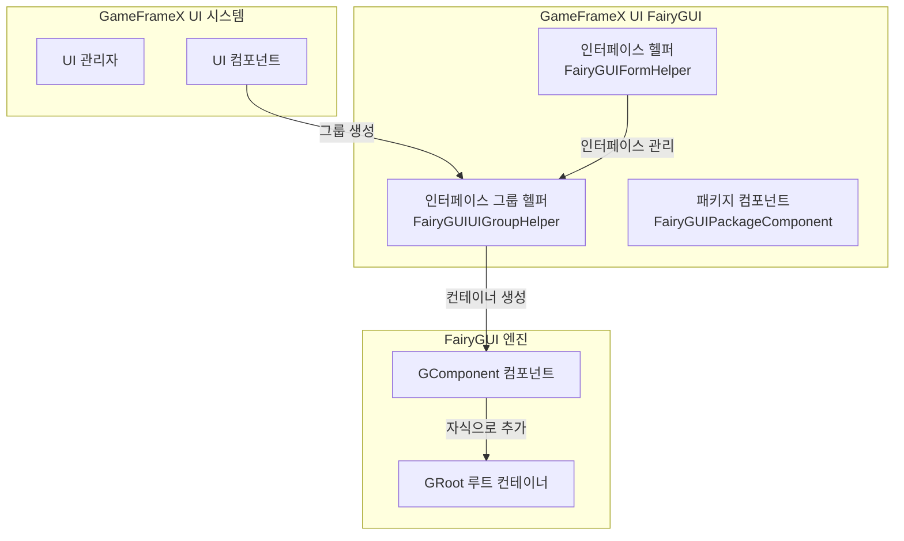
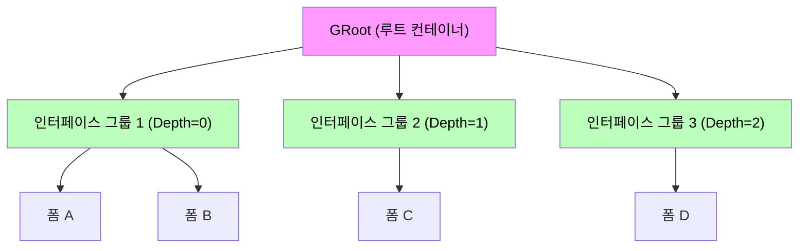
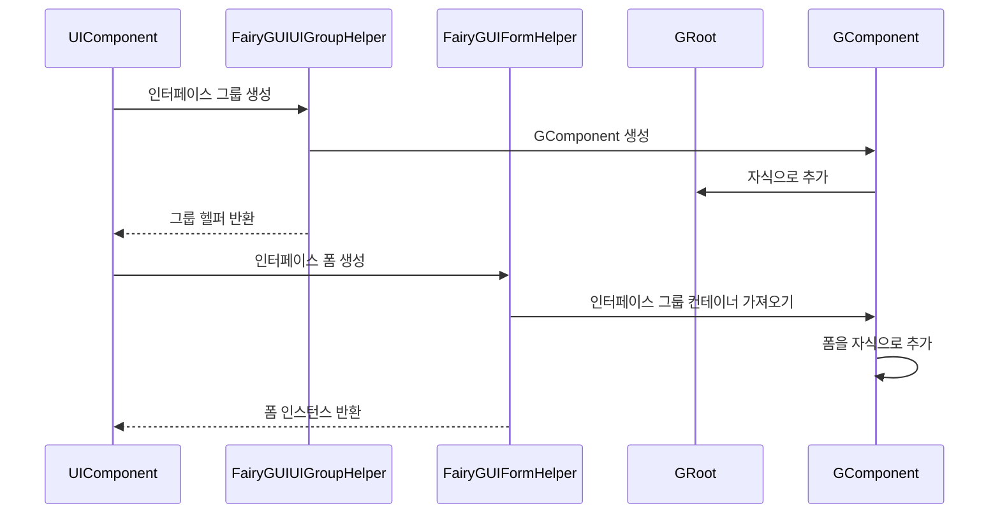

# 인터페이스 그룹 헬퍼

`FairyGUIUIGroupHelper`는 GameFrameX UI FairyGUI 플러그인의 핵심 컴포넌트 중 하나로, FairyGUI 렌더링 엔진에서 UI 인터페이스 그룹을 생성하고 관리하는 역할을 담당합니다. 인터페이스 그룹은 깊이(Depth)를 통해 인터페이스의 표시 레벨을 제어하는 다수의 인터페이스 폼(창)을 구성하는 컨테이너입니다.

## 개요

인터페이스 그룹 헬퍼는 GameFrameX UI 시스템과 FairyGUI 렌더링 엔진 사이의 다리 컴포넌트입니다. `UIGroupHelperBase` 추상 클래스를 상속하여 FairyGUI 특정 인터페이스 그룹 구현을 제공합니다. UI 시스템에서 인터페이스 그룹은 관련 인터페이스 폼을 함께 구성하고, 깊이 값을 통해 인터페이스의 가림 관계 및 표시 순서를 제어하는 데 사용됩니다.

**핵심 책임:**
- FairyGUI 인터페이스 그룹 컨테이너(GComponent) 생성
- 인터페이스 그룹의 깊이(Z 순서) 관리
- 인터페이스 그룹 전체 화면 표시 설정
- GameFrameX 핵심 시스템과의 통합

> Source: [FairyGUIUIGroupHelper.cs](https://github.com/GameFrameX/com.gameframex.unity.ui.fairygui/blob/main/Runtime/FairyGUIUIGroupHelper.cs#L36-L97)

## 아키텍처 설계

### 클래스図 구조

```mermaid
classDiagram
    class UIGroupHelperBase {
        <<abstract>>
        +Depth: int { get; protected set; }
        +Handler(root, groupName, helperTypeName, customHelper, depth) IUIGroupHelper
        +SetDepth(depth) void
    }
    
    class FairyGUIUIGroupHelper {
        +Depth: int { get; protected set; }
        +Handler(root, groupName, helperTypeName, customHelper, depth) IUIGroupHelper
        +SetDepth(depth) void
    }
    
    class GComponent {
        +name: string
        +opaque: bool
        +displayObject: DisplayObject
        +AddRelation(target, type) void
        +MakeFullScreen() void
    }
    
    class GRoot {
        +inst: GRoot
    }
    
    UIGroupHelperBase <|-- FairyGUIUIGroupHelper
    FairyGUIUIGroupHelper --> GComponent : creates
    GComponent --> GRoot : added as child
```

### 시스템 통합 아키텍처



### 인터페이스 그룹 레벨 관계



## 핵심 기능

### 인터페이스 그룹 생성

`Handler` 메서드는 인터페이스 그룹 헬퍼의 핵심 메서드로, 새 FairyGUI 인터페이스 그룹을 생성하고 초기화하는 역할을 담당합니다.

```csharp
public override IUIGroupHelper Handler(Transform root, string groupName, string uiGroupHelperTypeName, IUIGroupHelper customUIGroupHelper, int depth = 0)
{
    SetDepth(depth);
    GComponent component = new GComponent();
    GRoot.inst.AddChild(component);
    var comName = groupName;
    component.displayObject.name = comName;
    component.gameObjectName = comName;
    component.name = comName;
    component.opaque = false;
    component.AddRelation(GRoot.inst, RelationType.Width);
    component.AddRelation(GRoot.inst, RelationType.Height);
    component.MakeFullScreen();
    return GameFrameX.Runtime.Helper.CreateHelper(component.displayObject.gameObject, uiGroupHelperTypeName, (UIGroupHelperBase)customUIGroupHelper, 0);
}
```

> Source: [FairyGUIUIGroupHelper.cs](https://github.com/GameFrameX/com.gameframex.unity.ui.fairygui/blob/main/Runtime/FairyGUIUIGroupHelper.cs#L82-L96)

**생성 흐름 설명:**

1. **깊이 설정**: `SetDepth(depth)`를 호출하여 인터페이스 그룹의 Z 순서 설정
2. **컴포넌트 생성**: `new GComponent()`를 사용하여 FairyGUI 컨테이너 컴포넌트 생성
3. **루트 컨테이너에 추가**: 컴포넌트를 `GRoot.inst`(FairyGUI 전역 루트 컨테이너)에 추가
4. **이름 설정**: 컴포넌트의 `name`, `gameObjectName` 및 `displayObject.name` 설정
5. **투명 설정**: `opaque = false`를 설정하여 인터페이스 그룹 컨테이너 자체가 투명하도록 설정
6. **전체 화면 설정**: 너비 및 높이 관계를 추가하고, `MakeFullScreen()`을 사용하여 컴포넌트가 전체 화면을 차지하도록 설정
7. **헬퍼 생성**: `GameFrameX.Runtime.Helper.CreateHelper`를 사용하여 실제 헬퍼 인스턴스 생성

### 인터페이스 깊이 설정

`SetDepth` 메서드는 인터페이스 그룹의 깊이 값을 설정하는 데 사용되며, 이 값은 인터페이스의 표시 레벨을 결정합니다.

```csharp
public override void SetDepth(int depth)
{
    Depth = depth;
    transform.localPosition = new Vector3(0, 0, depth * 100);
}
```

> Source: [FairyGUIUIGroupHelper.cs](https://github.com/GameFrameX/com.gameframex.unity.ui.fairygui/blob/main/Runtime/FairyGUIUIGroupHelper.cs#L63-L67)

**깊이 설정 원리:**
- FairyGUI는 Z 축 좌표를 사용하여 표시 레벨 제어
- 각 깊이 레벨은 100 단위의 Z축 거리에 해당
- 깊이 값이 클수록 인터페이스가 더 앞으로 표시됨(깊이 값이 작은 인터페이스를 덮음)

## 인터페이스 그룹과 폼의 관계

인터페이스 그룹과 인터페이스 폼(Form)은 일대다 포함 관계입니다:



### 인터페이스 그룹 할당

FairyGUI 시스템에서 인터페이스 폼은 `OptionUIGroupAttribute` 특성을 통해 지정된 인터페이스 그룹에 할당됩니다:

```csharp
[OptionUIGroup("MainUI")]
public class MainMenuForm : FUI
{
    // 인터페이스 폼 로직
}
```

> Source: [FairyGUIFormHelper.cs](https://github.com/GameFrameX/com.gameframex.unity.ui.fairygui/blob/main/Runtime/FairyGUIFormHelper.cs#L108-L115)

시스템은 `OptionUIGroup` 특성에 지정된 그룹 이름을 기반으로 해당 인터페이스 그룹 인스턴스를 가져오고, 인터페이스 폼을 해당 인터페이스 그룹의 GComponent 컨테이너에 추가합니다.

## 사용 예제

### 기본 구성

인터페이스 그룹 헬퍼를 사용하기 전에 GameFrameX 시작 구성에서 FairyGUI 관련 컴포넌트를 등록해야 합니다:

```csharp
// GameFrameworkComponent에서 구성
// FairyGUIUIGroupHelper를 인터페이스 그룹 헬퍼 구현으로 사용
```

### 인터페이스 그룹 정의 예제

```csharp
// 인터페이스 그룹은 UIManager가 런타임에 자동으로 생성
// 다음은 시스템 내부의 생성 로직

// 1. 새 인터페이스가 필요할 때 해당 인터페이스 그룹이 존재하는지 확인
// 2. 존재하지 않으면 FairyGUIUIGroupHelper를 사용하여 새 인터페이스 그룹 생성
// 3. 인터페이스 그룹의 깊이는 시스템이 구성 또는 자동 증분 할당에 따라 결정
```

## API 참고

### `FairyGUIUIGroupHelper` 클래스

**네임스페이스:** `GameFrameX.UI.FairyGUI.Runtime`

**상속:** `UIGroupHelperBase`

---

### 속성

#### `Depth`

```csharp
public override int Depth { get; protected set; }
```

인터페이스 그룹의 깊이 값을 가져옵니다.

- **유형:** `int`
- **설명:** 인터페이스의 표시 레벨을 제어하는 데 사용되는 Z축 깊이를 나타냄

---

### 메서드

#### `Handler`

```csharp
public override IUIGroupHelper Handler(
    Transform root,
    string groupName,
    string uiGroupHelperTypeName,
    IUIGroupHelper customUIGroupHelper,
    int depth = 0
)
```

FairyGUI 인터페이스 그룹을 생성하고 초기화합니다.

**매개변수:**
- `root` (Transform): 루트 노드 (현재 구현에서 미사용)
- `groupName` (string): 인터페이스 그룹의 이름
- `uiGroupHelperTypeName` (string): 인터페이스 그룹 헬퍼 유형 이름
- `customUIGroupHelper` (IUIGroupHelper): 사용자 정의 인터페이스 그룹 헬퍼 인스턴스
- `depth` (int): 인터페이스 그룹의 깊이 값, 기본값은 0

**반환값:** 
- `IUIGroupHelper`: 생성된 인터페이스 그룹 헬퍼 인스턴스

**구현 설명:**
1. 인터페이스 그룹 깊이 설정
2. `GComponent`를 인터페이스 그룹 컨테이너로 생성
3. 컨테이너를 `GRoot.inst`에 추가
4. 전체 화면 표시 속성 구성
5. 헬퍼 인스턴스를 생성하여 반환

---

#### `SetDepth`

```csharp
public override void SetDepth(int depth)
```

인터페이스 그룹의 깊이를 설정합니다.

**매개변수:**
- `depth` (int): 인터페이스 그룹의 깊이 값

**구현 설명:**
`transform.localPosition`의 Z 좌표를 수정하여 깊이를 설정합니다. Z 좌표 계산 공식은 `depth * 100`입니다. 이러한 설계는 서로 다른 깊이의 인터페이스 사이에 충분한 Z축 간격을 확보하여 렌더링 충돌을 방지합니다.

---

## 관련 링크

- [FUI 인터페이스 기본 클래스](./4-core-concepts.1-fui-base-class) - FairyGUI 인터페이스 폼의 기본 클래스 구현
- [인터페이스 관리자](./4-core-concepts.2-ui-manager) - 인터페이스 시스템의 핵심 관리자
- [패키지 관리자](./4-core-concepts.3-package-manager) - FairyGUI 리소스 패키지 관리
- [인터페이스 헬퍼](./4-core-concepts.4-form-helper) - 인터페이스 폼의 생성 및 해제 관리
- [인터페이스 그룹 구성](./6-configuration.2-ui-group-config) - 인터페이스 그룹의 구성 옵션
- [GitHub 저장소](https://github.com/GameFrameX/com.gameframex.unity.ui.fairygui.git) - 플러그인 소스 코드