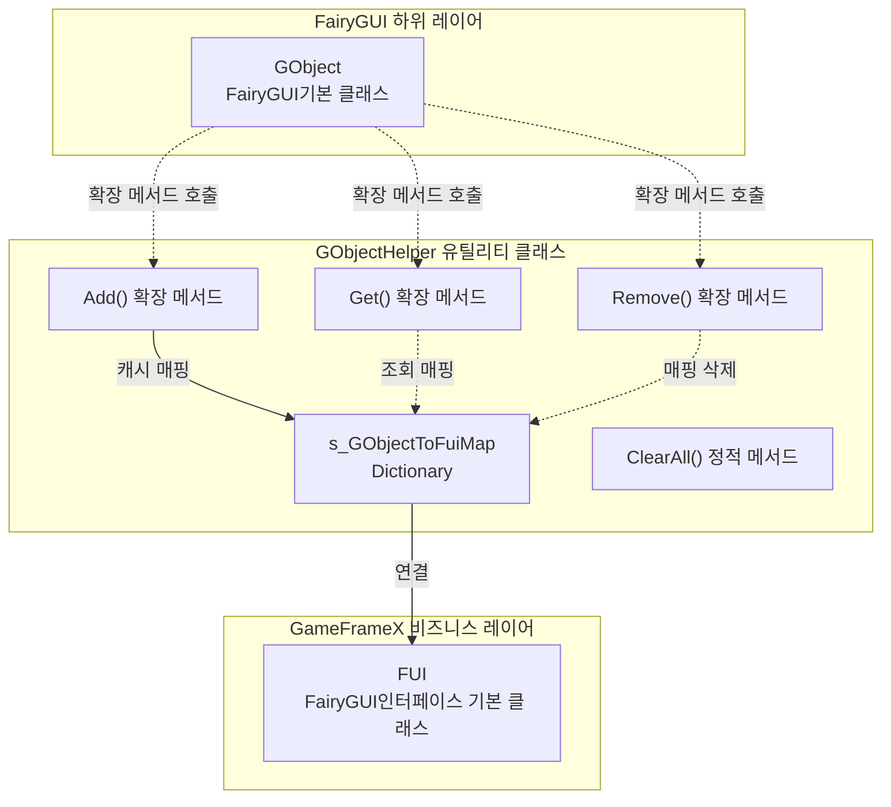
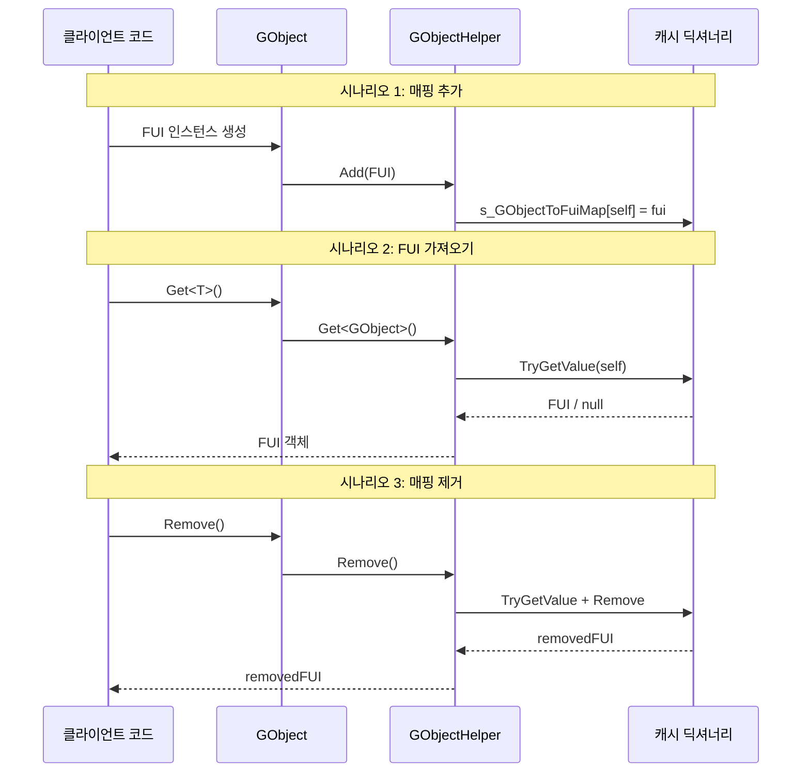

# GObjectHelper 유틸리티 클래스

GObjectHelper는 FairyGUI의 GObject 객체와 FUI 인터페이스 객체 사이의 매핑 관계를 관리하는 정적 유틸리티 클래스로, 캐시 및 조회 기능을 제공합니다.

## 개요

GObjectHelper는 GameFrameX 플러그인에서 FairyGUI 하위 객체(GObject)와 비즈니스 로직 계층(FUI 인터페이스 클래스)을 연결하는 다리 역할을 합니다. FairyGUI 인터페이스 시스템에서 각 인터페이스는 GObject 인스턴스로 표시되며, GObjectHelper는 런타임에 GObject를 기반으로 해당 FUI 객체를 빠르게 가져오는 기능을 제공합니다.

**설계 의도:**
- FairyGUI의 GObject와 비즈니스 계층 FUI 객체 간의 연결 문제 해결
- 복잡한 인터페이스 트리에서 단계별로 탐색하지 않고 효율적인 조회 메커니즘 제공
- 인터페이스의 동적 생성 및 파괴 시 리소스 관리 지원

**사용 시나리오:**
- 이벤트 콜백에서 이벤트를 트리거한 인터페이스 객체를 가져와야 하는 경우
- 컴포넌트 수준에서 빠르게 대응하는 FUI에 연결해야 하는 경우
- 인터페이스 언로드 시 관련 리소스 정리

## 아키텍처



**아키텍처 설명:**
- GObjectHelper는 GObject에서 FUI로의 매핑 관계를 저장하는 private 정적 딕셔너리 `s_GObjectToFuiMap`을 유지합니다
- C# 확장 메서드 형식으로 Get, Add, Remove 메서드를 GObject에 추가합니다
- 모든 작업은 스레드 안전합니다(내부적으로 Dictionary 사용)

## 핵심 기능

### 1. 연결된 FUI 객체 가져오기

GObject 확장 메서드를 통해 연결된 FUI 객체를 빠르게 가져올 수 있습니다:

```csharp
// GObject 인스턴스가 있다고 가정
GObject gObject = someComponent.GetChild("Button");

// 연결된 FUI 객체 가져오기(유형 변환 필요)
MyFUI fui = gObject.Get<MyFUI>();
```
> Source: [GObjectHelper.cs](https://github.com/GameFrameX/com.gameframex.unity.ui.fairygui/blob/main/Runtime/GObjectHelper.cs#L69-L77)

**메서드 시그니처:**
```csharp
public static T Get<T>(this GObject self) where T : FUI
```

### 2. FUI 매핑 추가

FUI 객체를 캐시 풀에 추가하여 GObject와 FUI의 연결을 수립합니다:

```csharp
// FUI 인스턴스 생성
FUI fui = new MyFUI(gObject);

// 캐시에 추가
gObject.Add(fui);
```
> Source: [GObjectHelper.cs](https://github.com/GameFrameX/com.gameframex.unity.ui.fairygui/blob/main/Runtime/GObjectHelper.cs#L88-L94)

### 3. FUI 매핑 제거

캐시에서 지정된 FUI 매핑을 제거하고 제거된 FUI 객체를 반환합니다:

```csharp
// 매핑 제거 및 삭제된 FUI 가져오기
FUI removedFui = gObject.Remove();
```
> Source: [GObjectHelper.cs](https://github.com/GameFrameX/com.gameframex.unity.ui.fairygui/blob/main/Runtime/GObjectHelper.cs#L105-L114)

### 4. 모든 캐시 정리

인터페이스 시스템이 닫히거나 다시 초기화될 때 모든 캐시된 매핑 관계를 비웁니다:

```csharp
// 모든 캐시 정리
GObjectHelper.ClearAll();
```
> Source: [GObjectHelper.cs](https://github.com/GameFrameX/com.gameframex.unity.ui.fairygui/blob/main/Runtime/GObjectHelper.cs#L54-L57)

## 사용 흐름



## 사용 예제

### 기본 사용법

```csharp
using FairyGUI;
using GameFrameX.UI.FairyGUI.Runtime;

// 버튼 컴포넌트가 있다고 가정
GObject buttonObj = container.GetChild("SubmitButton");

// 연결된 FUI 가져오기
MainPanelFUI fui = buttonObj.Get<MainPanelFUI>();

if (fui != null)
{
    // FUI 조작 가능
    fui.Visible = true;
}
```

### 인터페이스 생성 시 매핑

```csharp
// FairyGUIFormHelper에서 인터페이스 생성 시
public override IUIForm CreateUIForm(object uiFormInstance, Type uiFormType, object userData)
{
    GComponent component = uiFormInstance as GComponent;
    var componentType = component.displayObject.gameObject.GetOrAddComponent(uiFormType);
    var uiForm = componentType as IUIForm;

    // 매핑 관계 수립
    component.Add(uiForm as FUI);

    return uiForm;
}
```

### 리소스 정리

```csharp
// 게임 종료 또는シーン 다시 로드 시
private void OnDestroy()
{
    // 모든 FUI 매핑 정리
    GObjectHelper.ClearAll();
}
```

## API 참고

### `Get<T>(this GObject self): T`

캐시에서 현재 GObject와 연결된 FUI 객체를 가져옵니다.

**제네릭 매개변수:**
- `T`: FUI의 파생 유형

**매개변수:**
- `self` (GObject): 확장 메서드를 호출하는 GObject 인스턴스

**반환:**
- 연결된 FUI 객체; 존재하지 않으면 유형 기본값(reference type의 경우 null) 반환

**예제:**
```csharp
MyPanelFUI fui = gObject.Get<MyPanelFUI>();
```

---

### `Add(this GObject self, FUI fui): void`

FUI 객체를 캐시에 추가하여 GObject와 FUI의 매핑 관계를 수립합니다.

**매개변수:**
- `self` (GObject): 확장 메서드를 호출하는 GObject 인스턴스
- `fui` (FUI): 추가할 FUI 객체

**예제:**
```csharp
gObject.Add(new MyPanelFUI(gObject));
```

---

### `Remove(this GObject self): FUI`

캐시에서 지정된 GObject의 FUI 매핑을 제거하고 제거된 FUI 객체를 반환합니다.

**매개변수:**
- `self` (GObject): 확장 메서드를 호출하는 GObject 인스턴스

**반환:**
- 제거된 FUI 객체; 존재하지 않으면 기본값 반환

**예제:**
```csharp
FUI removed = gObject.Remove();
```

---

### `ClearAll(): void`

캐시된 모든 FUI 매핑 관계를 비웁니다.

**주의:** 이 작업은 되돌릴 수 없으며, 호출 후 모든 GObject와 FUI의 연결이 삭제됩니다.

**예제:**
```csharp
GObjectHelper.ClearAll();
```

## 관련 링크

- [FUI 클래스](./5-api-reference.1-fui-class) - FairyGUI 인터페이스 기본 클래스
- [FairyGUIFormHelper 클래스](./5-api-reference.3-form-helper) - 인터페이스 헬퍼
- [FairyGUIPackageComponent 클래스](./5-api-reference.2-package-component) - 패키지 관리자 컴포넌트
- [인터페이스 관리자](./4-core-concepts.2-ui-manager) - 인터페이스 관리 핵심 개념
- [빠른 시작: 인터페이스 열기 및 닫기](./3-getting-started.2-open-close-ui)