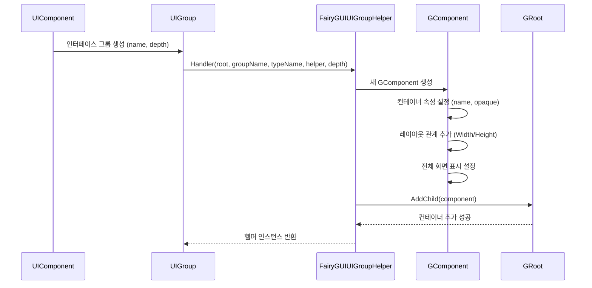
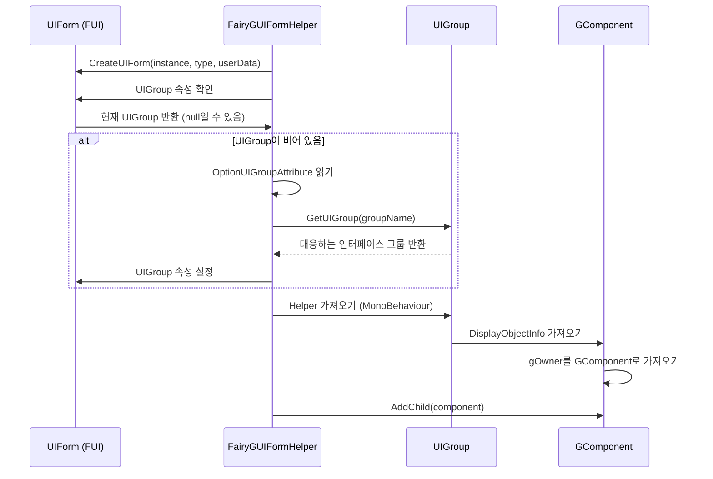

# 인터페이스 그룹 구성

인터페이스 그룹(UI Group)은 GameFrameX 프레임워크에서 UI 인터페이스의 레벨과 표시 순서를 관리하는 핵심 메커니즘입니다. FairyGUI 플러그인은 `FairyGUIUIGroupHelper` 클래스를 제공하여 FairyGUI 렌더링 특성에 맞는 인터페이스 그룹 기능을 구현합니다.

## 개요

인터페이스 그룹 구성은 주로 다음에 사용됩니다:

- **레벨 관리**: 다양한 유형의 인터페이스 표시 레벨 제어(예: 팝업, 대화상자, 메인 인터페이스 등)
- **깊이 제어**: Z 축 위치를 설정하여 인터페이스의 전후 순서 결정
- **컨테이너 구성**: 관련 인터페이스를同一 컨테이너에 구성하여 관리 및 제어 용이성 향상

FairyGUI 통합에서 인터페이스 그룹은 GComponent 컨테이너를 통해 구현되며, 각 그룹은 독립적인 컨테이너에 해당하며, 인터페이스는 대응하는 그룹 컨테이너에 자식 요소로 추가됩니다.

## 아키텍처

```mermaid
flowchart TD
    subgraph GameFrameX_UI["GameFrameX UI 시스템"]
        UIComponent[UIComponent<br/>UI컴포넌트]
        UIGroup[UIGroup<br/>인터페이스 그룹]
        UIForm[UIForm<br/>인터페이스]
    end

    subgraph FairyGUI_Integration["FairyGUI 통합"]
        FairyGUIUIGroupHelper["FairyGUIUIGroupHelper<br/>인터페이스 그룹 헬퍼"]
        FairyGUIFormHelper["FairyGUIFormHelper<br/>인터페이스 헬퍼"]
        FairyGUIPackageComponent["FairyGUIPackageComponent<br/>패키지 관리 컴포넌트"]
    end

    subgraph FairyGUI_Runtime["FairyGUI 런타임"]
        GRoot[GRoot<br/>루트 컨테이너"]
        GComponent["GComponent<br/>컨테이너 컴포넌트"]
    end

    UIComponent -->|생성/가져오기| UIGroup
    UIGroup -->|사용| FairyGUIUIGroupHelper
    FairyGUIUIGroupHelper -->|컨테이너 생성| GComponent
    GComponent -->|추가| GRoot
    FairyGUIFormHelper -->|인터페이스를 그룹에 추가| UIGroup
    UIForm -->|소속| UIGroup
```

**아키텍처 설명:**

1. **UIComponent**: GameFrameX 핵심 컴포넌트로, 모든 인터페이스 그룹 및 인터페이스 인스턴스를 관리합니다
2. **UIGroup**: 인터페이스 그룹 추상으로, `IUIGroupHelper`에 대한 참조를 보유합니다
3. **FairyGUIUIGroupHelper**: FairyGUI 특정 인터페이스 그룹 헬퍼 구현으로, GComponent 컨테이너 생성 및 깊이 관리를 담당합니다
4. **FairyGUIFormHelper**: 인터페이스 헬퍼로, 인터페이스 인스턴스를 대응하는 인터페이스 그룹 컨테이너에 추가하는 역할을 담당합니다
5. **GRoot**: FairyGUI의 루트 컨테이너로, 모든 인터페이스 그룹 컨테이너가 여기에 추가됩니다

## 핵심 메커니즘

### 인터페이스 그룹 생성 흐름



### 인터페이스를 그룹에 할당



## 구성 옵션

### FairyGUIUIGroupHelper 속성

| 속성 | 유형 | 설명 |
|------|------|------|
| `Depth` | int | 인터페이스 그룹 깊이를 가져오거나 설정하여 Z 축 순서 제어 |

### FairyGUIUIGroupHelper 메서드

#### `SetDepth(int depth)`

인터페이스 그룹 깊이를 설정합니다. 이 메서드는 깊이 제어를 위해 transform.localPosition의 Z 좌표를 수정합니다.

```csharp
csharp
public override void SetDepth(int depth)
{
    Depth = depth;
    transform.localPosition = new Vector3(0, 0, depth * 100);
}
```

> Source: [FairyGUIUIGroupHelper.cs](https://github.com/GameFrameX/com.gameframex.unity.ui.fairygui/blob/main/Runtime/FairyGUIUIGroupHelper.cs#L63-L67)

**매개변수:**
- `depth` (int): 인터페이스 그룹 깊이 값으로, 값이 클수록 앞에 표시됩니다

#### `Handler(Transform root, string groupName, string uiGroupHelperTypeName, IUIGroupHelper customUIGroupHelper, int depth = 0)`

인터페이스 그룹 핸들러를 생성합니다.

```csharp
csharp
public override IUIGroupHelper Handler(Transform root, string groupName, string uiGroupHelperTypeName, IUIGroupHelper customUIGroupHelper, int depth = 0)
{
    SetDepth(depth);
    GComponent component = new GComponent();
    GRoot.inst.AddChild(component);
    var comName = groupName;
    component.displayObject.name = comName;
    component.gameObjectName = comName;
    component.name = comName;
    component.opaque = false;
    component.AddRelation(GRoot.inst, RelationType.Width);
    component.AddRelation(GRoot.inst, RelationType.Height);
    component.MakeFullScreen();
    return GameFrameX.Runtime.Helper.CreateHelper(component.displayObject.gameObject, uiGroupHelperTypeName, (UIGroupHelperBase)customUIGroupHelper, 0);
}
```

> Source: [FairyGUIUIGroupHelper.cs](https://github.com/GameFrameX/com.gameframex.unity.ui.fairygui/blob/main/Runtime/FairyGUIUIGroupHelper.cs#L82-L96)

**매개변수:**
- `root` (Transform): 루트 노드
- `groupName` (string): 인터페이스 그룹 이름
- `uiGroupHelperTypeName` (string): 인터페이스 그룹 헬퍼 유형 이름
- `customUIGroupHelper` (IUIGroupHelper): 사용자 정의 인터페이스 그룹 헬퍼
- `depth` (int): 인터페이스 그룹 깊이, 기본값은 0

**반환값:** 생성된 인터페이스 그룹 헬퍼 인스턴스

## 사용 방식

### 인터페이스 소속 그룹 선언

`OptionUIGroupAttribute` 특성을 통해 인터페이스를 지정된 인터페이스 그룹에 할당합니다:

```csharp
csharp
using GameFrameX.UI.Runtime;

[OptionUIGroup("Dialog")]
public class MyDialogForm : FUI
{
    // 인터페이스 구현
}
```

> Source: [FairyGUIFormHelper.cs](https://github.com/GameFrameX/com.gameframex.unity.ui.fairygui/blob/main/Runtime/FairyGUIFormHelper.cs#L108-L114)

**설명:**
- 인터페이스 그룹 이름은 GameFrameX 핵심 프레임워크의 UIComponent에서 구성됩니다
- FairyGUIUIGroupHelper는 대응하는 이름의 GComponent 컨테이너를 자동으로 생성합니다
- 깊이 값은 인터페이스의 표시 순서를 결정하며, 값이 클수록 앞에 표시됩니다

### 인터페이스 그룹 깊이 구성

인터페이스 그룹의 깊이는 일반적으로 게임 프레임워크 초기화 시 구성됩니다:

```csharp
csharp
// UIComponent 구성에서 인터페이스 그룹 깊이 설정
// 서로 다른 인터페이스 그룹은 서로 다른 깊이 값을 사용하여 레벨 분리 구현
// 예: Background=0, Normal=10, Dialog=20, Toast=30
```

## 일반 시나리오

### 시나리오 1: 팝업 인터페이스 그룹

모든 팝업 유형의 인터페이스를 독립적인 인터페이스 그룹에 배치하여 팝업이 항상 일반 인터페이스 위에 표시되도록 합니다:

```csharp
csharp
[OptionUIGroup("Dialog")]
public class ConfirmDialog : FUI { }

[OptionUIGroup("Dialog")]
public class AlertDialog : FUI { }
```

### 시나리오 2: Toast 알림 그룹

일시적인 알림 정보를 가장 높은 레벨에 배치합니다:

```csharp
csharp
[OptionUIGroup("Toast")]
public class ToastForm : FUI { }
```

### 시나리오 3: 배경 인터페이스 그룹

배경 인터페이스를 가장 낮은 레벨에 배치합니다:

```csharp
csharp
[OptionUIGroup("Background")]
public class MainBackground : FUI { }
```

## 관련 링크

- [FUI 인터페이스 기본 클래스](../4-core-concepts.1-fui-base-class)
- [인터페이스 관리자](../4-core-concepts.2-ui-manager)
- [인터페이스 헬퍼](../4-core-concepts.4-form-helper)
- [패키지 관리자](../4-core-concepts.3-package-manager)
- [편집기 구성](./6-configuration.1-editor-config)
- [API 참고 - FairyGUIUIGroupHelper 클래스](./5-api-reference.3-form-helper)