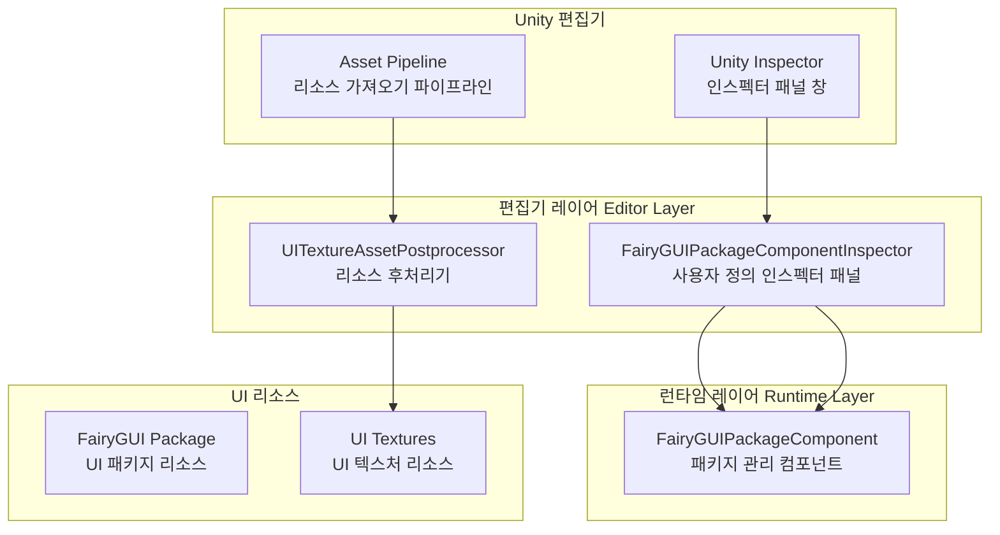
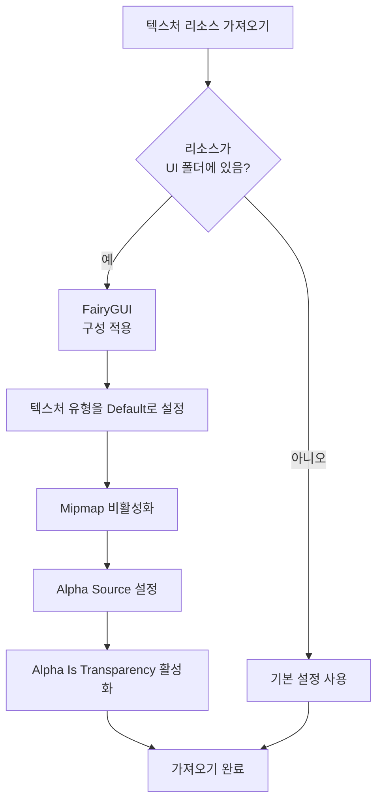

# 편집기 구성

편집기 구성 문서는 Unity 편집기에서 GameFrameX UI FairyGUI 플러그인의 구성 기능을 소개하며, 사용자 정의 인스펙터 패널 및 리소스 후처리기 포함합니다.

## 개요

GameFrameX UI FairyGUI 플러그인은 Unity 편집기에서 UI 개발 워크플로를 간소화하기 위해 완전한 편집기 구성 메커니즘을 제공합니다. 이러한 편집기 기능은 주로 다음 두 가지 핵심 컴포넌트로 구성됩니다:

1. **사용자 정의 인스펙터 패널 (Custom Inspector)** - FairyGUIPackageComponent에 시각적 구성 인터페이스 제공
2. **리소스 후처리기 (Asset Postprocessor)** - UI 텍스처 리소스의 가져오기 설정을 자동 구성

이 편집기 구성 기능은 개발 효율성을 크게 향상시키고 수동 구성 작업을 줄이며, UI 리소스가 최적의 관행を使用하도록 보장합니다.

## 아키텍처



## 사용자 정의 인스펙터 패널

### FairyGUIPackageComponentInspector

사용자 정의 인스펙터 패널은 GameFrameX 기초 편집기 프레임워크에서 상속하여 FairyGUIPackageComponent 컴포넌트의 시각적 구성 인터페이스를 제공합니다.

```csharp
// Source: Editor/Inspector/FairyGUIPackageComponentInspector.cs
using GameFrameX.Editor;
using GameFrameX.UI.FairyGUI.Runtime;
using UnityEditor;

namespace GameFrameX.UI.FairyGUI.Editor
{
    [CustomEditor(typeof(FairyGUIPackageComponent))]
    internal sealed class UIFairyGUIPackageComponentInspector : GameFrameworkInspector
    {
        public override void OnInspectorGUI()
        {
            base.OnInspectorGUI();
            Repaint();
        }
    }
}
```

> Source: [FairyGUIPackageComponentInspector.cs](https://github.com/GameFrameX/com.gameframex.unity.ui.fairygui/blob/main/Editor/Inspector/FairyGUIPackageComponentInspector.cs#L38-L46)

**기능 특징:**
- Unity Inspector 패널에 자동 통합
- GameFrameworkInspector 기본 클래스에서 상속하여统一的 편집기 인터페이스 스타일 제공
- 컴포넌트의 런타임 구성 보기 지원
- `GameFrameX/FairyGUIPackage` 메뉴 항목 추가하여 컴포넌트 빠른 생성 용이

**사용 방식:**
1. Unity 씬에서 빈 객체 생성
2. `FairyGUIPackageComponent` 컴포넌트 추가 (메뉴 `GameFrameX/FairyGUIPackage`를 통해 빠르게 추가 가능)
3. Inspector 패널에서 컴포넌트 속성 보기 및 구성

## 리소스 후처리기

### UITextureAssetPostprocessor

리소스 후처리기는 편집기 구성의 핵심 컴포넌트로, UI 텍스처 리소스를 가져올 때 FairyGUI 요구사항에 맞는 올바른 설정을 자동으로 적용합니다.

```csharp
// Source: Editor/UITextureAssetPostprocessor.cs
#if ENABLE_UI_FAIRYGUI
using GameFrameX.Runtime;
using UnityEditor;

namespace GameFrameX.UI.FairyGUI.Editor
{
    internal sealed class UITextureAssetPostprocessor : AssetPostprocessor
    {
        void OnPreprocessTexture()
        {
            if (assetPath.Contains(PathHelper.Combine(Utility.Asset.Path.BundlesPath, "UI")))
            {
                TextureImporter textureImporter = (TextureImporter)assetImporter;
                if (textureImporter.textureType != TextureImporterType.Default)
                {
                    textureImporter.textureType = TextureImporterType.Default;
                }

                if (textureImporter.mipmapEnabled)
                {
                    textureImporter.mipmapEnabled = false;
                }

                textureImporter.alphaSource = TextureImporterAlphaSource.FromInput;
                textureImporter.alphaIsTransparency = true;
            }
        }
    }
}
#endif
```

> Source: [UITextureAssetPostprocessor.cs](https://github.com/GameFrameX/com.gameframex.unity.ui.fairygui/blob/main/Editor/UITextureAssetPostprocessor.cs#L41-L59)

### 자동 구성 속성 설명

| 구성 항목 | 설정 값 | 설명 |
|--------|--------|------|
| Texture Type | Default | FairyGUI가 올바르게 인식하도록 기본 텍스처 유형 사용 |
| Mipmap | 비활성화 | UI 텍스처는 일반적으로 Mipmap이 필요 없으며, 비활성화하면 메모리 절약 |
| Alpha Source | FromInput | 텍스처 채널에서 Alpha 정보 읽기 |
| Alpha Is Transparency | 활성화 | Alpha 채널을 투명도로 취급하여 렌더링 최적화 |

### 처리 범위

리소스 후처리기느 UI 폴더에 있는 텍스처 리소스만 처리합니다. UI 폴더 경로는 `PathHelper.Combine(Utility.Asset.Path.BundlesPath, "UI")`로 결정되며, 일반적으로 `Assets/Bundles/UI`입니다.

### 워크플로



## 구성 옵션 요약

### 편집기 어셈블리 정의

편집기 코드는 독립적인 어셈블리에 있으며, 런타임 코드와 분리됩니다:

```json
// Source: Editor/GameFrameX.UI.FairyGUI.Editor.asmdef
{
  "name": "GameFrameX.UI.FairyGUI.Editor",
  "references": [
    "GameFrameX.UI.FairyGUI.Runtime",
    "GameFrameX.Editor",
    "GameFrameX.Runtime",
    "FairyGUI.Editor",
    "FairyGUI.Runtime"
  ],
  "includePlatforms": [
    "Editor"
  ]
}
```

> Source: [GameFrameX.UI.FairyGUI.Editor.asmdef](https://github.com/GameFrameX/com.gameframex.unity.ui.fairygui/blob/main/Editor/GameFrameX.UI.FairyGUI.Editor.asmdef#L1-L21)

### 컴파일 조건

편집기 코드는 `ENABLE_UI_FAIRYGUI` 컴파일 기호로 제어되어, FairyGUI 모듈이 활성화된 경우에만 관련 코드가 컴파일됩니다.

## 일반 구성 문제

### 텍스처 가져오기 문제

UI 텍스처가 자동으로 올바른 구성이 적용되지 않은 경우 다음을 확인하세요:

1. **UI 리소스 경로 확인**: 텍스처가 UI 폴더에 있는지 확인 (예: `Assets/Bundles/UI/`)
2. **컴파일 기호 확인**: `ENABLE_UI_FAIRYGUI`가 정의되었는지 확인
3. **리소스 데이터베이스 새로고침**: Unity에서 `Assets > Refresh`를 선택하거나 `Ctrl+R`을 눌러 강제 새로고침

### Inspector 사용자 정의 패널이 표시되지 않음

사용자 정의 인스펙터 패널이 정상적으로 표시되지 않는 경우:

1. GameFrameX.Editor 의존성 패키지가 설치되었는지 확인
2. FairyGUIPackageComponentInspector 클래스가 올바르게 상속되었는지 확인
3. 어셈블리 정의가 Editor 플랫폼을 포함하는지 확인

## 관련 링크

- [FUI 인터페이스 기본 클래스](../4-core-concepts.1-fui-base-class) - FUI 기본 클래스 사용 방법 학습
- [FairyGUIPackageComponent 클래스](../5-api-reference.2-package-component) - 패키지 관리 컴포넌트의 상세 API 문서
- [인터페이스 관리자](../4-core-concepts.2-ui-manager) - 인터페이스 관리자의 구성 및 사용 학습
- [설치 가이드](../2-installation.1-install-methods) - 플러그인 설치 설명
- [의존성 구성](../2-installation.2-dependencies) - 의존성 항목 구성 설명