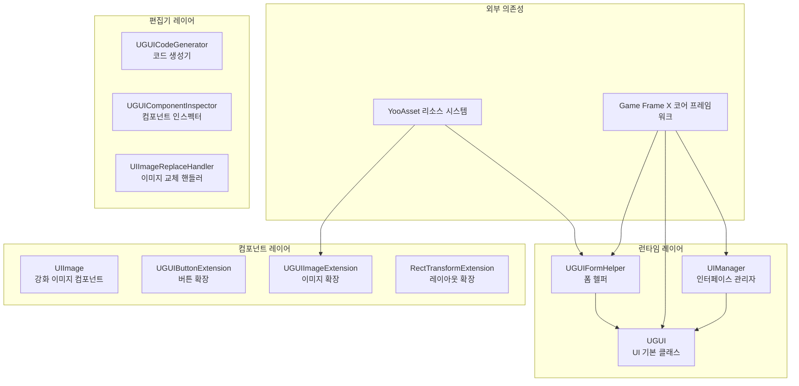
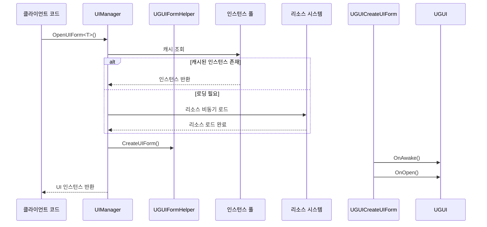

# 플러그인 소개

Game Frame X UGUI 컴포넌트는 Unity UI 기능 패키지로, UGUI 컴포넌트의 래핑을 제공하여 UGUI 컴포넌트 사용을 더욱 간단하고 효율적으로 만듭니다. 이 플러그인은 Game Frame X 게임 개발 프레임워크의 핵심 구성 요소로, Unity의 UGUI 시스템에 대해 심층적인 최적화와 기능 확장을 제공합니다.

## 개요

Game Frame X UGUI 플러그인은 Unity 게임 개발자에게 완전하고 효율적이며 확장 가능한 UI 솔루션을 제공합니다. 이 플러그인은 Unity 네이티브 UGUI 시스템을 래핑하여 더 편리한 API 호출 방식을 제공하며, 강력한 코드 생성기를 내장하여 UI 개발 효율성을 크게 향상시킵니다.

Game Frame X 프레임워크의 일부로서, 이 플러그인은 코어 프레임워크(`com.gameframex.unity`), UI 기초 패키지(`com.gameframex.unity.ui`), 리소스 관리 패키지(`com.gameframex.unity.asset`) 및 이벤트 시스템(`com.gameframex.unity.event`)에 의존합니다. 모듈화된 설계를 통해 개발자는 필요에 따라 플러그인의 각 기능 모듈을 선택적으로 사용할 수 있습니다.

이 플러그인은 Unity 2019.4 이상 버전을 지원하며, MIT 라이선스와 Apache License 2.0 이중 라이선스로 배포됩니다.

## 핵심 아키텍처



### 아키텍처 레이어 설명

**런타임 레이어**는 플러그인의 핵심 비즈니스 로직을 포함합니다:

- **UIManager**: UI 인터페이스의 열기, 닫기 및 생명주기 관리를 담당하며, 인터페이스 인스턴스 풀과 자동 회수 메커니즘을 지원합니다
- **UGUI**: 추상 UI 기본 클래스로, UI 표시 상태 제어 및 인터페이스 표시/숨김 애니메이션 지원을 제공합니다
- **UGUIFormHelper**: UI 폼 헬퍼로, UI 인스턴스化和 생성을 처리하며, 특성 구성을 통해 UI 그룹 및 애니메이션을 지원합니다

**컴포넌트 레이어**는 확장 기능을 제공합니다:

- **UIImage**: Unity의 Image 컴포넌트를 상속하며, 리소스 경로를 통해 비동기식으로 아이콘을 로드하는 것을 지원합니다
- **확장 메서드**: 버튼 확장, 이미지 확장 및 RectTransform 확장을 포함하여 일반적인 작업을 단순화합니다

**편집기 레이어**는 개발 효율성 도구를 제공합니다:

- **UGUICodeGenerator**: UGUI 프리팹에서 자동으로 코드를 생성합니다
- **UGUIComponentInspector**: 편집기에서 컴포넌트 속성을 시각적으로 검사합니다
- **UIImageReplaceHandler**: 이미지 리소스 대체를 일괄 처리합니다

## 주요 기능

### UGUI 컴포넌트 래핑

플러그인은 Unity 네이티브 UGUI 컴포넌트에 대한 고급 래핑을 제공하며, 더욱 객체 지향적인 인터페이스 설계를 제공합니다. 개발자는 Unity의 GameObject와 Component를 직접 조작할 필요 없이, `UGUI` 기본 클래스를 상속하여 자체 UI 인터페이스를 생성하여统일된 생명주기 관리와 이벤트 콜백 메커니즘을 활용할 수 있습니다.

```csharp
using GameFrameX.UI.UGUI.Runtime;
using UnityEngine;

public class MainMenuUI : UGUI
{
    protected override void OnInit(object userData)
    {
        base.OnInit(userData);
        // UI 초기화 로직
    }
    
    protected override void OnOpen(object userData)
    {
        base.OnOpen(userData);
        // UI 열기 시의 로직
    }
    
    protected override void OnClose(bool isShutdown, object userData)
    {
        base.OnClose(isShutdown, userData);
        // UI 닫기 시의 로직
    }
}
```
> Source: [README.md](https://github.com/GameFrameX/com.gameframex.unity.ui.ugui/blob/main/README.md#L78-L101)

### UI 관리자

`UIManager`는 전체 플러그인의 핵심 관리자로, UI 인터페이스의 완전한 생명주기를 처리합니다. `BaseUIManager`를 상속하며, 인터페이스 로딩, 캐싱, 회수 등의 완전한 기능을 제공합니다. 인스턴스 풀 기술을 통해 인터페이스의频繁한 생성 및 파괴로 인한 성능 오버헤드를 효과적으로 줄일 수 있습니다.



### 코드 생성기

편집기 도구 `UGUICodeGenerator`는 UI 개발 효율성을 크게 향상시킵니다. 개발자는 Unity 편집기에서 UGUI 프리팹을 생성하고 선택한 후, 우클릭하여 `GameObject/UI/Generate UGUI Code(UGUI 코드 생성)` 메뉴 항목을 선택하면対応하는 C# 코드 파일이 자동으로 생성됩니다.

생성된 코드는 다음을 포함합니다:
- 모든 하위 컴포넌트의 직렬화 필드 참조
- 버튼 클릭 이벤트 바인딩 메서드
- 컴포넌트 획득 완료 콜백 메서드

### 확장 메서드

플러그인은 일상적인 UI 개발 작업을 단순화하는 다양한 확장 메서드를 제공합니다:

**버튼 확장** - 이벤트 바인딩 단순화:
```csharp
startButton.onClick.Add(OnStartButtonClick);
startButton.onClick.Clear();
startButton.onClick.Set(OnClickHandler);
```
> Source: [UGUIButtonExtension.cs](https://github.com/GameFrameX/com.gameframex.unity.ui.ugui/blob/main/Runtime/UGUIButtonExtension.cs#L52-L101)

**이미지 확장** - 비동기 아이콘 로드:
```csharp
iconImage.SetIconAsync("UI/Icons/StartIcon");
```
> Source: [UGUIImageExtension.cs](https://github.com/GameFrameX/com.gameframex.unity.ui.ugui/blob/main/Runtime/UGUIImageExtension.cs#L56-L74)

**레이아웃 확장** - 전체 화면 설정:
```csharp
panel.MakeFullScreen();
```
> Source: [RectTransformExtension.cs](https://github.com/GameFrameX/com.gameframex.unity.ui.ugui/blob/main/Runtime/RectTransformExtension.cs#L56-L62)

## 의존성 관계

이 플러그인은 다음 Game Frame X 컴포넌트에 의존합니다:

| 의존성 패키지 | 최소 버전 | 설명 |
|---------|----------|------|
| com.gameframex.unity | 1.1.1 | 코어 프레임워크, 기본 서비스 제공 |
| com.gameframex.unity.ui | 1.0.0 | UI 기초 패키지, UIForm 인터페이스 정의 |
| com.gameframex.unity.asset | 1.0.6 | 리소스 관리 시스템 |
| com.gameframex.unity.event | 1.0.0 | 이벤트 시스템 |

## 빠른 시작

### 기본 사용 흐름

1. **UI 인터페이스 클래스 생성**: `UGUI` 기본 클래스를 상속하고 생명주기 메서드 구현
2. **UI 프리팹 구성**: 프리팹에 `UGUI`를 상속하는 컴포넌트 추가
3. **관리자를 통한 인터페이스 열기**: `UIManager`를 사용하여 인터페이스 열기/닫기

```csharp
// 인터페이스 열기
var mainMenu = await UIManager.Instance.OpenUIForm<MainMenuUI>("UI/");

// 인터페이스 닫기
UIManager.Instance.CloseUIForm(mainMenu);
```

### UIImage 컴포넌트 사용

`UIImage` 컴포넌트는 `icon` 속성을 설정하여 이미지 리소스를 비동기식으로 로드하는 것을 지원합니다:

```csharp
public class IconDisplay : MonoBehaviour
{
    [SerializeField] private UIImage iconImage;
    
    void Start()
    {
        // 아이콘 설정, 비동기 로드 지원
        iconImage.icon = "UI/Icons/PlayerAvatar";
    }
}
```
> Source: [README.md](https://github.com/GameFrameX/com.gameframex.unity.ui.ugui/blob/main/README.md#L143-L156)

## 관련 링크

- [기능 특성](./1-overview.features) - 상세 기능 목록
- [의존성 요구사항](./2-installation.dependencies) - 의존성 상세 정보
- [설치 방식](./2-installation.methods) - 설치 구성 가이드
- [UI 인터페이스 생성](./3-getting-started.create-ui) - UI 생성 튜토리얼
- [코드 생성기](./3-getting-started.code-generator) - 코드 생성기 사용
- [UGUI 기본 클래스](./4-core-concepts.ugui-base) - UGUI 기본 클래스 상세
- [UI 관리자](./4-core-concepts.ui-manager) - 관리자 API 참조
- [폼 헬퍼](./4-core-concepts.form-helper) - 헬퍼 상세
- [UIImage 컴포넌트](./5-components.uiimage) - 강화 이미지 컴포넌트
- [확장 메서드](./5-components.extensions) - 확장 메서드 API
- [코드 생성기 도구](./6-editor-tools.code-generator) - 편집기 도구
- [컴포넌트 인스펙터](./6-editor-tools.inspector) - 인스펙터 설명
- [이미지 교체 핸들러](./6-editor-tools.image-replace) - 리소스 처리 도구
- [구성 설명](./7-configuration) - 프레임워크 구성
- [일반 문제](./8-troubleshooting) - FAQ疑难解答
- [공식 문서](https://gameframex.doc.alianblank.com)
- [GitHub 저장소](https://github.com/GameFrameX/com.gameframex.unity.ui.ugui)
