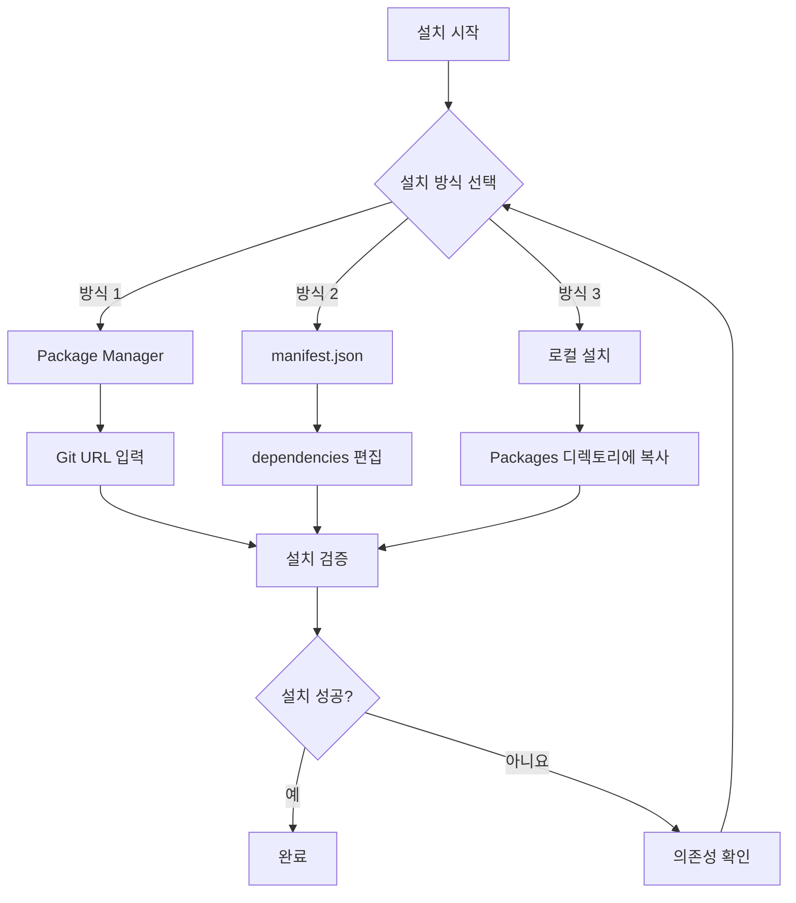
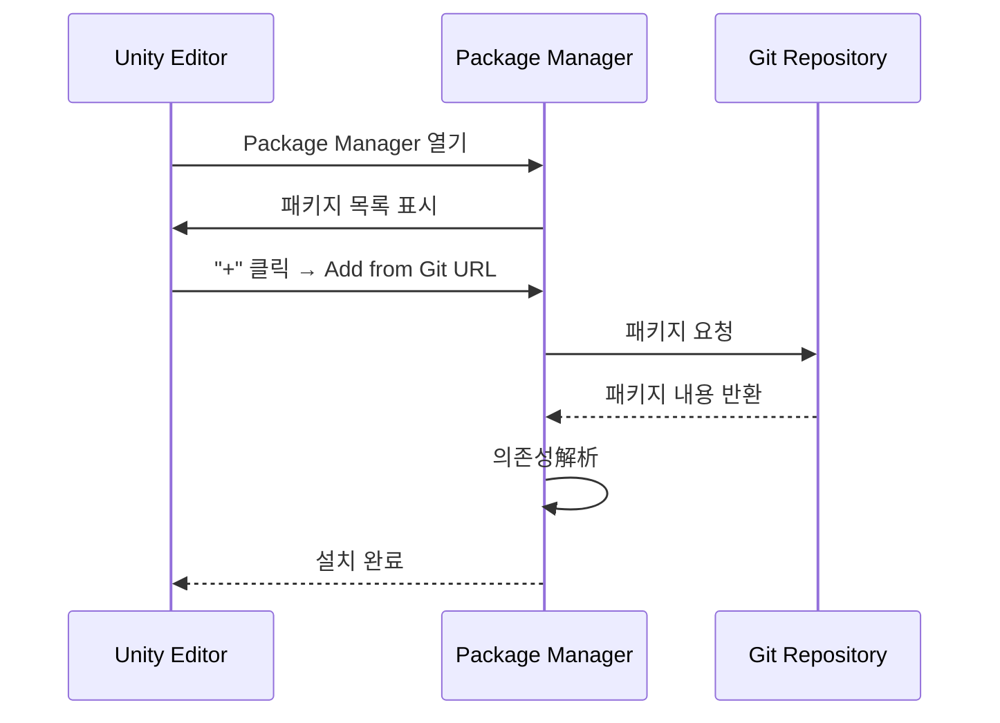

# 설치 방식

이 문서는 Game Frame X UI UGUI 패키지의 다양한 설치 방법을 소개하며, 개발자가 프로젝트 요구에 따라最适合한 설치 방식을 선택할 수 있도록 도와줍니다.

## 개요

Game Frame X UI UGUI는 Unity UGUI의 강화 컴포넌트 라이브러리로, UI 관리자, 코드 생성기, 확장 메서드 등의 기능 모듈을 제공합니다. 이 패키지는 Unity Package Manager (UPM) 표준을 따르며, 다양한 설치 방식을 지원합니다.

**패키지 기본 정보:**
- 패키지명: `com.gameframex.unity.ui.ugui`
- 현재 버전: 2.3.6
- Unity 버전 요구사항: 2019.4+
- Git 저장소: https://github.com/GameFrameX/com.gameframex.unity.ui.ugui.git

## 설치 흐름 개요



## 선행 의존성

이 패키지를 설치하기 전에 다음 의존성 패키지가 올바르게 설치되었는지 확인해야 합니다:

| 의존성 패키지 | 버전 요구사항 | 설명 |
|-----------|----------|------|
| com.gameframex.unity | 1.1.1 | 코어 프레임워크 |
| com.gameframex.unity.ui | 1.0.0 | UI 기초 패키지 |
| com.gameframex.unity.asset | 1.0.6 | 리소스 관리 |
| com.gameframex.unity.event | 1.0.0 | 이벤트 시스템 |

> **주의**: 위 의존성 패키지는 이 패키지 설치 시 자동으로解析하려고 시도합니다. 의존성 설치에 실패하면 [의존성 요구사항](./2-installation.dependencies) 문서를 참조하여 수동으로 처리하세요.

## 설치 방식

### 방식 1: Package Manager (권장)

Unity의 Package Manager를 통해 Git URL로 설치하는 것은 공식 권장 방식으로, 다음的优点가 있습니다:
- 자동 버전 관리
- 의존성 자동解析
- 최신 버전으로 업데이트 용이

**작업 단계:**

1. Unity 편집기 열기
2. `Window` → `Package Manager` (창 → 패키지 관리자)로 이동
3. 패키지 관리자 좌측 상단 **+** 버튼 클릭
4. **Add package from git URL** (Git URL에서 패키지 추가) 선택
5. 입력창에 다음 주소 붙여넣기:
   ```
   https://github.com/GameFrameX/com.gameframex.unity.ui.ugui.git
   ```
6. **Add** (추가) 버튼 클릭하여 설치 완료 대기



### 방식 2: manifest.json 직접 편집

이 방식은 특정 버전을 잠그거나 네트워크 환경이 없는 상태에서 개발하는 데 적합합니다.

**작업 단계:**

1. 프로젝트의 `Packages/manifest.json` 파일 찾기
2. 텍스트 편집기로 파일 열기
3. `dependencies` 노드 아래에 다음 내용 추가:

```json
{
  "dependencies": {
    "com.gameframex.unity.ui.ugui": "https://github.com/GameFrameX/com.gameframex.unity.ui.ugui.git",
    "com.gameframex.unity": "1.1.1",
    "com.gameframex.unity.ui": "1.0.0",
    "com.gameframex.unity.asset": "1.0.6",
    "com.gameframex.unity.event": "1.0.0"
  }
}
```

> Source: [README.md](https://github.com/GameFrameX/com.gameframex.unity.ui.ugui/blob/main/README.md#L66-L69)

4. 파일 저장하고 Unity 편집기로 돌아가기
5. Unity가 패키지를 자동으로 다시 가져오기するまで 대기

**버전 잠금 방식:**

특정 버전을 설치해야 하는 경우 Git의 버전 태그를 사용할 수 있습니다:

```json
{
  "dependencies": {
    "com.gameframex.unity.ui.ugui": "https://github.com/GameFrameX/com.gameframex.unity.ui.ugui.git#2.3.6"
  }
}
```

### 방식 3: 로컬 설치

외부 네트워크에 액세스할 수 없거나 오프라인 개발이 필요한 시나리오에 적합합니다.

**작업 단계:**

1. Git 저장소克隆 또는 다운로드:
   ```
   https://github.com/GameFrameX/com.gameframex.unity.ui.ugui.git
   ```
2. 저장소 폴더를 Unity 프로젝트의 `Packages` 디렉토리에 복사
3. Unity가 해당 패키지를 자동으로 인식하고 로드합니다

> Source: [README.md](https://github.com/GameFrameX/com.gameframex.unity.ui.ugui/blob/main/README.md#L71-L72)

**디렉토리 구조 요구사항:**

```
YourUnityProject/
└── Packages/
    └── com.gameframex.unity.ui.ugui/    ← 패키지 루트 디렉토리
        ├── package.json                  ← 필수
        ├── Runtime/                      ← 런타임 어셈블리
        │   └── GameFrameX.UI.UGUI.Runtime.asmdef
        ├── Editor/                       ← 편집기 어셈블리
        │   └── GameFrameX.UI.UGUI.Editor.asmdef
        └── ...
```

## 설치 검증

설치 완료 후 다음方式来验证是否成功:

### 방법 1: Package Manager 확인

Package Manager 창에서 `Game Frame X UI UGUI`를 검색하여 패키지가 목록에 표시되는지 확인합니다.

### 방법 2: 어셈블리 확인

Unity 프로젝트에서 다음 어셈블리가 올바르게 로드되었는지 확인:
- `GameFrameX.UI.UGUI.Runtime`
- `GameFrameX.UI.UGUI.Editor`

### 방법 3: 테스트 스크립트 생성

간단한 테스트 스크립트를 생성하여 네임스페이스 사용 가능성 검증:

```csharp
using GameFrameX.UI.UGUI.Runtime;

public class InstallationTest : MonoBehaviour
{
    void Start()
    {
        Debug.Log("Game Frame X UI UGUI 설치 성공!");
    }
}
```

> Source: [README.md](https://github.com/GameFrameX/com.gameframex.unity.ui.ugui/blob/main/README.md#L78-L102)

## 일반 문제

### Q1: 설치 후 의존성 오류 발생

**원인**: 의존하는 패키지 버전이 호환되지 않거나 설치되지 않음

**솔루션**:
1. `Window` → `Package Manager` 열기
2. 모든 의존성 패키지가 올바르게 설치되었는지 확인
3. [의존성 요구사항](./2-installation.dependencies)을 참조하여 누락된 의존성 수동 설치

### Q2: Git URL에서 설치 불가

**원인**: 네트워크 문제 또는 Git 자격 증명 구성不正确

**솔루션**:
1. GitHub에 액세스할 수 있는지 네트워크 확인
2. 로컬 설치 방식 시도
3. Git 자격 증명 관리자 구성

### Q3: 버전 번호 접미사 ".git"의 의미

이는 Git 저장소의 URL 접미사로, 원격 저장소에서 코드를 풀링함을 나타냅니다. 이 형식을使用时, Unity는 자동으로 최신 버전을 풀링합니다. 특정 버전이 필요한 경우 `#version` 형식을 사용하여 버전 태그를 지정하세요.

## 관련 링크

- [의존성 요구사항](./2-installation.dependencies) - 상세 의존성 설명
- [공식 문서](https://gameframex.doc.alianblank.com)
- [GitHub 저장소](https://github.com/GameFrameX/com.gameframex.unity.ui.ugui)
- [빠른 시작](../3-getting-started.create-ui)
- [핵심 개념](../4-core-concepts.ugui-base)
