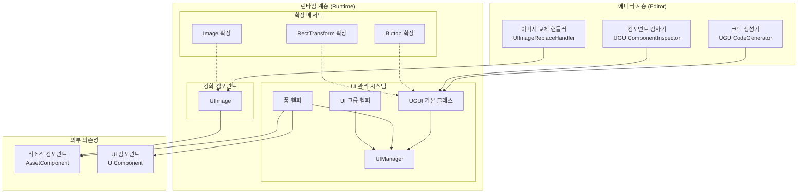
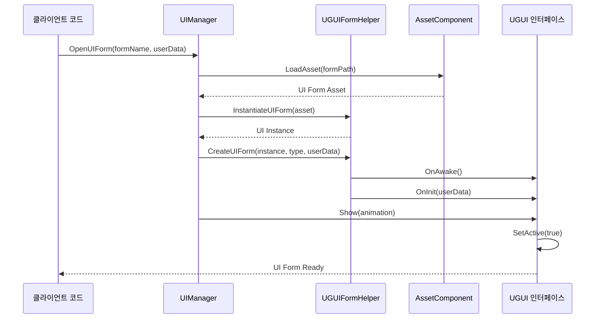
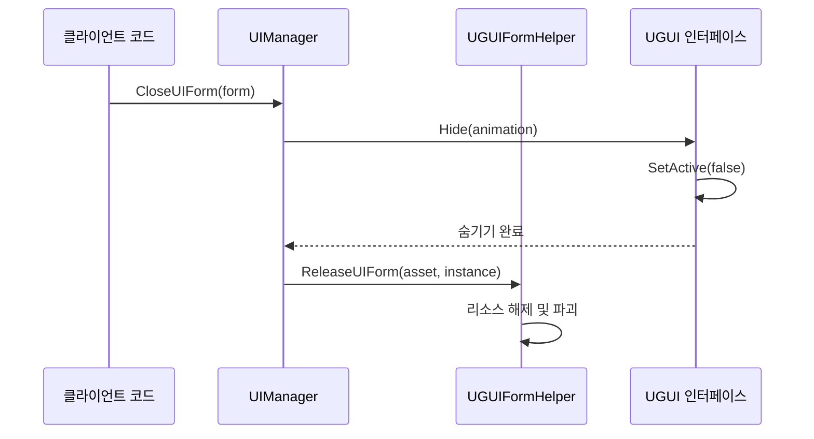

# 기능 특성

GameFrameX UGUI 컴포넌트는 Unity UI 기능 패키지로, Unity UGUI 컴포넌트의 고급 래핑을 제공하여 UGUI 컴포넌트 사용을 더욱 간단하고 효율적으로 만든다. 이 플러그인은 Game Frame X 프레임워크와 긴밀하게 통합되어 완전한 UI 인터페이스 관리, 코드 생성 및 확장 메서드 기능을 제공한다.

## 개요

본 플러그인은 Unity 게임 개발을 위한 완전한 UGUI 솔루션을 제공하며, 다음과 같은 핵심 기능 모듈을 포함한다:

- **UGUI 컴포넌트 래핑**: Unity UGUI 컴포넌트의 고급 래핑 제공, UI 개발 프로세스 간소화
- **UI 관리자**: 완전한 UI 인터페이스 관리 시스템, 인터페이스 열기, 닫기 및 라이프사이클 관리 처리
- **코드 생성기**: UI 프리팹에서 자동으로 코드 생성, 개발 효율성 대폭 향상
- **확장 메서드**:常用的 UGUI 컴포넌트에 풍부한 체인 확장 메서드 제공
- **폼 헬퍼**: UI 폼 생성 및 관리 보조 도구

이러한 기능 모듈들이 상호 협력하여 완전한 UGUI 개발 솔루션을 구성한다. 플러그인은 Game Frame X 프레임워크의 아키텍처 규범을 준수하여 리소스 관리, 이벤트 시스템等其他 컴포넌트와 긴밀하게 통합할 수 있다.

## 아키텍처

플러그인은 계층형 아키텍처 설계를 채택하여 런타임 계층과 에디터 계층으로 크게 나뉜다. 런타임 계층에는 UI 관리의 핵심 로직과 확장 기능이 포함되고, 에디터 계층은 시각적 개발 도구를 제공한다.



### 아키텍처 설명

**에디터 계층**은 세 가지 주요 개발 도구를 제공한다: 코드 생성기는 UI 코드를 자동으로 생성하고, 컴포넌트 검사기는 Inspector 패널에서 UI 컴포넌트를 시각적으로 조작하며, 이미지 교체 핸들러는 표준 Image 컴포넌트를 강화된 UIImage 컴포넌트로 교체한다.

**런타임 계층**은 플러그인의 핵심으로, 세 가지 주요 부분을 포함한다: UI 관리 시스템은 인터페이스의 라이프사이클 관리를 담당하고, 강화 컴포넌트는 기능 확장이 있는 UI 요소를 제공하고, 확장 메서드는常用的 UGUI 컴포넌트에 편리한 조작 메서드를 추가한다.

**외부 의존성** 부분은 플러그인과 Game Frame X 프레임워크 다른 컴포넌트와의 통합 관계를 보여주며, 리소스 컴포넌트와 UI 컴포넌트를 포함한다.

## 핵심 기능 상세

### UI 관리 시스템

UI 관리 시스템은 플러그인의 핵심으로, 게임의 모든 UI 인터페이스의 라이프사이클을 관리한다. 이 시스템은 네 가지 주요 클래스로 구성된다: UGUI는 모든 UI 인터페이스의 기본 클래스이고, UIManager는 인터페이스 관리자이고, UGUIFormHelper는 폼 헬퍼이고, UGUIUIGroupHelper는 인터페이스 그룹 헬퍼다.

**UGUI 기본 클래스**는 UIForm에서 상속되어 UGUI 특정 인터페이스 기능 구현을 제공한다. 인터페이스의 표시 및 숨기기 조작을 처리하고, 선택적 애니메이션 효과로 사용자 경험을 향상시키며, 가시성 제어 기능을 제공한다.

```csharp
public class MainMenuUI : UGUI
{
    protected override void OnInit(object userData)
    {
        base.OnInit(userData);
        // UI 초기화 로직
    }
    
    protected override void OnOpen(object userData)
    {
        base.OnOpen(userData);
        // UI 열기時の 로직
    }
    
    protected override void OnClose(bool isShutdown, object userData)
    {
        base.OnClose(isShutdown, userData);
        // UI 닫기時の 로직
    }
}
```
> Source: [README.md](https://github.com/GameFrameX/com.gameframex.unity.ui.ugui/blob/main/README.md#L78-L102)

**UIManager**는 인터페이스 관리자의 구체적 구현으로 BaseUIManager에서 상속되어 UI 폼의 로딩, 캐싱 및 라이프사이클 관리를 처리한다. 프레임워크의 UI 컴포넌트와 긴밀하게 통합되어 통일된 인터페이스 액세스를 제공한다.

**UGUIFormHelper**는 기본 인터페이스 헬퍼로, UIFormHelperBase 인터페이스를 구현한다. UI 폼의 인스턴스화, 생성 및 해제를 처리한다. 인터페이스 생성 시 인터페이스 그룹 할당, 애니메이션 구성 등의 세부 사항을 자동으로 처리한다.

**UGUIUIGroupHelper**는 인터페이스 그룹 헬퍼로, UI 그룹의 계층 및 레벨 구조를 관리한다. 깊이 설정 기능을 제공하여 서로 다른 인터페이스 그룹 간의 올바른 가림 관계를 보장한다.

### 강화 컴포넌트

**UIImage**는 Unity 표준 Image 컴포넌트의 확장으로, 리소스 경로를 통해 아이콘을 비동기적으로 로드하는 기능을 추가했다. icon 속성을 설정하면 리소스 시스템에서 자동으로 텍스처를 로드하여 Sprite를 생성하여 Image에 표시한다.

```csharp
[DisallowMultipleComponent]
public class UIImage : UnityEngine.UI.Image
{
    public string icon
    {
        get { return m_icon; }
        set
        {
            if (m_icon != value)
            {
                m_icon = value;
                _ = this.SetIconAsync(m_icon);
            }
        }
    }
}
```
> Source: [Runtime/UIImage.cs](https://github.com/GameFrameX/com.gameframex.unity.ui.ugui/blob/main/Runtime/UIImage.cs#L40-L72)

UIImage 컴포넌트를 사용하면 아이콘 로드 코드를 간소화할 수 있다:

```csharp
public class IconDisplay : MonoBehaviour
{
    [SerializeField] private UIImage iconImage;
    
    void Start()
    {
        // 아이콘 설정, 비동기 로드 지원
        iconImage.icon = "UI/Icons/PlayerAvatar";
    }
}
```
> Source: [README.md](https://github.com/GameFrameX/com.gameframex.unity.ui.ugui/blob/main/README.md#L143-L156)

### 확장 메서드

플러그인은 세 가지 주요 확장 메서드 클래스를 제공한다. 각각 Button, Image 및 RectTransform 컴포넌트를 대상으로 한다.

**UGUIButtonExtension**은 버튼의 클릭 이벤트에 편리한 확장 메서드를 제공한다. 클릭 이벤트 추가, 제거, 지우기 및 설정 기능이 포함된다.

```csharp
public static class UGUIBOttonExtension
{
    // 버튼 클릭 이벤트 추가
    public static void Add(this Button.ButtonClickedEvent self, UnityAction action);
    
    // 버튼 클릭 이벤트 제거
    public static void Remove(this Button.ButtonClickedEvent self, UnityAction action);
    
    // 버튼 클릭 이벤트 지우기
    public static void Clear(this Button.ButtonClickedEvent self);
    
    // 버튼 클릭 이벤트 설정 (기존 이벤트 대체)
    public static void Set(this Button.ButtonClickedEvent self, UnityAction action);
}
```
> Source: [Runtime/UGUIButtonExtension.cs](https://github.com/GameFrameX/com.gameframex.unity.ui.ugui/blob/main/Runtime/UGUIButtonExtension.cs#L42-L101)

확장 메서드 사용 예:

```csharp
startButton.onClick.Add(OnStartButtonClick);
```
> Source: [README.md](https://github.com/GameFrameX/com.gameframex.unity.ui.ugui/blob/main/README.md#L119-L119)

**UGUIImageExtension**은 비동기 아이콘 설정 기능을 제공한다. 리소스 시스템을 통해 텍스처를 로드하고 Sprite를 생성한다.

```csharp
public static class UGUIImageExtension
{
    public static async Task SetIconAsync(this UnityEngine.UI.Image self, string icon)
    {
        var assetComponent = GameEntry.GetComponent<AssetComponent>();
        using (var valueHandle = await assetComponent.LoadAssetAsync<Texture2D>(icon))
        {
            if (valueHandle.IsDone && valueHandle.Status == EOperationStatus.Succeed)
            {
                var texture2D = valueHandle.GetAssetObject<Texture2D>();
                self.sprite = Sprite.Create(texture2D, new Rect(0, 0, texture2D.width, texture2D.height), new Vector2(0.5f, 0.5f));
            }
        }
    }
}
```
> Source: [Runtime/UGUIImageExtension.cs](https://github.com/GameFrameX/com.gameframex.unity.ui.ugui/blob/main/Runtime/UGUIImageExtension.cs#L44-L74)

**RectTransformExtension**은 MakeFullScreen 메서드를 제공한다. RectTransform을 전체 화면으로 설정할 수 있다.

```csharp
public static class RectTransformExtension
{
    public static void MakeFullScreen(this RectTransform rectTransform)
    {
        rectTransform.anchorMin = Vector2.zero;
        rectTransform.anchorMax = Vector2.one;
        rectTransform.anchoredPosition = Vector2.zero;
        rectTransform.sizeDelta = Vector2.zero;
    }
}
```
> Source: [Runtime/RectTransformExtension.cs](https://github.com/GameFrameX/com.gameframex.unity.ui.ugui/blob/main/Runtime/RectTransformExtension.cs#L56-L62)

### 에디터 도구

플러그인은 개발 효율성을 높이기 위해 세 가지 에디터 도구를 제공한다.

**UGUICodeGenerator**는 UGUI 코드 생성기로, UI 프리팹에서 자동으로 코드를 생성한다. 메뉴 항목 `GameObject/UI/Generate UGUI Code(UGUI 코드 생성)`을 통해 접근하며, 프리팹의 모든 UI 컴포넌트를 자동으로 스캔하여 해당 코드를 생성한다.

```csharp
[MenuItem("GameObject/UI/Generate UGUI Code(UGUI 코드 생성)", false, 1)]
static void Code()
{
    // 코드 생성 로직
}
```
> Source: [Editor/UGUICodeGenerator.cs](https://github.com/GameFrameX/com.gameframex.unity.ui.ugui/blob/main/Editor/UGUICodeGenerator.cs#L56-L73)

생성된 코드는 다음 특성을 포함한다:

- 모든 UI 하위 노드를 자동으로 인식하여 속성 선언 생성
- 각 컨트롤의 경로를 표시하기 위해 `UGUIElementPropertyAttribute` 사용
- 초기화 바인딩을 위해 `InitView()` 메서드 생성
- 사용자 정의 타입 변환 핸들러 지원

**UGUIComponentInspector**는 UGUI 컴포넌트의 사용자 정의 인스펙터로, 두 가지 주요 기능 버튼을 제공한다: "코드 재생성" 및 "목록 다시 바인딩".

```csharp
[CustomEditor(typeof(Runtime.UGUI), true)]
internal sealed class UGUIComponentInspector : GameFrameworkInspector
{
    public override void OnInspectorGUI()
    {
        // "코드 재생성" 및 "목록 다시 바인딩" 기능 제공
    }
}
```
> Source: [Editor/UGUIComponentInspector.cs](https://github.com/GameFrameX/com.gameframex.unity.ui.ugui/blob/main/Editor/UGUIComponentInspector.cs#L43-L153)

**UIImageReplaceHandler**는 표준 Image 컴포넌트를 UIImage 컴포넌트로 교체하는 기능을 제공한다. 메뉴 항목 `CONTEXT/Image/Replace To UIImage(UIImage로 교체)`를 통해 접근한다.

```csharp
[MenuItem("CONTEXT/Image/Replace To UIImage(UIImage로 교체)", false, 10)]
static void Run()
{
    // 교체 로직, 원본 Image의 모든 속성 유지
}
```
> Source: [Editor/UIImageReplaceHandler.cs](https://github.com/GameFrameX/com.gameframex.unity.ui.ugui/blob/main/Editor/UIImageReplaceHandler.cs#L42-L76)

### 속성 특성

**UGUIElementPropertyAttribute**는 코드 생성기와 함께 사용하여 프리팹 내 UI 컨트롤의 경로를 표시한다.

```csharp
public sealed class UGUIElementPropertyAttribute : Attribute
{
    public string Path { get; }
    
    public UGUIElementPropertyAttribute(string path)
    {
        Path = path;
    }
}
```
> Source: [Runtime/UGUIElementPropertyAttribute.cs](https://github.com/GameFrameX/com.gameframex.unity.ui.ugui/blob/main/Runtime/UGUIElementPropertyAttribute.cs#L40-L64)

## 인터페이스 열기 및 닫기 프로세스

게임에서 UI 인터페이스의 열기 및 닫기는 특정 프로세스를 따르며, 여러 컴포넌트의 협업을 포함한다.



인터페이스를 닫아야 할 때 프로세스는 다음과 같다:



## 사용 예시

### 사용자 정의 UI 인터페이스 생성

UGUI 기본 클래스를 상속하여 사용자 정의 인터페이스를 생성하고, 라이프사이클 메서드를 재정의하여 비즈니스 로직을 처리한다:

```csharp
using GameFrameX.UI.UGUI.Runtime;
using UnityEngine;

public class MainMenuUI : UGUI
{
    protected override void OnInit(object userData)
    {
        base.OnInit(userData);
        // UI 초기화 로직
    }
    
    protected override void OnOpen(object userData)
    {
        base.OnOpen(userData);
        // UI 열기時の 로직
    }
    
    protected override void OnClose(bool isShutdown, object userData)
    {
        base.OnClose(isShutdown, userData);
        // UI 닫기時の 로직
    }
}
```
> Source: [README.md](https://github.com/GameFrameX/com.gameframex.unity.ui.ugui/blob/main/README.md#L78-L102)

### 확장 메서드 사용

MonoBehaviour에서 확장 메서드를 사용하여 UI 조작을 간소화한다:

```csharp
using GameFrameX.UI.UGUI.Runtime;
using UnityEngine.UI;

public class UIController : MonoBehaviour
{
    [SerializeField] private Button startButton;
    [SerializeField] private Image iconImage;
    [SerializeField] private RectTransform panel;
    
    void Start()
    {
        // 버튼 확장 메서드
        startButton.onClick.Add(OnStartButtonClick);
        
        // 이미지 확장 메서드
        iconImage.SetIcon("UI/Icons/StartIcon");
        
        // RectTransform 확장 메서드
        panel.MakeFullScreen();
    }
    
    private void OnStartButtonClick()
    {
        Debug.Log("시작 버튼 클릭됨!");
    }
}
```
> Source: [README.md](https://github.com/GameFrameX/com.gameframex.unity.ui.ugui/blob/main/README.md#L106-L133)

### 코드 생성기 사용

1. Hierarchy에서 UGUI 프리팹 선택
2. 우클릭하여 `GameObject/UI/Generate UGUI Code(UGUI 코드 생성)` 선택
3. 코드가 자동으로 `Assets/Hotfix/UI/UGUI/` 디렉토리에 생성됨

생성된 코드 구조는 다음과 같다:

```csharp
[DisallowMultipleComponent]
[OptionUIConfig(null, "Assets/Prefabs/UI")]
public sealed partial class MainMenuUI : UGUI
{
    public GameObject self { get; private set; }

    [SerializeField] [UGUIElementProperty("Background")]
    private UnityEngine.UI.Image m_Background;

    [SerializeField] [UGUIElementProperty("StartButton")]
    private UnityEngine.UI.Button m_StartButton;

    protected override void InitView()
    {
        if (_isInitView) return;
        _isInitView = true;
        this.self = this.gameObject;
        m_Background = gameObject.transform.FindChildName("Background").GetComponent<UnityEngine.UI.Image>();
        m_StartButton = gameObject.transform.FindChildName("StartButton").GetComponent<UnityEngine.UI.Button>();
    }
}
```
> Source: [Editor/UGUICodeGenerator.cs](https://github.com/GameFrameX/com.gameframex.unity.ui.ugui/blob/main/Editor/UGUICodeGenerator.cs#L199-L230)

## 관련 링크

- [플러그인 소개](./1-overview.introduction) - 플러그인의 개요 및 설계 철학 파악
- [설치 방식](./2-installation.methods) - 플러그인 설치 단계 얻기
- [UGUI 기본 클래스](./4-core-concepts.ugui-base) - UGUI 기본 클래스의 상세 문서
- [UI 관리자](./4-core-concepts.ui-manager) - UI 관리자의 상세 문서
- [폼 헬퍼](./4-core-concepts.form-helper) - 폼 헬퍼의 상세 문서
- [UIImage 컴포넌트](./5-components.uiimage) - UIImage 컴포넌트의 상세 문서
- [확장 메서드](./5-components.extensions) - 확장 메서드의 상세 문서
- [코드 생성기](./6-editor-tools.code-generator) - 코드 생성기의 상세 문서
- [컴포넌트 검사기](./6-editor-tools.inspector) - 컴포넌트 검사기의 상세 문서
- [이미지 교체 핸들러](./6-editor-tools.image-replace) - 이미지 교체 핸들러의 상세 문서
