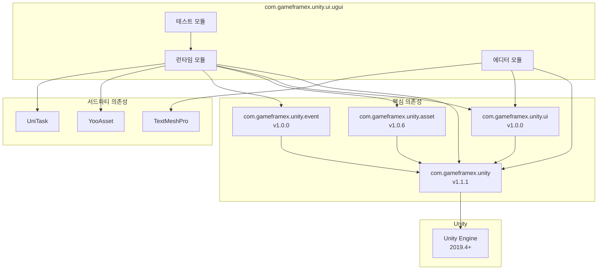

# 의존성 요구사항

이 문서는 Game Frame X UGUI 컴포넌트 패키지의 모든 의존성 요구사항을 상세히 설명한다. Unity 버전 요구사항, 패키지 의존성 및 어셈블리 참조를 포함한다.

## 개요

Game Frame X UGUI 컴포넌트 패키지는 Unity UGUI 기반의 고급 UI 프레임워크로, Game Frame X 핵심 프레임워크 및 기타 관련 컴포넌트 패키지에 의존한다. 이러한 의존성 요구사항을 이해하는 것이 올바른 설치 및 사용의 첫 단계다.

## Unity 버전 요구사항

| 항목 | 요구사항 |
|------|----------|
|最低 Unity 버전 | 2019.4 |
| 권장 Unity 버전 | 2020.3 LTS 이상 |

> Source: [package.json](https://github.com/GameFrameX/com.gameframex.unity.ui.ugui/blob/main/package.json#L7)

## 패키지 의존성

UGUI 컴포넌트 패키지를 설치하기 전에 다음 의존성 패키지가 올바르게 설치되어 있는지 확인해야 한다. 이러한 의존성 패키지는 Unity Package Manager를 통해 관리된다.

### 핵심 의존성

| 패키지명 |最低버전 | 설명 |
|------|---------|------|
| com.gameframex.unity | 1.1.1 | Game Frame X 핵심 프레임워크, 기반 아키텍처 및 공통 기능 제공 |
| com.gameframex.unity.ui | 1.0.0 | Game Frame X UI 기본 패키지, UI 추상 계층 및 기본 인터페이스 제공 |
| com.gameframex.unity.asset | 1.0.6 | Game Frame X 리소스 관리 패키지, 리소스 로딩 및 관리 기능 제공 |
| com.gameframex.unity.event | 1.0.0 | Game Frame X 이벤트 시스템 패키지, 이벤트 배포 및 리스닝 기능 제공 |

> Source: [package.json](https://github.com/GameFrameX/com.gameframex.unity.ui.ugui/blob/main/package.json#L21-L26)

### 의존성 설치

Unity 프로젝트의 `manifest.json` 파일에 다음 의존성을 추가한다:

```json
{
  "dependencies": {
    "com.gameframex.unity": "1.1.1",
    "com.gameframex.unity.ui": "1.0.0",
    "com.gameframex.unity.asset": "1.0.6",
    "com.gameframex.unity.event": "1.0.0",
    "com.gameframex.unity.ui.ugui": "2.3.6"
  }
}
```

## 어셈블리 참조

### 런타임 어셈블리 (Runtime)

UGUI 런타임 어셈블리는 다음 어셈블리를 참조해야 한다:

| 어셈블리 | 설명 |
|--------|------|
| GameFrameX.Runtime | 핵심 런타임 |
| GameFrameX.Asset.Runtime | 리소스 관리 런타임 |
| GameFrameX.Event.Runtime | 이벤트 시스템 런타임 |
| GameFrameX.UI.Runtime | UI 기본 런타임 |
| YooAsset.Runtime | YooAsset 리소스 엔진 런타임 |
| YooAsset | YooAsset 메인 어셈블리 |
| UniTask.Runtime | UniTask 비동기 런타임 |

> Source: [Runtime/GameFrameX.UI.UGUI.Runtime.asmdef](https://github.com/GameFrameX/com.gameframex.unity.ui.ugui/blob/main/Runtime/GameFrameX.UI.UGUI.Runtime.asmdef#L4-L11)

### 에디터 어셈블리 (Editor)

UGUI 에디터 어셈블리는 다음 어셈블리를 참조해야 한다:

| 어셈블리 | 설명 |
|--------|------|
| GameFrameX.Editor | 핵심 에디터 |
| GameFrameX.Runtime | 핵심 런타임 |
| GameFrameX.UI.Runtime | UI 기본 런타임 |
| GameFrameX.UI.UGUI.Runtime | UGUI 런타임 |
| Unity.TextMeshPro | TextMeshPro（조건부 의존성） |

> Source: [Editor/GameFrameX.UI.UGUI.Editor.asmdef](https://github.com/GameFrameX/com.gameframex.unity.ui.ugui/blob/main/Editor/GameFrameX.UI.UGUI.Editor.asmdef#L4-L9)

#### TextMeshPro 조건부 참조

에디터 어셈블리는 버전 정의를 사용하여 TextMeshPro를 조건부로 참조한다:

```json
{
  "name": "com.unity.textmeshpro",
  "expression": "",
  "define": "ENABLE_UI_TEXT_MESH_PRO"
}
```

이는 TextMeshPro가 선택적 의존성임을 의미하며, 프로젝트에 TextMeshPro가 있을 때 자동으로 관련 기능이 활성화된다.

> Source: [Editor/GameFrameX.UI.UGUI.Editor.asmdef](https://github.com/GameFrameX/com.gameframex.unity.ui.ugui/blob/main/Editor/GameFrameX.UI.UGUI.Editor.asmdef#L20-L26)

## 의존성 관계도



## 설치 순서

의존성이 올바르게 분석되도록 하려면 다음 순서대로 설치한다:

1. **첫 번째 단계: 핵심 의존성 설치**
   - com.gameframex.unity (1.1.1)
   - com.gameframex.unity.ui (1.0.0)
   - com.gameframex.unity.asset (1.0.6)
   - com.gameframex.unity.event (1.0.0)

2. **두 번째 단계: 서드파티 의존성 설치**
   - YooAsset（Asset 또는 UI 패키지를 통해 자동 도입）
   - UniTask（자동 도입되지 않으면 수동 설치 필요）

3. **세 번째 단계: UGUI 컴포넌트 설치**
   - com.gameframex.unity.ui.ugui (2.3.6)

4. **네 번째 단계（선택사항）: 에디터 향상 설치**
   - TextMeshPro（향상된 텍스트 기능 사용 필요 시）

## 버전 호환성

| UGUI 버전 | Unity 버전 | 핵심 프레임워크 버전 | 패키지 상태 |
|-----------|-----------|-------------|--------|
| 2.3.6 | 2019.4+ | 1.1.1 | 현재 안정화 버전 |
| 2.0.0 | 2019.4+ | 1.0.0 | 이력 버전 |

## 자주 묻는 질문

### Q1: 설치 시 의존성 부족 안내가 표시되면 어떻게 해야 하나요?

위의 설치 순서대로 모든 의존성 패키지를 순차적으로 설치해야 한다. Git URL 설치 방식을 사용하면 의존성 패키지가 일반적으로 자동으로 다운로드된다.

### Q2: YooAsset과 UniTask는 어디서 얻을 수 있나요?

이 두 패키지는 일반적으로 Game Frame X 생태계의 일부로 자동 도입된다. 자동 도입되지 않은 경우:
- YooAsset: GitHub 저장소 `YooAsset`에서 얻을 수 있음
- UniTask: Unity Package Manager에서 `com.cysharp.unitask`를 얻을 수 있음

### Q3: TextMeshPro는 필수인가요?

아니요. TextMeshPro는 선택적 의존성으로, 핵심 기능 사용에 영향을 주지 않는다. 그러나 완전한 텍스트 처리 기능을 얻으려면 설치 권장한다.

## 관련 링크

- [설치 방식](./2-installation.methods) - 상세 설치 단계
- [플러그인 소개](./1-overview.introduction) - 플러그인 기능 개요
- [기능 특성](./1-overview.features) - 완전한 기능 목록
- [Game Frame X 공식 문서](https://gameframex.doc.alianblank.com)
- [GitHub 저장소](https://github.com/gameframex/com.gameframex.unity.ui.ugui.git)
