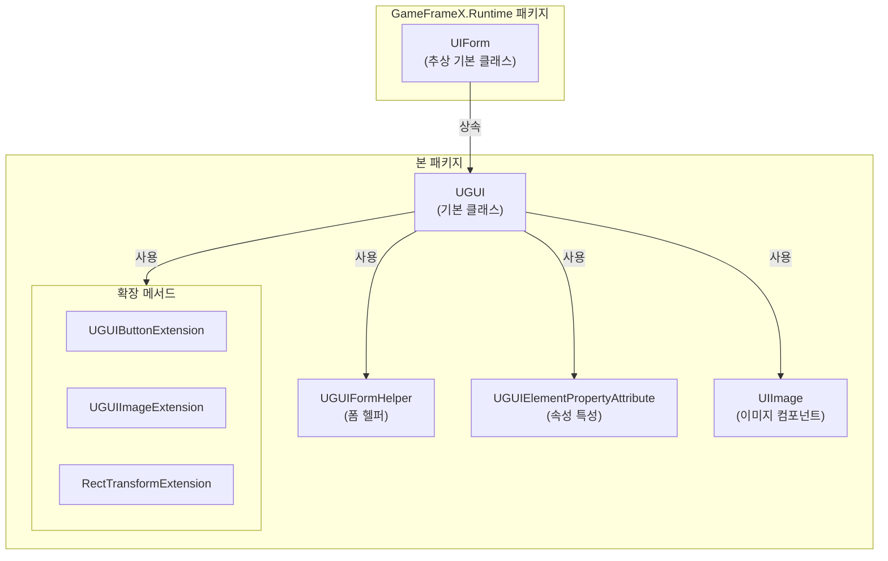
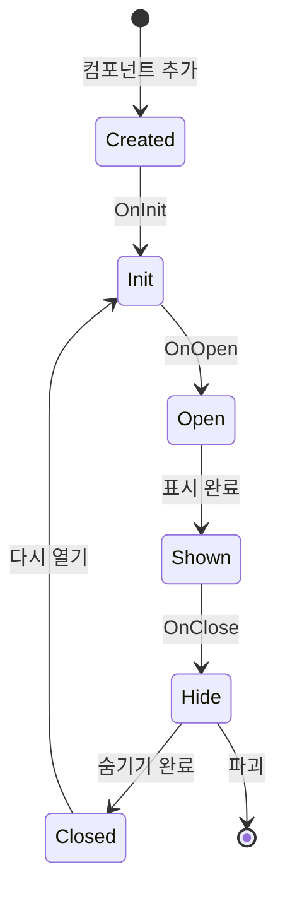

# UGUI 기본 클래스

UGUI 기본 클래스는 GameFrameX UGUI 모듈의 핵심 클래스로, UGUI 특정 인터페이스 기능 구현을 제공한다. 모든 UGUI 인터페이스는 완전한 UI 라이프사이클 관리 및 표시 제어 기능을 얻기 위해 이 클래스를 상속해야 한다.

## 개요

`UGUI` 클래스는 Unity UGUI 인터페이스의 기본 클래스로, `UIForm`에서 상속된다. Unity UGUI의 특정 구현을 래핑하여 인터페이스 표시/숨기기, 가시성 제어, 전체 화면 레이아웃 등의 핵심 기능을 제공한다. 이 기본 클래스를 상속함으로써 개발자는 UGUI 인터페이스를 빠르게 생성, 관리 및 조작할 수 있으며, GameFrameX의 UI 관리 시스템과 긴밀하게 통합할 수 있다.

이 클래스는 `[DisallowMultipleComponent]` 특성을 사용하여 각 GameObject에 UGUI 컴포넌트를 하나만 추가할 수 있어 중복 추가导致的逻辑错误를 방지한다.

## 핵심 기능

### 인터페이스 표시 및 숨기기

UGUI 기본 클래스는 상위 클래스의 표시 및 숨기기 메서드를 재정의하여 애니메이션이 있는 인터페이스 전환 효과를 지원한다:

- **Show 메서드**: 인터페이스 표시, `IUIFormShowHandler`를 통해 표시 애니메이션 처리 지원
- **Hide 메서드**: 인터페이스 숨기기, `IUIFormHideHandler`를 통해 숨기기 애니메이션 처리 지원

### 가시성 관리

인터페이스 가시성을 제어하는 두 가지 방법을 제공한다:

1. **보호된 InternalSetVisible 메서드**: UI의 표시 상태를 설정하지만, 내부 상태 동기화에 적합한 이벤트를 발생시키지 않음
2. **공용 Visible 속성**: 인터페이스의 가시성을 가져오거나 설정하며, GameObject의 활성화/비활성화 상태를 트리거함

### 전체 화면 레이아웃

`MakeFullScreen` 메서드는 UI 요소를 전체 화면 모드로 설정할 수 있으며, 앵커, 위치 및 크기를 자동으로 구성한다:
- 앵커를 (0,0)에서 (1,1)로 설정
- 앵커 위치를 (0,0)으로 설정
- 크기 증분을 Vector2.zero로 설정

## 아키텍처 설계



### 클래스 관계 설명

| 컴포넌트 | 역할 | 설명 |
|------|------|------|
| UIForm | 상위 클래스 추상 기본 | UI 인터페이스의 추상 인터페이스 및 라이프사이클 관리 제공 |
| UGUI | 핵심 클래스 | UGUI 특정 인터페이스 구현, Unity UGUI 세부 사항 처리 |
| UGUIFormHelper | 헬퍼 | UI 폼의 인스턴스화, 생성 및 해제 처리 |
| UGUIElementPropertyAttribute | 특성 | 프리팹에서 UI 컨트롤 경로 표시 |
| UIImage | 컴포넌트 | 비동기 아이콘 로드를 지원하는 확장 이미지 컴포넌트 |
| 확장 메서드 | 유틸리티 세트 | 편리한 컴포넌트 조작 메서드 제공 |

## 인터페이스 라이프사이클



## 사용 예시

### 사용자 정의 UGUI 인터페이스 생성

```csharp
using GameFrameX.UI.UGUI.Runtime;
using UnityEngine;

public class MainMenuUI : UGUI
{
    protected override void OnInit(object userData)
    {
        base.OnInit(userData);
        // UI 초기화 로직
    }
    
    protected override void OnOpen(object userData)
    {
        base.OnOpen(userData);
        // UI 열기時の 로직
    }
    
    protected override void OnClose(bool isShutdown, object userData)
    {
        base.OnClose(isShutdown, userData);
        // UI 닫기時の 로직
    }
}
```
> Source: [UGUI.cs](https://github.com/GameFrameX/com.gameframex.unity.ui.ugui/blob/main/Runtime/UGUI.cs#L46-L179)

### UGUIElementPropertyAttribute를 사용하여 컨트롤 바인딩

```csharp
using GameFrameX.UI.UGUI.Runtime;
using UnityEngine;
using UnityEngine.UI;

public class GameStartUI : UGUI
{
    // 특성을 사용하여 컨트롤 경로 표시
    [SerializeField]
    [UGUIElementProperty("StartButton")]
    private Button m_StartButton;

    [SerializeField]
    [UGUIElementProperty("Title/Text")]
    private Text m_TitleText;

    public Button StartButton => m_StartButton;
    public Text TitleText => m_TitleText;

    protected override void OnInit(object userData)
    {
        base.OnInit(userData);
        // 버튼 이벤트 바인딩
        m_StartButton.onClick.AddListener(OnStartClick);
    }

    private void OnStartClick()
    {
        Debug.Log("게임 시작 버튼 클릭됨");
    }
}
```
> Source: [UGUIElementPropertyAttribute.cs](https://github.com/GameFrameX/com.gameframex.unity.ui.ugui/blob/main/Runtime/UGUIElementPropertyAttribute.cs#L40-L64)

### 전체 화면 UI 설정

```csharp
using GameFrameX.UI.UGUI.Runtime;
using UnityEngine;

public class FullScreenPanel : MonoBehaviour
{
    private void Start()
    {
        // RectTransform을 가져오거나 추가하여 전체 화면으로 설정
        gameObject.GetOrAddComponent<RectTransform>().MakeFullScreen();
    }
}
```
> Source: [RectTransformExtension.cs](https://github.com/GameFrameX/com.gameframex.unity.ui.ugui/blob/main/Runtime/RectTransformExtension.cs#L56-L62)

## 코드 생성기 통합

UGUI 기본 클래스는 코드 생성기와 긴밀하게 통합된다. 코드 생성기는 UGUI 프리팹에서 UGUI를 상속하는 코드 클래스를 자동으로 생성한다:

```csharp
// 코드 생성기가 생성한 코드 구조 예시
namespace Hotfix.UI
{
    /// <summary>
    /// 코드 생성된 UI 코드 MainMenu
    /// </summary>
    [DisallowMultipleComponent]
    [OptionUIConfig(null, "Assets/Prefabs/UI/MainMenu")]
    public sealed partial class MainMenu : UGUI
    {
        public GameObject self { get; private set; }

        [SerializeField]
        [UGUIElementProperty("Panel/StartButton")]
        private Button m_StartButton;

        public Button m_StartButton => m_StartButton;

        private bool _isInitView = false;

        protected override void InitView()
        {
            if (_isInitView)
            {
                return;
            }

            _isInitView = true;
            this.self = this.gameObject;
            m_StartButton = gameObject.transform.FindChildName("Panel/StartButton").GetComponent<Button>();
        }
    }
}
```
> Source: [UGUICodeGenerator.cs](https://github.com/GameFrameX/com.gameframex.unity.ui.ugui/blob/main/Editor/UGUICodeGenerator.cs#L195-L230)

## 관련 링크

- [UI 관리자](./4-core-concepts.ui-manager) - UI 인터페이스의 전체 관리 시스템 파악
- [폼 헬퍼](./4-core-concepts.form-helper) - UI 폼 생성 및 관리 헬퍼 도구 파악
- [UIImage 컴포넌트](./5-components.uiimage) - 확장 이미지 컴포넌트 파악
- [확장 메서드](./5-components.extensions) - 버튼, 이미지, RectTransform의 확장 메서드 파악
- [코드 생성기](./6-editor-tools.code-generator) - UGUI 코드를 자동으로 생성하는 방법 파악
- [공식 문서](https://gameframex.doc.alianblank.com) - 더 많은 상세 정보 얻기
