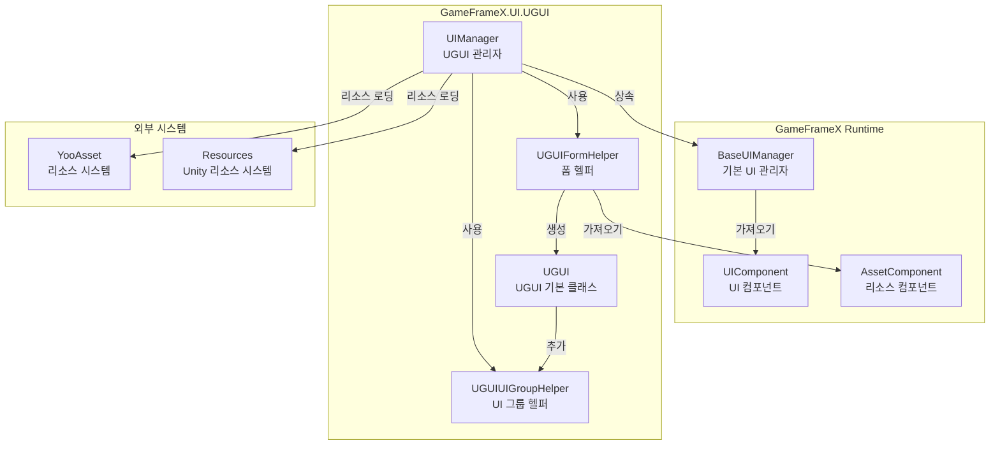
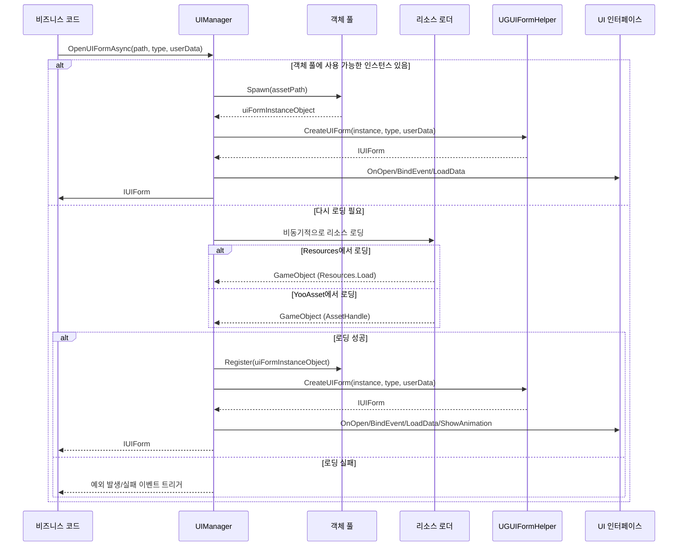
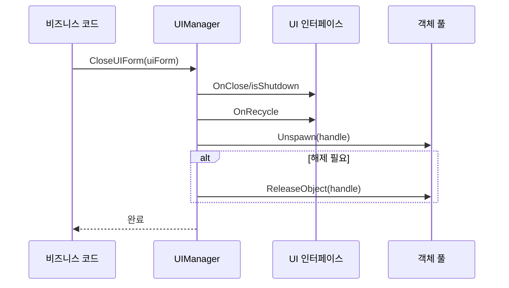

# UI 관리자

UI 관리자(UIManager)는 GameFrameX UGUI 플러그인의 핵심 컴포넌트로, UI 인터페이스의 완전한 라이프사이클 관리 담당한다. 인터페이스의 로딩, 표시, 숨기기, 닫기 및 재활용 등의 작업을 포함한다.

## 개요

UIManager는 전체 UI 시스템의 중앙 컴포넌트로, `BaseUIManager`에서 상속되어 완전한 UI 인터페이스 관리 기능을 제공한다. 이 관리자는 Resources 리소스 디렉토리 또는 YooAsset 리소스 번들에서 비동기적으로 UI 인터페이스를 로드하며, 객체 풀 메커니즘을 구현하여 메모리 사용을 최적화한다.

### 핵심 책임

- **인터페이스 라이프사이클 관리**: UI 인터페이스의 열기, 닫기, 표시, 숨기기 등의 라이프사이클 작업 담당
- **리소스 로딩**: Resources 및 YooAsset 리소스 번들에서 UI 인터페이스를 비동기적으로 로드
- **객체 풀 관리**: 객체 풀을 사용하여 닫힌 UI 인터페이스 인스턴스를 캐시하여 리소스 로딩 오버헤드 감소
- **이벤트 콜백**: 인터페이스 열기/닫기 성공 또는 실패 상태를 알리기 위한 완전한 이벤트 콜백 메커니즘 제공
- **UI 그룹 관리**: 여러 UI 그룹의 계층 및 표시 순서 관리

### 설계 의도

UIManager는 비동기 로딩 모드를 채택하여 메인 스레드를 차단하지 않아 사용자 경험 향상시킨다. 객체 풀 메커니즘은 빈번한 UI 인터페이스 인스턴스화로 인한 메모리 떨림 및 성능 오버헤드를 효과적으로 감소시킨다. 이벤트驱动的设计模式는 UI 로직과 비즈니스 로직의 결합을 분리하여 유지 관리 및 확장을 용이하게 한다.

## 아키텍처



### 컴포넌트 설명

| 컴포넌트 | 네임스페이스 | 설명 |
|------|----------|------|
| UIManager | GameFrameX.UI.UGUI.Runtime | UGUI 인터페이스 관리자, 인터페이스 라이프사이클 관리 담당 |
| UGUIFormHelper | GameFrameX.UI.UGUI.Runtime | 폼 헬퍼, UI 인터페이스 인스턴스화 및 생성 처리 |
| UGUIUIGroupHelper | GameFrameX.UI.UGUI.Runtime | UI 그룹 헬퍼, UI 그룹의 깊이 및 계층 관리 |
| UGUI | GameFrameX.UI.UGUI.Runtime | UGUI 인터페이스 기본 클래스, UIForm에서 상속 |

## 인터페이스 열기 프로세스

UIManager의 핵심 기능 중 하나는 비동기적으로 UI 인터페이스를 여는 것이다. 다음은 인터페이스를 여는 완전한 프로세스다:



### 상세 프로세스 설명

1. **객체 풀 확인**: 먼저 객체 풀에 재사용 가능한 UI 인스턴스가 있는지 확인
2. **리소스 로딩**: 객체 풀에 사용 가능한 인스턴스가 없으면 리소스를 비동기적으로 로드
3. **리소스 출처 판단**: 경로에 따라 Resources 또는 YooAsset 번들에서 로드
4. **UI 폼 생성**: UGUIFormHelper를 사용하여 UI 인터페이스 인스턴스 생성
5. **UI 초기화**: 인터페이스의 OnOpen, BindEvent, LoadData 등의 메서드 호출
6. **애니메이션 재생**: 표시 애니메이션이 활성화되면 애니메이션 재생
7. **이벤트 콜백**: 열기 성공 이벤트 트리거

> Source: [UIManager.Open.cs](https://github.com/GameFrameX/com.gameframex.unity.ui.ugui/blob/main/Runtime/UIManager.Open.cs#L78-L115)

## 인터페이스 닫기 및 재활용

UI 인터페이스를 닫을 때, UIManager는 구성에 따라 인스턴스를 재활용할지 즉시 파괴할지 결정한다:



> Source: [UIManager.Close.cs](https://github.com/GameFrameX/com.gameframex.unity.ui.ugui/blob/main/Runtime/UIManager.Close.cs#L50-L67)

## 핵심 메서드

### InnerOpenUIFormAsync

UI 인터페이스를 비동기적으로 여는 핵심 메서드.

```csharp
protected override async Task<IUIForm> InnerOpenUIFormAsync(
    string uiFormAssetPath,  // UI 리소스 경로
    Type uiFormType,         // UI 인터페이스 타입
    bool pauseCoveredUIForm,// 덮어진 인터페이스 일시 정지 여부
    object userData,         // 사용자 정의 데이터
    bool isFullScreen = false // 전체 화면 표시 여부
)
```

> Source: [UIManager.Open.cs](https://github.com/GameFrameX/com.gameframex.unity.ui.ugui/blob/main/Runtime/UIManager.Open.cs#L78-L115)

**구현 로직**:

1. 객체 풀에 사용 가능한 인스턴스가 있으면 직접 사용
2. 그렇지 않으면 `InnerLoadUIFormAsync`를 호출하여 비동기적으로 리소스 로드
3. 리소스 경로에 따라 Resources 또는 YooAsset 번들에서 로드
4. 로딩成功后 UI 폼 생성 및 초기화
5. 열기成功 이벤트 콜백 트리거

### InnerLoadUIFormAsync

UI 인터페이스 리소스를 비동기적으로 로드.

```csharp
private async Task<IUIForm> InnerLoadUIFormAsync(
    string uiFormAssetPath,
    Type uiFormType,
    bool pauseCoveredUIForm,
    object userData,
    bool isFullScreen,
    string uiFormAssetName,
    string assetPath
)
```

> Source: [UIManager.Open.cs](https://github.com/GameFrameX/com.gameframex.unity.ui.ugui/blob/main/Runtime/UIManager.Open.cs#L131-L163)

**리소스 로딩 로직**:

```csharp
// "Bundles" 디렉토리가 리소스 경로에 포함되어 있는지 판단
if (uiFormAssetPath.IndexOf(Utility.Asset.Path.BundlesDirectoryName, StringComparison.OrdinalIgnoreCase) < 0)
{
    // Resources에서 로드
    var original = (GameObject)Resources.Load(assetPath);
    var gameObject = UnityEngine.Object.Instantiate(original);
}
else
{
    // YooAsset 번들에서 로드
    var assetHandle = await m_AssetManager.LoadAssetAsync<UnityEngine.Object>(assetPath);
    var gameObject = assetHandle.InstantiateSync();
}
```

> Source: [UIManager.Open.cs](https://github.com/GameFrameX/com.gameframex.unity.ui.ugui/blob/main/Runtime/UIManager.Open.cs#L137-L162)

### RecycleUIForm

UI 인터페이스 인스턴스 객체를 재활용.

```csharp
protected override void RecycleUIForm(IUIForm uiForm, bool isDispose = false)
{
    uiForm.OnRecycle();
    var formHandle = uiForm.Handle as GameObject;
    
    m_InstancePool.Unspawn(uiForm.Handle);
    
    if (isDispose)
    {
        m_InstancePool.ReleaseObject(uiForm.Handle);
    }
}
```

> Source: [UIManager.Close.cs](https://github.com/GameFrameX/com.gameframex.unity.ui.ugui/blob/main/Runtime/UIManager.Close.cs#L52-L67)

## 폼 헬퍼

UGUIFormHelper는 UI 인터페이스의 인스턴스화, 생성 및 해제를 담당한다.

### UI 인터페이스 생성

```csharp
public override IUIForm CreateUIForm(object uiFormInstance, Type uiFormType, object userData)
{
    var uiGameObject = uiFormInstance as GameObject;
    
    // UI 인터페이스 스크립트 컴포넌트 추가
    var componentType = uiGameObject.GetOrAddComponent(uiFormType);
    
    // OnAwake 초기화 호출
    if (uiForm.IsAwake == false)
    {
        uiForm.OnAwake();
    }
    
    // 특성을 가져와서 UI 그룹 가져오기
    var attribute = uiFormType.GetCustomAttribute(typeof(OptionUIGroupAttribute));
    if (attribute is OptionUIGroupAttribute optionUIGroup)
    {
        uiGroup = m_UIComponent.GetUIGroup(optionUIGroup.GroupName);
    }
    
    // 부모 객체 설정
    uiTransform.SetParent(helper.transform);
    uiTransform.localScale = Vector3.one;
    
    return uiForm;
}
```

> Source: [UGUIFormHelper.cs](https://github.com/GameFrameX/com.gameframex.unity.ui.ugui/blob/main/Runtime/UGUIFormHelper.cs#L92-L164)

### UI 인터페이스 해제

```csharp
public override void ReleaseUIForm(
    object uiFormAsset,
    object uiFormInstance,
    object assetHandle,
    string uiFormAssetPath,
    string uiFormAssetName)
{
    if (!m_UIComponent.EnableAutoReleaseUIForm)
    {
        return;
    }
    
    // 경로에 따라 리소스 타입 판단 및 해제
    if (uiFormAssetPath.IndexOf(Utility.Asset.Path.BundlesDirectoryName, StringComparison.OrdinalIgnoreCase) >= 0)
    {
        m_AssetComponent.UnloadAsset(uiFormAssetPath);
    }
    else
    {
        UnityEngine.Resources.UnloadAsset((Object)uiFormInstance);
    }
    
    Destroy((Object)uiFormInstance);
}
```

> Source: [UGUIFormHelper.cs](https://github.com/GameFrameX/com.gameframex.unity.ui.ugui/blob/main/Runtime/UGUIFormHelper.cs#L177-L195)

## UI 그룹 헬퍼

UGUIUIGroupHelper는 UI 그룹의 계층 및 깊이 관리 담당.

```csharp
public override void SetDepth(int depth)
{
    Depth = depth;
    // Z축 위치를 조정하여 깊이 제어 구현
    transform.localPosition = new Vector3(0, 0, depth * 1000);
}

public override IUIGroupHelper Handler(
    Transform root,
    string groupName,
    string uiGroupHelperTypeName,
    IUIGroupHelper customUIGroupHelper,
    int depth = 0)
{
    SetDepth(depth);
    
    // UI 그룹 컨테이너 생성
    GameObject component = new GameObject();
    component.name = groupName;
    component.transform.SetParent(root, false);
    
    // UI 레이어 설정
    var uiLayer = LayerMask.NameToLayer("UI");
    component.SetLayerRecursively(uiLayer);
    
    // 전체 화면 RectTransform 생성
    RectTransform rectTransform = component.GetOrAddComponent<RectTransform>();
    rectTransform.MakeFullScreen();
    
    return uiGroupHelper;
}
```

> Source: [UGUIUIGroupHelper.cs](https://github.com/GameFrameX/com.gameframex.unity.ui.ugui/blob/main/Runtime/UGUIUIGroupHelper.cs#L64-L105)

## 사용 예시

### UI 인터페이스 열기

```csharp
// UI 컴포넌트 가져오기
var uiComponent = GameEntry.GetComponent<UIComponent>();

// UI 인터페이스를 비동기적으로 열기
var uiForm = await uiComponent.OpenUIFormAsync("UI/MainMenu", typeof(MainMenuUI), false, null);
```

### UI 인터페이스 닫기

```csharp
// 지정된 UI 인터페이스 닫기
uiComponent.CloseUIForm(uiForm);
```

### UI 그룹 특성 사용

```csharp
// UI 인터페이스에 UI 그룹 지정
[OptionUIGroup("DialogGroup")]
public class DialogUI : UGUI
{
    // UI 인터페이스 로직
}
```

> Source: [UGUIFormHelper.cs](https://github.com/GameFrameX/com.gameframex.unity.ui.ugui/blob/main/Runtime/UGUIFormHelper.cs#L117-L124)

### 표시 애니메이션 특성 사용

```csharp
// UI 인터페이스에 표시 애니메이션 지정
[OptionUIShowAnimation(true, "FadeIn")]
[OptionUIHideAnimation(true, "FadeOut")]
public class MainMenuUI : UGUI
{
    // UI 인터페이스 로직
}
```

> Source: [UGUIFormHelper.cs](https://github.com/GameFrameX/com.gameframex.unity.ui.ugui/blob/main/Runtime/UGUIFormHelper.cs#L126-L146)

## 관련 링크

- [UGUI 기본 클래스](./4-core-concepts.ugui-base) - UGUI 인터페이스 기본 클래스의 상세 문서
- [폼 헬퍼](./4-core-concepts.form-helper) - 폼 헬퍼의 상세 문서
- [UIImage 컴포넌트](./5-components.uiimage) - 강화된 이미지 컴포넌트
- [확장 메서드](./5-components.extensions) - UGUI 컴포넌트 확장 메서드
- [공식 문서](https://gameframex.doc.alianblank.com)
- [GitHub 저장소](https://github.com/GameFrameX/com.gameframex.unity.ui.ugui)
