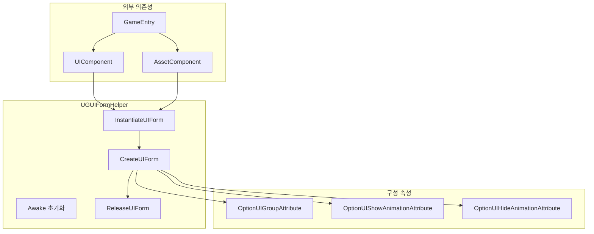
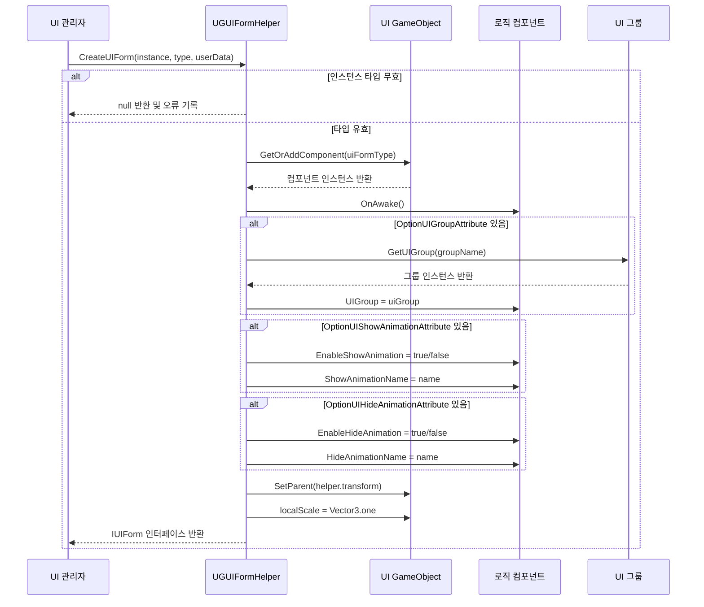

# 폼 헬퍼

폼 헬퍼(Form Helper)는 GameFrameX UGUI 시스템에서 UI 폼 인스턴스화, 생성 및 해제를 담당하는 핵심 컴포넌트다. UI 관리자와 실제 UI 리소스 사이의 브릿지로, 인터페이스 생성의 모든 저수준 로직을 래핑한다.

## 개요

`UGUIFormHelper`는 UGUI 인터페이스의 기본 폼 헬퍼로, `UIFormHelperBase` 추상 클래스에서 상속된다. 세 가지 핵심 책임을 담당한다:

1. **인스턴스화 인터페이스**: UI 리소스를 사용 가능한 GameObject 인스턴스로 로드
2. **생성 인터페이스**: 인스턴스에 로직 컴포넌트 추가, 그룹 설정, 애니메이션 구성 등
3. **해제 인터페이스**: 리소스 언로드 및 인스턴스 파괴

폼 헬퍼를 사용하면, UI 관리 시스템은 인터페이스 리소스의 로딩 방식과 비즈니스 로직을 분리할 수 있어, 시스템이 다양한 리소스 로딩 방식(AssetBundle, Resources 등)을 지원할 수 있다.

> 참고: `UIFormHelperBase` 추상 클래스는 `GameFrameX.UI.Runtime` 패키지에 정의되어 있으며, 프레임워크의 기본 UI 컴포넌트다. 이 문서는 주로 `UGUIFormHelper`의 구체적 구현을 소개한다.

## 아키텍처



**아키텍처 설명:**
- `UGUIFormHelper`는 `UIComponent` 및 `AssetComponent`에 의존하며, `GameEntry`를 통해 컴포넌트 인스턴스를 가져옴
- 세 가지 구성 특성은 코드 수준에서 인터페이스의 그룹 및 애니메이션 동작을 지정하는 데 사용
- 핵심 프로세스는 인스턴스화 → 생성 → 해제 순서로 실행

## 핵심 기능

### 인스턴스화 인터페이스

```csharp
public override object InstantiateUIForm(object uiFormAsset)
{
    return (Object)uiFormAsset;
}
```

> Source: [UGUIFormHelper.cs](https://github.com/GameFrameX/com.gameframex.unity.ui.ugui/blob/main/Runtime/UGUIFormHelper.cs#L77-L80)

인스턴스화 프로세스는 비교적 간단하며, 로드된 리소스 객체를 직접 반환한다. UGUI 시스템에서 로드된 리소스 자체가 사용 가능한 Unity Object다.

### 생성 인터페이스

인터페이스 생성은 폼 헬퍼의 핵심 기능으로, 다음 작업을 완료한다:

1. **타입 검증**: 전달된 인스턴스가 유효한 GameObject인지 확인
2. **컴포넌트 추가**: GameObject에 인터페이스 로직 컴포넌트 추가
3. **초기화 호출**: 인터페이스의 `OnAwake` 메서드 호출
4. **그룹 설정**: `OptionUIGroupAttribute`에 따라 UI 그룹 가져오기 및 설정
5. **애니메이션 구성**: `OptionUIShowAnimationAttribute` 및 `OptionUIHideAnimationAttribute`에 따라 표시/숨기기 애니메이션 구성
6. **계층 설정**: 올바른 부모-자식 관계 및 스케일 설정

```csharp
public override IUIForm CreateUIForm(object uiFormInstance, Type uiFormType, object userData)
{
    var uiGameObject = uiFormInstance as GameObject;
    if (uiGameObject == null)
    {
        Log.Error($"UI form instance type {uiFormType} is invalid.");
        return null;
    }

    var componentType = uiGameObject.GetOrAddComponent(uiFormType);
    if (!(componentType is IUIForm uiForm))
    {
        Log.Error($"UI form instance type {uiFormType} is invalid.");
        return null;
    }

    if (uiForm.IsAwake == false)
    {
        uiForm.OnAwake();
    }
    // ... 그룹 및 애니메이션 구성
}
```

> Source: [UGUIFormHelper.cs](https://github.com/GameFrameX/com.gameframex.unity.ui.ugui/blob/main/Runtime/UGUIFormHelper.cs#L93-L164)

### 해제 인터페이스

인터페이스를 해제할 때, 헬퍼는 구성에 따라 리소스를 자동으로 해제할지 결정한다:

```csharp
public override void ReleaseUIForm(object uiFormAsset, object uiFormInstance, object assetHandle, string uiFormAssetPath, string uiFormAssetName)
{
    if (!m_UIComponent.EnableAutoReleaseUIForm)
    {
        return;
    }

    if (uiFormAssetPath.IndexOf(Utility.Asset.Path.BundlesDirectoryName, StringComparison.OrdinalIgnoreCase) >= 0)
    {
        m_AssetComponent.UnloadAsset(uiFormAssetPath);
    }
    else
    {
        UnityEngine.Resources.UnloadAsset((Object)uiFormInstance);
    }

    Destroy((Object)uiFormInstance);
}
```

> Source: [UGUIFormHelper.cs](https://github.com/GameFrameX/com.gameframex.unity.ui.ugui/blob/main/Runtime/UGUIFormHelper.cs#L178-L195)

**해제 전략:**
- `EnableAutoReleaseUIForm`가 false이면 해제 실행 안 함
- 리소스 경로에 bundles 디렉토리가 포함되면 AssetComponent 언로드 사용
- 그렇지 않으면 Resources.UnloadAsset 언로드 사용
- 마지막으로 GameObject 인스턴스 파괴

## 인터페이스 생성 프로세스



## 구성 속성 사용

### OptionUIGroupAttribute

인터페이스가 속한 UI 그룹 지정:

```csharp
[OptionUIGroup("MainPanel")]
public class MainMenuUI : UGUI
{
    // ...
}
```

### OptionUIShowAnimationAttribute

인터페이스 표시 애니메이션 구성:

```csharp
[OptionUIShowAnimation(true, "FadeIn")]
public class MainMenuUI : UGUI
{
    // ...
}
```

### OptionUIHideAnimationAttribute

인터페이스 숨기기 애니메이션 구성:

```csharp
[OptionUIHideAnimation(true, "FadeOut")]
public class MainMenuUI : UGUI
{
    // ...
}
```

## 구성 옵션

| 구성 항목 | 타입 | 기본값 | 설명 |
|--------|------|--------|------|
| EnableAutoReleaseUIForm | bool | true | 인터페이스 닫을 때 리소스를 자동으로 해제할지 여부 |

> 참고: UIComponent의 구성 항목은 `GameFrameX.UI.Runtime` 패키지에 정의되어 있으며, 자세한 내용은 [UI 관리자](./4-core-concepts.ui-manager) 문서를 참조.

## API 참조

### `InstantiateUIForm(uiFormAsset: object): object`

UI 인터페이스 리소스를 인스턴스화.

**파라미터:**
- `uiFormAsset` (object): 인스턴스화할 인터페이스 리소스

**반환:** 인스턴스화된 Unity Object

---

### `CreateUIForm(uiFormInstance: object, uiFormType: Type, userData: object): IUIForm`

UI 인터페이스를 생성하여 컴포넌트 추가 및 초기화를 완료.

**파라미터:**
- `uiFormInstance` (object): 인터페이스 인스턴스(GameObject)
- `uiFormType` (Type): 인터페이스 로직 클래스 타입
- `userData` (object): 사용자 정의 데이터

**반환:** IUIForm 인터페이스 인스턴스

**null을 반환할 수 있는 상황:**
- uiFormInstance가 유효한 GameObject가 아닌 경우
- 추가된 컴포넌트가 IUIForm 인터페이스를 구현하지 않는 경우
- UI 그룹이 무효인 경우

---

### `ReleaseUIForm(uiFormAsset: object, uiFormInstance: object, assetHandle: object, uiFormAssetPath: string, uiFormAssetName: string): void`

UI 인터페이스 리소스를 해제.

**파라미터:**
- `uiFormAsset` (object): 인터페이스 리소스
- `uiFormInstance` (object): 인터페이스 인스턴스
- `assetHandle` (object): 리소스 핸들
- `uiFormAssetPath` (string): 인터페이스 리소스 경로
- `uiFormAssetName` (string): 인터페이스 리소스 이름

---

## 관련 링크

- [UGUI 기본 클래스](./4-core-concepts.ugui-base) - UGUI 인터페이스의 기본 클래스 구현
- [UI 관리자](./4-core-concepts.ui-manager) - UI 관리자의 완전한 기능
- [코드 생성기](./6-editor-tools.code-generator) - UI 코드를 자동으로 생성
- [공식 문서](https://gameframex.doc.alianblank.com)
