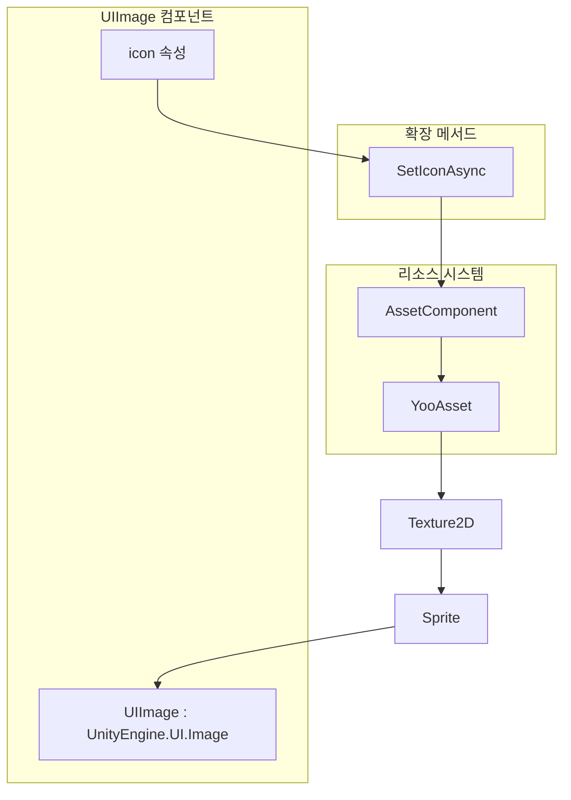
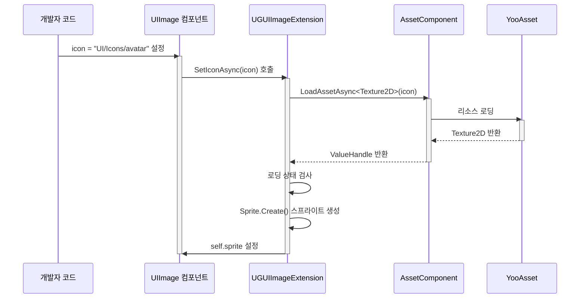

# UIImage 컴포넌트

UIImage 컴포넌트는 GameFrameX UGUI 시스템의 강화형 이미지 컴포넌트로, Unity 네이티브 `UnityEngine.UI.Image`에서 상속되며 비동기 아이콘 로딩 기능을 추가했다. 리소스 경로만으로 이미지를 자동으로 로드하여 표시하므로, UI 이미지 관리를 크게 간소화한다.

## 개요

UIImage 컴포넌트는 Unity UGUI의 이미지 관리 일반 문제를 해결하기 위해 설계되었다. 전통적인 방식에서 개발자는 Sprite의 로딩, 메모리 관리 및 비동기 로딩 코루틴 코드를 수동으로 처리해야 했다. UIImage 컴포넌트는 리소스 시스템을 통합하여 간결한 API를 제공하며, 리소스 경로만 설정하면 이미지의 비동기 로딩 및 표시를 자동으로 완료한다.

이 컴포넌트는 Unity의 `Image` 클래스에서 상속되므로 기존 UGUI 시스템과 완전 호환된다. Image의 모든 속성(Type, FillAmount, Color 등)과 기능을 포함한다. 개발자는 일반 Image 컴포넌트처럼 UIImage를 사용할 수 있으며, 동시에 비동기 로딩의 추가 기능을 얻는다.

### 핵심 기능

UIImage 컴포넌트의 핵심 기능은 비동기 아이콘 로딩을 중심으로 한다. `icon` 속성을 설정하면 컴포넌트가 자동으로 리소스 시스템에서 대응하는 Texture2D를 로드하여 Sprite로 변환하여 Image에 표시한다. 전체 프로세스는 비동기로 진행되어 메인 스레드를 차단하지 않으며, 이는 대량의 이미지를 로드해야 하는 UI 인터페이스에 특히 중요하다.

컴포넌트 내부에서는 GameFrameX의 리소스管理系统(AssetComponent)을 사용하여 리소스를 로드하여 리소스 로딩의 통일성과 추적 가능성을 보장한다. 로딩 실패 시 오류 로그를 기록하지만 예외를 던지지 않으며, 이러한 부드러운 오류 처리 방식은 UI 시나리오에 적합하여 인터페이스의 안정성을 보장한다.

## 아키텍처 설계



### 컴포넌트 계층 구조

UIImage 컴포넌트의 UGUI 시스템에서의 포지셔닝은 상단 도표와 같다. UI 표시 계층에 위치하며 Unity의 Image 컴포넌트에서 직접 상속된다. 컴포넌트 내부에서 icon 속성을 설정하면 확장 메서드 SetIconAsync를 호출하여 리소스 시스템과 상호작용한다. 리소스 시스템은 YooAsset을 사용하여 실제 리소스 로딩을 수행하며, 이러한 계층 설계는 각 부분의 책임이 명확하여 유지 관리 및 확장이 용이하다.

확장 메서드 UGUIImageExtension은 UIImage와 리소스 시스템 사이의 브릿지 역할을 하며, 리소스 경로를 Texture2D로 변환한 후 다시 Sprite로 변환하여 Image에 설정한다. 이 변환 프로세스는 비동기이며 async/await 패턴을 사용하여 UI의 흐름성을 보장한다.

## 핵심 프로세스

### 아이콘 로딩 프로세스

개발자가 UIImage의 icon 속성을 설정하면 다음 비동기 로딩 프로세스가 트리거된다:



시퀀스 도표에서 볼 수 있듯이 전체 로딩 프로세스는 비동기이며 호출 스레드를 차단하지 않는다. 개발자가 속성을 설정한 후 즉시 반환하여 다른 작업을 계속할 수 있으며, 이미지 로딩이 완료되면 자동으로 표시된다. 로딩 실패 시 로그 시스템을 통해 오류를 기록하지만 프로그램 실행을 중단하지 않는다.

### 에디터 교체 프로세스

UIImageReplaceHandler는 표준 Image를 UIImage로 변환하는 에디터 기능을 제공한다:

```mermaid
flowchart TD
    A[개발자가 Image를 우클릭] --> B[메뉴 항목 선택<br/>"Replace To UIImage"]
    B --> C[원본 Image 모든 속성 가져오기]
    C --> D[원본 Image 컴포넌트 파괴]
    D --> E[UIImage 컴포넌트 추가]
    E --> F[모든 속성 복원]
    F --> G[변환 완료]
```

이 변환 프로세스는 원본 Image의 모든 설정(유형, 머티리얼, Sprite, 색상, 레이캐스트 설정 등)을 유지하여 변환이 무손실임을 보장한다.

## 사용 예시

### 기본 사용

Unity 장면에서 UIImage 컴포넌트를 생성하고 아이콘 리소스 경로를 설정:

```csharp
using GameFrameX.UI.UGUI.Runtime;
using UnityEngine;

public class IconDisplayExample : MonoBehaviour
{
    [SerializeField]
    private UIImage iconImage;

    void Start()
    {
        // 아이콘 설정, 리소스 경로만 전달
        iconImage.icon = "UI/Icons/PlayerAvatar";
    }
}
```
> Source: [UIImage.cs](https://github.com/GameFrameX/com.gameframex.unity.ui.ugui/blob/main/Runtime/UIImage.cs#L58-L71)

### 확장 메서드 직접 사용

UIImage 컴포넌트를 통하는 것 외에도 일반 Image에 직접 확장 메서드를 호출할 수 있다:

```csharp
using GameFrameX.UI.UGUI.Runtime;
using UnityEngine.UI;

public class ImageExtensionExample : MonoBehaviour
{
    [SerializeField]
    private Image normalImage;

    async void Start()
    {
        // 확장 메서드를 사용하여 비동기적으로 아이콘 로드
        await normalImage.SetIconAsync("UI/Icons/StartButton");
    }
}
```
> Source: [UGUIImageExtension.cs](https://github.com/GameFrameX/com.gameframex.unity.ui.ugui/blob/main/Runtime/UGUIImageExtension.cs#L56-L74)

### 에디터에서 교체

Unity 에디터에서 기존 Image 컴포넌트를 UIImage로 교체할 수 있다:

1. Hierarchy에서 Image 컴포넌트가 있는 게임 객체 선택
2. 해당 객체를 우클릭
3. "CONTEXT/Image/Replace To UIImage(UIImage로 교체)" 선택

이 작업은 Image 컴포넌트의 모든 속성(유형, 머티리얼, Sprite, 색상 등)을 UIImage로 완전 마이그레이션한다.
> Source: [UIImageReplaceHandler.cs](https://github.com/GameFrameX/com.gameframex.unity.ui.ugui/blob/main/Editor/UIImageReplaceHandler.cs#L42-L76)

## API 참조

### UIImage 클래스

`UnityEngine.UI.Image`에서 상속되며 icon 속성을 추가하여 비동기 아이콘 로딩을 제공한다.

```csharp
[DisallowMultipleComponent]
public class UIImage : UnityEngine.UI.Image
```

#### 속성

**icon** (string)

아이콘 리소스 경로를 가져오거나 설정한다. 이 속성을 설정하면 리소스 시스템에서 대응하는 이미지를 자동으로 로드하여 표시한다.

```csharp
public string icon
{
    get { return m_icon; }
    set
    {
        if (m_icon != value)
        {
            m_icon = value;
            _ = this.SetIconAsync(m_icon);
        }
    }
}
```

**파라미터 설명:**

| 파라미터 | 타입 | 설명 |
|------|------|------|
| value | string | 리소스 루트 디렉토리에 대한 상대 아이콘 리소스 경로 |

**설계 의도:** 메서드 대신 속성을 사용하는 장점은 Unity 에디터에서 직접 리소스 경로를 드래그하거나 입력할 수 있으며 데이터 바인딩 시나리오도 지원한다. 값이 변경될 때만 로딩을 트리거하여 동일한 리소스의 반복 로딩을 방지한다.

### UGUIImageExtension 확장 메서드 클래스

UnityEngine.UI.Image에 대한 확장 메서드를 제공한다.

```csharp
public static class UGUIImageExtension
```

#### SetIconAsync

리소스 시스템을 통해 텍스처를 로드하고 Sprite를 생성하여 비동기적으로 아이콘을 설정한다.

```csharp
public static async Task SetIconAsync(this UnityEngine.UI.Image self, string icon)
```

**파라미터:**

- `self` (UnityEngine.UI.Image): 대상 이미지 컴포넌트
- `icon` (string): 아이콘 리소스 주소

**반환값:** Task 비동기 태스크

**구현 로직:**

1. AssetComponent 인스턴스 가져오기
2. Texture2D 리소스를 비동기적으로 로드
3. 로딩 상태가 성공인지 확인
4. Sprite.Create를 사용하여 스프라이트를 생성하여 Image에 설정

**오류 처리:** 로딩 실패 시 예외를 캡처하여 오류 로그를 출력하며 예외를 던지지 않는다.

```csharp
public static async Task SetIconAsync(this UnityEngine.UI.Image self, string icon)
{
    try
    {
        var assetComponent = GameEntry.GetComponent<AssetComponent>();
        using (var valueHandle = await assetComponent.LoadAssetAsync<Texture2D>(icon))
        {
            if (valueHandle.IsDone && valueHandle.Status == EOperationStatus.Succeed)
            {
                var texture2D = valueHandle.GetAssetObject<Texture2D>();
                self.sprite = Sprite.Create(
                    texture2D, 
                    new Rect(0, 0, texture2D.width, texture2D.height), 
                    new Vector2(0.5f, 0.5f)
                );
            }
        }
    }
    catch (System.Exception e)
    {
        Log.Error($"Failed to load icon '{icon}': {e.Message}");
    }
}
```
> Source: [UGUIImageExtension.cs](https://github.com/GameFrameX/com.gameframex.unity.ui.ugui/blob/main/Runtime/UGUIImageExtension.cs#L56-L74)

### UIImageReplaceHandler 에디터 클래스

에디터에서 Image에서 UIImage로 변환 기능을 제공한다.

```csharp
[CustomEditor(typeof(UnityEngine.UI.Image))]
public class UIImageReplaceHandler : UnityEditor.Editor
```

#### 메뉴 항목

**CONTEXT/Image/Replace To UIImage(UIImage로 교체)**

선택한 Image 컴포넌트를 UIImage로 교체하여 모든 원본 속성 설정을 유지한다.

> Source: [UIImageReplaceHandler.cs](https://github.com/GameFrameX/com.gameframex.unity.ui.ugui/blob/main/Editor/UIImageReplaceHandler.cs#L42-L76)

## 관련 링크

- [확장 메서드](./5-components.extensions) - 더 많은 UGUI 확장 메서드 보기
- [UGUI 기본 클래스](./4-core-concepts.ugui-base) - UGUI 인터페이스 기본 클래스 파악
- [UI 관리자](./4-core-concepts.ui-manager) - UI 관리 시스템 파악
- [코드 생성기](./6-editor-tools.code-generator) - 자동 코드 생성 도구 파악
- [컴포넌트 검사기](./6-editor-tools.inspector) - 에디터 검사기 도구 파악
