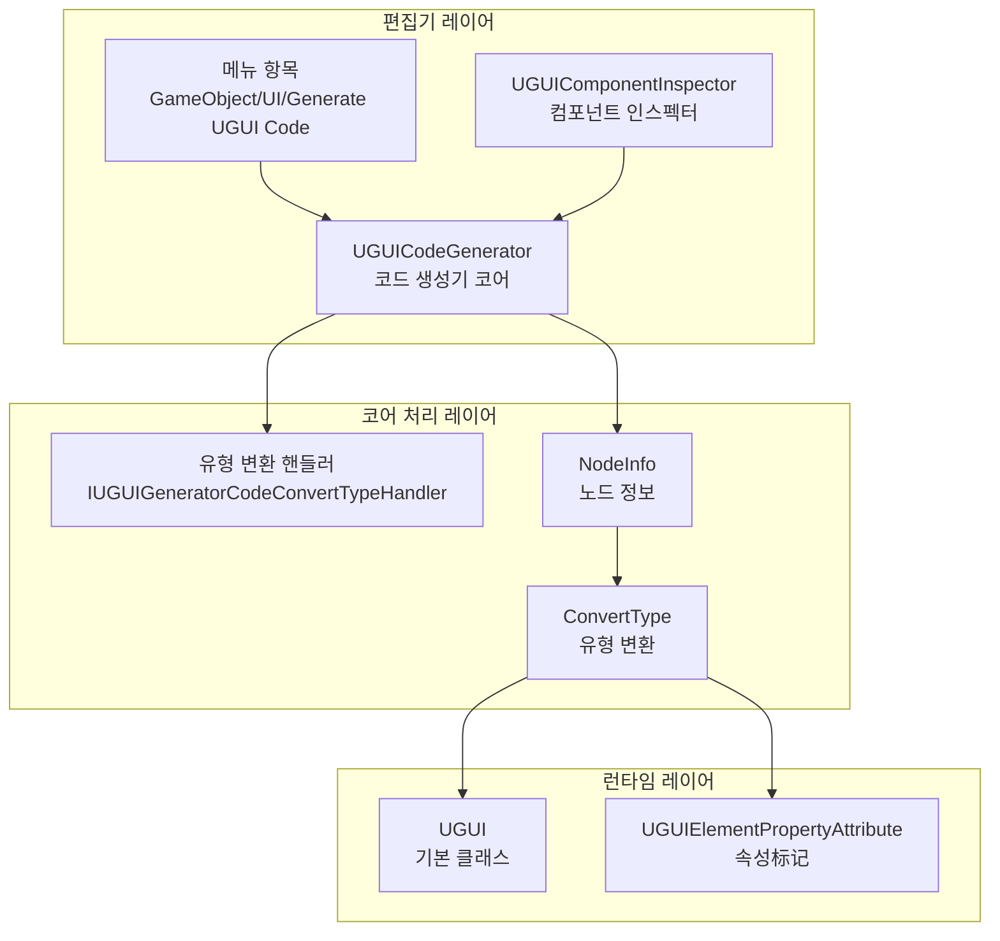
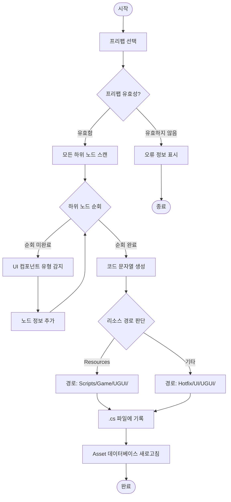

# 코드 생성기

코드 생성기는 GameFrameX UGUI 플러그인의 핵심 편집기 도구로, Unity UGUI 프리팹에서 자동으로 대응하는 C# 코드를 생성하여 UI 개발 효율성을 크게 향상시킵니다.

## 개요

코드 생성기(UGUICodeGenerator)는 Unity 편집기 도구로, UGUI 프리팹을 사용 가능한 C# 코드로 자동으로 변환합니다. 이 도구는 다음 기능을 제공합니다:

- **UI 레벨 자동 순회**: 프리팹의 모든 하위 객체를 재귀적으로 스캔
- **지능형 유형 인식**: Button, Text, Image, Toggle 등의 UI 컴포넌트 유형을 자동으로 인식
- **확장 가능한 변환 메커니즘**: 인터페이스를 통해 사용자 정의 UI 컴포넌트 유형 인식을 지원
- **원클릭 코드 생성**: 메뉴 또는 인스펙터에서 코드 생성 트리거

### 사용 시나리오

새로운 UI 인터페이스를 생성해야 할 때, 많은 양의 반복적인 UI 참조 코드를 수동으로 작성할 필요 없이:
1. Unity 편집기에서 UGUI 프리팹을 생성하거나 선택
2. 우클릭하여 코드 생성 메뉴 선택
3. 시스템이 자동으로 모든 UI 참조가 포함된 코드 파일을 생성

## 아키텍처

코드 생성기는 모듈화된 설계를 채택하며, 주요하게 다음 컴포넌트로 구성됩니다:



### 컴포넌트 설명

| 컴포넌트 | 파일 경로 | 책임 |
|------|----------|------|
| UGUICodeGenerator | `Editor/UGUICodeGenerator.cs` | 주요 코드 생성기, 프리팹 순회 및 코드 생성 처리 |
| IUGUIGeneratorCodeConvertTypeHandler | `Editor/IUGUIGeneratorCodeConvertTypeHandler.cs` | 유형 변환 핸들러 인터페이스, 확장 지원 |
| UGUIComponentInspector | `Editor/UGUIComponentInspector.cs` | Unity 인스펙터, 코드 재생성 및 바인딩 기능 제공 |
| UGUIElementPropertyAttribute | `Runtime/UGUIElementPropertyAttribute.cs` | 속성标记, UI 요소 경로标识 |

## 핵심 기능

### 메뉴 트리거 방식

코드 생성기는 Unity 메뉴 항목을 통해 두 가지 트리거 방식을 제공합니다:

```csharp
/// <summary>
/// UI 코드를 생성하는 메뉴 항목
/// </summary>
[MenuItem("GameObject/UI/Generate UGUI Code(生成UGUI代码)", false, 1)]
static void Code()
```

> Source: [UGUICodeGenerator.cs](https://github.com/GameFrameX/com.gameframex.unity.ui.ugui/blob/main/Editor/UGUICodeGenerator.cs#L56-L73)

### 코드 생성 흐름



### UI 컴포넌트 유형 인식

코드 생성기는 우선순위에 따라 다음 UI 컴포넌트 유형을 순차적으로 감지합니다:

```csharp
// 각 UI 컴포넌트 순차 확인
UIBehaviour component = transform.GetComponent<Button>();
if (component != null) { return typeof(Button).FullName; }

component = transform.GetComponent<Text>();
if (component != null) { return typeof(Text).FullName; }

component = transform.GetComponent<Toggle>();
if (component != null) { return typeof(Toggle).FullName; }

// ... 더 많은 컴포넌트 유형
```

> Source: [UGUICodeGenerator.cs](https://github.com/GameFrameX/com.gameframex.unity.ui.ugui/blob/main/Editor/UGUICodeGenerator.cs#L400-L497)

**지원하는 UI 컴포넌트 유형:**

- UnityEngine.UI.Button
- UnityEngine.UI.Text
- UnityEngine.UI.Image
- UnityEngine.UI.RawImage
- UnityEngine.UI.Toggle
- UnityEngine.UI.ToggleGroup
- UnityEngine.UI.InputField
- UnityEngine.UI.ScrollRect
- UnityEngine.UI.Dropdown
- UnityEngine.UI.Scrollbar
- UnityEngine.UI.Slider
- UnityEngine.UI.RectTransform
- UnityEngine.Transform
- GameFrameX.UI.UGUI.Runtime.UIImage (확장 컴포넌트)
- TMPro.TextMeshProUGUI (조건부 컴파일)

### 유형 변환 핸들러 확장

`IUGUIGeneratorCodeConvertTypeHandler` 인터페이스를 구현하여 사용자 정의 UI 컴포넌트 유형 인식 로직을 추가할 수 있습니다:

```csharp
/// <summary>
/// UI 컨트롤 유형 변환 인터페이스
/// </summary>
public interface IUGUIGeneratorCodeConvertTypeHandler
{
    /// <summary>
    /// 핸들러 우선순위, 값이 작을수록 우선순위 높음
    /// </summary>
    int Priority { get; }

    /// <summary>
    /// 유형 변환 실행
    /// </summary>
    /// <param name="transform">변환할 Transform</param>
    /// <returns>변환 후 유형 이름</returns>
    string Run(Transform transform);
}
```

> Source: [IUGUIGeneratorCodeConvertTypeHandler.cs](https://github.com/GameFrameX/com.gameframex.unity.ui.ugui/blob/main/Editor/IUGUIGeneratorCodeConvertTypeHandler.cs#L39-L52)

핸들러는 우선순위 정렬 후 순차 실행되며,某个 핸들러가 null이 아닌 유형을 반환하면 해당 유형을 채택합니다:

```csharp
// 먼저 사용자 정의 핸들러로 처리
if (_handler != null)
{
    foreach (var handler in _handler)
    {
        var type = handler.Run(transform);
        if (type != null)
        {
            return type;
        }
    }
}
```

> Source: [UGUICodeGenerator.cs](https://github.com/GameFrameX/com.gameframex.unity.ui.ugui/blob/main/Editor/UGUICodeGenerator.cs#L387-L398)

## 사용 예제

### 기본 사용 흐름

1. **UGUI 프리팹 선택**: Unity 편집기 Hierarchy 또는 Project 창에서 코드를 생성할 UGUI 프리팹 선택

2. **코드 생성 트리거**:
   - 방식 1: 프리팹 우클릭 → `GameObject/UI/Generate UGUI Code(UGUI 코드 생성)`
   - 방식 2: 프리팹의 인스펙터에서 "코드 다시 생성" 버튼 클릭

3. **생성된 코드 확인**: 코드가 지정된 디렉토리에 자동으로 생성됩니다

### 생성된 코드 예제

생성된 코드 구조:

```csharp
/** This is an automatically generated class by UGUI. Please do not modify it. **/

#if ENABLE_UI_UGUI
using Cysharp.Threading.Tasks;
using GameFrameX.Entity.Runtime;
using GameFrameX.UI.Runtime;
using GameFrameX.Runtime;
using GameFrameX.UI.UGUI.Runtime;
using UnityEngine;

namespace Hotfix.UI
{
    /// <summary>
    /// 코드 생성된 UI 코드 MainMenu
    /// </summary>
    [DisallowMultipleComponent]
    [OptionUIConfig(null, "UI/Forms/MainMenu")]
    public sealed partial class MainMenu : UGUI
    {
        public GameObject self { get; private set; }

        #region Properties

        [SerializeField] [UGUIElementProperty("Background")]
        private UnityEngine.UI.Image m_Background;

        public UnityEngine.UI.Image m_Background
        {
            get { return m_Background;}
        }

        [SerializeField] [UGUIElementProperty("Title")]
        private UnityEngine.UI.Text m_Title;

        public UnityEngine.UI.Text m_Title
        {
            get { return m_Title;}
        }

        [SerializeField] [UGUIElementProperty("StartButton")]
        private UnityEngine.UI.Button m_StartButton;

        public UnityEngine.UI.Button m_StartButton
        {
            get { return m_StartButton;}
        }

        #endregion

        private bool _isInitView = false;

        protected override void InitView()
        {
            if (_isInitView)
            {
                return;
            }

            _isInitView = true;
            this.self = this.gameObject;
            m_Background = gameObject.transform.FindChildName("Background").GetComponent<UnityEngine.UI.Image>();
            m_Title = gameObject.transform.FindChildName("Title").GetComponent<UnityEngine.UI.Text>();
            m_StartButton = gameObject.transform.FindChildName("StartButton").GetComponent<UnityEngine.UI.Button>();
        }
    }
}
#endif
```

> Source: [UGUICodeGenerator.cs](https://github.com/GameFrameX/com.gameframex.unity.ui.ugui/blob/main/Editor/UGUICodeGenerator.cs#L147-L230)

### 목록 다시 바인딩 기능

프리팹의 인스펙터 패널에서 "목록 다시 바인딩" 버튼을 클릭하여 모든 UI 요소 참조를 다시 바인딩할 수 있습니다:

```csharp
bool buttonClicked = EditorGUILayout.DropdownButton(_reBind, FocusType.Passive, CustomButtonStyle);
if (buttonClicked && !EditorApplication.isPlaying)
{
    // 다시 바인딩
    Dictionary<string, string> fieldMap = new Dictionary<string, string>();
    foreach (var fieldInfo in fieldInfos)
    {
        var serializeFieldAttributes = fieldInfo.GetCustomAttribute(typeof(SerializeField));
        if (serializeFieldAttributes == null) { continue; }

        var uguiElementPropertyAttribute = fieldInfo.GetCustomAttribute(typeof(UGUIElementPropertyAttribute));
        if (uguiElementPropertyAttribute == null) { continue; }

        var elementPropertyAttribute = (UGUIElementPropertyAttribute)uguiElementPropertyAttribute;
        fieldMap[fieldInfo.Name] = elementPropertyAttribute.Path;
    }
    // ... 바인딩 로직
}
```

> Source: [UGUIComponentInspector.cs](https://github.com/GameFrameX/com.gameframex.unity.ui.ugui/blob/main/Editor/UGUIComponentInspector.cs#L96-L132)

## 구성 설명

### 코드 생성 경로 규칙

코드 생성기는 프리팹 위치를 기반으로 생성 경로를 자동으로 선택합니다:

| 프리팹 위치 | 생성 경로 |
|------------|----------|
| "Resources" 디렉토리 포함 | `Assets/Scripts/Game/UGUI/{프리팹 이름}/` |
| 기타 위치 | `Assets/Hotfix/UI/UGUI/{프리팹 이름}/` |

```csharp
if (assetPath.Contains(nameof(Resources)))
{
    savePath = System.IO.Path.Combine(Application.dataPath, "Scripts", "Game", "UGUI", className);
}
else
{
    savePath = System.IO.Path.Combine(Application.dataPath, "Hotfix", "UI", "UGUI", className);
}
```

> Source: [UGUICodeGenerator.cs](https://github.com/GameFrameX/com.gameframex.unity.ui.ugui/blob/main/Editor/UGUICodeGenerator.cs#L117-L127)

### 네임스페이스 규칙

생성된 코드는 경로에 따라 자동으로 네임스페이스를 설정합니다:

- Resources 디렉토리 아래의 프리팹: `namespace Unity.Startup`
- 기타 위치: `namespace Hotfix.UI`

> Source: [UGUICodeGenerator.cs](https://github.com/GameFrameX/com.gameframex.unity.ui.ugui/blob/main/Editor/UGUICodeGenerator.cs#L169-L177)

## 확장 개발

### 사용자 정의 유형 변환 핸들러 생성

`IUGUIGeneratorCodeConvertTypeHandler` 인터페이스를 구현하여 사용자 정의 UI 컴포넌트 인식 로직을 추가할 수 있습니다:

```csharp
using UnityEngine;
using GameFrameX.UI.UGUI.Editor;

public class CustomTypeHandler : IUGUIGeneratorCodeConvertTypeHandler
{
    public int Priority => 0; // 우선순위, 값이 작을수록 먼저 실행

    public string Run(Transform transform)
    {
        // 사용자 정의 유형 감지 로직
        var customComponent = transform.GetComponent<CustomUIComponent>();
        if (customComponent != null)
        {
            return typeof(CustomUIComponent).FullName;
        }
        return null; // null 반환 시 계속해서 다른 핸들러 사용
    }
}
```

이 핸들러는 내장 유형 감지 전에 실행되어 다음에 사용될 수 있습니다:
- 서드파티 UI 컴포넌트 라이브러리 지원
- 사용자 정의 컴포넌트 유형 매핑
- 특수 명명 규칙의 자동 인식

## 관련 링크

- [UGUI 기본 클래스](./4-core-concepts.ugui-base)
- [UI 관리자](./4-core-concepts.ui-manager)
- [UIImage 컴포넌트](./5-components.uiimage)
- [컴포넌트 인스펙터](./6-editor-tools.inspector)
- [이미지 교체 핸들러](./6-editor-tools.image-replace)
- [공식 문서](https://gameframex.doc.alianblank.com)
