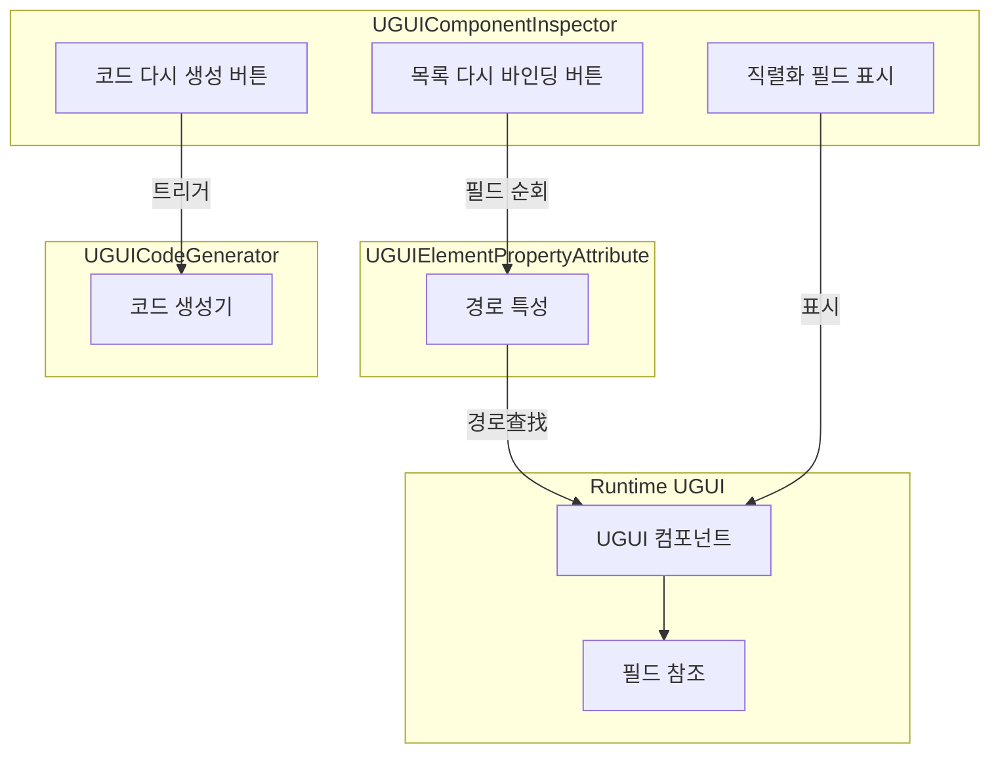
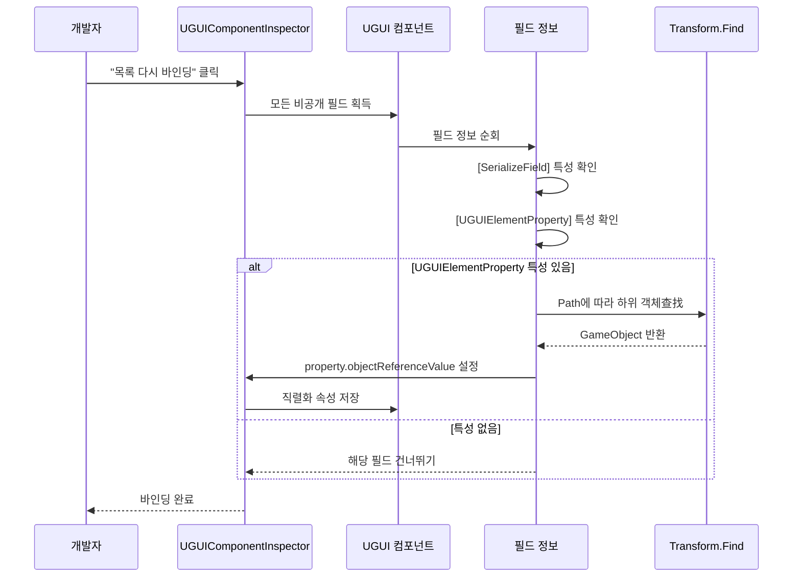

# 컴포넌트 인스펙터

컴포넌트 인스펙터는 UGUI 플러그인의 핵심 편집기 도구 중 하나로, Unity Editor에서 사용자 정의 UGUI 컴포넌트의 인스펙터 패널을 커스터마이즈합니다. 이 인스펙터는 개발자에게 편리한 코드 생성 및 참조 바인딩 기능을 제공하여 UI 개발 효율성을 크게 향상시킵니다.

## 개요

컴포넌트 인스펙터(`UGUIComponentInspector`)는 `UGUI` 기본 클래스 컴포넌트 전용 Unity Editor 사용자 정의 인스펙터입니다. `GameFrameworkInspector` 기본 클래스를 상속하며, UI 개발 흐름의 반복적인 작업을 자동화하기 위해 두 가지 핵심 기능 버튼을 제공합니다.

### 설계 목적

전통적인 UGUI 개발 모드에서 개발자는 수동으로 UI 프리팹을 생성하고, 각 UI 요소에 대한 참조 코드를 작성하고, 인스펙터에서 참조를 드래그 앤 드롭하여 하나씩 바인딩해야 합니다. 이러한 방식은 효율적일 뿐만 아니라, UI 구조가 변경될 때 많은 참조를 수동으로 업데이트해야 합니다.

컴포넌트 인스펙터는 다음 설계를 통해 이러한 문제를 해결합니다:

1. **코드 자동 생성**: 코드 생성기를 통해 UI 프리팹 구조를 자동으로 순회하여 `[UGUIElementProperty]` 특성이 있는 속성 코드를 생성
2. **참조 자동 바인딩**: 인스펙터 버튼을 통해 원클릭으로 모든 UI 요소 참조를 다시 바인딩하여 수동 드래그 앤 드롭 불필요

### 핵심 기능

- **코드 다시 생성**: 현재 프리팹 구조를 기반으로 UI 코드 파일을 다시 생성
- **목록 다시 바인딩**: 특성의 경로 정보에 따라 UI 요소 참조를 자동으로查找 및 바인딩

> Source: [UGUIComponentInspector.cs](https://github.com/GameFrameX/com.gameframex.unity.ui.ugui/blob/main/Editor/UGUIComponentInspector.cs#L44-L153)

## 아키텍처 설계

컴포넌트 인스펙터의 아키텍처 설계는 Unity Editor 확장 개발 모드를 따르며, 사용자 정의 인스펙터를 통해 Editor의 기능을 강화합니다.



### 컴포넌트 설명

| 컴포넌트 | 파일 위치 | 책임 |
|------|----------|------|
| UGUIComponentInspector | Editor/UGUIComponentInspector.cs | 사용자 정의 인스펙터, 버튼 상호작용 제공 |
| UGUIElementPropertyAttribute | Runtime/UGUIElementPropertyAttribute.cs | 특성 클래스, UI 요소 경로标记 |
| UGUICodeGenerator | Editor/UGUICodeGenerator.cs | 코드 생성기, UI 코드 생성 |
| UGUI | Runtime/UGUI.cs | UGUI 기본 클래스, 인스펙터 확장의 대상 |

> Source: [UGUIElementPropertyAttribute.cs](https://github.com/GameFrameX/com.gameframex.unity.ui.ugui/blob/main/Runtime/UGUIElementPropertyAttribute.cs#L40-L64)

## 핵심 구현

### 인스펙터 클래스 정의

인스펙터는 `[CustomEditor]` 특성을 사용하여 사용자 정의 편집기를 선언하고, `GameFrameworkInspector` 기본 클래스를 상속합니다:

```csharp
[CustomEditor(typeof(Runtime.UGUI), true)]
internal sealed class UGUIComponentInspector : GameFrameworkInspector
{
    private GUIStyle _customButtonStyle;

    private readonly GUIContent _reBind = new GUIContent("목록 다시 바인딩");
    private readonly GUIContent _reGenerate = new GUIContent("코드 다시 생성");

    public override void OnInspectorGUI()
    {
        // 인스펙터 GUI 구현
    }
}
```

> Source: [UGUIComponentInspector.cs](https://github.com/GameFrameX/com.gameframex.unity.ui.ugui/blob/main/Editor/UGUIComponentInspector.cs#L43-L80)

### 사용자 정의 버튼 스타일

인스펙터는 사용자 정의 버튼 스타일을 제공하며, 큰 폰트와 컬러 텍스트 디자인을 채택하여 개발자가 작업 버튼을 쉽게识别할 수 있도록 합니다:

```csharp
private GUIStyle CustomButtonStyle
{
    get
    {
        if (_customButtonStyle == null)
        {
            _customButtonStyle = new GUIStyle(GUI.skin.button)
            {
                fontSize = 32,
                normal = { textColor = Color.green },
                hover = { textColor = Color.yellow },
                active = { textColor = Color.green },
                alignment = TextAnchor.MiddleCenter,
            };
        }
        return _customButtonStyle;
    }
}
```

> Source: [UGUIComponentInspector.cs](https://github.com/github.com/GameFrameX/com.gameframex.unity.ui.ugui/blob/main/Editor/UGUIComponentInspector.cs#L48-L75)

## 핵심 흐름

### 목록 다시 바인딩 흐름

개발자가 "목록 다시 바인딩" 버튼을 클릭하면 인스펙터가 다음 흐름을 실행합니다:



### 목록 다시 바인딩 구현 코드

```csharp
bool buttonClicked = EditorGUILayout.DropdownButton(_reBind, FocusType.Passive, CustomButtonStyle);
if (buttonClicked && !EditorApplication.isPlaying)
{
    // 다시 바인딩
    Dictionary<string, string> fieldMap = new Dictionary<string, string>();
    foreach (var fieldInfo in fieldInfos)
    {
        var serializeFieldAttributes = fieldInfo.GetCustomAttribute(typeof(SerializeField));
        if (serializeFieldAttributes == null)
        {
            continue;
        }

        var uguiElementPropertyAttribute = fieldInfo.GetCustomAttribute(typeof(UGUIElementPropertyAttribute));
        if (uguiElementPropertyAttribute == null)
        {
            continue;
        }

        var elementPropertyAttribute = (UGUIElementPropertyAttribute)uguiElementPropertyAttribute;
        fieldMap[fieldInfo.Name] = elementPropertyAttribute.Path;
    }

    foreach (var kv in fieldMap)
    {
        var property = serializedObject.FindProperty(kv.Key);
        if (property != null)
        {
            var targetFind = targetGameObject.transform.Find(kv.Value);
            if (targetFind != null)
            {
                property.objectReferenceValue = targetFind.gameObject;
            }
        }
    }
}
```

> Source: [UGUIComponentInspector.cs](https://github.com/GameFrameX/com.gameframex.unity.ui.ugui/blob/main/Editor/UGUIComponentInspector.cs#L96-L131)

### 필드 표시 (읽기 전용 모드)

인스펙터는 또한 모든 직렬화 필드를 표시하지만, 읽기 전용 모드로 설정하여 Editor에서의 의도치 않은 수정을 방지합니다:

```csharp
// 편집기에서 수정 허용하지 않음
GUI.enabled = false;
foreach (var fieldInfo in fieldInfos)
{
    var attributes = fieldInfo.GetCustomAttributes(typeof(SerializeField));
    if (!attributes.Any())
    {
        continue;
    }

    EditorGUILayout.ObjectField(fieldInfo.Name, fieldInfo.GetValue(targetUGUI) as Object, fieldInfo.FieldType, true);
}

GUI.enabled = true;
```

> Source: [UGUIComponentInspector.cs](https://github.com/GameFrameX/com.gameframex.unity.ui.ugui/blob/main/Editor/UGUIComponentInspector.cs#L134-L147)

## UGUIElementProperty 특성

`UGUIElementPropertyAttribute`는 컴포넌트 인스펙터가 작동하는 핵심 특성으로, UI 컨트롤의 프리팹에서의 경로를标记합니다.

### 특성 정의

```csharp
/// <summary>
/// UGUI 컨트롤 속성 특성, UI 컨트롤의 프리팹에서의 경로를标记하는 데 사용됩니다.
/// </summary>
public sealed class UGUIElementPropertyAttribute : Attribute
{
    /// <summary>
    /// 컨트롤 경로를 획득합니다.
/// </summary>
    [UnityEngine.Scripting.Preserve]
    public string Path { get; }

    /// <summary>
    /// <see cref="UGUIElementPropertyAttribute"/> 클래스의 새 인스턴스를 초기화합니다.
/// </summary>
    /// <param name="path">컨트롤 경로</param>
    [UnityEngine.Scripting.Preserve]
    public UGUIElementPropertyAttribute(string path)
    {
        Path = path;
    }
}
```

> Source: [UGUIElementPropertyAttribute.cs](https://github.com/GameFrameX/com.gameframex.unity.ui.ugui/blob/main/Runtime/UGUIElementPropertyAttribute.cs#L34-L64)

### 사용 예제

코드 생성기는 자동으로 이 특성이 있는 속성 코드를 생성합니다:

```csharp
[SerializeField]
[UGUIElementProperty("Panel/Button_Start")]
private Button m_Button_Start;

public Button m_Button_Start
{
    get { return m_Button_Start; }
}
```

> Source: [UGUICodeGenerator.cs](https://github.com/GameFrameX/com.gameframex.unity.ui.ugui/blob/main/Editor/UGUICodeGenerator.cs#L259-L269)

## 사용 시나리오

### 시나리오 1: UI 구조 변경 후 다시 바인딩

UI 프리팹 구조가 변경되면(예: 이름 변경, 레벨 조정), 기존 참조가 유효하지 않게 됩니다. 이때 다음만 하면 됩니다:

1. 코드 다시 생성(또는 경로 수동 업데이트)
2. "목록 다시 바인딩" 버튼 클릭
3. 인스펙터가 새 경로를 기반으로 UI 요소를 자동으로查找 및 바인딩

### 시나리오 2: 코드 재구성 후 참조 업데이트

코드 재구성 과정에서 필드 이름을 수정하거나 프리팹 구조를 조정할 수 있습니다. 다시 바인딩 기능을 사용하면 모든 참조를 빠르게 복원할 수 있어 수동으로 하나씩 드래그 앤 드롭할 필요가 없습니다.

### 시나리오 3: 멀티 플랫폼 리소스 경로 조정

UI 리소스의 조직 구조를 조정해야 할 때, 코드 다시 생성 및 다시 바인딩을 통해 새 리소스 조직 방식에 빠르게 적응할 수 있습니다.

## 관련 링크

- [코드 생성기](./6-editor-tools.code-generator) - 코드 자동 생성 기능 이해
- [UGUI 기본 클래스](./4-core-concepts.ugui-base) - UGUI 기본 클래스 구현 이해
- [이미지 교체 핸들러](./6-editor-tools.image-replace) - UI 이미지 교체 기능 이해
- [빠른 시작 - 코드 생성기 사용](./3-getting-started.code-generator) - 빠른 시작 가이드
