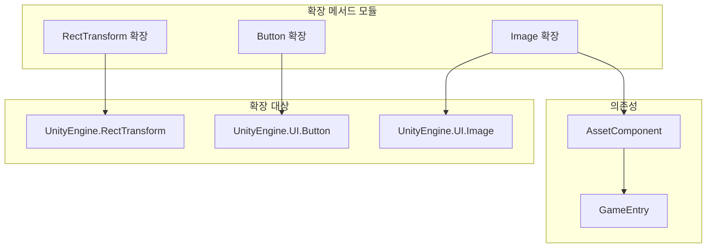

# 확장 메서드

편리한 확장 메서드를 제공하여 UGUI 컴포넌트의 기능을 강화하고 일반적인 UI 작업의 코드 작성을 단순화합니다.

## 개요

확장 메서드는 GameFrameX UGUI 플러그인에서 제공하는一组 정적 확장 메서드로, C# 확장 메서드 문법을 통해 Unity 내장 UGUI 컴포넌트에 편리한 기능을 추가합니다. 이러한 확장 메서드는 UI 레이아웃, 버튼 이벤트 처리 및 이미지 비동기 로드 등의 일반적인 시나리오를 커버하여,样板 코드를 현저히 줄이고 개발 효율성을 향상시킵니다.

모든 확장 메서드는 `GameFrameX.UI.UGUI.Runtime` 네임스페이스 아래에 있으며, `[Preserve]` 특성을 사용하여 IL2CPP 등 코드 사이닝 환경에서丢失되지 않도록 보장합니다.

## 아키텍처

확장 메서드는 대상 컴포넌트에 따라 분류되며, 세 가지 주요 유형으로 나뉩니다:



### 확장 메서드 분류

| 확장 클래스 | 대상 컴포넌트 | 주요 기능 |
|--------|----------|----------|
| `RectTransformExtension` | `RectTransform` | 전체 화면 레이아웃快速 설정 |
| `UGUIButtonExtension` | `Button.ButtonClickedEvent` | 버튼 이벤트 바인딩 단순화 |
| `UGUIImageExtension` | `UnityEngine.UI.Image` | 아이콘 리소스 비동기 로드 |

## RectTransform 확장

`RectTransformExtension` 클래스는 `RectTransform` 컴포넌트에 레이아웃 관련 확장 메서드를 제공합니다.

### MakeFullScreen

현재 UI 객체를 전체 화면으로 표시합니다.

```csharp
public static void MakeFullScreen(this RectTransform rectTransform)
```

**구현 원리:**

이 메서드는 RectTransform의 네 가지 핵심 속성을 설정하여 전체 화면 효과를 구현합니다:

1. `anchorMin = Vector2.zero` - 앵커 최솟값을 (0,0)으로 설정, 즉 부모 컨테이너의 좌측 하단
2. `anchorMax = Vector2.one` - 앵커 최대값을 (1,1)으로 설정, 즉 부모 컨테이너의 우측 상단
3. `anchoredPosition = Vector2.zero` - 앵커 위치를 영으로 재설정
4. `sizeDelta = Vector2.zero` - 크기增量을 영으로 설정하여 요소가 부모 컨테이너를 완전 채우도록 함

> Source: [RectTransformExtension.cs](https://github.com/GameFrameX/com.gameframex.unity.ui.ugui/blob/main/Runtime/RectTransformExtension.cs#L56-L62)

**사용 예제:**

```csharp
using GameFrameX.UI.UGUI.Runtime;

// RectTransform 참조가 있다고 가정
RectTransform fullScreenPanel = someUIObject.GetComponent<RectTransform>();

// 한 줄의 코드로 전체 화면으로 설정
fullScreenPanel.MakeFullScreen();
```

## Button 확장

`UGUIButtonExtension` 클래스는 `Button.ButtonClickedEvent`에 이벤트 처리 관련 확장 메서드를 제공하여, 버튼 클릭 이벤트 바인딩 및 관리를 단순화합니다.

### 메서드 목록

| 메서드 | 기능 설명 |
|------|----------|
| `Add` | 버튼 클릭 이벤트 리스너 추가 |
| `Remove` | 버튼 클릭 이벤트 리스너 제거 |
| `Clear` | 모든 버튼 클릭 이벤트 리스너 지우기 |
| `Set` | 버튼 클릭 이벤트 설정 (기존 이벤트 대체) |
| `Set(action, userData)` | 사용자 데이터가 포함된 클릭 이벤트 설정 |

### Add

버튼 클릭 이벤트 리스너를 추가합니다.

```csharp
public static void Add(this Button.ButtonClickedEvent self, UnityAction action)
```

**매개변수:**
- `self`: 버튼의 클릭 이벤트 컬렉션
- `action`: 클릭 시 실행할 콜백

> Source: [UGUIButtonExtension.cs](https://github.com/GameFrameX/com.gameframex.unity.ui.ugui/blob/main/Runtime/UGUIButtonExtension.cs#L52-L57)

### Remove

지정된 버튼 클릭 이벤트 리스너를 제거합니다.

```csharp
public static void Remove(this Button.ButtonClickedEvent self, UnityAction action)
```

> Source: [UGUIButtonExtension.cs](https://github.com/GameFrameX/com.gameframex.unity.ui.ugui/blob/main/Runtime/UGUIButtonExtension.cs#L67-L72)

### Clear

모든 버튼 클릭 이벤트 리스너를 지웁니다.

```csharp
public static void Clear(this Button.ButtonClickedEvent self)
```

> Source: [UGUIButtonExtension.cs](https://github.com/GameFrameX/com.gameframex.unity.ui.ugui/blob/main/Runtime/UGUIButtonExtension.cs#L81-L85)

### Set

버튼 클릭 이벤트를 설정하여 기존 이벤트를 모두 새 이벤트로 대체합니다.

```csharp
public static void Set(this Button.ButtonClickedEvent self, UnityAction action)
```

> Source: [UGUIButtonExtension.cs](https://github.com/GameFrameX/com.gameframex.unity.ui.ugui/blob/main/Runtime/UGUIButtonExtension.cs#L95-L101)

### Set (사용자 데이터 포함)

사용자 데이터가 포함된 버튼 클릭 이벤트를 설정합니다.

```csharp
public static void Set(this Button.ButtonClickedEvent self, UnityAction<object> action, object userData)
```

**매개변수:**
- `self`: 버튼의 클릭 이벤트 컬렉션
- `action`: 사용자 데이터 매개변수가 포함된 콜백 함수
- `userData`: 콜백에 전달할 사용자 정의 데이터

> Source: [UGUIButtonExtension.cs](https://github.com/GameFrameX/com.gameframex.unity.ui.ugui/blob/main/Runtime/UGUIButtonExtension.cs#L112-L124)

**사용 예제:**

```csharp
using GameFrameX.UI.UGUI.Runtime;
using UnityEngine.UI;
using UnityEngine;

// 버튼 컴포넌트 획득
Button button = GetComponent<Button>();

// 클릭 이벤트 추가
button.onClick.Add(() => {
    Debug.Log("버튼이 클릭됨");
});

// 매개변수가 있는 이벤트 사용
button.onClick.Set((userData) => {
    Debug.Log($"버튼이 클릭됨, 사용자 데이터: {userData}");
}, "사용자 정의 데이터");

// 모든 이벤트 지우기
button.onClick.Clear();
```

## Image 확장

`UGUIImageExtension` 클래스는 `UnityEngine.UI.Image`에 비동기 아이콘 로드 기능을 제공합니다.

### SetIconAsync

이미지 아이콘을 비동기식으로 설정합니다.

```csharp
public static async Task SetIconAsync(this UnityEngine.UI.Image self, string icon)
```

**매개변수:**
- `self`: 대상 이미지 컴포넌트
- `icon`: 아이콘 리소스 경로 (리소스 디렉토리에 대한 상대 경로)

**반환값:**
- `Task` 비동기 작업 반환

**구현 원리:**

1. `GameEntry.GetComponent<AssetComponent>()`를 통해 리소스 컴포넌트 획득
2. `LoadAssetAsync<Texture2D>`를 사용하여 텍스처 리소스를 비동기식으로 로드
3. 로드된 `Texture2D`를 `Sprite` 객체로 변환
4. 생성된 Sprite를 Image 컴포넌트의 sprite 속성에 할당

> Source: [UGUIImageExtension.cs](https://github.com/GameFrameX/com.gameframex.unity.ui.ugui/blob/main/Runtime/UGUIImageExtension.cs#L55-L74)

**예외 처리:**

이 메서드는内置 try-catch 예외 처리 메커니즘을 갖추고 있어, 로드 실패 시 오류 로그를 출력하지만 예외를 throw하지 않아 UI가 리소스 로드 실패로崩溃하지 않도록 합니다.

**사용 예제:**

```csharp
using GameFrameX.UI.UGUI.Runtime;
using UnityEngine.UI;

// Image 컴포넌트 획득
Image iconImage = GetComponent<Image>();

// 비동기식으로 아이콘 로드 및 설정
await iconImage.SetIconAsync("icons/player_avatar");

// UIFormHelper와 함께 사용 가능
await iconImage.SetIconAsync(formHelper.GetIconPath("item_001"));
```

## 일반 사용 시나리오

### 시나리오 1: 전체 화면 팝업 생성

```csharp
// 전체 화면 반투명 배경 생성
GameObject bgObj = new GameObject("PopupBackground");
bgObj.transform.SetParent(canvas.transform);
RectTransform bgRT = bgObj.AddComponent<RectTransform>();
Image bgImage = bgObj.AddComponent<Image>();
bgImage.color = new Color(0, 0, 0, 0.5f);

// 전체 화면으로 설정
bgRT.MakeFullScreen();
```

### 시나리오 2: 일괄 버튼 이벤트 설정

```csharp
// 일괄 버튼 이벤트 바인딩
Button[] buttons = GetComponentsInChildren<Button>();
foreach (var btn in buttons)
{
    btn.onClick.Set(() => OnButtonClick(btn.name));
}
```

### 시나리오 3: 비동기식 아이템 아이콘 로드

```csharp
// UIForm의 로딩 흐름에서 비동기식으로 아이콘 설정
public async void LoadItemIcon(Image iconImage, string itemId)
{
    await iconImage.SetIconAsync($"icons/items/{itemId}");
}
```

## 관련 링크

- [UIImage 컴포넌트](./5-components.uiimage) - UIImage 컴포넌트 문서
- [UGUI 기본 클래스](./4-core-concepts.ugui-base) - UGUI 기본 클래스 소개
- [UI 관리자](./4-core-concepts.ui-manager) - UI 관리자 문서
- [폼 헬퍼](./4-core-concepts.form-helper) - 폼 헬퍼 문서
