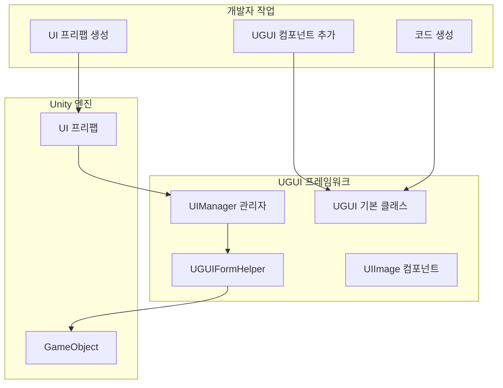
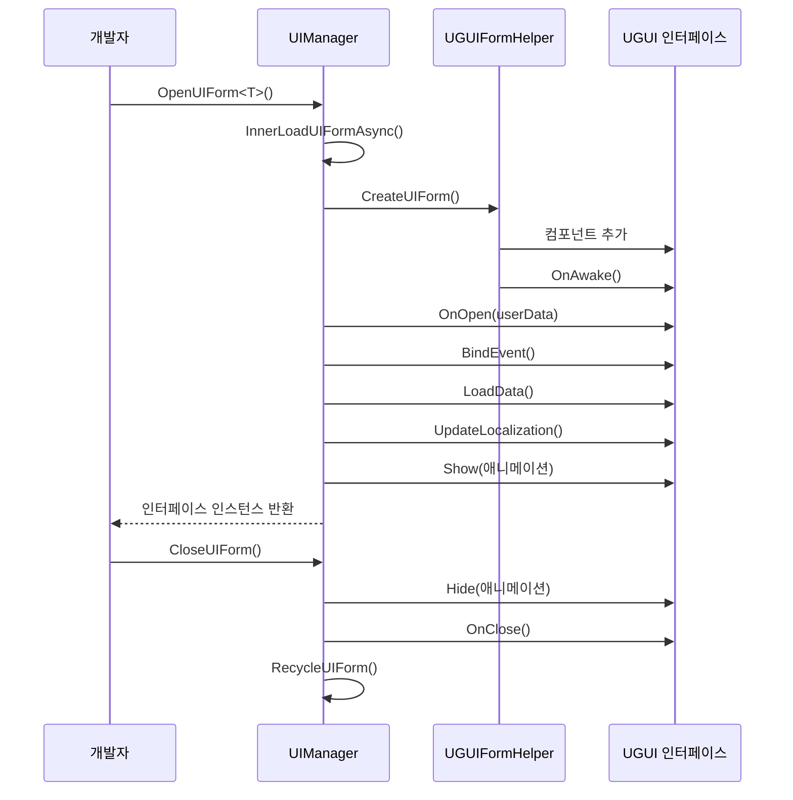

# UI 인터페이스 생성

이 문서는 GameFrameX UGUI 플러그인에서 UI 인터페이스를 생성하고 관리하는 방법을 소개합니다.

## 개요

GameFrameX UGUI 플러그인은 완전한 UI 인터페이스 생성 및 관리 시스템을 제공합니다. `UGUI` 기본 클래스를 상속하여 개발자는 빠르게 UI 인터페이스를 생성할 수 있으며, 코드 생성기를 사용하여 인터페이스 컴포넌트의 참조 코드를 자동으로 생성할 수 있습니다. UI 인터페이스는 `UIManager`가统일管理하며, 비동기 로딩, 객체 풀 캐싱, 표시/숨김 애니메이션 등의 기능을 지원합니다.

> 더 많은 핵심 개념 이해: [UGUI 기본 클래스](./4-core-concepts.ugui-base), [UI 관리자](./4-core-concepts.ui-manager), [폼 헬퍼](./4-core-concepts.form-helper)

## 핵심 아키텍처

UI 인터페이스의 생성 및 관리는 다음 핵심 컴포넌트를 관련합니다:



## 생성 흐름

### 단계 1: UI 프리팹 생성

Unity 프로젝트에서 UI 인터페이스 프리팹(Prefab)을 생성하며, 일반적으로 다음 구조를 포함합니다:

```
Canvas (캔버스)
├── UGUI (루트 노드, UGUI 컴포넌트 추가)
│   ├── Panel_xxx (배경 패널)
│   │   ├── Image_xxx (이미지)
│   │   ├── Text_xxx (텍스트)
│   │   └── Button_xxx (버튼)
│   └── ...
```

> Source: [Runtime/UGUI.cs](https://github.com/GameFrameX/com.gameframex.unity.ui.ugui/blob/main/Runtime/UGUI.cs#L44-L50)

### 단계 2: UGUI 컴포넌트 추가

프리팹의 루트 GameObject에 `UGUI` 컴포넌트를 추가합니다:

1. 프리팹의 루트 노드 선택
2. Inspector 패널에서 "Add Component" 클릭
3. `GameFrameX.UI.UGUI.Runtime.UGUI` 검색 및 추가

`UGUI` 컴포넌트는 `UIForm`을 상속하여 다음 기능을 제공합니다:
- 인터페이스의 표시와 숨김 (애니메이션 지원)
- 가시성 상태 관리
- 전체 화면 모드 설정

```csharp
// UGUI 기본 클래스 정의
namespace GameFrameX.UI.UGUI.Runtime
{
    [Preserve]
    [DisallowMultipleComponent]
    public class UGUI : UIForm
    {
        // 인터페이스 표시
        public override void Show(IUIFormShowHandler handler, Action complete)

        // 인터페이스 숨김
        public override void Hide(IUIFormHideHandler handler, Action complete)

        // 가시성 설정
        protected override void InternalSetVisible(bool value)

        // 가시성 가져오기/설정
        public override bool Visible { get; protected set; }

        // 전체 화면 설정
        protected override void MakeFullScreen()
    }
}
```

> Source: [Runtime/UGUI.cs](https://github.com/GameFrameX/com.gameframex.unity.ui.ugui/blob/main/Runtime/UGUI.cs#L36-L179)

### 단계 3: UI 코드 생성

코드 생성기를 사용하여 UI 컴포넌트 참조 코드를 자동으로 생성합니다:

1. Unity 메뉴에서 **GameObject → UI → Generate UGUI Code** 선택
2. 코드를 생성할 UGUI 프리팹 선택
3. 코드 생성기가 프리팹의 모든 하위 노드를 자동으로 순회하여 대응하는 속성 코드를 생성

생성된 코드는 다음 구조를 갖습니다:

```csharp
#if ENABLE_UI_UGUI
using Cysharp.Threading.Tasks;
using GameFrameX.Entity.Runtime;
using GameFrameX.UI.Runtime;
using GameFrameX.Runtime;
using GameFrameX.UI.UGUI.Runtime;
using UnityEngine;

namespace Hotfix.UI
{
    /// <summary>
    /// 코드 생성된 UI 코드 LoginPanel
    /// </summary>
    [DisallowMultipleComponent]
    [OptionUIConfig(null, "Assets/Prefabs/UI/Login")]
    public sealed partial class LoginPanel : UGUI
    {
        public GameObject self { get; private set; }

        #region Properties

        [SerializeField] [UGUIElementProperty("Panel_Bg/Image_Logo")]
        private UnityEngine.UI.Image m_Image_Logo;

        public UnityEngine.UI.Image m_Image_Logo => m_Image_Logo;

        [SerializeField] [UGUIElementProperty("Panel_Bg/Button_Login")]
        private UnityEngine.UI.Button m_Button_Login;

        public UnityEngine.UI.Button m_Button_Login => m_Button_Login;

        #endregion

        private bool _isInitView = false;

        protected override void InitView()
        {
            if (_isInitView)
            {
                return;
            }

            _isInitView = true;
            this.self = this.gameObject;
            m_Image_Logo = gameObject.transform.FindChildName("Panel_Bg/Image_Logo").GetComponent<UnityEngine.UI.Image>();
            m_Button_Login = gameObject.transform.FindChildName("Panel_Bg/Button_Login").GetComponent<UnityEngine.UI.Button>();
        }
    }
}
#endif
```

> Source: [Editor/UGUICodeGenerator.cs](https://github.com/GameFrameX/com.gameframex.unity.ui.ugui/blob/main/Editor/UGUICodeGenerator.cs#L84-L230)

### 단계 4: 생성된 코드 마운트

코드 생성 후, 코드를 프리팹에 마운트해야 합니다:

1. 생성된 `.UI.cs` 파일을 프리팹의 루트 노드에 마운트
2. Inspector에서 **"목록 다시 바인딩"** 버튼 클릭하여 프리팹의 하위 노드를 코드 속성에 바인딩

> 더 자세한 코드 생성기: [코드 생성기 사용](./3-getting-started.code-generator)

## UI 인터페이스 열기 및 닫기

### UI 인터페이스 열기

`UIManager`를 통해 UI 인터페이스를 비동기식으로 엽니다:

```csharp
// UI 인터페이스 열기
var uiForm = await GameEntry.UI.OpenUIForm<LoginPanel>();
```

`OpenUIForm` 메서드는 다음을 수행합니다:
1. 객체 풀에 사용 가능한 인스턴스가 있는지 확인
2. 없으면 Resources 또는 AssetBundle에서 비동기식으로 로드
3. `UGUIFormHelper`를 호출하여 인터페이스 생성
4. `OnOpen` 콜백 트리거
5. 표시 애니메이션 재생 (활성화된 경우)

```csharp
// 인터페이스 열기 핵심 흐름
protected override async Task<IUIForm> InnerOpenUIFormAsync(
    string uiFormAssetPath, 
    Type uiFormType, 
    bool pauseCoveredUIForm, 
    object userData, 
    bool isFullScreen = false)
{
    // 1. 객체 풀 확인
    var uiFormInstanceObject = m_InstancePool.Spawn(assetPath);
    if (uiFormInstanceObject != null)
    {
        return InternalOpenUIForm(...);
    }

    // 2. 리소스 비동기 로드
    var uiForm = InnerLoadUIFormAsync(...);
    return await uiForm;
}
```

> Source: [Runtime/UIManager.Open.cs](https://github.com/GameFrameX/com.gameframex.unity.ui.ugui/blob/main/Runtime/UIManager.Open.cs#L79-L115)

### UI 인터페이스 닫기

```csharp
// UI 인터페이스 닫기
GameEntry.UI.CloseUIForm(loginPanel);
```

### UIForm 생명주기



## UI 컴포넌트 참조

코드 생성기는 프리팹의 각 UI 컨트롤에 대해 참조 속성을 자동으로 생성합니다. `[UGUIElementProperty]` 특성을 사용하여 컨트롤 경로를标记합니다:

```csharp
[SerializeField] 
[UGUIElementProperty("Panel_Bg/Button_Start")]
private UnityEngine.UI.Button m_Button_Start;

public UnityEngine.UI.Button m_Button_Start => m_Button_Start;
```

> 더 많은 UI 컴포넌트: [UIImage 컴포넌트](./5-components.uiimage), [확장 메서드](./5-components.extensions)

## UI 인터페이스 구성

특성을 통해 UI 인터페이스의 동작을 구성할 수 있습니다:

### OptionUIConfig 특성

인터페이스의 리소스 로딩 방식 구성:

```csharp
[OptionUIConfig(true)]  // Resources에서 로드
[OptionUIConfig(null, "Assets/Prefabs/UI/Login")]  // AssetBundle에서 로드
```

### OptionUIGroupAttribute 특성

인터페이스가 속한 UI 그룹 구성:

```csharp
[OptionUIGroup("MainUI")]
```

### OptionUIShowAnimationAttribute 특성

표시 애니메이션 구성:

```csharp
[OptionUIShowAnimation(true, "FadeIn")]
```

### OptionUIHideAnimationAttribute 특성

숨김 애니메이션 구성:

```csharp
[OptionUIHideAnimation(true, "FadeOut")]
```

## 완전한 예제

다음은 완전한 UI 인터페이스 생성 예제입니다:

```csharp
using GameFrameX.UI.UGUI.Runtime;
using UnityEngine;
using UnityEngine.UI;

namespace Hotfix.UI
{
    /// <summary>
    /// 로그인 인터페이스
    /// </summary>
    [DisallowMultipleComponent]
    [OptionUIConfig(null, "Assets/Prefabs/UI/Login")]
    public sealed partial class LoginPanel : UGUI
    {
        public GameObject self { get; private set; }

        #region Properties

        [SerializeField] 
        [UGUIElementProperty("Background")]
        private Image m_Background;

        public Image m_Background => m_Background;

        [SerializeField] 
        [UGUIElementProperty("Button_Login")]
        private Button m_Button_Login;

        public Button m_Button_Login => m_Button_Login;

        [SerializeField] 
        [UGUIElementProperty("InputField_Username")]
        private InputField m_InputField_Username;

        public InputField m_InputField_Username => m_InputField_Username;

        #endregion

        private bool _isInitView = false;

        protected override void InitView()
        {
            if (_isInitView)
            {
                return;
            }

            _isInitView = true;
            this.self = this.gameObject;
            
            m_Background = gameObject.transform.FindChildName("Background").GetComponent<Image>();
            m_Button_Login = gameObject.transform.FindChildName("Button_Login").GetComponent<Button>();
            m_InputField_Username = gameObject.transform.FindChildName("InputField_Username").GetComponent<InputField>();

            // 버튼 클릭 이벤트 바인딩
            m_Button_Login.onClick.AddListener(OnLoginClick);
        }

        private void OnLoginClick()
        {
            Debug.Log("로그인 버튼 클릭, 사용자명: " + m_InputField_Username.text);
            // 로그인 로직 처리
        }

        protected override void OnClose(bool isShutdown, bool pauseCovered)
        {
            base.OnClose(isShutdown, pauseCovered);
            // 리소스 정리
        }
    }
}
```

## 관련 링크

- [코드 생성기 사용](./3-getting-started.code-generator) - 코드 생성기 사용 상세 이해
- [UGUI 기본 클래스](./4-core-concepts.ugui-base) - UGUI 기본 클래스의 상세 설명
- [UI 관리자](./4-core-concepts.ui-manager) - UI 관리자의 상세 설명
- [폼 헬퍼](./4-core-concepts.form-helper) - 폼 헬퍼의 상세 설명
- [UIImage 컴포넌트](./5-components.uiimage) - UIImage 컴포넌트 설명
- [확장 메서드](./5-components.extensions) - UGUI 확장 메서드
- [코드 생성기](./6-editor-tools.code-generator) - 편집기 코드 생성기 도구
- [컴포넌트 인스펙터](./6-editor-tools.inspector) - UGUI 컴포넌트 인스펙터
