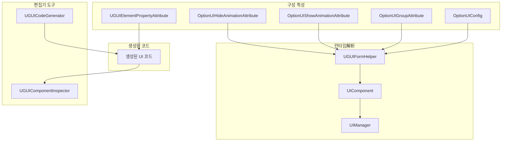
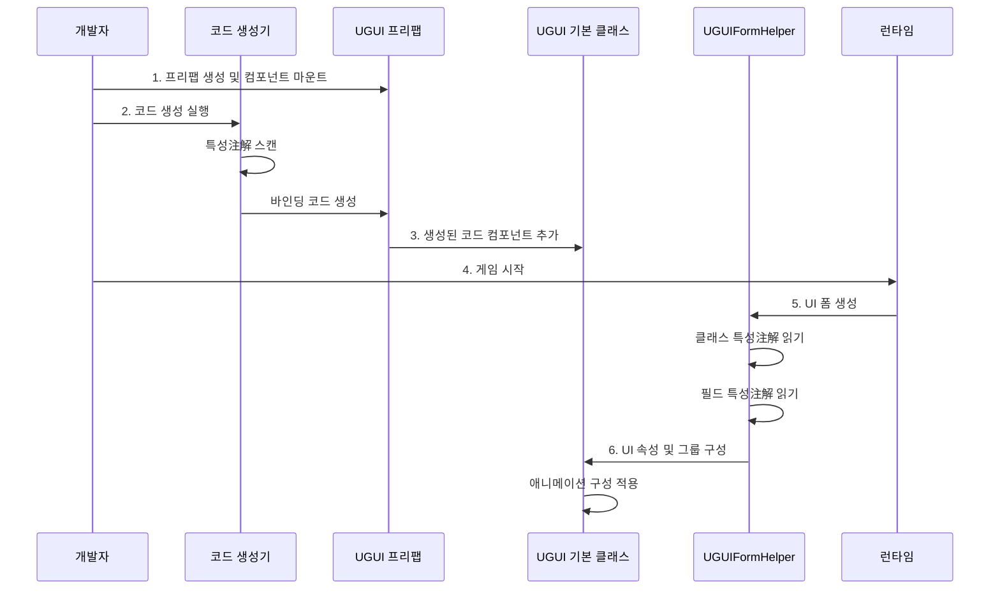

# 구성

이 문서는 GameFrameX UGUI 플러그인의 구성 시스템을 상세히 소개하며, 특성 구성, 속성 바인딩, 코드 생성기 설정 등을 포함합니다.

## 개요

GameFrameX UGUI 플러그인은**특성驱动 (Attribute-Driven)** 구성 모드를 채택하며, C# 특성(Attribute)을 통해 코드에서宣言적으로 UI 인터페이스의 다양한 동작과 속성을 정의합니다. 이 방식의优点:

- **宣言적 구성**: 특성을 사용하여标记하면 UI 동작 구성을 완료할 수 있어繁琐한 초기화 코드 작성 불필요
- **유형 안전**: 구성이 컴파일 시 검사되어 런타임 오류 감소
- **코드 생성 통합**: 특성과 코드 생성기가 깊이 통합되어 자동으로 바인딩 코드 생성
- **런타임解析**: 특성은 UI 인터페이스 생성 시 자동으로解析 및 적용

구성 시스템은主に 다음 차원을 포함합니다:

1. **UI 폼 구성**: 인터페이스의 리소스 경로, 소속 그룹, 애니메이션 등 정의
2. **UI 요소 바인딩**: 프리팹의 컨트롤 참조를宣言적으로 바인딩
3. **코드 생성기 구성**: 코드 생성 동작 및 출력 경로 사용자 정의
4. **UI 그룹 구성**: 인터페이스의 레벨 및 깊이 관계 관리

## 아키텍처



### 구성 흐름



## UI 폼 구성

### OptionUIConfig 특성

`OptionUIConfig` 특성은 UI 폼의 기본 정보를 구성하는 데 사용되며, 리소스 로딩 방식과 리소스 경로를 포함합니다.

```csharp
[OptionUIConfig(null, "Assets/Resources/UI/Prefabs")]
public partial class MainMenuUI : UGUI
{
    // UI 인터페이스 로직
}
```

> Source: [UGUICodeGenerator.cs#L188](https://github.com/GameFrameX/com.gameframex.unity.ui.ugui/blob/main/Editor/UGUICodeGenerator.cs#L188)

**매개변수 설명:**

| 매개변수 | 유형 | 기본값 | 설명 |
|------|------|--------|------|
| isResources | bool? | null | Resources에서 로드할지 여부, true는 Resources에서 로드, false는 AB 번들에서 로드, null은 기본 구성 사용 |
| assetPath | string | null | 리소스 경로, isResources가 false일 때 AB 번들의 상대 경로 지정 |

**사용 시나리오:**

- **Resources에서 로드**: `[OptionUIConfig(true)]` - 리소스는 반드시 `Resources` 디렉토리에 있어야 합니다
- **AB 번들에서 로드**: `[OptionUIConfig(false, "Assets/UI/Prefabs")]` - 리소스는 AB 번들로 관리됩니다
- **기본 구성 사용**: `[OptionUIConfig(null, "Assets/UI/Prefabs")]` - UIComponent의 기본 설정 사용

### OptionUIGroupAttribute 특성

`OptionUIGroupAttribute` 특성은 UI 인터페이스가 속한 UI 그룹(UIGroup)을 지정하는 데 사용됩니다.

```csharp
[OptionUIGroup("MainUI")]
public partial class MainMenuUI : UGUI
{
    // UI 인터페이스 로직
}
```

> Source: [UGUIFormHelper.cs#L117-L121](https://github.com/GameFrameX/com.gameframex.unity.ui.ugui/blob/main/Runtime/UGUIFormHelper.cs#L117-L121)

**매개변수 설명:**

| 매개변수 | 유형 | 설명 |
|------|------|------|
| GroupName | string | UI 그룹의 이름으로, 인터페이스를 특정 그룹에 할당하는 데 사용됩니다 |

**UI 그룹의 역할:**

- 동그룹 인터페이스의 표시 레벨(Depth) 관리
- 동그룹 인터페이스의 표시/숨김 전략 제어
- 동그룹 인터페이스의 리소스 해제统일 관리

### OptionUIShowAnimationAttribute 특성

`OptionUIShowAnimationAttribute` 특성은 UI 인터페이스 열기 시 애니메이션 효과를 구성하는 데 사용됩니다.

```csharp
[OptionUIShowAnimation(true, "MainMenuEnter")]
public partial class MainMenuUI : UGUI
{
    // UI 인터페이스 로직
}
```

> Source: [UGUIFormHelper.cs#L126-L131](https://github.com/GameFrameX/com.gameframex.unity.ui.ugui/blob/main/Runtime/UGUIFormHelper.cs#L126-L131)

**매개변수 설명:**

| 매개변수 | 유형 | 기본값 | 설명 |
|------|------|--------|------|
| Enable | bool | false | 표시 애니메이션 활성화 여부 |
| AnimationName | string | "" | 애니메이션 이름으로, 애니메이션 시스템의 애니메이션 식별자에 대응합니다 |

### OptionUIHideAnimationAttribute 특성

`OptionUIHideAnimationAttribute` 특성은 UI 인터페이스 닫기 시 애니메이션 효과를 구성하는 데 사용됩니다.

```csharp
[OptionUIHideAnimation(true, "MainMenuExit")]
public partial class MainMenuUI : UGUI
{
    // UI 인터페이스 로직
}
```

> Source: [UGUIFormHelper.cs#L137-L142](https://github.com/GameFrameX/com.gameframex.unity.ui.ugui/blob/main/Runtime/UGUIFormHelper.cs#L137-L142)

**매개변수 설명:**

| 매개변수 | 유형 | 기본값 | 설명 |
|------|------|--------|------|
| Enable | bool | false | 숨김 애니메이션 활성화 여부 |
| AnimationName | string | "" | 애니메이션 이름으로, 애니메이션 시스템의 애니메이션 식별자에 대응합니다 |

### 조합 구성 예제

여러 특성을 동시에 사용하여 조합 구성을 수행할 수 있습니다:

```csharp
[OptionUIConfig(false, "Assets/UI/Prefabs/MainMenu")]
[OptionUIGroup("MainUI")]
[OptionUIShowAnimation(true, "MainMenuEnter")]
[OptionUIHideAnimation(true, "MainMenuExit")]
public partial class MainMenuUI : UGUI
{
    // 인터페이스 로직
}
```

## UI 요소 바인딩

### UGUIElementPropertyAttribute 특성

`UGUIElementPropertyAttribute` 특성은 UI 컨트롤의 프리팹에서의 경로를标记하여, 코드 생성기가 자동으로 속성 바인딩 코드를 생성할 수 있도록 합니다.

```csharp
public partial class MainMenuUI : UGUI
{
    [SerializeField]
    [UGUIElementProperty("StartButton")]
    private Button m_StartButton;

    [SerializeField]
    [UGUIElementProperty("Panel/Title")]
    private Text m_Title;

    public Button m_StartButton => m_StartButton;
    public Text m_Title => m_Title;
}
```

> Source: [UGUIElementPropertyAttribute.cs#L40-L64](https://github.com/GameFrameX/com.gameframex.unity.ui.ugui/blob/main/Runtime/UGUIElementPropertyAttribute.cs#L40-L64)

**매개변수 설명:**

| 매개변수 | 유형 | 설명 |
|------|------|------|
| Path | string | 컨트롤의 프리팹에서의 경로로, "/"를 사용하여 레벨 구분 |

**경로 규칙:**

- 현재 UI 프리팹의 루트 노드에 대한 상대 경로입니다
- "/"를 사용하여 하위 노드 레벨을 나타냅니다
- 예: `"Panel/Content/Button"`은 루트 노드에서 시작하여 Panel -> Content -> Button으로 순차 진입함을 나타냅니다

**작동 원리:**

1. 코드 생성기가 `[UGUIElementProperty]` 특성이 있는 필드를 스캔합니다
2. Path 경로를 기반으로 프리팹에서 대응하는 Transform을查找합니다
3. 자동으로 대응하는 유형의 컴포넌트를 가져와서 할당합니다

### 생성된 코드 구조

코드 생성기는 각 UI 컨트롤에 대해 다음 코드 구조를 생성합니다:

```csharp
[SerializeField]
[UGUIElementProperty("StartButton")]
private Button m_StartButton;

public Button m_StartButton => m_StartButton;
```

이 패턴의优点:

- `[SerializeField]`는 필드가 편집기에서 직렬화될 수 있도록 합니다
- `[UGUIElementProperty]`는 경로 정보를 제공하여 코드 생성기가 사용합니다
- 속성 래핑(Property)은 읽기 전용 액세스를 제공합니다

## 코드 생성기 구성

### 코드 생성 경로

코드 생성기는 프리팹의 위치에 따라 생성 경로를 자동으로 선택합니다:

```csharp
if (assetPath.Contains(nameof(Resources)))
{
    // Resources 디렉토리 아래의 프리팹
    savePath = System.IO.Path.Combine(Application.dataPath, "Scripts", "Game", "UGUI", className);
}
else
{
    // 기타 위치의 프리팹 (핫픽스 코드)
    savePath = System.IO.Path.Combine(Application.dataPath, "Hotfix", "UI", "UGUI", className);
}
```

> Source: [UGUICodeGenerator.cs#L120-L127](https://github.com/GameFrameX/com.gameframex.unity.ui.ugui/blob/main/Editor/UGUICodeGenerator.cs#L120-L127)

**생성 경로 규칙:**

| 프리팹 위치 | 생성 경로 |
|------------|----------|
| `Resources/` 디렉토리 | `Assets/Scripts/Game/UGUI/<프리팹명>/` |
| 기타 디렉토리 | `Assets/Hotfix/UI/UGUI/<프리팹명>/` |

### 사용자 정의 유형 변환 핸들러

코드 생성기는 `IUGUIGeneratorCodeConvertTypeHandler` 인터페이스를 구현하여 지원되는 UI 컨트롤 유형을 확장할 수 있습니다.

```csharp
public interface IUGUIGeneratorCodeConvertTypeHandler
{
    /// <summary>
    /// 핸들러 우선순위, 값이 작을수록 우선순위 높음
    /// </summary>
    int Priority { get; }

    /// <summary>
    /// 유형 변환 실행
    /// </summary>
    /// <param name="transform">대상 Transform</param>
    /// <returns>변환 후 유형 이름, null 반환 시 처리 안 함</returns>
    string Run(Transform transform);
}
```

> Source: [UGUICodeGenerator.cs#L78-L115](https://github.com/GameFrameX/com.gameframex.unity.ui.ugui/blob/main/Editor/UGUICodeGenerator.cs#L78-L115)

코드 생성기는 이 인터페이스를 구현한 모든 유형을 자동으로 스캔하여 우선순위 순서로 실행합니다.

### 내장 유형 지원

코드 생성기는 다음 UI 컨트롤 유형을 기본으로 지원합니다:

| 컴포넌트 유형 | 우선순위 | 설명 |
|----------|--------|------|
| Button | 내장 | 버튼 컴포넌트 |
| Text | 내장 | 텍스트 컴포넌트 |
| Toggle | 내장 | 토글 컴포넌트 |
| ToggleGroup | 내장 | 토글 그룹 컴포넌트 |
| InputField | 내장 | 입력란 컴포넌트 |
| ScrollRect | 내장 | 스크롤 뷰 컴포넌트 |
| Dropdown | 내장 | 드롭다운 컴포넌트 |
| Scrollbar | 내장 | 스크롤바 컴포넌트 |
| Slider | 내장 | 슬라이더 컴포넌트 |
| RawImage | 내장 | 원본 이미지 컴포넌트 |
| UIImage | 내장 | 확장 이미지 컴포넌트 |
| Image | 내장 | 이미지 컴포넌트 |
| RectTransform | 내장 | 직사각형 변환 컴포넌트 |
| TextMeshProUGUI | 조건부 컴파일 | TMP 텍스트 컴포넌트 |
| TMP_InputField | 조건부 컴파일 | TMP 입력란 컴포넌트 |
| TMP_Dropdown | 조건부 컴파일 | TMP 드롭다운 컴포넌트 |

## UI 그룹 구성

### UGUIUIGroupHelper

`UGUIUIGroupHelper`는 UGUI의 UI 그룹 헬퍼로, UI 그룹의 깊이 및 레벨 관계를 관리합니다.

```csharp
public sealed class UGUIUIGroupHelper : UIGroupHelperBase
{
    /// <summary>
    /// 인터페이스 그룹 깊이 설정
    /// </summary>
    public override void SetDepth(int depth)
    {
        Depth = depth;
        // Z축 위치를 사용하여 서로 다른 깊이의 UI 그룹 구분
        transform.localPosition = new Vector3(0, 0, depth * 1000);
    }
}
```

> Source: [UGUIUIGroupHelper.cs#L44-L68](https://github.com/GameFrameX/com.gameframex.unity.ui.ugui/blob/main/Runtime/UGUIUIGroupHelper.cs#L44-L68)

**UI 그룹 깊이 메커니즘:**

- 각 UI 그룹에는 고유한 깊이 값(Depth)이 있습니다
- 깊이 값은 UI의 Z축 위치를 결정합니다: `z = depth * 1000`
- 깊이 값이 클수록 UI가 앞에 표시됩니다
- 엔진 렌더링 시 나중에 그려진 UI가 먼저 그려진 UI를 덮어씁니다

### UI 그룹 생성

UI 그룹은 `Handler` 메서드를 통해 생성됩니다:

```csharp
public override IUIGroupHelper Handler(
    Transform root,           // 루트 노드
    string groupName,         // 그룹 이름
    string uiGroupHelperTypeName,  // 헬퍼 유형 이름
    IUIGroupHelper customUIGroupHelper,  // 사용자 정의 헬퍼
    int depth = 0             // 깊이 값
)
```

> Source: [UGUIUIGroupHelper.cs#L84-L105](https://github.com/GameFrameX/com.gameframex.unity.ui.ugui/blob/main/Runtime/UGUIUIGroupHelper.cs#L84-L105)

**생성 흐름:**

1. 빈 GameObject 생성, 이름은 그룹 이름
2. 부모 노드를 root로 설정
3. 레이어를 "UI"로 설정
4. RectTransform 추가 및 전체 화면으로 설정
5. 헬퍼 컴포넌트 생성

## 편집기 구성

### UGUIComponentInspector

`UGUIComponentInspector`는 UGUI 기본 클래스의 사용자 정의 인스펙터로, 편집기 내 구성 기능을 제공합니다.

```csharp
[CustomEditor(typeof(Runtime.UGUI), true)]
internal sealed class UGUIComponentInspector : GameFrameworkInspector
{
    // 목록 다시 바인딩 버튼
    private readonly GUIContent _reBind = new GUIContent("목록 다시 바인딩");
    
    // 코드 다시 생성 버튼
    private readonly GUIContent _reGenerate = new GUIContent("코드 다시 생성");
}
```

> Source: [UGUIComponentInspector.cs#L43-L78](https://github.com/GameFrameX/com.gameframex.unity.ui.ugui/blob/main/Editor/UGUIComponentInspector.cs#L43-L78)

**기능 설명:**

| 기능 | 설명 |
|------|------|
| 목록 다시 바인딩 | 프리팹을 다시 스캔하여 `[UGUIElementProperty]` 특성이 있는 모든 필드를 다시 바인딩 |
| 코드 다시 생성 | UI 코드 파일을 다시 생성 |
| 바인딩 필드 보기 | 모든 바인딩된 UI 요소 표시 (읽기 전용) |

### 이미지 교체 핸들러

`UIImageReplaceHandler`는 표준 Image 컴포넌트를 UIImage 컴포넌트로 교체하는 기능을 제공합니다.

```csharp
[MenuItem("CONTEXT/Image/Replace To UIImage(UIImage로 교체)", false, 10)]
static void Run()
{
    // 원본 Image의 모든 속성 유지
    var imageType = image.type;
    var material = image.material;
    var sprite = image.sprite;
    var color = image.color;
    // ... 기타 속성
    
    // 원본 Image 컴포넌트 파괴
    DestroyImmediate(image);
    
    // UIImage 컴포넌트 추가 및 속성 복원
    var uiImage = Selection.activeGameObject.GetOrAddComponent<UIImage>();
    // ... 모든 속성 복원
}
```

> Source: [UIImageReplaceHandler.cs#L42-L76](https://github.com/GameFrameX/com.gameframex.unity.ui.ugui/blob/main/Editor/UIImageReplaceHandler.cs#L42-L76)

## 런타임 구성解析

### UGUIFormHelper 구성解析

`UGUIFormHelper`는 UI 폼 생성 시 특성을 자동으로解析합니다:

```csharp
public override IUIForm CreateUIForm(object uiFormInstance, Type uiFormType, object userData)
{
    // 1. UI 그룹 구성解析
    var attribute = uiFormType.GetCustomAttribute(typeof(OptionUIGroupAttribute));
    if (attribute is OptionUIGroupAttribute optionUIGroup)
    {
        uiGroup = m_UIComponent.GetUIGroup(optionUIGroup.GroupName);
    }

    // 2. 표시 애니메이션 구성解析
    var showAnimationAttribute = uiFormType.GetCustomAttribute(typeof(OptionUIShowAnimationAttribute));
    if (showAnimationAttribute is OptionUIShowAnimationAttribute optionShowAnimation)
    {
        uiForm.EnableShowAnimation = optionShowAnimation.Enable;
        uiForm.ShowAnimationName = optionShowAnimation.AnimationName;
    }
    else
    {
        // UIComponent의 전역 기본 설정 사용
        uiForm.EnableShowAnimation = m_UIComponent.IsEnableUIShowAnimation;
    }

    // 3. 숨김 애니메이션 구성解析
    var hideAnimationAttribute = uiFormType.GetCustomAttribute(typeof(OptionUIHideAnimationAttribute));
    if (hideAnimationAttribute is OptionUIHideAnimationAttribute optionHideAnimation)
    {
        uiForm.EnableHideAnimation = optionHideAnimation.Enable;
        uiForm.HideAnimationName = optionHideAnimation.AnimationName;
    }
    else
    {
        // UIComponent의 전역 기본 설정 사용
        uiForm.EnableHideAnimation = m_UIComponent.IsEnableUIHideAnimation;
    }
}
```

> Source: [UGUIFormHelper.cs#L93-L164](https://github.com/GameFrameX/com.gameframex.unity.ui.ugui/blob/main/Runtime/UGUIFormHelper.cs#L93-L164)

**解析 우선순위:**

1. **클래스 수준 특성** > **UIComponent 전역 설정**
2. 클래스에 구성 특성이 없으면 UIComponent의 전역 기본값 사용
3. 클래스에 구성 특성이 있으면 특성에서 지정한 값 사용

## 구성 모범 사례

### 1. 합리적인 UI 그룹划分

기능 또는 장면에 따라 UI 그룹을划分하는 것을 권장합니다:

```csharp
// 메인 인터페이스 그룹
[OptionUIGroup("MainUI")]
public class MainMenuUI : UGUI { }

// 팝업 대화상자 그룹
[OptionUIGroup("Dialog")]
public class ConfirmDialogUI : UGUI { }

// HUD 그룹 (최고 우선순위)
[OptionUIGroup("HUD")]
public class ScoreDisplayUI : UGUI { }
```

### 2. 애니메이션 구성 권장

-常用的 간단한 인터페이스에는 전역 기본 애니메이션 구성을 사용할 수 있습니다
- 특수 애니메이션 효과가 필요한 인터페이스에는 특성을 사용하여 개별적으로 구성합니다
- 애니메이션 이름이 프로젝트의 애니메이션 시스템과 일치하는지 확인합니다

### 3. 코드 생성 후 유지 관리

- 프리팹 구조를 수정한 후에는 반드시 코드를 다시 생성합니다
- 수동으로 추가한 바인딩 필드는 `[UGUIElementProperty]` 특성을 삭제하지 마십시오
- "목록 다시 바인딩" 기능을 사용하여 바인딩 관계를 빠르게 업데이트합니다

## 관련 링크

- [UI 관리자](./4-core-concepts.ui-manager)
- [UGUI 기본 클래스](./4-core-concepts.ugui-base)
- [폼 헬퍼](./4-core-concepts.form-helper)
- [코드 생성기](./6-editor-tools.code-generator)
- [컴포넌트 인스펙터](./6-editor-tools.inspector)
- [빠른 시작 - 코드 생성기 사용](./3-getting-started.code-generator)
