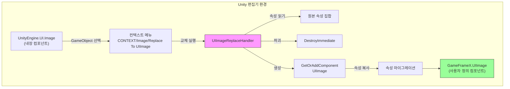
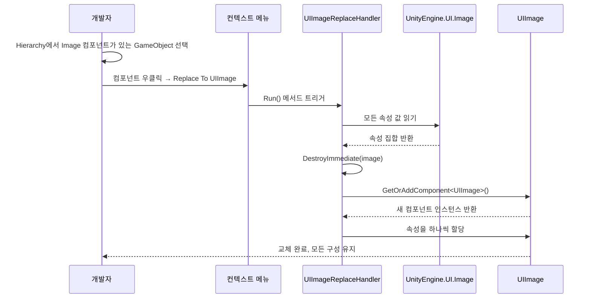

# 이미지 교체 핸들러

이미지 교체 핸들러는 GameFrameX UGUI 편집기 도구 세트의 핵심 컴포넌트로, Unity 내장 `Image` 컴포넌트를 사용자 정의 `UIImage` 컴포넌트로 원클릭 교체하는 동시에 모든原有 속성 구성을 유지합니다.

## 개요

Unity UGUI 프로젝트 개발에서 기존의 UI 인터페이스를 GameFrameX 프레임워크로 마이그레이션해야 할 때, 각 Image 컴포넌트를 수동으로 UIImage로 교체하는 것은 시간이 많이 걸릴뿐만 아니라 속성 구성을 놓치기 쉽습니다. 이미지 교체 핸들러는上下文 메뉴 방식을 통해 빠르고 안전한 컴포넌트 교체 기능을 제공합니다.

이 도구는 교체 과정에서 자동으로 다음 속성을 저장합니다:
- 이미지 유형 (Simple, Sliced, Tiled, Filled)
- 소재 (Material)
- 스프라이트 (Sprite)
- 채우기 센터 (fillCenter)
- 채우기 메서드 (fillMethod)
- 채우기 양 (fillAmount)
- 투명도 임계값 (alphaHitTestMinimumThreshold)
- 스프라이트 메쉬 사용 (useSpriteMesh)
- 오버라이드 스프라이트 (overrideSprite)
- 색상 (color)
- 레이캐스트 대상 (raycastTarget)
- 가림 가능성 (maskable)

## 작동 원리

이미지 교체 핸들러는 Unity Editor 확장 메커니즘을 기반으로 구현되며, `CustomEditor` 및 `MenuItem` 특성을 통해 내장 Image 컴포넌트에上下文 메뉴 입구를 추가합니다.



### 교체 흐름



## 사용 방법

### 교체 트리거

1. Unity 편집기의 Hierarchy 패널에서 `Image` 컴포넌트가 있는 GameObject 선택
2. Inspector 패널에서 `Image` 컴포넌트 제목 우클릭
3.弹出上下文 메뉴에서 **Replace To UIImage(UIImage로 교체)** 선택

```csharp
// 사용 방식: Unity 편집기에서 컨텍스트 메뉴를 통해 트리거
// 메뉴 경로: CONTEXT/Image/Replace To UIImage(UIImage로 교체)
```
> Source: [UIImageReplaceHandler.cs](https://github.com/GameFrameX/com.gameframex.unity.ui.ugui/blob/main/Editor/UIImageReplaceHandler.cs#L42-L43)

### 실행 로직

사용자가 메뉴 항목을 클릭하면 교체 핸들러가 다음 단계를 실행합니다:

```csharp
[MenuItem("CONTEXT/Image/Replace To UIImage(替换为UIImage)", false, 10)]
static void Run()
{
    // 1. 선택한 Image 컴포넌트 획득
    var image = Selection.activeGameObject.GetComponent<UnityEngine.UI.Image>();
    
    // 2. 모든 속성 값 읽기
    var imageType = image.type;
    var material = image.material;
    var sprite = image.sprite;
    var color = image.color;
    var raycastTarget = image.raycastTarget;
    // ... 기타 속성
    
    // 3. 원본 Image 컴포넌트 파괴
    DestroyImmediate(image);
    
    // 4. UIImage 컴포넌트 추가
    var uiImage = Selection.activeGameObject.GetOrAddComponent<UIImage>();
    
    // 5. 모든 속성을 새 컴포넌트에 복사
    uiImage.type = imageType;
    uiImage.material = material;
    uiImage.sprite = sprite;
    uiImage.color = color;
    // ... 모든 속성 할당
}
```
> Source: [UIImageReplaceHandler.cs](https://github.com/GameFrameX/com.gameframex.unity.ui.ugui/blob/main/Editor/UIImageReplaceHandler.cs#L43-L76)

## 핵심 구현

### CustomEditor 등록

이 도구는 `CustomEditor` 특성을 통해 Unity 편집기에 등록하여 `UnityEngine.UI.Image`의 사용자 정의 인스펙터가 됩니다:

```csharp
[CustomEditor(typeof(UnityEngine.UI.Image))]
public class UIImageReplaceHandler : UnityEditor.Editor
{
    // ...
}
```
> Source: [UIImageReplaceHandler.cs](https://github.com/GameFrameX/com.gameframex.unity.ui.ugui/blob/main/Editor/UIImageReplaceHandler.cs#L39-L40)

### MenuItem 메뉴 항목

`MenuItem` 특성을 사용하여 Image 컴포넌트의 컨텍스트 메뉴에 입구를 추가합니다:

```csharp
[MenuItem("CONTEXT/Image/Replace To UIImage(替换为UIImage)", false, 10)]
static void Run()
```
> Source: [UIImageReplaceHandler.cs](https://github.com/GameFrameX/com.gameframex.unity.ui.ugui/blob/main/Editor/UIImageReplaceHandler.cs#L42-L43)

## UIImage 컴포넌트 설명

교체 후 생성된 `UIImage` 컴포넌트는 `UnityEngine.UI.Image`를 상속하며, 추가적으로 아이콘 리소스 경로 설정 기능을 제공합니다:

```csharp
public class UIImage : UnityEngine.UI.Image
{
    /// <summary>
    /// 아이콘 리소스 경로를 가져오거나 설정합니다.
    /// 설정 후 자동으로 리소스 시스템에서 아이콘을 로드합니다.
    /// </summary>
    public string icon
    {
        get { return m_icon; }
        set
        {
            if (m_icon != value)
            {
                m_icon = value;
                _ = this.SetIconAsync(m_icon);
            }
        }
    }
}
```
> Source: [UIImage.cs](https://github.com/GameFrameX/com.gameframex.unity.ui.ugui/blob/main/Runtime/UIImage.cs#L41-L72)

## 적용 시나리오

| 시나리오 | 설명 |
|------|------|
| 프로젝트 초기 마이그레이션 | 기존 Unity UGUI 프로젝트를 GameFrameX 프레임워크로 마이그레이션 |
| 일괄 교체 테스트 | 먼저 하나의 컴포넌트를 교체하여 UIImage 기능 테스트, 그 후 일괄 마이그레이션 |
| 컴포넌트 업그레이드 | 기존 Image 컴포넌트에 아이콘 경로 로드 기능 추가 |

## 주의사항

1. **교체 불가逆**: 교체 실행 시 원본 Image 컴포넌트가 즉시 파괴되므로, 교체 전에 반드시場景 백업
2. **의존성 항목 유지**:项目中 GameFrameX.Runtime 의존성이 올바르게 구성되었는지 확인해야 합니다, `GetOrAddComponent` 확장 메서드 사용のため
3. **다중 컴포넌트 시나리오**: GameObject에 Image 컴포넌트에 의존하는 다른 스크립트의 참조가 있는 경우, 교체 전에 이러한 참조가更新되었는지 확인

## 관련 링크

- [UIImage 컴포넌트](./5-components.uiimage)
- [컴포넌트 인스펙터](./6-editor-tools.inspector)
- [코드 생성기](./6-editor-tools.code-generator)
- [UGUI 기본 클래스](./4-core-concepts.ugui-base)
