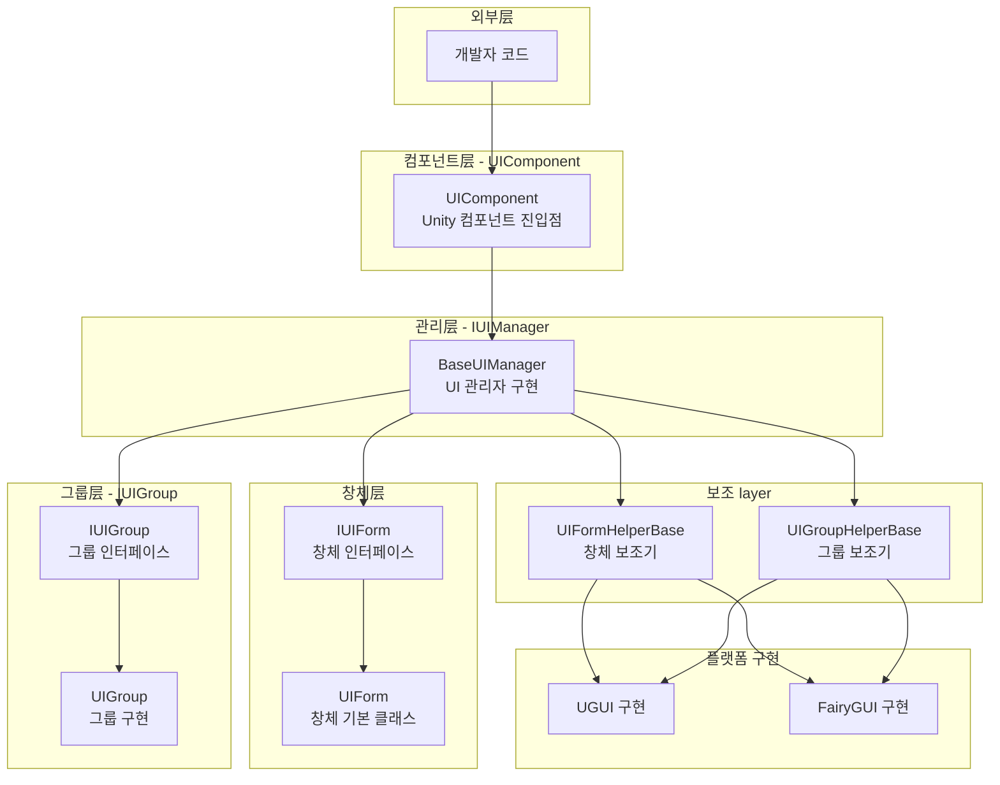
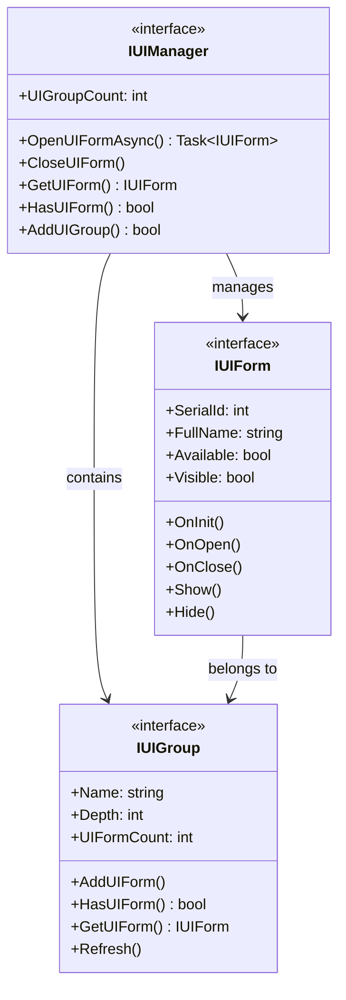
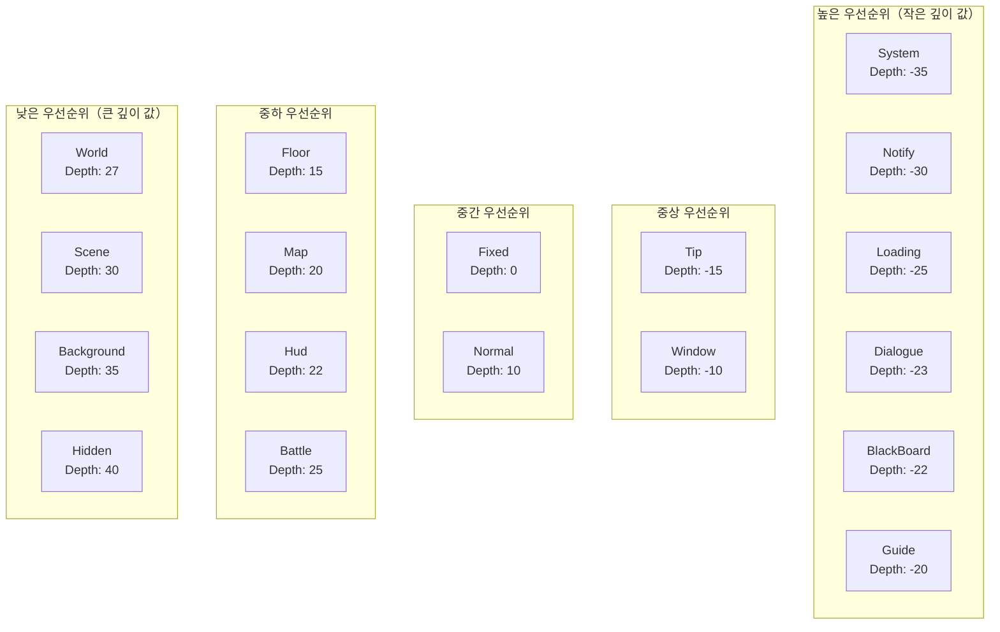
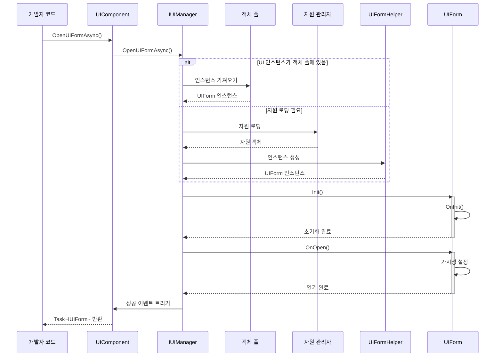
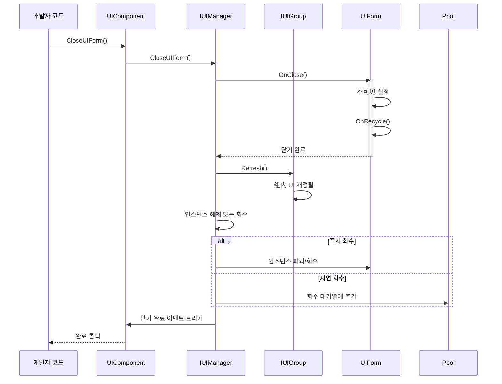

# 개요

Game Frame X UI는 GameFrameX 프레임워크의 UI 컴포넌트로, Unity UI 관리 솔루션을 제공합니다. 이 시스템은 UGUI와 FairyGUI 두 가지 주요 UI 시스템을 지원하며, 통합된 인터페이스 설계, 계층化管理, 객체 풀 재활용 및 완전한 이벤트驱动 메커니즘을 제공합니다.

## 개요

Game Frame X UI는 GameFrameX 게임 프레임워크의 핵심 UI 관리 시스템으로, Unity 게임 개발을 위해 설계되었습니다. 이 시스템은 UGUI와 FairyGUI 두 가지 UI 렌더링 시스템을 지원하며, 개발자는 프로젝트 요구사항에 따라 유연하게 선택할 수 있습니다. UI 시스템은界面 로딩, 표시, 숨김, 닫기 회수까지 완전한生命周期 관리를 제공하며, 각 단계에서 완전한 이벤트 콜백 메커니즘을 통해 개발자가 UI의 동작을 정밀하게 제어할 수 있습니다.

이 시스템의 핵심 설계 철학은 "통합 인터페이스, 유연한 구성"입니다. 어떤 UI 시스템을 기본으로 사용하든, 개발자는统一的 `IUIManager` 인터페이스를 통해 UI 열기, 닫기, 查询 등의 작업을 수행합니다. 동시에 시스템은高度なカスタマイズ을 지원하여 개발자가 다양한 UI 组辅助器和 UI 窗体辅助器를 구성하여 특정 기능 요구사항을 구현할 수 있습니다. 이러한 설계는 코드의 간결성을 보장하는 동시에 다양한 복잡한 게임 UI 시나리오에 대응할 수 있는 충분한 유연성을 제공합니다.

Game Frame X UI는 GameFrameX 프레임워크의 다른 핵심 컴포넌트와 깊이 통합되어 있으며, 자원 관리 시스템, 객체 풀 시스템 및 이벤트 시스템이 포함됩니다. 이러한 깊이 있는 통합使得 UI 시스템이 UI 자원 로딩 및 회수를 효율적으로 관리할 수 있으며, 이벤트 시스템을 통해 모듈 간의 느슨한 결합 통신을 실현합니다. 개발자는 UI 이벤트를 구독하여 크로스 시스템의 논리 연동을 구현할 수 있으며, 구체적인 UI 구현 클래스에 직접 의존할 필요가 없습니다.

## 아키텍처 설계

Game Frame X UI는 分層 아키텍처 설계를 채택했으며, 하단에서 상단까지 接口層, 구현층, 컴포넌트층 및 에디터層으로 구성됩니다. 각 层에는 명확한 책임划分이 있으며, 层과 层 사이의 통신은 接口를 통해 이루어집니다. 이러한 설계는コード의 유지보수성과 확장성을 크게 향상시킵니다.



**아키텍처 설명:**

- **컴포넌트层（UIComponent）**: Unity 게임 오브젝트의 컴포넌트로, 전체 UI 시스템의 진입점이며 IUIManager 구현의 초기화 및 관리를 담당합니다
- **관리层（IUIManager）**: 핵심 인터페이스로, UI 창체 및 UI 그룹의 모든 작업을 정의하며 열기, 닫기, 查询 등의 메서드를 포함합니다
- **창체层（IUIForm/UIForm）**: UI 창체의 인터페이스 정의 및 기본 클래스 구현으로, 완전한生命周期 메서드를 제공합니다
- **그룹层（IUIGroup）**: UI 그룹 인터페이스로,同一 계층의 UI 창체 관리 및 표시 깊이 및 우선순위 제어를 담당합니다
- **보조 layer（Helper）**: 플랫폼별 구현 보조 클래스로, UGUI와 FairyGUI의 低수준 차이를 각각 처리합니다
- **플랫폼 구현 layer**: 구체적인 UGUI 또는 FairyGUI 구현으로,各自 플랫폼의 API 호출을 캡슐화합니다

### 핵심 인터페이스 관계

UI 시스템의 핵심 인터페이스는 IUIManager, IUIForm 및 IUIGroup이며, 이들은 함께 UI 관리의 기초를 구성합니다. IUIManager는 UI 창체 생성 및 파괴, UI 그룹 관리, 이벤트 디스패치를 포함한 전반적인 UI 관리를 담당합니다. IUIForm은 개별 UI 창체의 동작 규범을 정의하며, 초기화, 열기, 닫기, 표시, 숨김 등의生命周期 메서드를 포함합니다. IUIGroup는一组 관련 UI 창체 관리 담당하며,它们的 깊이 및 표시 순서를 제어합니다.



이러한 인터페이스 설계는 의존성 반전 원칙을 따르며, 상위 모듈은 구체적인 구현이 아닌抽象 인터페이스에 의존하여, 시스템이良好的可测试성 및 교체 가능성을 갖도록 합니다. 개발자는自定义 보조기를 구현하여 기본 UGUI 또는 FairyGUI 구현을 교체할 수 있으며, 상위 비지니스 로직 코드를 수정할 필요가 없습니다.

## 핵심 개념

### UI 창체（UIForm）

UI 창체는 UI 시스템에서 가장 기본적인操作 단위로, 각可见 UI 인터페이스는 해당 UIForm 인스턴스에 대응됩니다. UIForm은 Unity의 MonoBehaviour를 상속하며,Prefab에 직접 연결하여 사용할 수 있습니다. 기본 클래스로서 완전한生命周期 후크를 제공하며, 개발자는 이 메서드들을 재정의하여 UI의 구체적인 로직을 처리합니다.

```csharp
using GameFrameX.UI.Runtime;
using UnityEngine;

public class MainMenuUI : UIForm
{
    protected override void OnInit(object userData)
    {
        base.OnInit(userData);
        // UI 요소 참조 초기화
        // 버튼 이벤트 바인딩 등
    }

    protected override void OnOpen(object userData)
    {
        base.OnOpen(userData);
        // UI 열기时的 로직
        // 엔트리 애니메이션 재생
        // 인터페이스 데이터 새로 고침
    }

    protected override void OnClose(bool isShutdown, object userData)
    {
        base.OnClose(isShutdown, userData);
        // UI 닫기时的 정리 작업
    }
}
```
> Source: [UIForm.cs](https://github.com/GameFrameX/com.gameframex.unity.ui/blob/main/Runtime/UIForm.cs#L39-L100)

UIForm의生命周期는 다음 주요 메서드를 포함합니다: OnAwake는 UI 인스턴스 생성 후 즉시 호출되며, 이벤트 구독 등 초기화 작업에 적합합니다; OnInit는 UI가 처음 초기화될 때 호출되며, UI 요소 설정 및 이벤트 핸들러 바인딩에 사용됩니다; OnOpen는 UI가 표시될 때 호출되며, 전달된 사용자 데이터를 수신하고 처리할 수 있습니다; OnClose는 UI가 닫힐 때 호출되며, 자원 정리 및 상태 저장에 사용됩니다; OnPause와 OnResume는 각각 UI가 가려지거나恢复될 때 호출됩니다.

### UI 컴포넌트（UIComponent）

UIComponent는 Unity 게임 장면의 핵심 컴포넌트로, GameFrameworkComponent를 상속합니다. 전체 게임 생명주기에서 UI 창체의 로딩, 표시, 숨김, 닫기 및 회수 등의 모든管理工作을 담당합니다. 객체 풀 모드를 채택하여 UI 창체 인스턴스를 관리하며,频繁 생성 파괴로 인한性能 overhead를 효과적으로 줄입니다.

UIComponent는 Unity 기본 UGUI 및 서드파티 UI 프레임워크 FairyGUI를 포함한 다양한 UI 렌더링 솔루션을 지원합니다. 사전 정의된 18개의 UI 그룹（UIGroup）을 통해 정확한 계층 제어 및 가림 관계 관리를 실현할 수 있습니다.

**핵심 기능:**
- 비동기 로딩 및 UI 창체 열기
- 다양한 방식으로 UI 창체 닫기（직접 닫기, 지연 닫기, 그룹 닫기）
- UI 창체 객체 풀 관리
- UI 그룹 계층 제어
- 표시/숨김 애니메이션 지원
- 완전한 이벤트 시스템

> UIComponent는 UI 시스템의 핵심 진입점이며, 자세한 API 메서드 설명은 [UIComponent API 참고](./5-api-reference.ui-component)를 참조하세요.

## UI 그룹 계층

Game Frame X UI는 18개의 사전 정의 UI 그룹을 제공하며, 각 그룹에는 특정 깊이 값이 있습니다. 깊이 값이 작을수록 표시 계층이 높습니다. 이는 깊이 값 -35의 System 그룹이 깊이 값 40의 Hidden 그룹보다 위에 표시됨을 의미합니다.



### 사전 정의 UI 그룹

| 그룹명 | 깊이 값 | 일반적인 용도 |
|------|---------|----------|
| System | -35 | 시스템 공지, VIP 힌트 등 최상위 인터페이스 |
| Notify | -30 | 알림 팝업,Marquee |
| Loading | -25 | 로딩 인터페이스 |
| Dialogue | -23 | 대화剧情 인터페이스 |
| BlackBoard | -22 | 블랙보드/任务面板 |
| Guide | -20 | 초보자 안내 마스킹 |
| Tip | -15 | 힌트 팝업, Toast |
| Window | -10 | 창 유형 인터페이스 |
| Fixed | 0 | 화면 하단에 고정된 UI |
| Normal | 10 | 일반 인터페이스 |
| Floor | 15 | 바닥 UI |
| Map | 20 | 지도 인터페이스 |
| Hud | 22 | 하늘표시, BUFF 표시 |
| Battle | 25 | 전투 관련 UI |
| World | 27 | 세계 지도 UI |
| Scene | 30 | 장면 전환 인터페이스 |
| Background | 35 | 배경 UI |
| Hidden | 40 | 숨김 UI（不可见）|

> Source: [UIGroupConstants.cs](https://github.com/GameFrameX/com.gameframex.unity.ui/blob/main/Runtime/UIGroupConstants.cs#L38-L202)

깊이 값 설계는 다음 원칙을 따릅니다: 음수 깊이는 게임 장면 위에 표시되는 UI용（대화상자, 힌트 등）; 0 및 양수 깊이는 게임 내 HUD 요소용;较大的 양수 깊이는 배경 및 低우선순위 UI용. 이 설계는 중요한 UI가 항상 가장 위에 표시되도록 보장합니다.

## 핵심流程

### UI 열기 흐름

UI 창체 열기는 UI 시스템에서 가장 많이 사용되는 작업 중 하나입니다. 전체 흐름은 자원 로딩, 인스턴스 생성, 초기화 및 표시 등 여러 단계를 포함합니다. 다음은 완전한 비동기 열기 흐름입니다:



### UI 닫기 흐름

UI 창체 닫기는 숨김, 회수 및 이벤트 트리거를 포함한 여러 단계를 포함합니다. 시스템은 즉시 회수와 지연 회수 두 가지 모드를 지원합니다.



## 이벤트 시스템

Game Frame X UI는 완전한 이벤트 시스템을 제공하여 UI 상태 변경을通知합니다. 개발자는 이러한 이벤트를 구독하여 UI의 다양한 상태 변경에 대응하고, 느슨하게 결합된 코드 아키텍처를 실현할 수 있습니다.

### 이벤트 유형

| 이벤트 클래스 | 이벤트 ID | 설명 |
|--------|---------|------|
| OpenUIFormSuccessEventArgs | 인터페이스 열기 성공 이벤트 | UI가 성공적으로 열릴 때 트리거 |
| OpenUIFormFailureEventArgs | 인터페이스 열기 실패 이벤트 | UI 열기 실패 시 트리거 |
| CloseUIFormCompleteEventArgs | 인터페이스 닫기 완료 이벤트 | UI 닫기 완료 시 트리거 |
| UIFormVisibleChangedEventArgs | 인터페이스 가시성 변경 이벤트 | UI 표시 상태가 변경될 때 트리거 |

> Source: [Runtime/EventArgs/](https://github.com/GameFrameX/com.gameframex.unity.ui/blob/main/Runtime/EventArgs/)

### 이벤트 구독 예제

```csharp
using GameFrameX.UI.Runtime;
using GameFrameX.Event.Runtime;

// 게임 초기화 시 이벤트 구독
var eventComponent = GameEntry.GetComponent<EventComponent>();
eventComponent.Subscribe(OpenUIFormSuccessEventArgs.EventId, OnOpenUIFormSuccess);
eventComponent.Subscribe(OpenUIFormFailureEventArgs.EventId, OnOpenUIFormFailure);
eventComponent.Subscribe(CloseUIFormCompleteEventArgs.EventId, OnCloseUIFormComplete);

private void OnOpenUIFormSuccess(object sender, GameEventArgs e)
{
    var args = (OpenUIFormSuccessEventArgs)e;
    Debug.Log($"UI 열기 성공: {args.UIForm.UIFormAssetName}");
}

private void OnOpenUIFormFailure(object sender, GameEventArgs e)
{
    var args = (OpenUIFormFailureEventArgs)e;
    Debug.LogError($"UI 열기 실패: {args.UIFormAssetName}, 오류: {args.ErrorMessage}");
}

private void OnCloseUIFormComplete(object sender, GameEventArgs e)
{
    var args = (CloseUIFormCompleteEventArgs)e;
    Debug.Log($"UI 닫기 완료: {args.UIFormAssetName}");
}
```
> Source: [UIComponent.cs](https://github.com/GameFrameX/com.gameframex.unity.ui/blob/main/Runtime/UIComponent.cs#L436-L465)

## 플랫폼 지원

Game Frame X UI는 Unity의 UGUI 시스템과 FairyGUI 플러그인을 동시에 지원합니다. 이러한 이중 트랙 지원은 조건부 컴파일 및 보조기 모드를 통해 구현되며, 개발자는 프로젝트 요구사항에 따라 적합한 렌더링 백엔드를 선택할 수 있으며, 비지니스 코드는 수정할 필요가 없습니다.

### UGUI 지원

UGUI는 Unity 기본 UI 시스템으로,良好的兼容性를 가지며, 대부분의 Unity 프로젝트의首选입니다. 시스템은 완전한 UGUI 구현을 제공하며, Canvas 관리, 이벤트 처리 및 자원 로딩 등을 포함합니다.

### FairyGUI 지원

FairyGUI는 기능이强大的 서드파티 UI 에디터로, 시각적 UI 편집 경험과 효율적인 자원 관리를 제공합니다. 복잡한 UI 상호작용과 효율적인迭代이 필요한 프로젝트에 적합합니다.

UI 시스템 전환은 매우 간단하며, Unity의 Scripting Define Symbols에 해당 컴파일 심볼（`ENABLE_UI_UGUI` 또는 `ENABLE_UI_FAIRYGUI`）을 추가하기만 하면 됩니다. UIComponent는 컴파일 심볼에 따라 자동적으로 대응하는 보조기 구현을 로딩합니다.

## 종속성

Game Frame X UI는 GameFrameX 프레임워크의 다른 핵심 컴포넌트에 종속됩니다:

| 종속 항목 | 최소 버전 | 설명 |
|--------|----------|------|
| com.gameframex.unity | >= 1.1.1 | 핵심 프레임워크 |
| com.gameframex.unity.asset | >= 1.0.6 | 자원 관리 |
| com.gameframex.unity.event | >= 1.0.0 | 이벤트 시스템 |
| com.gameframex.unity.localization | >= 1.0.0 | 현지화 지원 |

> Source: [package.json](https://github.com/GameFrameX/com.gameframex.unity.ui/blob/main/package.json)

## 관련 링크

- [설치 가이드](./2-installation)
- [빠른 시작](./3-getting-started)
- [UI 컴포넌트 상세](./4-core-concepts.ui-component)
- [UI 창체 상세](./4-core-concepts.ui-form)
- [UI 그룹 시스템](./4-core-concepts.ui-group)
- [객체 풀 관리](./4-core-concepts.object-pool)
- [API 참고 - IUIManager](./5-api-reference.iuimanager)
- [API 참고 - UIComponent](./5-api-reference.ui-component)
- [API 참고 - UIForm](./5-api-reference.ui-form)
- [API 참고 - IUIGroup](./5-api-reference.iuigroup)
- [이벤트 시스템 상세](./6-event-system)
- [UI 그룹 계층 상세](./7-ui-group-hierarchy)
- [에디터 구성](./8-configuration.editor)
- [UI 속성 구성](./8-configuration.attributes)
- [플랫폼 지원](./9-platforms)
- [일반 문제](./10-troubleshooting)
- 공식 문서: https://gameframex.doc.alianblank.com/
- GitHub 저장소: https://github.com/GameFrameX/com.gameframex.unity.ui